# Security MVP-First Implementation Guide

## Maximum Value, Minimum Effort, Reasonably Secure

**Version:** 1.0  
**Date:** December 21, 2025  
**Philosophy:** Ship secure, iterate smart - foundations that scale without rewrites

---

## Executive Summary

For MVP, focus on **three non-negotiables** that prevent catastrophic failures and establish foundations that won't require rewrites. Everything else can be layered in as you scale toward 100 paying customers.

```mermaid
flowchart LR
    subgraph MVP["MVP Day 1 - Week 1"]
        RLS["🔒 RLS on ALL Tables<br/>4-8 hours"]
        CTX["🎯 Tenant Context<br/>2-4 hours"]
        AUDIT["📝 Basic Audit Log<br/>2-4 hours"]
    end
    
    subgraph Post["Post-MVP - Weeks 2-4"]
        VER["Version History"]
        LOCK["Edit Locking"]
        ANNOT["Annotations"]
    end
    
    subgraph Scale["Scale - Month 2+"]
        AGT["Agent Authority"]
        ALERT["Security Alerts"]
        ADV["Advanced Integrity"]
    end
    
    MVP --> Post --> Scale
```



---

## The Three Non-Negotiables (Day 1)

These **must** be in place before any customer data enters the system. Total effort: **8-16 hours**.

### 1. RLS on Every Tenant-Scoped Table (4-8 hours)

**Why it's non-negotiable:** Without RLS, a single bug in your application code exposes all customer data. RLS is your database-level safety net.

**The Pattern (copy-paste for each table):**

```sql
-- Template: Apply to EVERY table with tenant_id column
ALTER TABLE {table_name} ENABLE ROW LEVEL SECURITY;
ALTER TABLE {table_name} FORCE ROW LEVEL SECURITY;

-- Single policy handles 90% of cases
CREATE POLICY {table_name}_tenant_isolation ON {table_name}
    FOR ALL
    USING (tenant_id = current_setting('app.current_tenant_id', true)::UUID);

-- Backend bypass for service operations
CREATE POLICY {table_name}_service_bypass ON {table_name}
    FOR ALL
    TO service_role
    USING (true);
```

**Your MVP tables needing RLS:**

```sql
-- Core ontology/data tables
ALTER TABLE ontologies ENABLE ROW LEVEL SECURITY;
ALTER TABLE datasets ENABLE ROW LEVEL SECURITY;
ALTER TABLE gap_analyses ENABLE ROW LEVEL SECURITY;

-- Content tables
ALTER TABLE social_media_briefs ENABLE ROW LEVEL SECURITY;
ALTER TABLE generated_social_posts ENABLE ROW LEVEL SECURITY;
ALTER TABLE blog_articles ENABLE ROW LEVEL SECURITY;

-- User/config tables
ALTER TABLE tenant_users ENABLE ROW LEVEL SECURITY;
ALTER TABLE onboarding_wizard_progress ENABLE ROW LEVEL SECURITY;
```

**Verification (run after applying):**

```sql
-- This should return ALL your tenant-scoped tables with rowsecurity = true
SELECT tablename, rowsecurity 
FROM pg_tables 
WHERE schemaname = 'public' 
  AND tablename NOT IN ('schema_migrations', 'feature_definitions')
ORDER BY tablename;
```

### 2. Tenant Context Function (2-4 hours)

**Why it's non-negotiable:** RLS policies need to know "who is asking". This function sets that context.

```sql
-- Create the context-setting function
CREATE OR REPLACE FUNCTION set_tenant_context(
    p_tenant_id UUID,
    p_user_id UUID DEFAULT NULL,
    p_user_role TEXT DEFAULT 'tenant_user'
) RETURNS VOID AS $$
BEGIN
    PERFORM set_config('app.current_tenant_id', p_tenant_id::TEXT, false);
    PERFORM set_config('app.user_id', COALESCE(p_user_id::TEXT, ''), false);
    PERFORM set_config('app.user_role', p_user_role, false);
END;
$$ LANGUAGE plpgsql SECURITY DEFINER;

-- Grant execute to authenticated users
GRANT EXECUTE ON FUNCTION set_tenant_context TO authenticated;
```

**Backend integration (Python/Node):**

```python
# Call this at the START of every API request
async def set_request_context(supabase_client, tenant_id: str, user_id: str):
    await supabase_client.rpc('set_tenant_context', {
        'p_tenant_id': tenant_id,
        'p_user_id': user_id,
        'p_user_role': 'tenant_user'
    }).execute()
```

### 3. Basic Audit Log (2-4 hours)

**Why it's non-negotiable:** When (not if) something goes wrong, you need to know what happened. Start simple.

```sql
-- Minimal audit log - captures the essentials
CREATE TABLE audit_log (
    id UUID PRIMARY KEY DEFAULT gen_random_uuid(),
    tenant_id UUID,
    user_id UUID,
    action TEXT NOT NULL,           -- 'create', 'update', 'delete', 'login'
    table_name TEXT,
    record_id UUID,
    old_data JSONB,                 -- For updates/deletes
    new_data JSONB,                 -- For creates/updates
    created_at TIMESTAMPTZ DEFAULT NOW()
);

-- Index for common queries
CREATE INDEX idx_audit_tenant_time ON audit_log(tenant_id, created_at DESC);

-- RLS: tenants see their own logs, platform owner sees all
ALTER TABLE audit_log ENABLE ROW LEVEL SECURITY;

CREATE POLICY audit_log_tenant_read ON audit_log
    FOR SELECT
    USING (
        tenant_id = current_setting('app.current_tenant_id', true)::UUID
        OR current_setting('app.user_role', true) = 'platform_owner'
    );

-- Insert-only from application
CREATE POLICY audit_log_insert ON audit_log
    FOR INSERT
    WITH CHECK (true);
```

**Simple audit trigger (apply to critical tables):**

```sql
CREATE OR REPLACE FUNCTION audit_trigger_func()
RETURNS TRIGGER AS $$
BEGIN
    IF TG_OP = 'INSERT' THEN
        INSERT INTO audit_log (tenant_id, user_id, action, table_name, record_id, new_data)
        VALUES (
            NEW.tenant_id,
            current_setting('app.user_id', true)::UUID,
            'create',
            TG_TABLE_NAME,
            NEW.id,
            to_jsonb(NEW)
        );
        RETURN NEW;
    ELSIF TG_OP = 'UPDATE' THEN
        INSERT INTO audit_log (tenant_id, user_id, action, table_name, record_id, old_data, new_data)
        VALUES (
            NEW.tenant_id,
            current_setting('app.user_id', true)::UUID,
            'update',
            TG_TABLE_NAME,
            NEW.id,
            to_jsonb(OLD),
            to_jsonb(NEW)
        );
        RETURN NEW;
    ELSIF TG_OP = 'DELETE' THEN
        INSERT INTO audit_log (tenant_id, user_id, action, table_name, record_id, old_data)
        VALUES (
            OLD.tenant_id,
            current_setting('app.user_id', true)::UUID,
            'delete',
            TG_TABLE_NAME,
            OLD.id,
            to_jsonb(OLD)
        );
        RETURN OLD;
    END IF;
END;
$$ LANGUAGE plpgsql;

-- Apply to your most critical tables only for MVP
CREATE TRIGGER ontologies_audit AFTER INSERT OR UPDATE OR DELETE ON ontologies
    FOR EACH ROW EXECUTE FUNCTION audit_trigger_func();
```

---

## What You're Deferring (And Why It's OK)

```mermaid
flowchart TB
    subgraph Safe["✅ Safe to Defer"]
        VER["Ontology Versioning<br/>━━━━━━━━━━━━━━<br/>Manual backups work<br/>for &lt;100 customers"]
        LOCK["Edit Session Locking<br/>━━━━━━━━━━━━━━<br/>Unlikely concurrent edits<br/>at MVP scale"]
        CHK["Checksum Verification<br/>━━━━━━━━━━━━━━<br/>Trust your app code<br/>initially"]
        ALERT["Real-time Alerts<br/>━━━━━━━━━━━━━━<br/>Check logs manually<br/>daily"]
    end
    
    subgraph Risky["⚠️ Don't Defer Too Long"]
        AGT["Agent Authority<br/>━━━━━━━━━━━━━━<br/>Add when agents go<br/>to production"]
        CON["Consultant Access<br/>━━━━━━━━━━━━━━<br/>Add when onboarding<br/>first consultant"]
        ANNOT["Annotations<br/>━━━━━━━━━━━━━━<br/>Add when collaborative<br/>workflows needed"]
    end
```



| Deferred Item | Why It's OK for MVP | When to Add |
|--------------|---------------------|-------------|
| Ontology Versioning | Supabase daily backups + manual exports | When customers ask for "undo" |
| Edit Locking | <10 users won't have collisions | When you see conflicts in logs |
| Checksum Verification | Trust your validated app code | When you have compliance requirements |
| Real-time Alerts | Check audit log daily manually | When you can't check logs daily |
| Agent Authority Framework | No production agents yet | Before first agent goes live |
| Consultant Access Model | No consultants accessing yet | Before first consultant onboards |

---

## MVP Security Architecture (Simplified)


**Key simplifications for MVP:**

1. **No role hierarchy** - Just `tenant_user` and `platform_owner` (you)
2. **No consultant access** - You access customer data via service_role when needed
3. **No agent controls** - Agents run as service_role with your oversight
4. **No edit locking** - Last write wins (acceptable at MVP scale)

---

## Post-MVP Phasing

### Phase 1: Weeks 2-4 (After First Customers)

**Trigger:** You have paying customers storing real data


**Add: Ontology Version History**

```sql
-- Simple version tracking
CREATE TABLE ontology_versions (
    id UUID PRIMARY KEY DEFAULT gen_random_uuid(),
    ontology_id UUID NOT NULL REFERENCES ontologies(id),
    tenant_id UUID NOT NULL,
    version_number INTEGER NOT NULL,
    data_snapshot JSONB NOT NULL,
    created_by UUID,
    created_at TIMESTAMPTZ DEFAULT NOW()
);

-- Auto-version on update
CREATE OR REPLACE FUNCTION version_ontology()
RETURNS TRIGGER AS $$
BEGIN
    INSERT INTO ontology_versions (ontology_id, tenant_id, version_number, data_snapshot, created_by)
    SELECT 
        NEW.id,
        NEW.tenant_id,
        COALESCE((SELECT MAX(version_number) FROM ontology_versions WHERE ontology_id = NEW.id), 0) + 1,
        to_jsonb(OLD),
        current_setting('app.user_id', true)::UUID;
    RETURN NEW;
END;
$$ LANGUAGE plpgsql;

CREATE TRIGGER ontology_version_trigger
    BEFORE UPDATE ON ontologies
    FOR EACH ROW EXECUTE FUNCTION version_ontology();
```

**Add: Simple Edit Locking**

```sql
-- Lightweight locking
ALTER TABLE ontologies ADD COLUMN locked_by UUID;
ALTER TABLE ontologies ADD COLUMN locked_at TIMESTAMPTZ;

-- Lock expires after 30 minutes automatically in queries
CREATE OR REPLACE FUNCTION is_locked(p_ontology_id UUID)
RETURNS BOOLEAN AS $$
    SELECT EXISTS(
        SELECT 1 FROM ontologies 
        WHERE id = p_ontology_id 
          AND locked_by IS NOT NULL 
          AND locked_at > NOW() - INTERVAL '30 minutes'
    );
$$ LANGUAGE sql;
```

### Phase 2: Month 2 (Scaling to 50+ Customers)

**Trigger:** You need consultants helping customers, or agents in production


**Add: Consultant Assignments (Simplified)**

```sql
CREATE TABLE consultant_assignments (
    id UUID PRIMARY KEY DEFAULT gen_random_uuid(),
    consultant_user_id UUID NOT NULL,
    tenant_id UUID NOT NULL,
    access_level TEXT DEFAULT 'read_only',
    expires_at TIMESTAMPTZ NOT NULL,
    is_active BOOLEAN DEFAULT true,
    created_at TIMESTAMPTZ DEFAULT NOW()
);

-- Update RLS to include consultants
CREATE OR REPLACE POLICY tenant_isolation_with_consultants ON ontologies
    FOR ALL
    USING (
        tenant_id = current_setting('app.current_tenant_id', true)::UUID
        OR EXISTS (
            SELECT 1 FROM consultant_assignments
            WHERE consultant_user_id = current_setting('app.user_id', true)::UUID
              AND tenant_id = ontologies.tenant_id
              AND is_active = true
              AND expires_at > NOW()
        )
    );
```

### Phase 3: Month 3+ (100+ Customers, Full Platform)

**Trigger:** Compliance requirements, enterprise customers, or security incidents

- Full agent authority framework
- Real-time security alerting
- Checksum verification
- Advanced audit analytics
- Annotation/recommendation workflows

---

## Day 1 Checklist

```markdown
## MVP Security Deployment Checklist

### Before Any Customer Data
- [ ] RLS enabled on ALL tables with tenant_id
- [ ] RLS FORCED on ALL tables (service_role respects policies)  
- [ ] set_tenant_context() function deployed
- [ ] audit_log table created with RLS
- [ ] Audit trigger on ontologies table

### Backend Integration  
- [ ] Every API route calls set_tenant_context() first
- [ ] Error handling logs to audit_log
- [ ] JWT validation extracts tenant_id correctly

### Verification
- [ ] Run RLS audit query - all tables covered
- [ ] Test: User A cannot see User B data
- [ ] Test: Audit log captures create/update/delete

### Documentation
- [ ] Incident response: Who to call if breach suspected
- [ ] Daily routine: Check audit_log for anomalies
```

---

## Effort Summary

| Item | MVP Effort | Defer Until | Full Effort |
|------|------------|-------------|-------------|
| RLS on all tables | 4-8 hours | Never - Day 1 | Same |
| Tenant context | 2-4 hours | Never - Day 1 | Same |
| Basic audit log | 2-4 hours | Never - Day 1 | 8-12 hours (full) |
| Version history | - | First customers | 4-6 hours |
| Edit locking | - | Collision reports | 4-6 hours |
| Consultant access | - | First consultant | 8-12 hours |
| Agent authority | - | Agents in prod | 12-16 hours |
| Security alerts | - | Can't check logs daily | 8-12 hours |
| Checksum verification | - | Compliance/enterprise | 6-8 hours |

**MVP Total: 8-16 hours**  
**Full Platform: 60-80 additional hours over 3 months**

---

## The "Good Enough" Security Mindset

```mermaid
flowchart LR
    subgraph MVP["MVP Security"]
        A["Prevent catastrophic<br/>data leaks"]
        B["Know what happened<br/>when things go wrong"]
        C["Foundation that<br/>scales without rewrites"]
    end
    
    subgraph NOT["NOT MVP Security"]
        D["Prevent every<br/>possible attack"]
        E["Real-time threat<br/>detection"]
        F["Perfect audit<br/>trail"]
    end
    
    MVP --> SHIP["🚀 SHIP IT"]
    NOT --> DELAY["⏳ Analysis Paralysis"]
```



**The rule:** If a security measure doesn't prevent customer data from leaking to other customers, it can wait. Everything else is optimization.

---

## Quick Decision Framework

When evaluating "should I add this security feature now?":

1. **Does skipping it risk exposing Customer A's data to Customer B?**
   - Yes → Add it now (RLS, tenant context)
   - No → Continue to question 2

2. **Will I need to rewrite significant code to add it later?**
   - Yes → Add foundation now, full feature later
   - No → Defer entirely

3. **Can I manually handle this at MVP scale (<100 customers)?**
   - Yes → Defer and automate later
   - No → Add it now

---

*Ship secure, iterate smart. Your MVP security is your foundation - get it right, but don't over-engineer.*
