# Security MVP: Product Requirements, PBS & WBS

## Platform Foundation Security Essentials

**Version:** 1.0.0  
**Date:** December 2025  
**Module:** PF-SEC-MVP (Platform Foundation Security - MVP)  
**Scope:** Day-1 security essentials for multi-tenant ontology platform  
**Total Effort:** 8-16 hours implementation + 4 hours testing

---

# Part 1: Product Requirements Document (PRD)

## 1. Executive Summary

### 1.1 Purpose

This PRD defines the minimum viable security requirements that **must** be implemented before any customer data enters the BAIV/AIR/W4M platform. These requirements establish the foundation for tenant data isolation, audit capability, and scalable security architecture.

### 1.2 Problem Statement

Without proper security foundations, a single application bug could expose all customer data across tenants. The platform requires database-level security controls that operate independently of application code quality.

### 1.3 Success Criteria

| Metric | Target | Measurement |
|--------|--------|-------------|
| Tenant Isolation | 100% | No cross-tenant data leakage in security tests |
| RLS Coverage | 100% | All tenant-scoped tables have RLS enabled |
| Audit Coverage | Core tables | Ontologies, datasets audited on all changes |
| Implementation Time | ≤16 hours | Complete deployment within 2 days |

---

## 2. Scope Definition

### 2.1 In Scope (MVP)

```mermaid
flowchart TB
    subgraph MVP["MVP Security Scope"]
        RLS["Row Level Security<br/>━━━━━━━━━━━━━━<br/>• Enable on all tables<br/>• Tenant isolation policy<br/>• Service role bypass"]
        
        CTX["Tenant Context<br/>━━━━━━━━━━━━━━<br/>• Context-setting function<br/>• JWT claim extraction<br/>• Role propagation"]
        
        AUD["Basic Audit Log<br/>━━━━━━━━━━━━━━<br/>• audit_log table<br/>• Trigger on ontologies<br/>• Immutable insert-only"]
    end
    
    subgraph OUT["Out of Scope (Post-MVP)"]
        VER["Ontology Versioning"]
        LOCK["Edit Locking"]
        AGENT["Agent Authority"]
        ALERT["Real-time Alerts"]
        CON["Consultant Access"]
    end
    
    MVP --> SHIP["🚀 Ship to Production"]
    OUT --> LATER["📋 Backlog"]
```



### 2.2 Out of Scope (Deferred)

| Feature | Deferral Rationale | Trigger to Implement |
|---------|-------------------|---------------------|
| Ontology Versioning | Supabase backups sufficient for <100 customers | Customer requests "undo" capability |
| Edit Session Locking | Concurrent edits unlikely at MVP scale | Conflict reports in audit log |
| Agent Authority Framework | No production agents yet | First agent deployment |
| Real-time Security Alerts | Manual log review feasible daily | Cannot check logs daily |
| Consultant Cross-Tenant Access | No consultants onboarded | First consultant engagement |

---

## 3. Functional Requirements

### 3.1 Row Level Security (RLS)

**FR-RLS-001:** System SHALL enable Row Level Security on ALL tables containing tenant_id column.

**FR-RLS-002:** System SHALL enforce RLS policies using FORCE ROW LEVEL SECURITY to prevent service_role bypass unless explicitly permitted.

**FR-RLS-003:** System SHALL implement tenant isolation policy matching `tenant_id = current_setting('app.current_tenant_id')::UUID`.

**FR-RLS-004:** System SHALL provide service_role bypass policy for backend operations requiring cross-tenant access.

**FR-RLS-005:** System SHALL return empty result sets (not errors) when RLS filters exclude all rows.

### 3.2 Tenant Context Management

**FR-CTX-001:** System SHALL provide `set_tenant_context()` function accepting tenant_id, user_id, and role parameters.

**FR-CTX-002:** System SHALL propagate context via PostgreSQL session settings (`app.current_tenant_id`, `app.user_id`, `app.user_role`).

**FR-CTX-003:** System SHALL support NULL-safe context retrieval using `current_setting(name, true)` pattern.

**FR-CTX-004:** System SHALL allow authenticated users to execute context-setting function.

**FR-CTX-005:** System SHALL reset context per-session (not persist across connections).

### 3.3 Audit Logging

**FR-AUD-001:** System SHALL create audit_log table capturing tenant_id, user_id, action, table_name, record_id, old_data, new_data, and timestamp.

**FR-AUD-002:** System SHALL implement INSERT/UPDATE/DELETE trigger on ontologies table.

**FR-AUD-003:** System SHALL enforce append-only audit log (INSERT permitted, UPDATE/DELETE blocked via RLS).

**FR-AUD-004:** System SHALL allow tenants to read only their own audit records.

**FR-AUD-005:** System SHALL allow platform_owner role to read all audit records.

---

## 4. Technical Requirements

### 4.1 Database Architecture

**TR-DB-001:** All RLS policies SHALL use consistent naming pattern: `{table_name}_tenant_isolation`.

**TR-DB-002:** All service bypass policies SHALL use pattern: `{table_name}_service_bypass`.

**TR-DB-003:** Audit log SHALL include index on `(tenant_id, created_at DESC)` for efficient queries.

**TR-DB-004:** Context function SHALL be marked `SECURITY DEFINER` to ensure consistent execution context.

### 4.2 Integration Requirements

**TR-INT-001:** Backend API layer SHALL call `set_tenant_context()` at start of every authenticated request.

**TR-INT-002:** JWT tokens SHALL contain tenant_id claim for context extraction.

**TR-INT-003:** Error handling SHALL log security-relevant failures to audit_log.

---

## 5. User Stories

### 5.1 Platform Security Stories

**US-SEC-001:** As a Platform Owner, I want all tenant data isolated at the database level so that application bugs cannot expose cross-tenant data.

**US-SEC-002:** As a Platform Owner, I want an immutable audit log so that I can investigate any security incidents.

**US-SEC-003:** As a Tenant Admin, I want to view audit logs for my organization so that I can track data changes.

### 5.2 Developer Stories

**US-DEV-001:** As a Backend Developer, I want a simple function to set tenant context so that RLS policies work automatically.

**US-DEV-002:** As a Backend Developer, I want RLS to return empty results (not errors) so that my code handles edge cases gracefully.

---

## 6. Acceptance Criteria

### 6.1 RLS Acceptance

**AC-RLS-001:** Given User A authenticated to Tenant A, when User A queries any table, then only Tenant A rows are returned.

**AC-RLS-002:** Given User A authenticated to Tenant A, when User A queries with WHERE tenant_id = 'Tenant-B-UUID', then zero rows are returned.

**AC-RLS-003:** Given service_role connection, when querying without context set, then all rows are accessible.

**AC-RLS-004:** Given RLS audit script executed, when results reviewed, then ALL tenant-scoped tables show RLS enabled.

### 6.2 Context Acceptance

**AC-CTX-001:** Given set_tenant_context() called with valid UUIDs, when current_setting() checked, then all three values (tenant_id, user_id, user_role) are correctly set.

**AC-CTX-002:** Given context set for Tenant A, when new database session started, then context is NOT persisted (returns NULL).

### 6.3 Audit Acceptance

**AC-AUD-001:** Given INSERT on ontologies table, when audit_log queried, then new row exists with action='create' and new_data populated.

**AC-AUD-002:** Given UPDATE on ontologies table, when audit_log queried, then new row exists with action='update', old_data and new_data populated.

**AC-AUD-003:** Given DELETE on ontologies table, when audit_log queried, then new row exists with action='delete' and old_data populated.

**AC-AUD-004:** Given attempt to UPDATE audit_log directly, when executed, then operation is blocked by RLS policy.

---

## 7. Non-Functional Requirements

### 7.1 Performance

**NFR-PERF-001:** RLS policy evaluation SHALL add <10ms to query execution time.

**NFR-PERF-002:** Audit trigger SHALL add <50ms to write operations.

### 7.2 Security

**NFR-SEC-001:** No SQL injection vector SHALL bypass tenant isolation.

**NFR-SEC-002:** Audit log SHALL be tamper-proof (append-only).

### 7.3 Maintainability

**NFR-MAINT-001:** RLS policies SHALL be template-based for consistent application to new tables.

**NFR-MAINT-002:** Security implementation SHALL be documented for onboarding developers.

---

# Part 2: Product Breakdown Structure (PBS)

## PBS Overview

The PBS decomposes the Security MVP deliverables into hierarchical product components.

```mermaid
flowchart TB
    SEC["PF-SEC-MVP<br/>Platform Security MVP<br/>━━━━━━━━━━━━━━━━"]
    
    SEC --> RLS_PKG["PBS-1.0<br/>RLS Package<br/>━━━━━━━━━"]
    SEC --> CTX_PKG["PBS-2.0<br/>Context Package<br/>━━━━━━━━━"]
    SEC --> AUD_PKG["PBS-3.0<br/>Audit Package<br/>━━━━━━━━━"]
    SEC --> TEST_PKG["PBS-4.0<br/>Test Package<br/>━━━━━━━━━"]
    SEC --> DOC_PKG["PBS-5.0<br/>Documentation<br/>━━━━━━━━━"]
    
    RLS_PKG --> RLS1["PBS-1.1<br/>RLS Enable Script"]
    RLS_PKG --> RLS2["PBS-1.2<br/>Isolation Policies"]
    RLS_PKG --> RLS3["PBS-1.3<br/>Service Bypass Policies"]
    RLS_PKG --> RLS4["PBS-1.4<br/>RLS Audit Script"]
    
    CTX_PKG --> CTX1["PBS-2.1<br/>Context Function"]
    CTX_PKG --> CTX2["PBS-2.2<br/>Backend Integration"]
    
    AUD_PKG --> AUD1["PBS-3.1<br/>Audit Table"]
    AUD_PKG --> AUD2["PBS-3.2<br/>Audit Trigger"]
    AUD_PKG --> AUD3["PBS-3.3<br/>Audit RLS Policies"]
    
    TEST_PKG --> TEST1["PBS-4.1<br/>Isolation Tests"]
    TEST_PKG --> TEST2["PBS-4.2<br/>Context Tests"]
    TEST_PKG --> TEST3["PBS-4.3<br/>Audit Tests"]
    
    DOC_PKG --> DOC1["PBS-5.1<br/>Security Runbook"]
    DOC_PKG --> DOC2["PBS-5.2<br/>Developer Guide"]
```



## PBS Detailed Breakdown

### PBS-1.0: Row Level Security Package

| ID | Component | Description | Deliverable |
|----|-----------|-------------|-------------|
| PBS-1.1 | RLS Enable Script | SQL to enable RLS on all tables | `migrations/xxx_enable_rls_all_tables.sql` |
| PBS-1.2 | Tenant Isolation Policies | Per-table isolation policy | Policy definitions in migration |
| PBS-1.3 | Service Bypass Policies | service_role access policies | Policy definitions in migration |
| PBS-1.4 | RLS Audit Script | Verification query for coverage | `scripts/audit_rls_policies.sql` |

### PBS-2.0: Tenant Context Package

| ID | Component | Description | Deliverable |
|----|-----------|-------------|-------------|
| PBS-2.1 | Context Function | `set_tenant_context()` PL/pgSQL | Function in migration |
| PBS-2.2 | Backend Integration | API middleware code | `middleware/tenantContext.ts` |

### PBS-3.0: Audit Log Package

| ID | Component | Description | Deliverable |
|----|-----------|-------------|-------------|
| PBS-3.1 | Audit Table | `audit_log` table definition | Table in migration |
| PBS-3.2 | Audit Trigger | Generic audit trigger function | Function + trigger in migration |
| PBS-3.3 | Audit RLS Policies | Insert-only, tenant-read policies | Policies in migration |

### PBS-4.0: Test Package

| ID | Component | Description | Deliverable |
|----|-----------|-------------|-------------|
| PBS-4.1 | Isolation Tests | Cross-tenant access prevention | `tests/security/rls_isolation.test.sql` |
| PBS-4.2 | Context Tests | Context propagation verification | `tests/security/context.test.sql` |
| PBS-4.3 | Audit Tests | Trigger and immutability tests | `tests/security/audit.test.sql` |

### PBS-5.0: Documentation Package

| ID | Component | Description | Deliverable |
|----|-----------|-------------|-------------|
| PBS-5.1 | Security Runbook | Incident response procedures | `docs/SECURITY_RUNBOOK.md` |
| PBS-5.2 | Developer Guide | Security implementation guide | `docs/SECURITY_DEVELOPER_GUIDE.md` |

---

# Part 3: Work Breakdown Structure (WBS)

## WBS Overview

The WBS decomposes work into manageable tasks with effort estimates and dependencies.


## WBS Detailed Task List

### WBS-1.0: Database Security Layer

| WBS ID | Task | Description | Effort | Dependency | Owner |
|--------|------|-------------|--------|------------|-------|
| 1.1 | Inventory Tables | List all tables requiring RLS | 30 min | None | DBA/Dev |
| 1.2 | Create RLS Migration | Write SQL migration file | 2 hrs | 1.1 | DBA/Dev |
| 1.2.1 | Enable RLS statements | ALTER TABLE ... ENABLE | 30 min | 1.1 | DBA/Dev |
| 1.2.2 | Force RLS statements | ALTER TABLE ... FORCE | 15 min | 1.2.1 | DBA/Dev |
| 1.2.3 | Isolation policies | CREATE POLICY ... tenant_isolation | 45 min | 1.2.2 | DBA/Dev |
| 1.2.4 | Service bypass policies | CREATE POLICY ... service_bypass | 30 min | 1.2.3 | DBA/Dev |
| 1.3 | Create Context Function | Write set_tenant_context() | 1 hr | None | DBA/Dev |
| 1.4 | Create Audit Infrastructure | Write audit table, trigger, policies | 2 hrs | None | DBA/Dev |
| 1.4.1 | Audit table definition | CREATE TABLE audit_log | 30 min | None | DBA/Dev |
| 1.4.2 | Audit trigger function | CREATE FUNCTION audit_trigger_func | 45 min | 1.4.1 | DBA/Dev |
| 1.4.3 | Apply trigger to tables | CREATE TRIGGER ... ontologies | 15 min | 1.4.2 | DBA/Dev |
| 1.4.4 | Audit RLS policies | Append-only + tenant-read | 30 min | 1.4.1 | DBA/Dev |
| 1.5 | Apply Migration | Execute in Supabase | 30 min | 1.2-1.4 | DBA/Dev |

**Phase 1 Total: 6 hours**

### WBS-2.0: Backend Integration

| WBS ID | Task | Description | Effort | Dependency | Owner |
|--------|------|-------------|--------|------------|-------|
| 2.1 | Create Context Middleware | Next.js/API middleware | 2 hrs | 1.5 | Backend Dev |
| 2.1.1 | JWT extraction logic | Parse tenant_id from token | 45 min | 1.5 | Backend Dev |
| 2.1.2 | Supabase RPC call | Call set_tenant_context | 30 min | 2.1.1 | Backend Dev |
| 2.1.3 | Error handling wrapper | Handle auth failures | 45 min | 2.1.2 | Backend Dev |
| 2.2 | Integrate All Routes | Apply middleware globally | 2 hrs | 2.1 | Backend Dev |
| 2.2.1 | API route integration | Add to all /api routes | 1 hr | 2.1 | Backend Dev |
| 2.2.2 | Edge function integration | Add to Supabase functions | 1 hr | 2.1 | Backend Dev |
| 2.3 | Error Handling | Log security failures | 1 hr | 2.2 | Backend Dev |

**Phase 2 Total: 5 hours**

### WBS-3.0: Verification & Documentation

| WBS ID | Task | Description | Effort | Dependency | Owner |
|--------|------|-------------|--------|------------|-------|
| 3.1 | Write Security Tests | SQL test scripts | 2 hrs | 1.5 | QA/Dev |
| 3.1.1 | RLS isolation tests | Cross-tenant prevention | 45 min | 1.5 | QA/Dev |
| 3.1.2 | Context tests | Propagation verification | 30 min | 1.5 | QA/Dev |
| 3.1.3 | Audit tests | Trigger + immutability | 45 min | 1.5 | QA/Dev |
| 3.2 | Execute RLS Audit | Run audit_rls_policies.sql | 30 min | 1.5 | DBA/Dev |
| 3.3 | Manual Penetration Test | Attempt cross-tenant access | 1 hr | 2.3 | QA/Dev |
| 3.4 | Document Results | Create security runbook | 1 hr | 3.3 | Tech Lead |

**Phase 3 Total: 4.5 hours**

---

## WBS Summary & Schedule

### Effort Summary

| Phase | Tasks | Effort | Cumulative |
|-------|-------|--------|------------|
| Phase 1: Database Security | 1.1 - 1.5 | 6 hrs | 6 hrs |
| Phase 2: Backend Integration | 2.1 - 2.3 | 5 hrs | 11 hrs |
| Phase 3: Verification | 3.1 - 3.4 | 4.5 hrs | 15.5 hrs |
| **Total** | | **15.5 hrs** | |

### Schedule (2-Day Sprint)


---

## WBS Deliverables Checklist

### Day 1 Completion Criteria

```markdown
## Day 1 Checklist

### Database (Must Complete)
- [ ] List of all tables with tenant_id identified
- [ ] Migration file created: xxx_security_mvp.sql
- [ ] RLS enabled on ALL identified tables
- [ ] RLS forced on ALL identified tables
- [ ] Tenant isolation policy on ALL tables
- [ ] Service bypass policy on ALL tables
- [ ] set_tenant_context() function deployed
- [ ] audit_log table created
- [ ] audit_trigger_func() deployed
- [ ] Trigger attached to ontologies table
- [ ] Audit RLS policies in place

### Backend (Start)
- [ ] Context middleware skeleton created
- [ ] JWT extraction working
```

### Day 2 Completion Criteria

```markdown
## Day 2 Checklist

### Backend (Complete)
- [ ] Context middleware complete
- [ ] All API routes integrated
- [ ] Edge functions integrated
- [ ] Error handling logs to audit

### Verification (Complete)
- [ ] RLS isolation test: PASS
- [ ] Context propagation test: PASS
- [ ] Audit trigger test: PASS
- [ ] Audit immutability test: PASS
- [ ] RLS audit: 100% coverage
- [ ] Manual penetration test: No vulnerabilities

### Documentation (Complete)
- [ ] Security runbook created
- [ ] Developer guide updated
```

---

## Risk Register

| Risk | Probability | Impact | Mitigation |
|------|-------------|--------|------------|
| Missing table in RLS inventory | Medium | High | Use automated audit script, review pg_tables |
| Context not set on some routes | Medium | High | Middleware at top of stack, integration tests |
| Performance impact of RLS | Low | Medium | Test with realistic data volumes |
| Audit trigger failures | Low | High | Wrap in exception handling, alert on errors |
| Migration rollback needed | Low | Medium | Test in staging first, keep rollback script |

---

## Dependencies


---

## Appendix A: SQL Templates

### A.1 RLS Enable Template

```sql
-- Template for each table
ALTER TABLE {table_name} ENABLE ROW LEVEL SECURITY;
ALTER TABLE {table_name} FORCE ROW LEVEL SECURITY;

CREATE POLICY {table_name}_tenant_isolation ON {table_name}
    FOR ALL
    USING (tenant_id = current_setting('app.current_tenant_id', true)::UUID);

CREATE POLICY {table_name}_service_bypass ON {table_name}
    FOR ALL
    TO service_role
    USING (true);
```

### A.2 Context Function

```sql
CREATE OR REPLACE FUNCTION set_tenant_context(
    p_tenant_id UUID,
    p_user_id UUID DEFAULT NULL,
    p_user_role TEXT DEFAULT 'tenant_user'
) RETURNS VOID AS $$
BEGIN
    PERFORM set_config('app.current_tenant_id', p_tenant_id::TEXT, false);
    PERFORM set_config('app.user_id', COALESCE(p_user_id::TEXT, ''), false);
    PERFORM set_config('app.user_role', p_user_role, false);
END;
$$ LANGUAGE plpgsql SECURITY DEFINER;

GRANT EXECUTE ON FUNCTION set_tenant_context TO authenticated;
```

### A.3 Audit Infrastructure

```sql
-- Audit table
CREATE TABLE audit_log (
    id UUID PRIMARY KEY DEFAULT gen_random_uuid(),
    tenant_id UUID,
    user_id UUID,
    action TEXT NOT NULL,
    table_name TEXT,
    record_id UUID,
    old_data JSONB,
    new_data JSONB,
    created_at TIMESTAMPTZ DEFAULT NOW()
);

CREATE INDEX idx_audit_tenant_time ON audit_log(tenant_id, created_at DESC);

-- RLS
ALTER TABLE audit_log ENABLE ROW LEVEL SECURITY;

CREATE POLICY audit_log_insert ON audit_log
    FOR INSERT WITH CHECK (true);

CREATE POLICY audit_log_tenant_read ON audit_log
    FOR SELECT
    USING (
        tenant_id = current_setting('app.current_tenant_id', true)::UUID
        OR current_setting('app.user_role', true) = 'platform_owner'
    );

-- Trigger function
CREATE OR REPLACE FUNCTION audit_trigger_func()
RETURNS TRIGGER AS $$
BEGIN
    IF TG_OP = 'INSERT' THEN
        INSERT INTO audit_log (tenant_id, user_id, action, table_name, record_id, new_data)
        VALUES (
            NEW.tenant_id,
            current_setting('app.user_id', true)::UUID,
            'create',
            TG_TABLE_NAME,
            NEW.id,
            to_jsonb(NEW)
        );
        RETURN NEW;
    ELSIF TG_OP = 'UPDATE' THEN
        INSERT INTO audit_log (tenant_id, user_id, action, table_name, record_id, old_data, new_data)
        VALUES (
            NEW.tenant_id,
            current_setting('app.user_id', true)::UUID,
            'update',
            TG_TABLE_NAME,
            NEW.id,
            to_jsonb(OLD),
            to_jsonb(NEW)
        );
        RETURN NEW;
    ELSIF TG_OP = 'DELETE' THEN
        INSERT INTO audit_log (tenant_id, user_id, action, table_name, record_id, old_data)
        VALUES (
            OLD.tenant_id,
            current_setting('app.user_id', true)::UUID,
            'delete',
            TG_TABLE_NAME,
            OLD.id,
            to_jsonb(OLD)
        );
        RETURN OLD;
    END IF;
END;
$$ LANGUAGE plpgsql;

-- Apply to ontologies
CREATE TRIGGER ontologies_audit 
    AFTER INSERT OR UPDATE OR DELETE ON ontologies
    FOR EACH ROW EXECUTE FUNCTION audit_trigger_func();
```

---

## Appendix B: Test Scripts

### B.1 RLS Isolation Test

```sql
-- Test cross-tenant isolation
DO $$
DECLARE
    tenant_a UUID := 'aaaaaaaa-aaaa-aaaa-aaaa-aaaaaaaaaaaa';
    tenant_b UUID := 'bbbbbbbb-bbbb-bbbb-bbbb-bbbbbbbbbbbb';
    count_result INTEGER;
BEGIN
    -- Set context to Tenant A
    PERFORM set_tenant_context(tenant_a);
    
    -- Try to access Tenant B data
    SELECT COUNT(*) INTO count_result 
    FROM ontologies 
    WHERE tenant_id = tenant_b;
    
    IF count_result > 0 THEN
        RAISE EXCEPTION 'RLS VIOLATION: Tenant A accessed Tenant B data';
    END IF;
    
    RAISE NOTICE '✓ RLS Isolation Test PASSED';
END $$;
```

### B.2 Audit Immutability Test

```sql
-- Test audit log cannot be modified
DO $$
BEGIN
    -- Attempt UPDATE (should fail)
    BEGIN
        UPDATE audit_log SET action = 'hacked' WHERE id = (SELECT id FROM audit_log LIMIT 1);
        RAISE EXCEPTION 'AUDIT VIOLATION: UPDATE succeeded';
    EXCEPTION WHEN insufficient_privilege THEN
        RAISE NOTICE '✓ Audit UPDATE blocked correctly';
    END;
    
    -- Attempt DELETE (should fail)
    BEGIN
        DELETE FROM audit_log WHERE id = (SELECT id FROM audit_log LIMIT 1);
        RAISE EXCEPTION 'AUDIT VIOLATION: DELETE succeeded';
    EXCEPTION WHEN insufficient_privilege THEN
        RAISE NOTICE '✓ Audit DELETE blocked correctly';
    END;
    
    RAISE NOTICE '✓ Audit Immutability Test PASSED';
END $$;
```

---

*End of Security MVP PRD, PBS, WBS*

**Next Steps:**
1. Review and approve this specification
2. Create migration file from Appendix A templates
3. Execute WBS Day 1 tasks
4. Verify with test scripts from Appendix B
5. Proceed to production deployment
