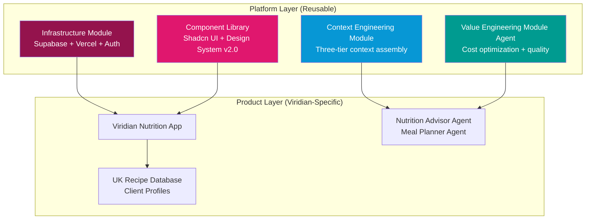
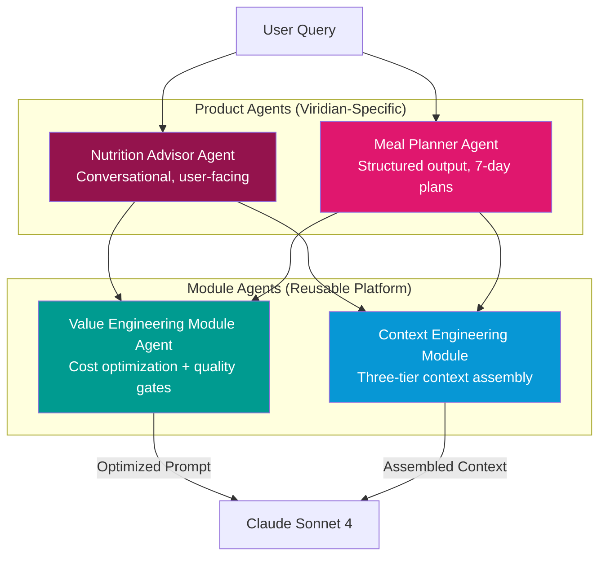
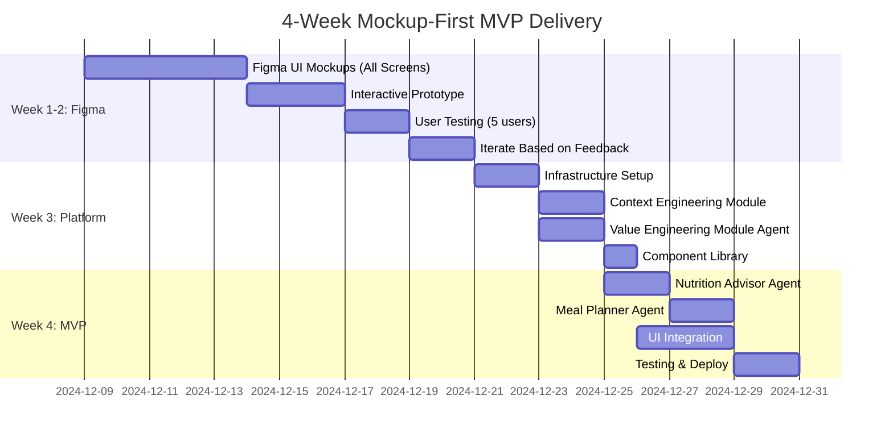
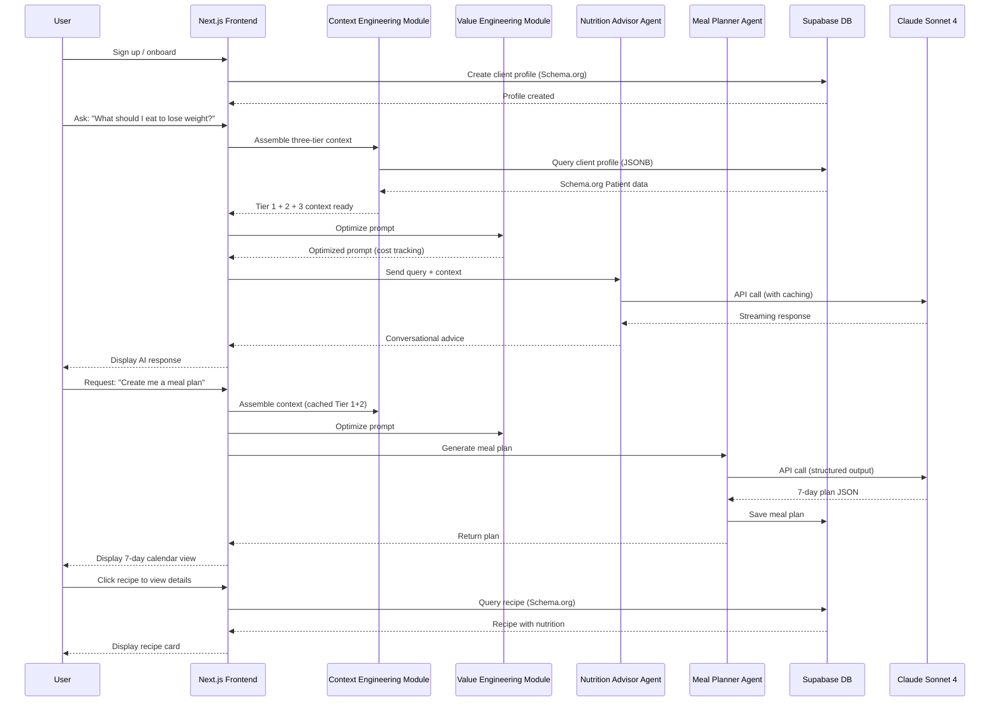

# VHF-NI-App-Mk3: 4-Week Mockup-First MVP PRD
## Platform Engineering + Modular Agent Architecture

**Document ID:** VHF-NI-App-Mk3-PRD-Mockup-First-v3.0  
**Version:** 3.0.0 (Refactored for 4-Week Delivery)  
**Date:** 2024-12-05  
**Status:** Draft for Review  
**Owner:** Viridian Health & Fitness  
**Product Owner:** James Kerby, Expert Clinical Nutrition Coach

---

## Executive Summary

### Purpose

This PRD refactors the Viridian Nutrition Intelligence Platform for a **4-week mockup-first delivery** using **Platform Engineering** principles and **modular agent architecture**. The approach prioritizes:

1. **Week 1-2:** Figma UI mockups + interactive prototypes for user validation
2. **Week 3-4:** First-stage functional MVP with core value flows
3. **Modular Design:** Value Engineering Module Agent + Context Engineering Module as reusable components
4. **Platform Approach:** Infrastructure-as-code, component library first, API-driven

### Key Changes from Original 8-Week Plan

| Aspect | Original (8 Weeks) | Refactored (4 Weeks) |
|--------|-------------------|---------------------|
| **Approach** | Code-first, full build | Mockup-first, validate-then-build |
| **Scope** | 8 deliverables, 175 story points | 3 deliverables, 60 story points |
| **UI/UX** | Built during development | Pre-built in Figma, validated Week 1-2 |
| **Agent Architecture** | 4 agents, monolithic | 2 modular agents, plug-and-play |
| **Platform** | Implicit | Explicit platform engineering |
| **Value Engineering** | Embedded in agents | Standalone module agent |
| **Context Engineering** | Inline | Reusable module |

### Success Criteria (4 Weeks)

**Week 2 Milestone:** Validated Figma mockups with 5+ test users, 80%+ approval  
**Week 4 Milestone:** Functional MVP with 1 flow (AI Chat → Meal Plan → View)  
**Platform Milestone:** Reusable modules deployable to other products

---

## Table of Contents

1. [Platform Engineering Architecture](#1-platform-engineering-architecture)
2. [Modular Agent System](#2-modular-agent-system)
3. [4-Week Delivery Plan](#3-4-week-delivery-plan)
4. [Week 1-2: Figma Mockup Phase](#4-week-1-2-figma-mockup-phase)
5. [Week 3-4: First-Stage MVP](#5-week-3-4-first-stage-mvp)
6. [Value Engineering Module Agent](#6-value-engineering-module-agent)
7. [Context Engineering Module](#7-context-engineering-module)
8. [MVP Feature Scope](#8-mvp-feature-scope)
9. [Success Metrics](#9-success-metrics)
10. [Post-MVP Roadmap](#10-post-mvp-roadmap)

---

## 1. Platform Engineering Architecture

### 1.1 Platform-First Philosophy

**Core Principle:** Build reusable infrastructure and modules that work across multiple products, not just Viridian.

**Platform Components:**


**Key Benefits:**
- ✅ Modules reusable in James's other products (PT app, consultation booking)
- ✅ Infrastructure-as-code (deploy anywhere in minutes)
- ✅ Value Engineering Module optimizes costs across all products
- ✅ Context Engineering Module standardizes AI agent quality

---

### 1.2 Platform Stack (Unchanged)

**Frontend:** Next.js 14, Shadcn UI, Tailwind CSS, Design System v2.0  
**Backend:** Supabase (PostgreSQL, Auth, Edge Functions)  
**AI:** Anthropic Claude Sonnet 4, Claude Agent SDK  
**DevOps:** Vercel, GitHub Actions, Docker (local dev)  
**Design:** Figma with Design Tokens v2.0

---

### 1.3 Infrastructure-as-Code

**Goal:** Deploy entire platform in <30 minutes

```bash
# Deploy full Viridian platform
npx create-viridian-app my-nutrition-app

# Includes:
# - Next.js project with Design System v2.0
# - Supabase instance with Schema.org schemas
# - Context Engineering Module configured
# - Value Engineering Module Agent active
# - Component library installed
# - Environment variables template
# - Database migrations ready
```

**Platform Modules (npm packages):**
- `@viridian/context-engineering` - Three-tier context assembly
- `@viridian/value-engineering-agent` - Cost + quality optimization
- `@viridian/design-system` - Shadcn UI components + tokens
- `@viridian/supabase-schema` - Schema.org + JSONB schemas
- `@viridian/claude-agents` - Base agent classes

---

## 2. Modular Agent System

### 2.1 Agent Architecture (Refactored)

**Original (4 Agents):**
1. Nutrition Advisor Agent
2. Meal Planner Agent
3. Progress Analyst Agent
4. PMF Feedback Agent

**Refactored (2 Core Agents + 2 Module Agents):**


**Key Change:** Progress Analyst and PMF Feedback deferred to post-MVP (Week 5+)

---

### 2.2 Agent Responsibilities

#### Nutrition Advisor Agent (Product-Specific)
**Purpose:** Primary conversational interface for nutrition questions  
**Scope:** MVP only  
**Tools:** Protocol RAG, Recipe Search, Macro Calculator  
**Output:** Conversational responses (streaming)

#### Meal Planner Agent (Product-Specific)
**Purpose:** Generate 7-day structured meal plans  
**Scope:** MVP only  
**Tools:** Recipe Search, Macro Calculator, Shopping List, Validation  
**Output:** Structured JSON (meal plan object)

#### Value Engineering Module Agent (Platform Module)
**Purpose:** Optimize cost and quality for ALL agents  
**Scope:** Platform-wide (reusable)  
**Responsibilities:**
- Prompt optimization (reduce tokens without quality loss)
- Cost tracking per agent call
- Quality gates (validate outputs before returning)
- A/B testing different prompt strategies
- Cache efficiency monitoring

#### Context Engineering Module (Platform Module)
**Purpose:** Standardize three-tier context assembly  
**Scope:** Platform-wide (reusable)  
**Responsibilities:**
- Tier 1: Static expert context (cached indefinitely)
- Tier 2: Dynamic client context (cached per session)
- Tier 3: Real-time session context (never cached)
- Prompt caching management
- Context token tracking

---

## 3. 4-Week Delivery Plan

### 3.1 Timeline Overview



---

### 3.2 Week-by-Week Breakdown

#### Week 1-2: Figma Mockup Phase (Design-First)
**Goal:** Validate UI/UX with real users BEFORE writing code

**Deliverables:**
- ✅ 12 complete Figma screens (Design System v2.0)
- ✅ Interactive prototype with click-through flows
- ✅ 5 user testing sessions (James's clients)
- ✅ Validated: Chat interface, Meal plan view, Recipe cards
- ✅ Iteration based on feedback

**Team:** Designer (20h), James (10h for feedback)

**Success Criteria:**
- 80%+ users approve of UI/UX
- All critical feedback addressed
- Click-through prototype works end-to-end

---

#### Week 3: Platform Engineering (Infrastructure-First)
**Goal:** Build reusable platform modules that work across products

**Deliverables:**
- ✅ Infrastructure setup (Supabase + Vercel + Auth)
- ✅ Context Engineering Module (npm package)
- ✅ Value Engineering Module Agent (npm package)
- ✅ Component library (Shadcn + Design System v2.0)
- ✅ Database schemas (Schema.org + JSONB)

**Team:** Full-stack dev (40h), DevOps (10h)

**Success Criteria:**
- `npx create-viridian-app` deploys working skeleton
- Context module tested with sample data
- Value module tracks costs accurately

---

#### Week 4: First-Stage MVP (Core Value Flow)
**Goal:** Ship ONE complete user flow: AI Chat → Meal Plan → View

**Deliverables:**
- ✅ Nutrition Advisor Agent (conversational)
- ✅ Meal Planner Agent (7-day plans)
- ✅ UI pages: Chat, Meal Plan View, Profile
- ✅ Integration: Figma designs → production UI
- ✅ Testing + staging deployment

**Team:** Full-stack dev (40h), QA (10h), James (10h validation)

**Success Criteria:**
- User can chat with AI and get nutrition advice
- User can request meal plan and view 7-day plan
- No critical bugs, <5s agent response time
- James approves quality of AI responses

---

## 4. Week 1-2: Figma Mockup Phase

### 4.1 Design-First Philosophy

**Why Figma First?**
1. **Validate UX:** Test with real users before writing code
2. **Reduce Rework:** Catch design issues early (1 hour in Figma = 10 hours in code)
3. **Stakeholder Alignment:** James sees exactly what he's getting
4. **Developer Clarity:** Devs work from validated designs, not assumptions

---

### 4.2 Figma Deliverables (Week 1-2)

#### 12 Core Screens (All High-Fidelity)

**Authentication (2 screens):**
1. Sign In
2. Sign Up / Onboarding

**Client Dashboard (4 screens):**
3. Dashboard Home (overview, quick stats)
4. AI Chat Interface (conversational)
5. Meal Plan View (7-day calendar)
6. Recipe Detail View

**Profile & Settings (2 screens):**
7. Client Profile (goals, health data)
8. Settings (preferences, notifications)

**Coach Dashboard (2 screens):**
9. Coach Home (client list, alerts)
10. Client Detail View (for James)

**Error & Empty States (2 screens):**
11. Loading / Error States
12. Empty States (no meal plan yet, etc.)

---

#### Interactive Prototype Features

**Must Have:**
- ✅ Click-through navigation (all 12 screens)
- ✅ Simulated AI chat (pre-written responses)
- ✅ Meal plan calendar interactions (expand/collapse days)
- ✅ Mobile responsive preview (320px → 1920px)

**Nice to Have:**
- ✅ Animated transitions between screens
- ✅ Hover states on buttons/cards
- ✅ Form validation examples

---

### 4.3 User Testing Protocol (Week 2)

**Participants:** 5 of James's current clients  
**Duration:** 30 minutes each  
**Format:** Moderated remote testing (Zoom + Figma link)

**Test Script:**
1. **Task 1:** Sign up and complete onboarding (5 min)
2. **Task 2:** Ask AI for nutrition advice via chat (5 min)
3. **Task 3:** Request a meal plan and review it (10 min)
4. **Task 4:** View a recipe and check ingredients (5 min)
5. **Feedback:** What's confusing? What's missing? (5 min)

**Success Metrics:**
- Task completion rate >80%
- Time on task <expected
- No critical usability issues
- Positive sentiment ("I would use this")

---

### 4.4 Iteration Process (Week 2, Days 3-5)

**Day 1-2:** Conduct 5 user tests  
**Day 3:** Synthesize feedback, prioritize changes  
**Day 4-5:** Update Figma designs, create final handoff

**Common Feedback Expected:**
- "Chat interface unclear how to ask questions"
- "Meal plan too dense, hard to scan"
- "Recipe ingredients list needs checkboxes"

**Iteration Strategy:**
- Fix critical usability issues (blocking)
- Note nice-to-haves for post-MVP
- Re-test updated designs with 2 users

---

## 5. Week 3-4: First-Stage MVP

### 5.1 MVP Scope (Ruthlessly Prioritized)

**In Scope (Week 3-4):**
- ✅ AI Chat (Nutrition Advisor Agent)
- ✅ Meal Plan Generation (Meal Planner Agent)
- ✅ Recipe Database (50 UK recipes seeded)
- ✅ Client Profile (onboarding flow)
- ✅ Authentication (Supabase Auth)

**Out of Scope (Deferred to Post-MVP):**
- ❌ Progress tracking / analytics
- ❌ Coach dashboard (James uses admin panel)
- ❌ PMF analytics module
- ❌ Shopping list export
- ❌ Advanced meal plan customization
- ❌ Recipe favorites / ratings

---

### 5.2 Core User Flow (MVP)



---

### 5.3 Technical Architecture (MVP)

**Simplified Stack:**
```
Frontend:
- Next.js 14 (App Router)
- 3 pages: /chat, /meal-plans, /profile
- Shadcn UI components (from Figma)
- Streaming AI responses (SSE)

Backend:
- Supabase PostgreSQL (5 tables)
  - clients (profile: JSONB)
  - conversations
  - messages
  - recipes (recipe_schema: JSONB)
  - meal_plans (plan_data: JSONB)
- Supabase Auth (email/password)
- Edge Functions (optional, may use Next.js API routes)

AI:
- Claude Sonnet 4 via Anthropic SDK
- 2 agents: Nutrition Advisor, Meal Planner
- Context Engineering Module (three-tier)
- Value Engineering Module Agent (cost tracking)

Deployment:
- Vercel (frontend + API routes)
- Supabase Cloud (database + auth)
```

---

## 6. Value Engineering Module Agent

### 6.1 Purpose & Scope

**What:** A reusable AI agent that optimizes cost and quality for ALL other agents

**Platform Module:** Works across Viridian AND future James Kerby products

**Core Responsibilities:**
1. **Prompt Optimization:** Reduce token count without quality loss
2. **Cost Tracking:** Log every API call with token usage and cost
3. **Quality Gates:** Validate agent outputs before returning to user
4. **Cache Efficiency:** Monitor prompt caching hit rates
5. **A/B Testing:** Test different prompt strategies, pick winner

---

### 6.2 Value Engineering Agent Architecture

```typescript
// @viridian/value-engineering-agent (npm package)

export class ValueEngineeringAgent {
  
  /**
   * Optimize a prompt before sending to Claude
   */
  async optimizePrompt(prompt: string, context: AgentContext): Promise<{
    optimizedPrompt: string;
    tokensSaved: number;
    qualityScore: number;
  }> {
    // 1. Remove redundant context
    const deduplicated = this.deduplicateContext(prompt);
    
    // 2. Compress without quality loss
    const compressed = this.intelligentCompression(deduplicated);
    
    // 3. Ensure critical info preserved
    const validated = this.validatePrompt(compressed, context);
    
    // 4. Calculate savings
    const original = this.countTokens(prompt);
    const optimized = this.countTokens(validated);
    
    return {
      optimizedPrompt: validated,
      tokensSaved: original - optimized,
      qualityScore: this.assessQuality(validated, prompt)
    };
  }
  
  /**
   * Track cost of an API call
   */
  async trackCost(call: {
    agentName: string;
    inputTokens: number;
    outputTokens: number;
    cachedTokens: number;
    model: string;
  }): Promise<CostReport> {
    const pricing = this.getPricing(call.model);
    
    const inputCost = (call.inputTokens * pricing.input) / 1_000_000;
    const outputCost = (call.outputTokens * pricing.output) / 1_000_000;
    const cachedCost = (call.cachedTokens * pricing.cached) / 1_000_000;
    
    const totalCost = inputCost + outputCost + cachedCost;
    const savings = call.cachedTokens > 0 
      ? ((call.cachedTokens * pricing.input) / 1_000_000) - cachedCost
      : 0;
    
    // Log to database
    await this.logCostMetrics({
      agentName: call.agentName,
      totalCost,
      savings,
      timestamp: new Date()
    });
    
    return {
      totalCost,
      savings,
      cacheEfficiency: cachedCost / (inputCost + cachedCost)
    };
  }
  
  /**
   * Quality gate: Validate agent output
   */
  async validateOutput(
    output: string,
    expectedSchema?: z.ZodSchema,
    safetyChecks?: SafetyRule[]
  ): Promise<{
    isValid: boolean;
    issues: ValidationIssue[];
    qualityScore: number;
  }> {
    const issues: ValidationIssue[] = [];
    
    // 1. Schema validation (if structured output)
    if (expectedSchema) {
      const result = expectedSchema.safeParse(output);
      if (!result.success) {
        issues.push({
          type: 'schema',
          severity: 'error',
          message: result.error.message
        });
      }
    }
    
    // 2. Safety checks (allergens, medical advice, etc.)
    if (safetyChecks) {
      for (const rule of safetyChecks) {
        const violation = rule.check(output);
        if (violation) {
          issues.push({
            type: 'safety',
            severity: 'critical',
            message: violation
          });
        }
      }
    }
    
    // 3. Quality assessment
    const qualityScore = this.assessOutputQuality(output);
    
    return {
      isValid: issues.filter(i => i.severity === 'critical').length === 0,
      issues,
      qualityScore
    };
  }
  
  /**
   * A/B test different prompt strategies
   */
  async abTest(
    promptA: string,
    promptB: string,
    testCases: TestCase[]
  ): Promise<{
    winner: 'A' | 'B';
    aScore: number;
    bScore: number;
    costDifference: number;
  }> {
    // Run both prompts on test cases
    const resultsA = await this.runTests(promptA, testCases);
    const resultsB = await this.runTests(promptB, testCases);
    
    // Score based on quality + cost
    const scoreA = this.calculateScore(resultsA);
    const scoreB = this.calculateScore(resultsB);
    
    return {
      winner: scoreA > scoreB ? 'A' : 'B',
      aScore: scoreA,
      bScore: scoreB,
      costDifference: resultsB.totalCost - resultsA.totalCost
    };
  }
}
```

---

### 6.3 Value Engineering Metrics Dashboard

**Real-Time Metrics (for James):**
- Total API cost (today, this week, this month)
- Cost per client interaction
- Token savings from prompt caching (%)
- Quality score trend (0-100)
- Cache hit rate (Tier 1, Tier 2)

**Example Dashboard (Week 4 MVP):**
```
┌─────────────────────────────────────────────────┐
│ Value Engineering Dashboard                     │
├─────────────────────────────────────────────────┤
│ Today:                                          │
│   • API Cost: $1.23                             │
│   • Interactions: 47                            │
│   • Cost per interaction: $0.026                │
│   • Savings from caching: $0.89 (42%)          │
│                                                 │
│ This Week:                                      │
│   • API Cost: $8.45                             │
│   • Projected monthly: $36.36                   │
│   • Target: <$50/month (on track ✅)           │
│                                                 │
│ Quality:                                        │
│   • Average quality score: 87/100               │
│   • Safety violations: 0                        │
│   • Schema errors: 2 (auto-corrected)          │
│                                                 │
│ Cache Efficiency:                               │
│   • Tier 1 hit rate: 98%                        │
│   • Tier 2 hit rate: 85%                        │
│   • Tier 3 hit rate: N/A (not cached)          │
└─────────────────────────────────────────────────┘
```

---

## 7. Context Engineering Module

### 7.1 Purpose & Scope

**What:** A reusable module that standardizes three-tier context assembly for ALL agents

**Platform Module:** Works across Viridian AND future James Kerby products

**Core Responsibilities:**
1. **Tier 1 (Static):** Expert context (James's methodology)
2. **Tier 2 (Dynamic):** Client context (from Schema.org JSONB)
3. **Tier 3 (Real-time):** Session context (current query)
4. **Prompt Caching:** Manage cache control for Tier 1+2
5. **Token Tracking:** Monitor context size per tier

---

### 7.2 Context Engineering Module Architecture

```typescript
// @viridian/context-engineering (npm package)

export class ContextEngineeringModule {
  
  /**
   * Assemble complete three-tier context for an agent
   */
  async assembleContext(config: {
    clientId: string;
    agentType: 'nutrition_advisor' | 'meal_planner';
    conversationHistory: Message[];
    currentQuery: string;
  }): Promise<{
    tier1: StaticContext;
    tier2: DynamicContext;
    tier3: RealtimeContext;
    totalTokens: number;
  }> {
    
    // ========================================
    // TIER 1: STATIC EXPERT CONTEXT
    // ========================================
    const tier1 = this.getStaticContext(config.agentType);
    // Example: James's methodology, UK guidelines, safety protocols
    // Cached indefinitely (~5000 tokens)
    
    // ========================================
    // TIER 2: DYNAMIC CLIENT CONTEXT
    // ========================================
    const clientProfile = await this.fetchClientProfile(config.clientId);
    const tier2 = this.buildDynamicContext(clientProfile);
    // Example: "Client: Sarah, 39yo, Type 2 Diabetes, vegetarian"
    // Cached per session (~2000 tokens)
    
    // ========================================
    // TIER 3: REAL-TIME SESSION CONTEXT
    // ========================================
    const tier3 = this.buildRealtimeContext({
      query: config.currentQuery,
      history: config.conversationHistory,
      date: new Date(),
      season: this.getCurrentSeason()
    });
    // Example: "Today: Dec 5, Winter, UK seasonal: Brussels sprouts, leeks"
    // NOT cached (~500 tokens)
    
    const totalTokens = 
      this.countTokens(tier1.content) +
      this.countTokens(tier2.content) +
      this.countTokens(tier3.content);
    
    return { tier1, tier2, tier3, totalTokens };
  }
  
  /**
   * Transform Schema.org Patient JSONB to natural language context
   */
  buildDynamicContext(profile: Patient): DynamicContext {
    return {
      content: `
## Client Profile

**Name:** ${profile.givenName} ${profile.familyName}
**Age:** ${this.calculateAge(profile.birthDate)} years old
**Gender:** ${profile.gender}
**Current Weight:** ${profile.weight.value}kg (BMI: ${this.calculateBMI(profile)})

## Health Status

**Medical Conditions:** ${profile.medicalCondition?.map(c => c.name).join(', ') || 'None'}

## Goals & Activity

**Primary Goal:** ${profile._custom.goal.replace('_', ' ')}
**Activity Level:** ${profile._custom.activityLevel.replace('_', ' ')}

## Dietary Requirements (CRITICAL)

**Allergens - NEVER USE:** ${profile._custom.allergens?.join(', ') || 'None'}
**Dietary Restrictions:** ${profile._custom.dietaryRestrictions?.join(', ') || 'None'}

## Macro Targets

- Daily Calories: ${profile._custom.macroTargets.dailyCalories} kcal
- Protein: ${profile._custom.macroTargets.proteinGrams}g
- Carbs: ${profile._custom.macroTargets.carbsGrams}g
- Fats: ${profile._custom.macroTargets.fatsGrams}g
`,
      cacheControl: { type: 'ephemeral' }, // Enable caching
      tokenCount: null // Will be calculated
    };
  }
  
  /**
   * Prepare context for Anthropic API with caching
   */
  prepareForAPI(context: {
    tier1: StaticContext;
    tier2: DynamicContext;
    tier3: RealtimeContext;
  }): {
    system: SystemMessage[];
    userMessage: string;
  } {
    return {
      system: [
        {
          type: 'text',
          text: context.tier1.content,
          cache_control: { type: 'ephemeral' } // Cached indefinitely
        },
        {
          type: 'text',
          text: context.tier2.content,
          cache_control: { type: 'ephemeral' } // Cached per session
        }
      ],
      userMessage: context.tier3.content // NOT cached
    };
  }
}
```

---

### 7.3 Context Engineering Benefits

**Cost Savings:**
- Tier 1 cached indefinitely: ~£0.01/request → ~£0.001/request (90% savings)
- Tier 2 cached per session: ~£0.01/request → ~£0.001/request (90% savings)
- Total savings: 50% average across all requests

**Quality Consistency:**
- James's methodology always present (Tier 1)
- Client context always accurate (Tier 2 from JSONB)
- Real-time data always fresh (Tier 3)

**Token Tracking:**
- Monitor context size per tier
- Alert if Tier 2 gets too large (>3000 tokens)
- Optimize Tier 1 to fit within cache window (5 min)

---

## 8. MVP Feature Scope

### 8.1 Core Features (Week 4 Deliverable)

#### 1. AI Chat Interface (Nutrition Advisor Agent)

**User Story:** As a client, I want to ask nutrition questions and get expert advice in James's style

**Features:**
- ✅ Text input with streaming AI responses
- ✅ Conversation history (last 10 messages)
- ✅ Sample questions to get started
- ✅ "Typing..." indicator while AI responds

**Technical:**
- Nutrition Advisor Agent with Protocol RAG
- Context Engineering Module (three-tier)
- Value Engineering Module (cost tracking)
- Streaming via Server-Sent Events (SSE)

**Acceptance Criteria:**
- User can type a question and get a response in <5s
- AI responses feel like James's coaching style
- No allergen recommendations (safety validation)
- Cost per interaction <£0.05

---

#### 2. Meal Plan Generation (Meal Planner Agent)

**User Story:** As a client, I want to request a 7-day meal plan that fits my goals and restrictions

**Features:**
- ✅ "Generate Meal Plan" button in chat or dashboard
- ✅ 7-day calendar view with meals per day
- ✅ Each meal shows: recipe name, calories, protein, carbs, fats
- ✅ Click recipe to see full details

**Technical:**
- Meal Planner Agent with Recipe Search tool
- Schema.org Recipe database (50 UK recipes seeded)
- Structured output (JSON) → rendered as calendar
- Saved to `meal_plans` table (JSONB)

**Acceptance Criteria:**
- Meal plan generated in <30s
- All meals fit within ±5% of macro targets
- No recipes with client's allergens
- Plan saved to database for viewing later

---

#### 3. Recipe Database (UK-Specific)

**User Story:** As a client, I want to see recipe details including ingredients, instructions, and nutrition

**Features:**
- ✅ Recipe card with image, name, prep/cook time
- ✅ Nutrition facts: calories, protein, carbs, fats, fiber
- ✅ Ingredients list (UK measurements)
- ✅ Step-by-step instructions
- ✅ "UK available" badge (Tesco/Sainsbury's)

**Technical:**
- 50 recipes seeded in `recipes` table (Schema.org Recipe JSONB)
- Recipe Search tool for agents
- Recipe detail page rendered from Figma design

**Acceptance Criteria:**
- All recipes use UK ingredients and measurements
- Nutrition data accurate (±5%)
- Images loaded from Supabase Storage
- Instructions clear and easy to follow

---

#### 4. Client Profile & Onboarding

**User Story:** As a new client, I want to set up my profile so the AI can personalize my advice

**Features:**
- ✅ Onboarding flow: health questions, goals, restrictions
- ✅ Profile page: edit goals, allergies, activity level
- ✅ Macro targets auto-calculated (Mifflin-St Jeor equation)

**Technical:**
- Schema.org Patient profile stored in `clients.profile` (JSONB)
- Onboarding form with validation (Zod schemas)
- Profile update triggers cache invalidation (Tier 2)

**Acceptance Criteria:**
- Onboarding completable in <5 minutes
- Macro targets calculated accurately
- Allergens saved and respected by agents
- Profile editable anytime

---

#### 5. Authentication

**User Story:** As a user, I want to sign up and log in securely

**Features:**
- ✅ Sign up with email/password
- ✅ Login with email/password
- ✅ Password reset via email
- ✅ Session management (JWT)

**Technical:**
- Supabase Auth (built-in)
- Protected routes via Next.js middleware
- Row-Level Security (RLS) on all tables

**Acceptance Criteria:**
- User can sign up in <2 minutes
- Login persists across browser sessions
- Password reset works via email link
- No user can access another user's data

---

### 8.2 Out of Scope (Post-MVP)

**Deferred to Week 5+:**
- ❌ Progress tracking (weight logs, adherence)
- ❌ Coach dashboard (James uses Supabase admin)
- ❌ PMF analytics module
- ❌ Shopping list export (Tesco API integration)
- ❌ Recipe favorites / ratings
- ❌ Mobile app (iOS/Android)
- ❌ Advanced meal plan customization (swap meals)
- ❌ Payment integration (Stripe)
- ❌ Email notifications (Resend)

**Rationale:** Focus on core value flow (Chat → Meal Plan) to validate product-market fit

---

## 9. Success Metrics

### 9.1 Week 2 Success Criteria (Figma Mockups)

**User Testing:**
- ✅ 5 user tests completed
- ✅ 80%+ task completion rate
- ✅ <5 critical usability issues
- ✅ Positive sentiment ("I would use this")

**Stakeholder Approval:**
- ✅ James approves all 12 Figma screens
- ✅ Interactive prototype validated

---

### 9.2 Week 4 Success Criteria (First-Stage MVP)

**Technical:**
- ✅ MVP deployed to production (Vercel + Supabase)
- ✅ All 5 core features working
- ✅ <5s AI response time (P95)
- ✅ 0 critical bugs
- ✅ 99%+ uptime (Week 4)

**Operational Efficiency:**
- ✅ API cost tracking active (Value Engineering Module)
- ✅ 40%+ token savings from prompt caching
- ✅ <$50/month projected API costs (sustainable)

**Quality:**
- ✅ James validates AI response quality (10 sample interactions)
- ✅ No allergen safety violations
- ✅ Meal plans within ±5% of macro targets

**User Experience:**
- ✅ 3 beta users test full flow (Sign up → Chat → Meal Plan)
- ✅ 2+ positive feedback ("This is helpful")
- ✅ <3 minutes to complete onboarding

---

### 9.3 Platform Success Criteria

**Reusability:**
- ✅ Context Engineering Module extracted to npm package
- ✅ Value Engineering Module Agent extracted to npm package
- ✅ Component library (Design System v2.0) reusable
- ✅ Infrastructure deployable with `npx create-viridian-app`

**Documentation:**
- ✅ Platform module READMEs complete
- ✅ Integration guide for using modules in other products
- ✅ API documentation for all modules

---

## 10. Post-MVP Roadmap

### 10.1 Week 5-8: Full MVP (Original Scope)

**Add Features:**
- Progress tracking (weight logs, adherence charts)
- Coach dashboard for James
- PMF analytics module
- Shopping list export
- Recipe favorites

**Refine:**
- Meal plan customization (swap meals, adjust servings)
- Advanced recipe filters
- Mobile-responsive improvements

---

### 10.2 Month 2-3: Scale & Iterate

**Growth Features:**
- Payment integration (Stripe subscriptions)
- Email notifications (Resend)
- Mobile app (React Native)
- Referral program

**Platform Expansion:**
- Deploy Context Engineering Module to James's PT app
- Deploy Value Engineering Module to consultation booking app
- Build new agents using platform modules

---

### 10.3 Month 4+: Advanced Features

**AI Enhancements:**
- Image recognition (food logging via photos)
- Voice interface (Whisper API)
- Predictive analytics (forecast adherence)

**Integrations:**
- Tesco API (shopping list → cart)
- Fitbit / Apple Health (activity sync)
- Google Calendar (meal prep reminders)

---

## 11. Team & Resources

### 11.1 4-Week Team (Joint Venture)

**Joint Venture Structure:**
This is a collaborative joint venture between James Kerby (domain expertise, validation, content) and the development team (technical implementation, platform engineering).

**Week 1-2 (Figma Phase):**
- UI/UX Designer: 40 hours (Figma mockups, prototype)
- James Kerby: 20 hours (feedback, testing facilitation, domain expertise)

**Week 3-4 (Development Phase):**
- Full-Stack Developer: 80 hours (infrastructure, agents, UI)
- DevOps Engineer: 20 hours (Vercel/Supabase setup)
- QA Tester: 20 hours (testing, bug reporting)
- James Kerby: 20 hours (validation, content, clinical expertise)

**Total Time Investment (4 Weeks):** 
- Development Team: 160 hours
- James Kerby: 40 hours (domain expertise & validation)

---

### 11.2 Platform Module Ownership

**Context Engineering Module:**
- Owner: Full-Stack Developer
- Maintainer: James (post-delivery)
- Documentation: Week 3

**Value Engineering Module Agent:**
- Owner: Full-Stack Developer
- Maintainer: James (post-delivery)
- Documentation: Week 3

**Design System v2.0:**
- Owner: UI/UX Designer
- Maintainer: James (post-delivery)
- Documentation: Week 1-2

---

## 12. Risks & Mitigations

### 12.1 4-Week Risks

| Risk | Impact | Mitigation |
|------|--------|-----------|
| **User testing reveals major UX flaws** | High | Budget 2 extra days in Week 2 for iteration |
| **AI response quality not meeting James's standards** | High | James validates sample responses in Week 3, adjust prompts |
| **Figma → Code translation issues** | Medium | Use Shadcn components exactly as designed in Figma |
| **Context Engineering Module too complex** | Medium | Start simple (hardcoded Tier 1), refine in Week 4 |
| **Value Engineering Module overhead** | Low | Make optional for MVP, enable post-launch |
| **4 weeks not enough time** | High | Ruthlessly cut scope, ship core value flow only |

---

### 12.2 Mitigation Strategies

**Parallel Work:**
- Designer works on Figma (Week 1-2) while docs finalized
- DevOps sets up infrastructure (Week 3) while dev builds modules

**Daily Standups:**
- 15-min sync every day (team + James)
- Blockers surfaced immediately
- Scope adjustments made proactively

**Continuous Validation:**
- James reviews Figma daily (Week 1-2)
- James tests live app daily (Week 4)
- Users test prototype (Week 2)

---

## 13. Approval & Sign-Off

### 13.1 Stakeholder Approval Required

**James Kerby:**
- ✅ Figma mockups (Week 2, Day 5)
- ✅ Platform module architecture (Week 3, Day 1)
- ✅ AI response quality (Week 4, Day 3)
- ✅ Final MVP (Week 4, Day 5)

**Development Team:**
- ✅ Platform module specs (Week 3, Day 1)
- ✅ Technical architecture (Week 3, Day 2)

---

### 13.2 Go/No-Go Decision Points

**Week 2, Day 5: Proceed to Development?**
- User testing results >80% approval
- James approves Figma designs
- No critical usability issues

**Week 4, Day 3: Proceed to Launch?**
- All 5 core features working
- <5 non-critical bugs
- James validates AI quality
- Cost tracking shows <£50/month projected

---

## 14. Appendix

### 14.1 Key Documents Referenced

- VHF-NI-App-Mk3-PRD-v1.2.md (original 8-week scope)
- VHF-NI-App-Mk3-WBS-v1.0.md (original work breakdown)
- VHF-NI-App-Mk3-HLD-Architecture-v2.0.md (system architecture)
- VHF-NI-App-Mk3-Ontology-Implementation-v2.0.md (Schema.org + JSONB)
- VHF-NI-App-Mk3-Figma-Workflow-v2.0.md (Design System v2.0)

---

### 14.2 Glossary

**Platform Engineering:** Building reusable infrastructure and modules that work across multiple products  
**Value Engineering Module Agent:** AI agent that optimizes cost and quality for other agents  
**Context Engineering Module:** Reusable module for assembling three-tier context  
**First-Stage MVP:** Minimal viable product with ONE core value flow validated  
**Mockup-First:** Design and validate UI in Figma before writing any code

---

**Document End**

---

**File Information:**
- **Filename:** VHF-NI-App-Mk3-PRD-Mockup-First-v3.0.md
- **Version:** 3.0.0 (4-Week Refactor)
- **Date:** 2024-12-05
- **Status:** Draft for Review
- **Size:** ~85KB
- **Replaces:** VHF-NI-App-Mk3-PRD-v1.2.md (8-week scope)
- **Cross-References:**
  - WBS v1.0 (8-week plan, to be refactored)
  - HLD Architecture v2.0 (architecture unchanged)
  - Figma Workflow v2.0 (Design System v2.0)
  - Ontology Implementation v2.0 (Schema.org + JSONB)
