# VHF-Mockup-FigmaMake: Product Breakdown Structure
## Component Inventory for FigmaMake Generation

**Document ID:** VHF-Mockup-FigmaMake-PBS-v1.0  
**Version:** 1.0.0  
**Date:** 2024-12-10  
**Status:** Active  
**Parent Document:** VHF-Mockup-FigmaMake-PRD-v1.0.md  
**GitHub:** https://github.com/ajrmooreuk/VHF-App-Mk3

---

## PBS Overview

This Product Breakdown Structure decomposes the FigmaMake mockup deliverable into a hierarchical inventory of **WHAT** will be produced (components, screens, assets), not HOW they will be built.

**PBS Principles:**
- Product-oriented (not activity-oriented)
- 100% Rule: All deliverables captured
- Mutually exclusive components
- Hierarchical structure: System → Subsystems → Components

---

## PBS Hierarchy Diagram

```mermaid
graph TB
    ROOT[0.0 VHF Figma Design System<br/>FigmaMake Generated]
    
    ROOT --> TOKENS[1.0 Design Tokens<br/>73 Styles]
    ROOT --> ATOMS[2.0 Atomic Components<br/>Primitives]
    ROOT --> MOLECULES[3.0 Molecular Components<br/>Basic UI]
    ROOT --> ORGANISMS[4.0 Organism Components<br/>Complex UI]
    ROOT --> TEMPLATES[5.0 Page Templates<br/>Layouts]
    ROOT --> SCREENS[6.0 Application Screens<br/>12 Pages]
    ROOT --> PROTOTYPE[7.0 Interactive Prototype<br/>Flows]
    ROOT --> DOCS[8.0 Documentation Package<br/>Handoff]
    
    TOKENS --> T1[1.1 Color Variables<br/>56 tokens]
    TOKENS --> T2[1.2 Typography Variables<br/>11 tokens]
    TOKENS --> T3[1.3 Spacing Variables<br/>6 tokens]
    TOKENS --> T4[1.4 Style Library<br/>73 styles]
    
    ATOMS --> A1[2.1 Color Swatches<br/>8 primitives]
    ATOMS --> A2[2.2 Icon Library<br/>50+ icons]
    ATOMS --> A3[2.3 Spacing Grid<br/>Visualization]
    ATOMS --> A4[2.4 Border Styles<br/>4 variants]
    
    MOLECULES --> M1[3.1 Button<br/>48 variants]
    MOLECULES --> M2[3.2 Input<br/>12 variants]
    MOLECULES --> M3[3.3 Badge<br/>5 variants]
    MOLECULES --> M4[3.4 Avatar<br/>6 variants]
    MOLECULES --> M5[3.5 MacroChart<br/>3 variants]
    
    ORGANISMS --> O1[4.1 MealCard<br/>16 variants]
    ORGANISMS --> O2[4.2 RecipeCard<br/>4 variants]
    ORGANISMS --> O3[4.3 ChatBubble<br/>4 variants]
    ORGANISMS --> O4[4.4 NutritionPanel<br/>3 variants]
    ORGANISMS --> O5[4.5 ProgressChart<br/>6 variants]
    
    TEMPLATES --> TM1[5.1 DashboardLayout]
    TEMPLATES --> TM2[5.2 ChatLayout]
    TEMPLATES --> TM3[5.3 MealPlanLayout]
    TEMPLATES --> TM4[5.4 ProfileLayout]
    
    SCREENS --> S1[6.1 Authentication<br/>2 screens]
    SCREENS --> S2[6.2 Client Dashboard<br/>4 screens]
    SCREENS --> S3[6.3 Profile & Settings<br/>2 screens]
    SCREENS --> S4[6.4 Coach Dashboard<br/>2 screens]
    SCREENS --> S5[6.5 States<br/>2 screens]
    
    PROTOTYPE --> P1[7.1 User Flows<br/>5 flows]
    PROTOTYPE --> P2[7.2 Interactions<br/>Hover, Focus]
    PROTOTYPE --> P3[7.3 Responsive Frames<br/>3 breakpoints]
    
    DOCS --> D1[8.1 Component Guide]
    DOCS --> D2[8.2 Screen Flows]
    DOCS --> D3[8.3 Token Reference]
    DOCS --> D4[8.4 Handoff Package]
    
    style ROOT fill:#94134d,color:#fff
    style TOKENS fill:#0797d5,color:#fff
    style SCREENS fill:#009b90,color:#fff
```

---

## 1.0 Design Tokens (73 Total)

### 1.1 Color Variables (56 tokens)

**Primitive Colors:**
- `color/teal/500` = #007c74 (Primary)
- `color/teal/300` = #65c0c0 (Primary Light)
- `color/teal/700` = #1e414f (Primary Dark)
- `color/orange/500` = #f16a21 (Secondary)
- `color/sage/500` = #a0afa1 (Accent)
- `color/mint/200` = #c2d8cc (Neutral Base)
- Neutral scale: 50, 100, 200, 300, 500, 700, 900

**Semantic Colors:**
- `color/primary` → teal/500
- `color/secondary` → orange/500
- `color/accent` → sage/500
- `color/success` → teal/500
- `color/warning` → orange/300
- `color/error` → red/500
- `color/info` → blue/500

**Component Colors:**
- `button/background/primary` → color/primary
- `button/background/secondary` → color/secondary
- `button/text/primary` → white
- `card/border` → neutral/200
- `input/border/default` → neutral/300
- `input/border/focus` → color/primary
- (46 additional component color tokens)

**Color Styles (56):**
- Primary (3 shades)
- Secondary (3 shades)
- Accent (3 shades)
- Semantic (success, warning, error, info - 4 colors × 3 shades = 12)
- Neutral (7 shades)
- Text (4 levels)
- Background (3 levels)
- Border (4 types)

---

### 1.2 Typography Variables (11 tokens)

**Font Families:**
- `font/family/sans` = PT Sans
- `font/family/heading` = PT Sans

**Font Sizes (8):**
- `font/size/xs` = 12px
- `font/size/sm` = 14px
- `font/size/base` = 16px
- `font/size/lg` = 18px
- `font/size/xl` = 20px
- `font/size/2xl` = 24px
- `font/size/3xl` = 30px
- `font/size/4xl` = 36px

**Font Weights:**
- `font/weight/normal` = 400
- `font/weight/bold` = 700

**Line Heights:**
- `font/lineHeight/tight` = 1.25
- `font/lineHeight/normal` = 1.5
- `font/lineHeight/relaxed` = 1.75

**Text Styles (11):**
1. H1 (36px, bold, tight)
2. H2 (30px, bold, tight)
3. H3 (24px, bold, normal)
4. H4 (20px, bold, normal)
5. H5 (18px, bold, normal)
6. H6 (16px, bold, normal)
7. Body Large (18px, normal, normal)
8. Body (16px, normal, normal)
9. Body Small (14px, normal, normal)
10. Caption (12px, normal, relaxed)
11. Label (14px, bold, normal)

---

### 1.3 Spacing Variables (6 tokens)

**8px Grid System:**
- `space/xs` = 4px (0.5 unit)
- `space/sm` = 8px (1 unit)
- `space/md` = 16px (2 units)
- `space/lg` = 24px (3 units)
- `space/xl` = 32px (4 units)
- `space/2xl` = 48px (6 units)

**Border Radius:**
- `radius/sm` = 4px
- `radius/md` = 8px
- `radius/lg` = 12px
- `radius/xl` = 16px
- `radius/2xl` = 24px
- `radius/full` = 9999px

---

### 1.4 Effect Styles (6 shadows)

**Shadow Styles:**
1. `shadow/sm` = 0 1px 2px rgba(0, 124, 116, 0.05)
2. `shadow/md` = 0 4px 6px rgba(0, 124, 116, 0.1)
3. `shadow/lg` = 0 10px 15px rgba(0, 124, 116, 0.1)
4. `shadow/xl` = 0 20px 25px rgba(0, 124, 116, 0.15)
5. `shadow/2xl` = 0 25px 50px rgba(0, 124, 116, 0.2)
6. `shadow/inner` = inset 0 2px 4px rgba(0, 124, 116, 0.06)

---

## 2.0 Atomic Components (Primitives)

### 2.1 Color Swatches (8 primitives)
- Primary swatch (teal, 3 shades)
- Secondary swatch (orange, 3 shades)
- Accent swatch (sage, 1 shade)
- Success swatch (teal)

### 2.2 Icon Library (50+ icons)
**Food Icons (20):**
- Apple, Banana, Chicken, Fish, Broccoli, Carrot, Egg, Milk, Bread, Rice, Pasta, Avocado, Salmon, Beef, Spinach, Tomato, Cheese, Nuts, Berries, Water

**Health Icons (15):**
- Heart, Weight, Measurements, Target, Activity, Sleep, Energy, Protein, Carbs, Fat, Calories, Supplement, Medical, Alert, Check

**UI Icons (15):**
- Home, Chat, Calendar, Recipe, Profile, Settings, Search, Filter, Edit, Delete, Add, Close, Menu, Arrow, Info

### 2.3 Spacing Grid Visualization
- Grid overlay showing 8px base unit
- Example boxes at each spacing scale (4px, 8px, 16px, 24px, 32px, 48px)

### 2.4 Border Styles (4 variants)
- Default: 1px solid neutral/300
- Subtle: 1px solid neutral/200
- Strong: 2px solid neutral/500
- Focus: 2px solid primary

---

## 3.0 Molecular Components (Basic UI)

### 3.1 Button Component (48 variants)

**Variant Matrix:** size (3) × variant (4) × state (4) = 48

**Sizes:**
- sm: height 32px, padding 8px 12px, font 14px
- md: height 40px, padding 12px 16px, font 16px
- lg: height 48px, padding 16px 24px, font 18px

**Variants:**
- default: primary background, white text
- secondary: orange background, white text
- outline: transparent background, primary border
- ghost: transparent background, primary text

**States:**
- default: base colors
- hover: 10% darker background
- focus: focus ring (2px primary)
- disabled: 50% opacity, cursor not-allowed

**Component Structure:**
- Auto-layout (horizontal)
- Icon slot (optional, left or right)
- Text label
- Loading spinner slot (optional)

---

### 3.2 Input Component (12 variants)

**Variant Matrix:** type (3) × state (4) = 12

**Types:**
- text: standard text input
- email: with @ symbol hint
- number: with up/down arrows

**States:**
- default: neutral border
- focus: primary border
- error: red border + error icon
- disabled: gray background, no interaction

**Component Structure:**
- Label (optional)
- Input field (auto-layout)
- Helper text (optional)
- Error message (conditional)
- Leading icon (optional)
- Trailing icon (optional)

---

### 3.3 Badge Component (5 variants)

**Variants:**
- default: neutral background
- secondary: orange background
- success: teal background
- warning: orange light background
- error: red background

**Component Structure:**
- Auto-layout (horizontal, hug contents)
- Padding: 4px 8px
- Border radius: 4px
- Font: 12px, bold, uppercase
- Text color: contrast-safe based on background

---

### 3.4 Avatar Component (6 variants)

**Variant Matrix:** size (3) × hasImage (2) = 6

**Sizes:**
- sm: 32px × 32px
- md: 48px × 48px
- lg: 64px × 64px

**States:**
- hasImage: true → displays image
- hasImage: false → displays initials

**Component Structure:**
- Circle container (border-radius: full)
- Image layer (fills container)
- Fallback text layer (initials, centered)
- Border: 2px white (optional)

---

### 3.5 MacroChart Component (3 variants)

**Types:**
- bar: horizontal stacked bar
- pie: circular pie chart
- ring: donut chart

**Data Display:**
- Protein (teal)
- Carbs (orange)
- Fat (sage)
- Total calories label
- Percentage labels

**Component Structure:**
- Chart graphic (SVG or composed shapes)
- Legend (3 items with color swatches)
- Total label
- Auto-layout frame

---

## 4.0 Organism Components (Complex UI)

### 4.1 MealCard (16 variants)

**Variant Matrix:** mealType (4) × hasImage (2) × showNutrition (2) = 16

**Meal Types:**
- breakfast: yellow badge
- lunch: green badge
- dinner: blue badge
- snack: gray badge

**Component Structure:**
- Card container (auto-layout vertical)
- Header: Badge + meal name + calories
- Image (optional, 16:9 ratio)
- Nutrition summary (optional, MacroChart bar)
- Footer: Prep time + servings
- Actions: View recipe button

**Specifications:**
- Width: fills container (min 280px)
- Height: auto (expands with content)
- Padding: 16px
- Border radius: 8px
- Shadow: md

---

### 4.2 RecipeCard (4 variants)

**Variant Matrix:** variant (2) × showNutrition (2) = 4

**Variants:**
- compact: small card for grid view
- detailed: large card with full info

**Component Structure:**
- Card container
- Hero image (4:3 ratio)
- Recipe title (H4)
- Prep/cook time badges
- Servings indicator
- Ingredient count
- Nutrition panel (optional, MacroChart ring)
- Tags (dietary, cuisine)
- CTA button: "View Recipe"

**Specifications (Detailed):**
- Width: 100% (max 640px)
- Image height: 240px
- Padding: 24px
- Border radius: 12px
- Shadow: lg

---

### 4.3 ChatBubble (4 variants)

**Variant Matrix:** role (2) × isStreaming (2) = 4

**Roles:**
- user: right-aligned, teal background, white text
- assistant: left-aligned, white background, black text

**States:**
- isStreaming: false → complete message
- isStreaming: true → typing indicator

**Component Structure:**
- Bubble container (auto-layout vertical)
- Avatar (left for assistant, right for user)
- Message content (markdown support)
- Timestamp (12px, neutral/500)
- Streaming indicator (3 animated dots)

**Specifications:**
- Max width: 70% of container
- Padding: 12px 16px
- Border radius: 16px (8px on avatar side)
- Shadow: sm

---

### 4.4 NutritionPanel (3 variants)

**Views:**
- daily: today's totals
- weekly: 7-day average
- monthly: 30-day average

**Component Structure:**
- Panel container (card)
- Header: view selector tabs
- Calories display (large, H2)
- Macro breakdown (MacroChart ring)
- Macro list (protein, carbs, fat with grams)
- Progress bars (target vs actual)
- Footer: last updated timestamp

**Specifications:**
- Width: 100% (max 400px)
- Padding: 24px
- Border radius: 12px
- Shadow: md

---

### 4.5 ProgressChart (6 variants)

**Variant Matrix:** metric (2) × timeframe (3) = 6

**Metrics:**
- weight: line chart with trend
- measurements: multi-line chart (waist, hips, etc.)

**Timeframes:**
- week: 7 data points
- month: 30 data points
- year: 52 data points

**Component Structure:**
- Chart container
- Title + timeframe selector
- Line chart graphic (SVG)
- Y-axis labels (metric units)
- X-axis labels (dates)
- Data point markers
- Tooltip (on hover)
- Legend (if multi-line)

**Specifications:**
- Width: 100%
- Height: 240px
- Padding: 16px
- Border radius: 8px
- Background: neutral/50

---

## 5.0 Page Templates (Layouts)

### 5.1 DashboardLayout
**Components:**
- Header (fixed, 64px height)
  - Logo (left)
  - Navigation menu (center)
  - User avatar + dropdown (right)
- Sidebar (240px width, collapsible on mobile)
  - Menu items (Home, Chat, Meal Plan, Recipes, Progress, Profile, Settings)
- Main content area (flex, scrollable)
- Footer (80px height)
  - Copyright + links

**Responsive:**
- Desktop (>1024px): sidebar visible
- Tablet (768-1023px): sidebar collapses to icons
- Mobile (<768px): sidebar hidden, hamburger menu

---

### 5.2 ChatLayout
**Components:**
- Message list container (scrollable, flex-reverse)
  - ChatBubbles (user + assistant)
  - Date separators
- Input area (fixed bottom, 80px height)
  - Text input (expandable)
  - Send button
  - Attachment button (optional)
- Suggested prompts (above input, dismissible)
  - 3-4 quick action chips

**Responsive:**
- All breakpoints: full height layout
- Mobile: input area height reduces to 64px

---

### 5.3 MealPlanLayout
**Components:**
- Calendar header (week selector, navigation)
- 7-day grid (desktop) / carousel (mobile)
  - Each day: 4 MealCards
- Day detail panel (expandable)
  - Expanded day shows full recipe info
- Totals summary (right sidebar)
  - Daily totals
  - Weekly totals
  - Macro progress
- CTA: "Generate New Plan" button

**Responsive:**
- Desktop: 7-column grid
- Tablet: 3-4 columns, scrollable
- Mobile: 1 column carousel, swipe navigation

---

### 5.4 ProfileLayout
**Components:**
- Tab navigation (horizontal, sticky)
  - Overview, Goals, Health Data, Preferences
- Content sections (per tab)
  - Form layouts
  - Data displays
- Actions footer
  - Save changes button
  - Cancel button

**Responsive:**
- Desktop: tabs horizontal
- Mobile: tabs scrollable horizontal

---

## 6.0 Application Screens (12 Pages)

### 6.1 Authentication (2 screens)

#### Screen 1: Sign In
**Components:**
- Logo (centered, 80px height)
- Sign in form
  - Email input
  - Password input
  - "Forgot password?" link
  - "Sign In" button (primary, large)
- "Don't have an account? Sign Up" link
- Footer: Terms + Privacy links

**Frames:**
- Desktop: 400px centered card
- Mobile: full-width, no card

---

#### Screen 2: Sign Up / Onboarding
**Components:**
- Progress indicator (4 steps)
- Multi-step form container
  - Step 1: Demographics (name, age, gender, height, weight)
  - Step 2: Health Profile (conditions, medications, activity level)
  - Step 3: Goals (target weight, timeline, motivation)
  - Step 4: Preferences (allergies, dietary restrictions, cooking skill)
- Navigation buttons
  - "Back" (secondary)
  - "Next" / "Complete" (primary)
- Skip option (for non-critical fields)

**Frames:**
- Desktop: 600px centered form
- Mobile: full-width, step-by-step

---

### 6.2 Client Dashboard (4 screens)

#### Screen 3: Dashboard Home
**Components (DashboardLayout):**
- Welcome header
  - "Welcome back, [Name]"
  - Current date
- Quick stats cards (4-card grid)
  - Today's calories (progress bar)
  - Macros summary (MacroChart ring)
  - Adherence streak (number badge)
  - Weight trend (mini ProgressChart)
- Upcoming meals section
  - Next 2 meals (MealCards compact)
- Recent chat summary
  - Last message from AI
  - "Continue conversation" CTA
- Action buttons
  - "Generate Meal Plan" (primary)
  - "Ask AI" (secondary)

**Responsive:**
- Desktop: 2×2 card grid
- Tablet: 2×2 card grid (smaller)
- Mobile: 1 column stack

---

#### Screen 4: AI Chat Interface
**Components (ChatLayout):**
- Message history
  - 10+ ChatBubbles (alternating user/assistant)
  - Date separators
  - Scrollable to top
- Suggested prompts (initial state)
  - "What should I eat for breakfast?"
  - "Create a meal plan for this week"
  - "How can I increase protein?"
  - "I'm craving something sweet"
- Input area
  - Text input (placeholder: "Ask me anything about nutrition...")
  - Send button
- Streaming indicator (when AI responding)

**Frames:**
- All breakpoints: full height

---

#### Screen 5: Meal Plan View
**Components (MealPlanLayout):**
- Week selector header
  - Current week label (e.g., "Week of Dec 10")
  - Previous/Next arrows
- 7-day calendar grid
  - Monday-Sunday columns
  - Each day: 4 MealCards (Breakfast, Lunch, Dinner, Snack)
- Totals sidebar (desktop) / bottom sheet (mobile)
  - Daily totals
  - Weekly totals
  - MacroChart pie
- Action buttons
  - "Generate New Plan"
  - "Customize"
  - "Export Shopping List"

**Responsive:**
- Desktop: 7 columns
- Tablet: 4 columns, scrollable
- Mobile: 1 column carousel

---

#### Screen 6: Recipe Detail
**Components:**
- Hero image (full-width, 400px height)
- Recipe header
  - Title (H1)
  - Prep time, cook time, total time badges
  - Servings selector
  - Save/favorite button
- Nutrition panel (NutritionPanel daily view)
- Ingredients list
  - Checkboxes
  - Quantities (scalable based on servings)
- Instructions
  - Step-by-step numbered list
  - Optional images per step
- Tags
  - Dietary (vegetarian, gluten-free, etc.)
  - Cuisine (British, Mediterranean, etc.)
- Actions
  - "Add to Meal Plan" (primary)
  - "Share" (secondary)

**Responsive:**
- Desktop: 2-column (ingredients left, instructions right)
- Mobile: 1 column stack

---

### 6.3 Profile & Settings (2 screens)

#### Screen 7: Client Profile
**Components (ProfileLayout, "Overview" tab):**
- Profile header
  - Avatar (large, 128px)
  - Name, email
  - Member since date
- Demographics card
  - Age, gender, height, current weight
  - Edit button
- Goals card
  - Target weight
  - Timeline
  - Progress bar
  - Edit button
- Dietary restrictions card
  - Tags (allergies, restrictions)
  - Edit button
- Macro targets card
  - Calories, protein, carbs, fat
  - MacroChart bar
  - Edit button
- Actions
  - "Save Changes" (primary)
  - "Cancel" (secondary)

**Responsive:**
- Desktop: 2-column card layout
- Mobile: 1 column stack

---

#### Screen 8: Settings
**Components (ProfileLayout, "Settings" tab):**
- Account section
  - Email (display only)
  - Change password button
- Notifications section
  - Email notifications toggle
  - Push notifications toggle
  - Reminder preferences dropdown
- Preferences section
  - Units (metric/imperial) radio
  - Theme (light/dark) radio
  - Language dropdown
- Data & Privacy section
  - Export data button
  - Delete account button (destructive)
- Actions
  - "Save Settings" (primary)
  - "Sign Out" (secondary, bottom)

**Responsive:**
- All breakpoints: single column form

---

### 6.4 Coach Dashboard (2 screens)

#### Screen 9: Coach Home (James)
**Components (DashboardLayout, coach variant):**
- Overview stats
  - Total active clients (number)
  - This week's activity (number)
  - Average adherence (percentage)
- Client list table
  - Columns: Name, Status (Active/Paused), Last Activity, Adherence, Actions
  - Sortable, filterable
  - Paginated (10 per page)
- Alerts section
  - Client needs attention (red badge)
  - New messages (blue badge)
- Quick actions
  - "Add Client" button (primary)
  - "View Reports" button (secondary)

**Responsive:**
- Desktop: table view
- Tablet: table view (scrollable horizontal)
- Mobile: card list view

---

#### Screen 10: Client Detail View (for James)
**Components:**
- Client header
  - Avatar + name
  - Status badge (Active/Paused)
  - Contact info
  - Edit button
- Tabs navigation
  - Overview, Meal Plans, Chat History, Progress, Notes
- Overview tab content
  - Current goals card
  - Recent progress (ProgressChart weight, week view)
  - Adherence summary (last 7 days)
  - Meal plan history (last 3 plans)
- Actions
  - "Message Client" (primary)
  - "Edit Profile" (secondary)
  - "View Full Chat" link

**Responsive:**
- Desktop: tabs + content side-by-side
- Mobile: tabs stacked, content below

---

### 6.5 States (2 screens)

#### Screen 11: Loading / Error States
**Components:**
- Loading state
  - Spinner (teal, 64px)
  - Message: "Generating your meal plan..."
  - Subtext: "This may take a few moments"
- Error state (generic)
  - Error icon (red, 80px)
  - Message: "Something went wrong"
  - Description: "We couldn't complete that action"
  - "Try Again" button (primary)
  - "Go Back" link
- API error state
  - Warning icon (orange)
  - Message: "We're having trouble connecting"
  - Description: "Please check your connection and try again"
  - "Retry" button
- Network error state
  - Offline icon (gray)
  - Message: "You're offline"
  - Description: "Please check your internet connection"

**Frames:**
- Centered overlay (400px card)

---

#### Screen 12: Empty States
**Components:**
- No meal plan yet
  - Illustration (meal plan icon, 200px)
  - Message: "No meal plan yet"
  - Description: "Generate your first personalized meal plan"
  - "Create Meal Plan" button (primary)
- No messages yet
  - Illustration (chat icon, 200px)
  - Message: "No messages yet"
  - Description: "Start a conversation with your AI nutrition advisor"
  - Suggested prompts (3 chips)
- No progress data
  - Illustration (chart icon, 200px)
  - Message: "No progress data yet"
  - Description: "Log your first weight entry to start tracking"
  - "Log Weight" button (primary)
- No recipes saved
  - Illustration (bookmark icon, 200px)
  - Message: "No saved recipes"
  - Description: "Save your favorite recipes for quick access"
  - "Browse Recipes" button (secondary)

**Frames:**
- Centered in content area (max 480px width)

---

## 7.0 Interactive Prototype (Flows)

### 7.1 User Flows (5 flows)

**Flow 1: Primary User Flow**
- 01 Sign In → 03 Dashboard Home → 04 AI Chat → 05 Meal Plan View → 06 Recipe Detail
- Total clicks: 4
- Duration estimate: 2 minutes

**Flow 2: Onboarding Flow**
- 02 Sign Up → Demographics → Health → Goals → Preferences → 03 Dashboard Home
- Total clicks: 5 (4 steps + completion)
- Duration estimate: 5 minutes

**Flow 3: Profile Management Flow**
- 03 Dashboard Home → 07 Client Profile → Edit → Save → 08 Settings → Sign Out
- Total clicks: 5
- Duration estimate: 3 minutes

**Flow 4: Coach Flow**
- 09 Coach Home → 10 Client Detail View → View Progress → Message Client
- Total clicks: 3
- Duration estimate: 1.5 minutes

**Flow 5: Error Recovery Flow**
- Any screen → Trigger loading → Error state → Retry → Success
- Total clicks: 2
- Duration estimate: 30 seconds

---

### 7.2 Interactions (Hover, Focus, Click)

**Button Interactions:**
- Hover: Background darkens 10%, cursor pointer
- Focus: 2px teal ring appears
- Click: Scale 98%, brief transition

**Input Interactions:**
- Focus: Border changes to teal, 2px width
- Error: Border changes to red, error message appears below
- Filled: Label moves to top (if floating label)

**Card Interactions:**
- Hover: Shadow increases from md to lg, lift 2px
- Click: Navigate to detail view

**Chat Interactions:**
- Streaming: Typing indicator (3 dots) animates
- Message sent: Smooth scroll to bottom
- New message: Slide in from bottom

**Navigation Interactions:**
- Tab click: Underline slides to active tab
- Mobile menu: Slide in from left
- Carousel: Swipe left/right, snap to card

---

### 7.3 Responsive Frames (3 breakpoints)

**Mobile (375px):**
- All 12 screens have mobile frames
- Navigation: Hamburger menu
- Cards: 1 column stack
- Forms: Full width
- Meal plan: Carousel view

**Tablet (768px):**
- Key screens: Dashboard Home, Chat, Meal Plan
- Navigation: Icon-only sidebar
- Cards: 2 column grid
- Forms: Max 600px centered
- Meal plan: 4 column grid

**Desktop (1440px):**
- All 12 screens have desktop frames
- Navigation: Full sidebar
- Cards: 3-4 column grid
- Forms: Max 800px centered
- Meal plan: 7 column grid

---

## 8.0 Documentation Package (Handoff)

### 8.1 Component Usage Guide
**Contents:**
- Component library overview
- Atomic design hierarchy explanation
- How to use each component
- Variant selection guide
- Best practices
- Do's and don'ts
- Code examples (TSX)

**Format:** PDF (15-20 pages)

---

### 8.2 Screen Flow Diagram
**Contents:**
- All 12 screens mapped
- User flow arrows
- Decision points
- Error states
- Empty states
- Mobile vs desktop flows

**Format:** Mermaid diagram + PDF export

---

### 8.3 Design Token Reference
**Contents:**
- Complete token list (73 tokens)
- Color palette with hex codes
- Typography scale
- Spacing scale
- Shadow styles
- Usage examples
- CSS variable equivalents
- Tailwind config mapping

**Format:** Markdown + PDF

---

### 8.4 Handoff Package
**Contents:**
- Figma share link (view-only)
- Prototype link (interactive)
- Asset export zip
  - Logos (SVG, PNG)
  - Icons (SVG)
  - Sample images (JPG, WebP)
- Component specs CSV
- Screen dimensions CSV
- Accessibility notes (WCAG 2.1 AA)
- Developer setup instructions

**Format:** Zip file + README

---

## PBS Summary Inventory

| Category | Quantity | Components |
|----------|----------|------------|
| **Design Tokens** | 73 | Colors (56), Typography (11), Shadows (6) |
| **Atoms** | 4 subsystems | Swatches, Icons, Spacing, Borders |
| **Molecules** | 5 components | Button (48v), Input (12v), Badge (5v), Avatar (6v), MacroChart (3v) |
| **Organisms** | 5 components | MealCard (16v), RecipeCard (4v), ChatBubble (4v), NutritionPanel (3v), ProgressChart (6v) |
| **Templates** | 4 layouts | Dashboard, Chat, MealPlan, Profile |
| **Screens** | 12 pages | Auth (2), Dashboard (4), Profile (2), Coach (2), States (2) |
| **Prototype** | 5 flows | Primary, Onboarding, Profile, Coach, Error |
| **Documentation** | 4 deliverables | Usage Guide, Flow Diagram, Token Reference, Handoff Package |
| **TOTAL** | 112 items | Complete design system + screens + prototype + docs |

---

## Acceptance Checklist

- [ ] 73 design tokens created in Figma variables
- [ ] 4 atomic subsystems complete
- [ ] 5 molecular components with all variants
- [ ] 5 organism components with all variants
- [ ] 4 page templates built
- [ ] 12 application screens complete
- [ ] 5 user flows functional in prototype
- [ ] Interactions working (hover, focus, responsive)
- [ ] 3 breakpoint frames created
- [ ] 4 documentation deliverables complete
- [ ] All components use design tokens (no hardcoded values)
- [ ] WCAG 2.1 AA compliance verified
- [ ] Figma file loads < 5 seconds
- [ ] Share links generated and tested

---

**Document Status:** ✅ Complete Inventory  
**Total Deliverables:** 112 items  
**Estimated Figma File Size:** ~50 MB  
**Estimated Components:** 100+  
**Estimated Frames:** 36+ (12 screens × 3 breakpoints)
