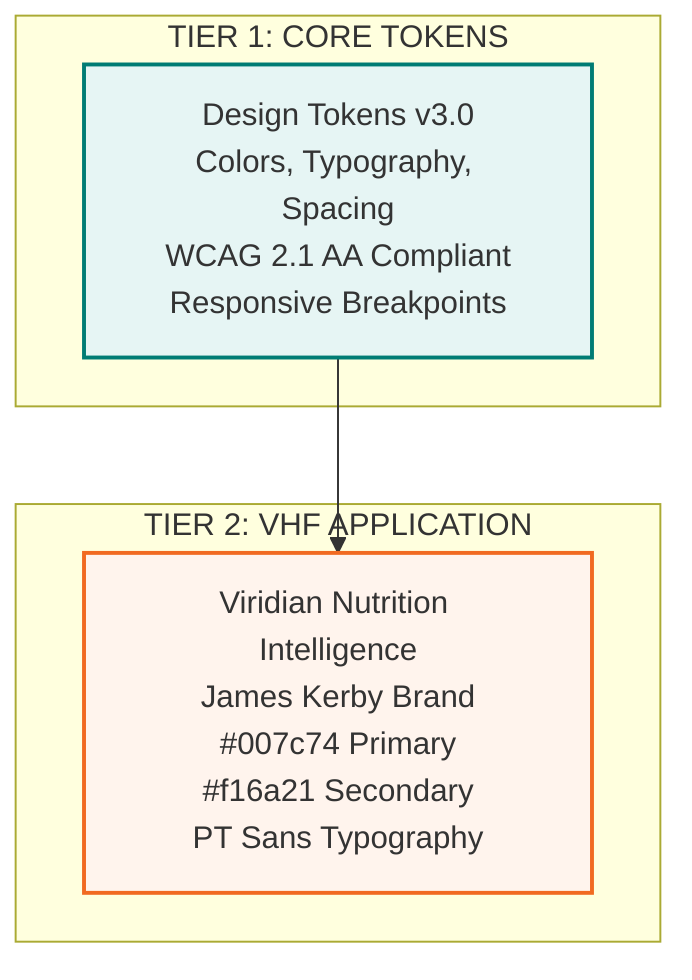
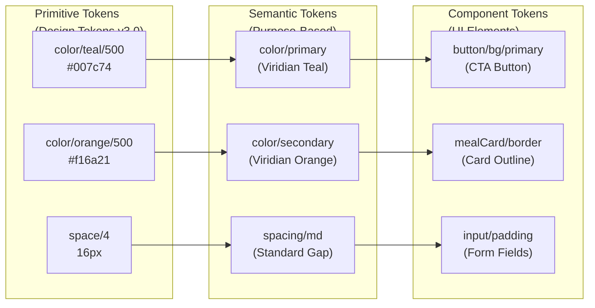
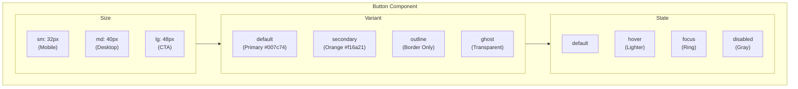
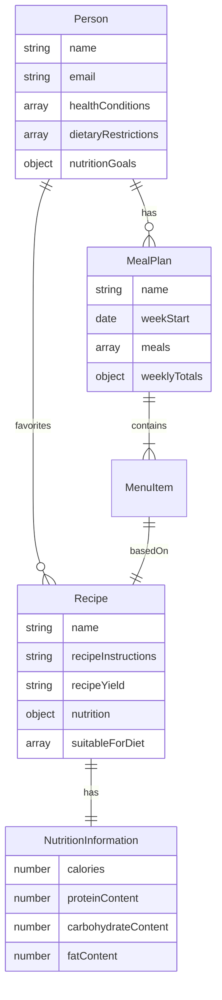
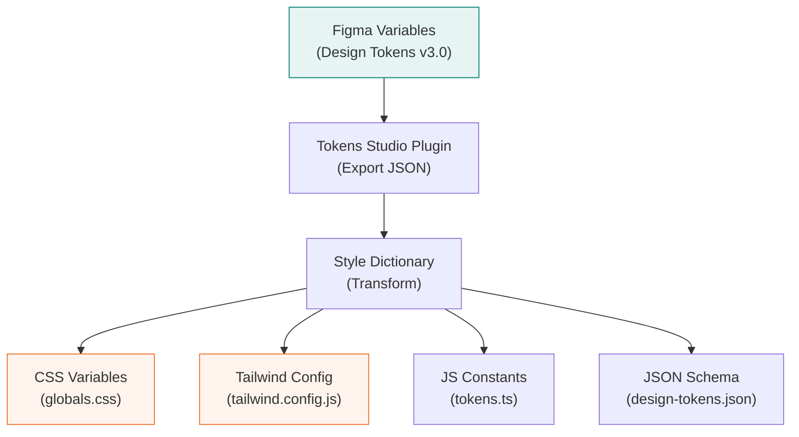
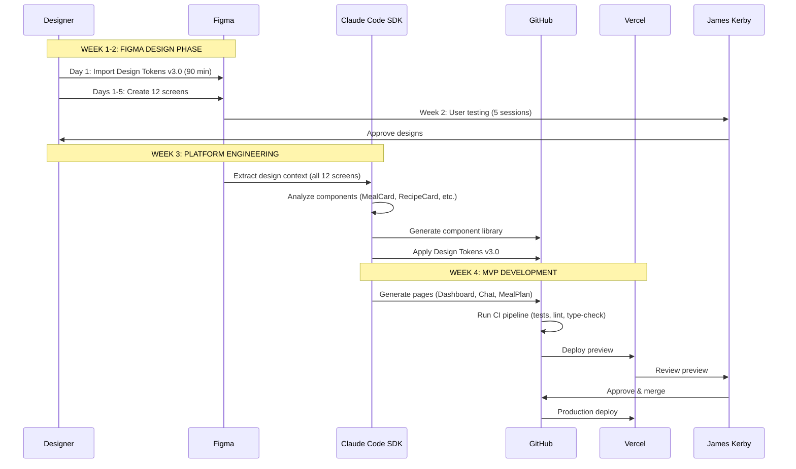

# VHF-NI-App: Figma Design System Architecture
## Professional Design-to-Code Framework for Nutrition Coaching

**Document ID:** VHF-NI-App-Mk3-Figma-Architecture-v1.0  
**Version:** 1.0.0  
**Date:** 2024-12-09  
**Status:** Active - Ready for Implementation  
**Approval:** ✅ Design Tokens v3.0 Approved by James Kerby

---

## Table of Contents

1. [Introduction & Design Philosophy](#1-introduction--design-philosophy)
2. [Atomic Design Methodology](#2-atomic-design-methodology)
3. [VHF Brand Architecture](#3-vhf-brand-architecture)
4. [Component Design Standards](#4-component-design-standards)
5. [Figma-to-Code Integration](#5-figma-to-code-integration)
6. [Design-to-Code Workflow](#6-design-to-code-workflow)
7. [VHF Implementation](#7-vhf-implementation)
8. [Quick Reference](#8-quick-reference)

---

## 1. Introduction & Design Philosophy

### 1.1 Core Principles

This document establishes the architectural foundation for the VHF Nutrition Intelligence Platform design system. The approach combines industry-standard Atomic Design principles with schema.org semantic standards to create component libraries that translate directly into production code via the Claude Code SDK.

**Design System Principles:**
- **Single Source of Truth:** Figma serves as the canonical design reference
- **Semantic Components:** Every component maps to schema.org types
- **Design Token Driven:** All styling comes from Design Tokens v3.0
- **Code-First Variants:** Design variants mirror code component props
- **Automation-Ready:** Structure enables AI-driven code generation

### 1.2 VHF Brand Context

The Viridian Health & Fitness platform is a B2C nutrition coaching application that requires:

**Brand Values:**
- **Evidence-Based:** Clean, professional design that conveys expertise
- **Approachable:** Warm colors (#007c74 teal, #f16a21 orange) that feel human, not clinical
- **No Gimmicks:** Straightforward UI, no dark patterns or manipulation
- **Empowering:** Clear information hierarchy that puts clients in control

**Single Brand Architecture:**
- One consistent brand identity across all touchpoints
- PT Sans typography for readability and warmth
- Teal primary (#007c74) from viridian-hf.com
- Mobile-first responsive design for consumer users

---

## 2. Atomic Design Methodology

### 2.1 Component Hierarchy

Atomic Design provides a systematic approach to building design systems by breaking interfaces into fundamental building blocks.

| Level | Description | Figma Structure | Code Mapping | VHF Examples |
|-------|-------------|-----------------|--------------|--------------|
| **ATOMS** | Smallest units | Variables, Styles | CSS Variables, Design Tokens v3.0 | Colors (#007c74), PT Sans, spacing (8px grid) |
| **MOLECULES** | Simple groups | Components with variants | shadcn/ui primitives | Button, Input, Badge, Avatar, MacroChart |
| **ORGANISMS** | Complex groups | Nested components | Composite components | MealCard, RecipeCard, ChatBubble, NutritionPanel |
| **TEMPLATES** | Page layouts | Frame templates | Layout components | DashboardLayout, ChatLayout, MealPlanLayout |
| **PAGES** | Complete screens | Design pages/frames | Next.js pages/routes | /dashboard, /chat, /meal-plan, /profile |

### Atomic Hierarchy Flow

```mermaid
flowchart LR
    subgraph Atoms["🔹 ATOMS"]
        A1[VHF Colors<br/>#007c74]
        A2[PT Sans<br/>Typography]
        A3[Icons<br/>Food/Health]
        A4[Spacing<br/>8px Grid]
    end
    
    subgraph Molecules["🔸 MOLECULES"]
        M1[Button<br/>Primary/Secondary]
        M2[Input<br/>Validation]
        M3[Badge<br/>Macro Tags]
        M4[MacroChart<br/>Protein/Carbs/Fat]
    end
    
    subgraph Organisms["🔶 ORGANISMS"]
        O1[MealCard<br/>Breakfast/Lunch]
        O2[RecipeCard<br/>With Nutrition]
        O3[ChatBubble<br/>AI/User]
        O4[NutritionPanel<br/>Daily Totals]
    end
    
    subgraph Templates["📄 TEMPLATES"]
        T1[Dashboard<br/>Overview]
        T2[Chat<br/>AI Advisor]
        T3[MealPlan<br/>7-Day View]
    end
    
    Atoms --> Molecules --> Organisms --> Templates
```



### 2.2 Figma File Structure

```
📁 VHF Nutrition Intelligence - Design System v3.0
├── 📁 00 - Foundation
│   ├── Variables (Design Tokens v3.0)
│   │   ├── Color Modes (Light mode for MVP)
│   │   ├── Typography Scales (PT Sans)
│   │   └── Spacing Scales (8px grid)
│   └── Styles
│       ├── Color Styles (56 total)
│       ├── Text Styles (11 total)
│       └── Effect Styles (6 shadows)
│
├── 📁 01 - Primitives
│   ├── Icons (Food, Health, UI)
│   ├── Spacing (4px, 8px, 16px, 24px, 32px, 48px)
│   ├── Shadows (sm, md, lg, xl, 2xl, inner)
│   └── Borders (Default, Subtle, Strong, Focus)
│
├── 📁 02 - Molecules
│   ├── Button (size: sm|md|lg, variant: default|secondary|outline|ghost)
│   ├── Input (type: text|email|number, state: default|focus|error|disabled)
│   ├── Badge (variant: default|secondary|success|warning|error)
│   ├── Avatar (size: sm|md|lg, hasImage: true|false)
│   └── MacroChart (type: bar|pie|ring, data: protein|carbs|fat)
│
├── 📁 03 - Organisms
│   ├── MealCard (mealType: breakfast|lunch|dinner|snack, hasImage: true|false)
│   ├── RecipeCard (variant: compact|detailed, showNutrition: true|false)
│   ├── ChatBubble (role: user|assistant, isStreaming: true|false)
│   ├── NutritionPanel (view: daily|weekly|monthly)
│   └── ProgressChart (metric: weight|measurements, timeframe: week|month|year)
│
├── 📁 04 - Patterns
│   ├── Forms (Login, Sign Up, Profile Edit, Goals Setup)
│   ├── Data Display (Meal List, Recipe Grid, Progress Dashboard)
│   └── Conversational (Chat Interface, AI Suggestions)
│
├── 📁 05 - Templates
│   ├── DashboardLayout (Header, Sidebar, Main, Footer)
│   ├── ChatLayout (Message List, Input Area)
│   ├── MealPlanLayout (7-Day Calendar, Day Detail)
│   └── ProfileLayout (Tabs, Content Area)
│
└── 📁 06 - Pages (12 MVP Screens)
    ├── Authentication
    │   ├── 01 - Sign In
    │   └── 02 - Sign Up / Onboarding
    ├── Client Dashboard
    │   ├── 03 - Dashboard Home
    │   ├── 04 - AI Chat Interface
    │   ├── 05 - Meal Plan View
    │   └── 06 - Recipe Detail
    ├── Profile & Settings
    │   ├── 07 - Client Profile
    │   └── 08 - Settings
    ├── Coach Dashboard
    │   ├── 09 - Coach Home (James)
    │   └── 10 - Client Detail View
    └── States
        ├── 11 - Loading / Error States
        └── 12 - Empty States
```

---

## 3. VHF Brand Architecture

### 3.1 Two-Tier Design Token System



### 3.2 Design Token Categories

| Variable Category | Naming Pattern | VHF Example |
|-------------------|----------------|-------------|
| **Primitive Colors** | `color/{hue}/{shade}` | `color/teal/500` = #007c74 (Primary) |
| **Semantic Colors** | `semantic/{purpose}/{state}` | `semantic/primary/default`, `semantic/error/hover` |
| **Component Colors** | `component/{name}/{element}/{state}` | `component/button/background/pressed` |
| **Spacing** | `spacing/{size}` | `spacing/xs` (4px), `spacing/md` (16px) |
| **Typography** | `font/{property}/{scale}` | `font/size/lg` (18px), `font/weight/bold` (700) |

### Token Inheritance Flow



---

## 4. Component Design Standards

### 4.1 Component Anatomy

Every component follows these standards:

1. **Auto Layout:** All components responsive, mobile-first
2. **Variants:** Size, state, type (nutrition-specific)
3. **Instance Swapping:** Icons (food icons, health icons)
4. **Boolean Properties:** showNutrition, showMacros, hasImage
5. **Text Properties:** mealName, recipeName, instructionText

### 4.2 Variant Naming Convention

| Property | Values | Code Mapping | VHF Usage |
|----------|--------|--------------|-----------|
| `size` | sm, md, lg | `<Button size="md" />` | Button, Input, Avatar, MealCard |
| `variant` | default, secondary, outline, ghost, destructive | `<Button variant="outline" />` | All interactive components |
| `state` | default, hover, focus, active, disabled | CSS pseudo-classes | All interactive components |
| `mealType` | breakfast, lunch, dinner, snack | `<MealCard mealType="breakfast" />` | MealCard, MealList |
| `showNutrition` | true, false | `<RecipeCard showNutrition={true} />` | RecipeCard, MealCard |
| `role` | user, assistant | `<ChatBubble role="assistant" />` | ChatBubble, MessageList |

### Component Variant Matrix



### 4.3 Schema.org Semantic Mapping

| Component | Schema Type | Key Properties | VHF Context |
|-----------|-------------|----------------|-------------|
| **RecipeCard** | Recipe | name, recipeInstructions, nutrition, recipeYield | Meal planning, recipe library |
| **NutritionPanel** | NutritionInformation | calories, proteinContent, carbohydrateContent, fatContent | Daily tracking, meal details |
| **ClientProfile** | Patient (Person) | name, email, healthConditions, dietaryRestrictions | User profile, health data |
| **MealCard** | MenuItem | name, nutrition, offers, suitableForDiet | Meal plan display |
| **ProgressChart** | ObservationValue | value, unitText, observedNode | Weight tracking, measurements |

### Schema.org Entity Relationships



---

## 5. Figma-to-Code Integration

### 5.1 Figma MCP Tools

**Primary Tool:** `Figma:get_design_context`

```javascript
// Extract MealCard component
{
  "fileKey": "VHF_FILE_KEY",
  "nodeId": "789:123",
  "clientLanguages": "typescript",
  "clientFrameworks": "react,nextjs"
}
```

**Returns:**
- Generated TSX code suggestion
- Asset download URLs (meal images, icons)
- Component structure with PT Sans typography
- Style definitions using Design Tokens v3.0

**Supporting Tools:**

1. **`Figma:get_variable_defs`** - Extract Design Tokens v3.0
2. **`Figma:get_code_connect_map`** - Check existing mappings
3. **`Figma:get_metadata`** - Structure overview for large files

### 5.2 Claude Code SDK Integration

**5-Stage Pipeline:**

```mermaid
flowchart LR
    subgraph Extract["1. EXTRACT<br/>(Week 1)"]
        E1["Figma MCP Tools"]
        E2["Design Context JSON<br/>(12 screens)"]
    end
    
    subgraph Analyze["2. ANALYZE<br/>(Week 1)"]
        A1["Component Detection<br/>(MealCard, RecipeCard)"]
        A2["shadcn/ui Mapping<br/>(Button, Card, Input)"]
    end
    
    subgraph Generate["3. GENERATE<br/>(Week 3-4)"]
        G1["TSX Components<br/>(PT Sans, #007c74)"]
        G2["TypeScript Types<br/>(Schema.org Recipe)"]
    end
    
    subgraph Validate["4. VALIDATE<br/>(Week 4)"]
        V1["Unit Tests<br/>(Jest + RTL)"]
        V2["Visual Regression<br/>(Chromatic)"]
    end
    
    subgraph Deploy["5. DEPLOY<br/>(Week 4)"]
        D1["Storybook<br/>(Component Docs)"]
        D2["Production<br/>(Vercel)"]
    end
    
    Extract --> Analyze --> Generate --> Validate --> Deploy
```



### 5.3 Design Token Export



---

## 6. Design-to-Code Workflow

### 6.1 VHF 4-Week MVP Workflow



### 6.2 Time Estimates

| Task | Manual Time | Automated Time | Notes |
|------|-------------|----------------|-------|
| 12 Screen Mockups | 40-60 hours | Week 1-2 (user-tested) | Design quality critical |
| Component Library | 20-30 hours | ~2 hours (Week 3) | shadcn/ui + Design Tokens v3.0 |
| Page Implementation | 30-40 hours | ~4 hours (Week 4) | Claude Code SDK generation |
| Visual Testing | 4-6 hours | CI/CD automated | Chromatic integration |

---

## 7. VHF Implementation

### 7.1 Week 1, Day 1: Figma Sync (90 minutes)

**CRITICAL PATH:**

```bash
# Phase 1: Import Design Tokens v3.0 (30 min)
# - Install Figma Tokens plugin
# - Import VHF-NI-App-Mk3-Design-Tokens-v3.0.json
# - Map tokens to Figma variables

# Phase 2: Create Color Styles (15 min)
# - 56 color styles (Primary, Secondary, Accent, Semantic, Neutral scales)

# Phase 3: Create Text Styles (15 min)
# - 11 text styles (H1-H6, Body, Caption with PT Sans)

# Phase 4: Create Effect Styles (10 min)
# - 6 shadow styles (using primary tint rgba(0, 124, 116, ...))

# Phase 5: Import Assets (20 min)
# - Logo, Hero image, OG image, Favicon from Google Drive

# Total: 73 Figma styles + 4 asset components
```

### 7.2 Component Generation Example

**MealCard Component:**

```typescript
import { Card, CardContent, CardHeader } from "@/components/ui/card";
import { Badge } from "@/components/ui/badge";
import { MacroChart } from "@/components/nutrition/macro-chart";
import type { MenuItem, NutritionInformation } from "@/lib/types/schema";

interface MealCardProps {
  meal: MenuItem;
  mealType: "breakfast" | "lunch" | "dinner" | "snack";
  showNutrition?: boolean;
  variant?: "default" | "compact";
}

export function MealCard({
  meal,
  mealType,
  showNutrition = true,
  variant = "default",
}: MealCardProps) {
  const mealTypeColors = {
    breakfast: "bg-primary/10 text-primary",
    lunch: "bg-secondary/10 text-secondary",
    dinner: "bg-accent/10 text-accent",
    snack: "bg-neutral-200 text-neutral-700",
  };

  return (
    <Card className="w-full">
      <CardHeader className="flex flex-row items-center justify-between">
        <div className="flex items-center gap-2">
          <Badge className={mealTypeColors[mealType]}>
            {mealType.charAt(0).toUpperCase() + mealType.slice(1)}
          </Badge>
          <h3 className="text-lg font-semibold font-heading">
            {meal.name}
          </h3>
        </div>
        {meal.nutrition && (
          <span className="text-sm text-muted-foreground">
            {meal.nutrition.calories} kcal
          </span>
        )}
      </CardHeader>
      {showNutrition && meal.nutrition && (
        <CardContent>
          <MacroChart
            protein={meal.nutrition.proteinContent}
            carbs={meal.nutrition.carbohydrateContent}
            fat={meal.nutrition.fatContent}
            type="bar"
          />
        </CardContent>
      )}
    </Card>
  );
}
```

### 7.3 CSS Token Implementation

```css
/* TIER 1: PRIMITIVE TOKENS (Design Tokens v3.0) */
:root {
  /* Brand Colors */
  --color-teal-500: #007c74;          /* VHF Primary */
  --color-teal-300: #65c0c0;          /* Primary Light */
  --color-teal-700: #1e414f;          /* Primary Dark */
  --color-orange-500: #f16a21;        /* VHF Secondary */
  --color-sage-500: #a0afa1;          /* VHF Accent */
  --color-mint-200: #c2d8cc;          /* Neutral Base */
  
  /* Typography */
  --font-family-sans: 'PT Sans', system-ui, sans-serif;
  --font-family-heading: 'PT Sans', system-ui, sans-serif;
  --font-weight-normal: 400;
  --font-weight-bold: 700;
  
  /* Spacing (8px grid) */
  --space-1: 4px;
  --space-2: 8px;
  --space-4: 16px;
  --space-6: 24px;
  --space-8: 32px;
  --space-12: 48px;
}

/* TIER 2: SEMANTIC TOKENS (VHF Application) */
:root {
  --color-primary: var(--color-teal-500);
  --color-secondary: var(--color-orange-500);
  --button-bg-primary: var(--color-primary);
  --card-shadow: 0 4px 6px rgba(0, 124, 116, 0.1);
}
```

---

## 8. Quick Reference

### 8.1 Figma File Key Extraction

```
https://figma.com/design/YOUR_FILE_KEY/VHF-Design-System?node-id=123-456
                        ^^^^^^^^^^^^^^^                      ^^^^^^^^^^^
                        fileKey                              nodeId (use 123:456)
```

### 8.2 Common Commands

```bash
# Extract design context
Figma:get_design_context --fileKey YOUR_KEY --nodeId 123:456

# Get Design Tokens v3.0
Figma:get_variable_defs --fileKey YOUR_KEY --nodeId 0:1

# Check code connect
Figma:get_code_connect_map --fileKey YOUR_KEY --nodeId 123:456
```

### 8.3 Recommended Figma Plugins

- **Tokens Studio:** Design token management and export
- **Stark:** Accessibility checking (WCAG 2.1 AA)
- **Iconify:** Access to 100k+ open source icons
- **Content Reel:** Realistic placeholder content
- **Unsplash:** Food photography for meal cards

---

## Document End

**File Information:**
- **Filename:** VHF-NI-App-Mk3-Figma-Architecture-v1.0.md
- **Version:** 1.0.0
- **Date:** 2024-12-09
- **Status:** ✅ Active
- **Approval:** Design Tokens v3.0 Approved by James Kerby

**Professional Figma-to-Code architecture for VHF's nutrition coaching platform! 🎨→💻🥗**
