# Figma to MVP Workflow: Viridian Nutrition Platform
## Complete UI/UX Design → Development Pipeline

**Project:** Viridian Nutrition Intelligence Platform for James Kerby  
**Tech Stack:** Figma → Next.js 14 + Shadcn UI + Supabase + Claude Agents  
**Goal:** Design mockups in Figma, then build functional MVP with backend integration

---

## Table of Contents

1. [Workflow Overview](#workflow-overview)
2. [Phase 1: Figma Design & Prototyping](#phase-1-figma-design--prototyping)
3. [Phase 2: Design System Setup](#phase-2-design-system-setup)
4. [Phase 3: Figma-to-Code Preparation](#phase-3-figma-to-code-preparation)
5. [Phase 4: Frontend Development](#phase-4-frontend-development)
6. [Phase 5: Backend Integration](#phase-5-backend-integration)
7. [Phase 6: MVP Testing & Launch](#phase-6-mvp-testing--launch)
8. [Tools & Resources](#tools--resources)
9. [Figma Templates for Viridian](#figma-templates-for-viridian)

---

## Workflow Overview

### The Complete Pipeline

```mermaid
graph LR
    A[User Research] --> B[Wireframes]
    B --> C[High-Fidelity Mockups]
    C --> D[Interactive Prototype]
    D --> E[Design System]
    E --> F[Design Handoff]
    F --> G[Component Development]
    G --> H[API Integration]
    H --> I[Agent Integration]
    I --> J[Testing]
    J --> K[MVP Launch]
    
    style A fill:#e3f2fd
    style B fill:#fff3e0
    style C fill:#f3e5f5
    style D fill:#e8f5e9
    style E fill:#fff9c4
    style F fill:#ffebee
    style G fill:#e0f2f1
    style H fill:#fce4ec
    style I fill:#f3e5f5
    style J fill:#fff3e0
    style K fill:#c8e6c9
```



### Time Estimates

| Phase | Duration | Deliverable |
|-------|----------|-------------|
| **Phase 1:** Figma Design | 2 weeks | Complete mockups + prototype |
| **Phase 2:** Design System | 3-4 days | Design tokens + components |
| **Phase 3:** Figma Prep | 2-3 days | Dev-ready specs |
| **Phase 4:** Frontend Dev | 3 weeks | Static UI components |
| **Phase 5:** Backend Integration | 2 weeks | Functional MVP |
| **Phase 6:** Testing & Launch | 1 week | Production-ready app |
| **TOTAL** | **8-9 weeks** | **Live MVP** |

---

## Phase 1: Figma Design & Prototyping

### Step 1.1: User Research & Requirements (2-3 days)

**Define User Personas:**

1. **Primary Users (Clients):**
   - Busy professionals (30-50 years old)
   - Athletes (20-40 years old)
   - Seniors (60+ years old)
   - Fitness enthusiasts

2. **Secondary User (Coach):**
   - James Kerby
   - Needs dashboard to monitor clients
   - Bulk operations for efficiency

**User Stories to Design For:**

```
CLIENT USER STORIES:
- As a new client, I want to complete onboarding quickly so I can start
- As a client, I want to chat with the nutrition advisor to get answers
- As a client, I want to see my meal plan for the week in an easy-to-read format
- As a client, I want to track my daily progress without friction
- As a client, I want to view recipes with photos and clear instructions

COACH USER STORIES:
- As James, I want to see all client progress at a glance
- As James, I want to review flagged conversations quickly
- As James, I want to approve/edit meal plans before they're sent
- As James, I want to see PMF metrics weekly
```

**Key Screens to Design:**

CLIENT FLOW (8 core screens):
1. Landing page (marketing)
2. Sign up / Login
3. Onboarding questionnaire (multi-step)
4. Chat interface (Nutrition Advisor)
5. Meal plan view (7-day calendar)
6. Recipe detail page
7. Progress tracking dashboard
8. Profile / Settings

COACH FLOW (4 core screens):
1. Coach dashboard (overview)
2. Client list with stats
3. Conversation review (flagged items)
4. PMF analytics

**Total: 12 unique screens minimum for MVP**

---

### Step 1.2: Wireframing (3-4 days)

**Create Low-Fidelity Wireframes:**

Use Figma's built-in wireframe kit or create simple boxes.

**Wireframe Structure:**

```
CLIENT APP WIREFRAMES:

1. ONBOARDING FLOW:
   ┌─────────────────┐
   │  Step 1/5       │
   │  ┌───────────┐  │
   │  │ Question  │  │
   │  │ Input     │  │
   │  └───────────┘  │
   │  [Progress Bar] │
   │  [Next Button]  │
   └─────────────────┘

2. CHAT INTERFACE:
   ┌─────────────────┐
   │ 🍎 Nutrition    │ ← Header
   ├─────────────────┤
   │ Message bubble  │ ← Messages
   │ Message bubble  │
   │                 │
   ├─────────────────┤
   │ [Type here...] │ ← Input
   └─────────────────┘

3. MEAL PLAN CALENDAR:
   ┌─────────────────┐
   │ Week of Dec 9   │ ← Header
   ├─────────────────┤
   │ Mon Tue Wed Thu │ ← Days
   │ [B] [B] [B] [B] │ ← Breakfast
   │ [L] [L] [L] [L] │ ← Lunch
   │ [D] [D] [D] [D] │ ← Dinner
   ├─────────────────┤
   │ [Shopping List] │ ← Actions
   └─────────────────┘

4. PROGRESS DASHBOARD:
   ┌─────────────────┐
   │ This Week       │
   ├─────────────────┤
   │ Weight: 78kg    │ ← KPIs
   │ Adherence: 85%  │
   │                 │
   │ [Weight Chart]  │ ← Visualization
   └─────────────────┘
```

**Wireframe Checklist:**
- [ ] All 12 screens wireframed
- [ ] User flows mapped (arrows between screens)
- [ ] Navigation patterns defined
- [ ] Content hierarchy established
- [ ] Interaction states noted (loading, error, empty)

**Tools:**
- Figma wireframe kit
- FigJam for flow mapping
- Miro for user journey mapping

---

### Step 1.3: High-Fidelity Mockups (5-7 days)

**Design System Decisions:**

**Color Palette:**
```
PRIMARY (Brand):
- Viridian Green: #40826D (main brand color)
- Dark Viridian: #2D5F4F (hover states)
- Light Viridian: #E8F5F1 (backgrounds)

SECONDARY:
- White: #FFFFFF
- Off-white: #F8F9FA
- Dark Text: #212529
- Gray Text: #6C757D

SEMANTIC:
- Success: #28A745 (progress)
- Warning: #FFC107 (needs attention)
- Error: #DC3545 (issues)
- Info: #17A2B8 (tips)
```

**Typography:**
```
HEADINGS:
- Font: Inter (Google Fonts)
- H1: 32px / 600 weight
- H2: 24px / 600 weight
- H3: 20px / 600 weight
- H4: 18px / 600 weight

BODY:
- Font: Inter
- Body Large: 16px / 400 weight / 1.5 line height
- Body: 14px / 400 weight / 1.5 line height
- Small: 12px / 400 weight / 1.5 line height
```

**Component Library to Use:**
- **Shadcn UI** components as design reference
- Match Shadcn's design tokens for easy development
- Reference: https://ui.shadcn.com/

**Spacing System (8px grid):**
```
XS: 4px
S: 8px
M: 16px
L: 24px
XL: 32px
XXL: 48px
```

**Create High-Fidelity Screens:**

**Screen 1: Client Chat Interface**
```
ELEMENTS:
- Header with "Nutrition Advisor" title + hamburger menu
- Message bubbles (user vs assistant styling)
- Typing indicator animation
- Message input with send button
- Suggested prompts (chips) above input
- Scroll to bottom button (when not at bottom)

STATES:
- Empty state (first visit)
- Loading state (agent thinking)
- Error state (connection lost)
```

**Screen 2: 7-Day Meal Plan View**
```
ELEMENTS:
- Week selector (arrows, date range)
- Tab navigation (Overview / Shopping List)
- Daily cards with meal thumbnails
- Macro totals per day (small badges)
- Weekly summary card
- Generate new plan button

INTERACTIONS:
- Tap meal → Recipe detail modal
- Swipe week → Change week
- Tap shopping list → Full list view
```

**Screen 3: Recipe Detail**
```
ELEMENTS:
- Hero image (recipe photo)
- Title + servings + time
- Macro badges (protein, calories, etc.)
- Ingredients list with checkboxes
- Step-by-step instructions (numbered)
- Swap ingredient button
- Add to favorites button

INTERACTIONS:
- Check ingredient → Strikethrough
- Tap swap → Substitution modal
- Pinch image → Zoom
```

**Screen 4: Progress Dashboard**
```
ELEMENTS:
- Current week summary card
- Weight chart (line graph, 8 weeks)
- Adherence chart (bar chart by day)
- Energy/sleep ratings (sparklines)
- Weekly insights card
- Log progress button (floating)

DATA VISUALIZATION:
- Chart.js or Recharts compatible
- Responsive scaling
- Interactive tooltips
```

**Screen 5: Coach Dashboard**
```
ELEMENTS:
- Summary stats (total clients, avg adherence, etc.)
- Client grid (cards with key metrics)
- Flagged conversations badge count
- PMF metrics widget
- Quick actions (create meal plan, send message)

FILTERS:
- All / On Track / Struggling / Flagged
- Sort by: Name / Progress / Last Contact
```

---

### Step 1.4: Interactive Prototype (2-3 days)

**Create Clickable Prototype in Figma:**

**User Flow 1: Client Onboarding → First Chat**
```
1. Landing Page [Click "Get Started"]
   ↓
2. Sign Up [Enter email/password]
   ↓
3. Onboarding Step 1 [Select goal]
   ↓
4. Onboarding Step 2 [Enter stats]
   ↓
5. Onboarding Step 3 [Allergies/preferences]
   ↓
6. Onboarding Step 4 [Lifestyle]
   ↓
7. Onboarding Complete [Click "Start Chat"]
   ↓
8. Chat Interface [Type "What should I eat for breakfast?"]
   ↓
9. Agent Response [View recipe suggestions]
   ↓
10. Recipe Detail [Tap recipe card]
```

**User Flow 2: Client Views Meal Plan**
```
1. Dashboard [Tap "This Week's Meals"]
   ↓
2. Meal Plan Calendar [Tap Monday Lunch]
   ↓
3. Recipe Detail Modal [View recipe]
   ↓
4. Back to Calendar [Tap "Shopping List" tab]
   ↓
5. Shopping List [View organized ingredients]
   ↓
6. Share List [Tap share button]
```

**User Flow 3: Coach Reviews Flagged Conversation**
```
1. Coach Dashboard [See "3 Flagged" badge]
   ↓
2. Flagged Conversations [List view]
   ↓
3. Conversation Detail [Read full chat]
   ↓
4. Add Coach Note [Type response]
   ↓
5. Resolve or Escalate [Action buttons]
```

**Prototype Interactions:**
- Button clicks → Navigate to next screen
- Form inputs → Show filled state
- Scrolling → Simulate content scroll
- Modals → Overlay animations
- Loading states → Spinner animations

**Figma Prototype Settings:**
- Device: iPhone 14 (390x844) for mobile
- Desktop: 1440x900 for coach dashboard
- Flow starting point: Landing page
- Hotspot hints: On (during review)

---

### Step 1.5: User Testing (2-3 days)

**Conduct Remote Testing:**

**Participants:**
- 3-5 potential clients (target demographic)
- James Kerby (for coach dashboard)

**Testing Script:**
```
TASK 1: Complete onboarding
- Start at landing page
- Complete full onboarding flow
- Observe: Did they understand questions? Any confusion?

TASK 2: Ask a nutrition question
- Use chat interface
- Type a realistic question
- Observe: Is chat obvious? Is response clear?

TASK 3: View and understand meal plan
- Navigate to meal plan
- Find Monday's lunch
- View recipe details
- Observe: Is navigation intuitive? Can they find info?

TASK 4: Log progress
- Find progress tracking
- Enter weight and adherence
- Observe: Is logging easy? Too many steps?

COACH TASK: Review flagged conversation
- Navigate to flagged items
- Review a conversation
- Take action
- Observe: Is information clear? Actions obvious?
```

**Feedback Collection:**
- Record sessions (Figma observation mode + Zoom)
- Note: Confusion points, positive reactions, suggestions
- System Usability Scale (SUS) questionnaire

**Iterate Based on Feedback:**
- Fix major usability issues
- Refine confusing UI elements
- Update prototype

---

## Phase 2: Design System Setup

### Step 2.1: Create Figma Design Tokens (1 day)

**Set Up Variables:**

In Figma → Local Variables:

**Colors:**
```
PRIMITIVE COLORS:
green-50: #E8F5F1
green-100: #C7E6DC
green-500: #40826D (primary)
green-700: #2D5F4F
green-900: #1A3A2F

gray-50: #F8F9FA
gray-100: #E9ECEF
gray-500: #6C757D
gray-900: #212529

SEMANTIC COLORS:
color/brand/primary: green-500
color/brand/primary-hover: green-700
color/background/default: white
color/background/subtle: gray-50
color/text/primary: gray-900
color/text/secondary: gray-500
color/border/default: gray-100
color/success: #28A745
color/warning: #FFC107
color/error: #DC3545
```

**Typography:**
```
FONT FAMILIES:
font/family/base: Inter
font/family/heading: Inter

FONT SIZES:
font/size/xs: 12px
font/size/sm: 14px
font/size/base: 16px
font/size/lg: 18px
font/size/xl: 20px
font/size/2xl: 24px
font/size/3xl: 32px

FONT WEIGHTS:
font/weight/normal: 400
font/weight/medium: 500
font/weight/semibold: 600
font/weight/bold: 700

LINE HEIGHTS:
font/lineHeight/tight: 1.25
font/lineHeight/normal: 1.5
font/lineHeight/relaxed: 1.75
```

**Spacing:**
```
space/xs: 4px
space/sm: 8px
space/md: 16px
space/lg: 24px
space/xl: 32px
space/2xl: 48px
space/3xl: 64px
```

**Border Radius:**
```
radius/sm: 4px
radius/md: 8px
radius/lg: 12px
radius/xl: 16px
radius/full: 9999px (for pills)
```

**Shadows:**
```
shadow/sm: 0 1px 2px rgba(0,0,0,0.05)
shadow/md: 0 4px 6px rgba(0,0,0,0.1)
shadow/lg: 0 10px 15px rgba(0,0,0,0.1)
shadow/xl: 0 20px 25px rgba(0,0,0,0.1)
```

---

### Step 2.2: Build Component Library (2-3 days)

**Create Reusable Components:**

**Atomic Components:**

1. **Button Component**
```
VARIANTS:
- Primary (green background)
- Secondary (white background, green border)
- Ghost (transparent, green text)
- Danger (red background)

SIZES:
- Small (32px height)
- Medium (40px height)
- Large (48px height)

STATES:
- Default
- Hover
- Pressed
- Disabled
- Loading (with spinner)

FIGMA SETUP:
- Component set with variant properties
- Auto-layout enabled
- Icon slot (optional)
- Text slot (required)
```

2. **Input Field Component**
```
VARIANTS:
- Text
- Email
- Password
- Number
- Textarea

STATES:
- Default
- Focus (blue border)
- Error (red border + error message)
- Disabled
- Read-only

ELEMENTS:
- Label (optional)
- Input field
- Helper text (optional)
- Error message (conditional)
- Leading icon (optional)
- Trailing icon (optional)
```

3. **Card Component**
```
VARIANTS:
- Default (white background)
- Outlined (border only)
- Elevated (with shadow)

SLOTS:
- Header (optional)
- Body (required)
- Footer (optional)

STATES:
- Default
- Hover (subtle shadow increase)
- Selected (green border)
```

4. **Message Bubble Component**
```
VARIANTS:
- User message (green, right-aligned)
- Assistant message (gray, left-aligned)
- System message (centered, small)

ELEMENTS:
- Avatar (optional)
- Message text
- Timestamp
- Status indicator (sent/delivered/read)
```

5. **Recipe Card Component**
```
ELEMENTS:
- Image (4:3 ratio)
- Title
- Macro badges (calories, protein)
- Time badge
- Difficulty badge
- Favorite icon button

STATES:
- Default
- Hover (scale 1.02)
- Favorited (filled heart icon)
```

**Molecular Components:**

6. **Navigation Bar**
7. **Meal Plan Day Card**
8. **Progress Chart Container**
9. **Modal Dialog**
10. **Toast Notification**

**Component Organization:**
```
FIGMA STRUCTURE:
📁 Design System
  ├── 🎨 Tokens (colors, typography, spacing)
  ├── 🔧 Atoms (buttons, inputs, icons)
  ├── 🧩 Molecules (cards, nav bars, forms)
  ├── 📐 Templates (page layouts)
  └── 📱 Screens (final designs)
```

---

### Step 2.3: Create Layout Templates (1 day)

**Mobile Layout Template:**
```
STRUCTURE:
┌─────────────────────┐
│ Header (64px)       │ ← Fixed header
├─────────────────────┤
│                     │
│ Content Area        │ ← Scrollable
│ (with padding)      │
│                     │
├─────────────────────┤
│ Bottom Nav (72px)   │ ← Fixed navigation
└─────────────────────┘

CONSTRAINTS:
- Max width: 428px (mobile)
- Safe areas: 16px padding
- Bottom nav: 5 items max
```

**Desktop Layout Template (Coach Dashboard):**
```
STRUCTURE:
┌──────┬──────────────────────┐
│ Side │                      │
│ Nav  │ Main Content Area    │
│      │                      │
│ 240  │ (with grid layout)   │
│ px   │                      │
│      │                      │
└──────┴──────────────────────┘

CONSTRAINTS:
- Min width: 1024px
- Sidebar: Fixed 240px
- Content: Fluid with max-width 1400px
- Grid: 12 columns
```

---

## Phase 3: Figma-to-Code Preparation

### Step 3.1: Annotate for Developers (1 day)

**Add Dev Notes:**

For each screen, add a dev notes layer:

```
CLIENT CHAT SCREEN - DEV NOTES:

LAYOUT:
- Container: max-w-2xl mx-auto
- Header: h-16 sticky top-0
- Messages: flex-1 overflow-auto pb-24
- Input: fixed bottom-0 w-full

COMPONENTS:
- Header: Use Shadcn Sheet for menu
- Messages: Map through conversation array
- Input: Shadcn Textarea with auto-resize

API ENDPOINTS:
- POST /api/agents/nutrition-advisor (streaming)
- GET /api/conversations/:id

STATES:
- isLoading: Show typing indicator
- error: Show toast notification
- messages: Array<{role, content, timestamp}>

INTERACTIONS:
- Auto-scroll to bottom on new message
- Disable input while agent responding
- Cmd/Ctrl + Enter to send
```

**Annotation Checklist:**
- [ ] Component names match Shadcn components
- [ ] State management notes added
- [ ] API endpoints specified
- [ ] Loading/error states documented
- [ ] Accessibility notes (ARIA labels)
- [ ] Responsive breakpoints noted
- [ ] Animation specs (duration, easing)

---

### Step 3.2: Export Assets (1 day)

**Image Assets:**

1. **Recipe Images:**
   - Format: WebP (for web performance)
   - Sizes: 400x300, 800x600 (1x, 2x)
   - Naming: recipe-{id}-{size}.webp
   - Optimization: TinyPNG or Squoosh

2. **Icons:**
   - Use Lucide React icons (matches Shadcn)
   - Custom icons: Export as SVG
   - Naming: icon-{name}.svg

3. **Illustrations:**
   - Empty states, error states
   - Format: SVG or PNG (transparent)
   - Naming: illustration-{context}.svg

**Export Settings in Figma:**
```
RECIPE IMAGES:
- 1x: WEBP, 400x300
- 2x: WEBP, 800x600

ICONS:
- SVG, outline
- Remove fill (if using currentColor)

BACKGROUNDS:
- WEBP or AVIF
- Progressive loading
```

---

### Step 3.3: Generate Style Guide Document (1 day)

**Create Developer Handoff Doc:**

```markdown
# Viridian Design System
## Developer Implementation Guide

### Colors
\`\`\`css
/* Tailwind config */
colors: {
  brand: {
    DEFAULT: '#40826D',
    hover: '#2D5F4F',
    light: '#E8F5F1',
  },
  semantic: {
    success: '#28A745',
    warning: '#FFC107',
    error: '#DC3545',
  }
}
\`\`\`

### Typography
\`\`\`css
fontFamily: {
  sans: ['Inter', 'sans-serif'],
}
fontSize: {
  'xs': '12px',
  'sm': '14px',
  'base': '16px',
  'lg': '18px',
  'xl': '20px',
  '2xl': '24px',
  '3xl': '32px',
}
\`\`\`

### Components
**Button:**
- Use Shadcn Button component
- Variants: default, secondary, ghost, destructive
- Add loading state with Lucide Loader2 icon

**Input:**
- Use Shadcn Input component
- Wrap in Form for validation
- Error state shows below input
\`\`\`

**Export as:**
- PDF for reference
- Markdown in GitHub repo
- Storybook documentation (optional)

---

## Phase 4: Frontend Development

### Step 4.1: Initialize Next.js Project (1 day)

**Set Up Project:**

```bash
# Create Next.js app
npx create-next-app@14 viridian-nutrition-app \
  --typescript \
  --tailwind \
  --app \
  --no-src-dir

cd viridian-nutrition-app

# Install Shadcn UI
npx shadcn-ui@latest init

# Install dependencies
npm install \
  @anthropic-ai/sdk \
  @supabase/supabase-js \
  @supabase/auth-helpers-nextjs \
  lucide-react \
  recharts \
  date-fns \
  zod \
  react-hook-form \
  @hookform/resolvers

# Dev dependencies
npm install -D \
  @types/node \
  eslint \
  prettier
```

**Configure Tailwind with Design Tokens:**

```javascript
// tailwind.config.ts
import type { Config } from 'tailwindcss'

const config: Config = {
  content: [
    './pages/**/*.{js,ts,jsx,tsx,mdx}',
    './components/**/*.{js,ts,jsx,tsx,mdx}',
    './app/**/*.{js,ts,jsx,tsx,mdx}',
  ],
  theme: {
    extend: {
      colors: {
        brand: {
          DEFAULT: '#40826D',
          hover: '#2D5F4F',
          light: '#E8F5F1',
          dark: '#1A3A2F',
        },
        semantic: {
          success: '#28A745',
          warning: '#FFC107',
          error: '#DC3545',
          info: '#17A2B8',
        },
      },
      fontFamily: {
        sans: ['Inter', 'sans-serif'],
      },
      fontSize: {
        'xs': ['12px', { lineHeight: '1.5' }],
        'sm': ['14px', { lineHeight: '1.5' }],
        'base': ['16px', { lineHeight: '1.5' }],
        'lg': ['18px', { lineHeight: '1.5' }],
        'xl': ['20px', { lineHeight: '1.25' }],
        '2xl': ['24px', { lineHeight: '1.25' }],
        '3xl': ['32px', { lineHeight: '1.25' }],
      },
      spacing: {
        'xs': '4px',
        'sm': '8px',
        'md': '16px',
        'lg': '24px',
        'xl': '32px',
        '2xl': '48px',
        '3xl': '64px',
      },
      borderRadius: {
        'sm': '4px',
        'md': '8px',
        'lg': '12px',
        'xl': '16px',
      },
      boxShadow: {
        'sm': '0 1px 2px rgba(0,0,0,0.05)',
        'md': '0 4px 6px rgba(0,0,0,0.1)',
        'lg': '0 10px 15px rgba(0,0,0,0.1)',
        'xl': '0 20px 25px rgba(0,0,0,0.1)',
      },
    },
  },
  plugins: [],
}
export default config
```

---

### Step 4.2: Build Component Library (4-5 days)

**Install Shadcn Components:**

```bash
# Install core components
npx shadcn-ui@latest add button
npx shadcn-ui@latest add input
npx shadcn-ui@latest add card
npx shadcn-ui@latest add dialog
npx shadcn-ui@latest add form
npx shadcn-ui@latest add toast
npx shadcn-ui@latest add avatar
npx shadcn-ui@latest add badge
npx shadcn-ui@latest add tabs
npx shadcn-ui@latest add sheet
npx shadcn-ui@latest add select
npx shadcn-ui@latest add textarea
```

**Create Custom Components:**

**1. Message Bubble Component:**

```typescript
// components/chat/message-bubble.tsx
import { Avatar, AvatarImage, AvatarFallback } from '@/components/ui/avatar';
import { cn } from '@/lib/utils';

interface MessageBubbleProps {
  role: 'user' | 'assistant';
  content: string;
  timestamp: string;
  className?: string;
}

export function MessageBubble({ role, content, timestamp, className }: MessageBubbleProps) {
  const isUser = role === 'user';
  
  return (
    <div className={cn(
      'flex gap-3 mb-4',
      isUser && 'flex-row-reverse',
      className
    )}>
      <Avatar className="h-8 w-8">
        {isUser ? (
          <AvatarFallback>U</AvatarFallback>
        ) : (
          <AvatarImage src="/viridian-avatar.png" />
        )}
      </Avatar>
      
      <div className={cn(
        'flex flex-col gap-1 max-w-[75%]',
        isUser && 'items-end'
      )}>
        <div className={cn(
          'rounded-lg px-4 py-2',
          isUser 
            ? 'bg-brand text-white' 
            : 'bg-gray-100 text-gray-900'
        )}>
          <p className="text-sm">{content}</p>
        </div>
        <span className="text-xs text-gray-500">
          {new Date(timestamp).toLocaleTimeString([], { hour: '2-digit', minute: '2-digit' })}
        </span>
      </div>
    </div>
  );
}
```

**2. Recipe Card Component:**

```typescript
// components/recipes/recipe-card.tsx
import Image from 'next/image';
import { Card, CardContent, CardFooter } from '@/components/ui/card';
import { Badge } from '@/components/ui/badge';
import { Clock, Flame, Heart } from 'lucide-react';
import { Button } from '@/components/ui/button';

interface RecipeCardProps {
  recipe: {
    id: string;
    name: string;
    image_url: string;
    total_time_minutes: number;
    nutrition: {
      calories: number;
      protein: number;
    };
  };
  onSelect?: (id: string) => void;
  onFavorite?: (id: string) => void;
  isFavorited?: boolean;
}

export function RecipeCard({ recipe, onSelect, onFavorite, isFavorited }: RecipeCardProps) {
  return (
    <Card className="overflow-hidden hover:shadow-md transition-shadow cursor-pointer">
      <div className="relative aspect-[4/3]" onClick={() => onSelect?.(recipe.id)}>
        <Image
          src={recipe.image_url}
          alt={recipe.name}
          fill
          className="object-cover"
        />
        <Button
          size="icon"
          variant="ghost"
          className="absolute top-2 right-2 bg-white/80 hover:bg-white"
          onClick={(e) => {
            e.stopPropagation();
            onFavorite?.(recipe.id);
          }}
        >
          <Heart className={cn(
            "h-4 w-4",
            isFavorited && "fill-red-500 text-red-500"
          )} />
        </Button>
      </div>
      
      <CardContent className="pt-4">
        <h3 className="font-semibold text-lg mb-2">{recipe.name}</h3>
        
        <div className="flex gap-2">
          <Badge variant="outline" className="gap-1">
            <Clock className="h-3 w-3" />
            {recipe.total_time_minutes}min
          </Badge>
          <Badge variant="outline" className="gap-1">
            <Flame className="h-3 w-3" />
            {recipe.nutrition.calories}cal
          </Badge>
          <Badge variant="outline">
            {recipe.nutrition.protein}g protein
          </Badge>
        </div>
      </CardContent>
    </Card>
  );
}
```

**3. Meal Plan Day Card:**

```typescript
// components/meal-plan/day-card.tsx
import { Card, CardHeader, CardTitle, CardContent } from '@/components/ui/card';
import { RecipeCard } from '@/components/recipes/recipe-card';

interface DayCardProps {
  day: string;
  date: string;
  meals: {
    breakfast: Recipe;
    lunch: Recipe;
    dinner: Recipe;
    snacks?: Recipe[];
  };
  dailyTotals: {
    calories: number;
    protein: number;
    carbs: number;
    fats: number;
  };
}

export function DayCard({ day, date, meals, dailyTotals }: DayCardProps) {
  return (
    <Card>
      <CardHeader>
        <CardTitle className="flex justify-between">
          <span>{day}</span>
          <span className="text-sm text-gray-500">{date}</span>
        </CardTitle>
      </CardHeader>
      
      <CardContent className="space-y-4">
        <div>
          <h4 className="text-sm font-medium mb-2">Breakfast</h4>
          <RecipeCard recipe={meals.breakfast} compact />
        </div>
        
        <div>
          <h4 className="text-sm font-medium mb-2">Lunch</h4>
          <RecipeCard recipe={meals.lunch} compact />
        </div>
        
        <div>
          <h4 className="text-sm font-medium mb-2">Dinner</h4>
          <RecipeCard recipe={meals.dinner} compact />
        </div>
        
        {meals.snacks && meals.snacks.length > 0 && (
          <div>
            <h4 className="text-sm font-medium mb-2">Snacks</h4>
            {meals.snacks.map(snack => (
              <RecipeCard key={snack.id} recipe={snack} compact />
            ))}
          </div>
        )}
        
        <div className="pt-4 border-t">
          <h4 className="text-sm font-medium mb-2">Daily Totals</h4>
          <div className="grid grid-cols-4 gap-2 text-sm">
            <div>
              <p className="text-gray-500">Calories</p>
              <p className="font-semibold">{dailyTotals.calories}</p>
            </div>
            <div>
              <p className="text-gray-500">Protein</p>
              <p className="font-semibold">{dailyTotals.protein}g</p>
            </div>
            <div>
              <p className="text-gray-500">Carbs</p>
              <p className="font-semibold">{dailyTotals.carbs}g</p>
            </div>
            <div>
              <p className="text-gray-500">Fats</p>
              <p className="font-semibold">{dailyTotals.fats}g</p>
            </div>
          </div>
        </div>
      </CardContent>
    </Card>
  );
}
```

---

### Step 4.3: Build Core Pages (7-10 days)

**Page 1: Chat Interface**

```typescript
// app/(client)/chat/page.tsx
'use client';

import { useState, useRef, useEffect } from 'react';
import { MessageBubble } from '@/components/chat/message-bubble';
import { Textarea } from '@/components/ui/textarea';
import { Button } from '@/components/ui/button';
import { Send, Loader2 } from 'lucide-react';

export default function ChatPage() {
  const [messages, setMessages] = useState<Message[]>([]);
  const [input, setInput] = useState('');
  const [isLoading, setIsLoading] = useState(false);
  const messagesEndRef = useRef<HTMLDivElement>(null);

  const scrollToBottom = () => {
    messagesEndRef.current?.scrollIntoView({ behavior: 'smooth' });
  };

  useEffect(scrollToBottom, [messages]);

  const handleSend = async () => {
    if (!input.trim() || isLoading) return;

    const userMessage: Message = {
      role: 'user',
      content: input,
      timestamp: new Date().toISOString(),
    };

    setMessages(prev => [...prev, userMessage]);
    setInput('');
    setIsLoading(true);

    try {
      const response = await fetch('/api/agents/nutrition-advisor', {
        method: 'POST',
        headers: { 'Content-Type': 'application/json' },
        body: JSON.stringify({
          message: input,
          conversationId: 'current-conversation-id',
        }),
      });

      const reader = response.body?.getReader();
      let assistantMessage = '';

      while (true) {
        const { done, value } = await reader!.read();
        if (done) break;

        const chunk = new TextDecoder().decode(value);
        const lines = chunk.split('\n');

        for (const line of lines) {
          if (line.startsWith('data: ')) {
            const data = JSON.parse(line.slice(6));
            if (data.type === 'text') {
              assistantMessage += data.content;
              // Update last message
              setMessages(prev => {
                const newMessages = [...prev];
                const lastMessage = newMessages[newMessages.length - 1];
                if (lastMessage?.role === 'assistant') {
                  lastMessage.content = assistantMessage;
                } else {
                  newMessages.push({
                    role: 'assistant',
                    content: assistantMessage,
                    timestamp: new Date().toISOString(),
                  });
                }
                return newMessages;
              });
            }
          }
        }
      }
    } catch (error) {
      console.error('Chat error:', error);
      // Show error toast
    } finally {
      setIsLoading(false);
    }
  };

  return (
    <div className="flex flex-col h-screen max-w-2xl mx-auto">
      {/* Header */}
      <div className="border-b p-4">
        <h1 className="text-xl font-semibold">Nutrition Advisor</h1>
      </div>

      {/* Messages */}
      <div className="flex-1 overflow-y-auto p-4">
        {messages.map((msg, idx) => (
          <MessageBubble key={idx} {...msg} />
        ))}
        {isLoading && (
          <div className="flex items-center gap-2 text-gray-500">
            <Loader2 className="h-4 w-4 animate-spin" />
            <span>Thinking...</span>
          </div>
        )}
        <div ref={messagesEndRef} />
      </div>

      {/* Input */}
      <div className="border-t p-4">
        <div className="flex gap-2">
          <Textarea
            value={input}
            onChange={(e) => setInput(e.target.value)}
            placeholder="Ask about nutrition, recipes, or meal planning..."
            className="flex-1"
            rows={3}
            onKeyDown={(e) => {
              if (e.key === 'Enter' && (e.metaKey || e.ctrlKey)) {
                handleSend();
              }
            }}
          />
          <Button 
            onClick={handleSend} 
            disabled={!input.trim() || isLoading}
            size="icon"
          >
            <Send className="h-4 w-4" />
          </Button>
        </div>
      </div>
    </div>
  );
}
```

**Page 2: Meal Plan View**

```typescript
// app/(client)/meal-plan/page.tsx
'use client';

import { useState, useEffect } from 'react';
import { DayCard } from '@/components/meal-plan/day-card';
import { Tabs, TabsContent, TabsList, TabsTrigger } from '@/components/ui/tabs';
import { Button } from '@/components/ui/button';
import { ChevronLeft, ChevronRight, ShoppingCart } from 'lucide-react';

export default function MealPlanPage() {
  const [mealPlan, setMealPlan] = useState<MealPlan | null>(null);
  const [isLoading, setIsLoading] = useState(true);

  useEffect(() => {
    fetchMealPlan();
  }, []);

  const fetchMealPlan = async () => {
    try {
      const response = await fetch('/api/meal-plans/current');
      const data = await response.json();
      setMealPlan(data);
    } catch (error) {
      console.error('Error fetching meal plan:', error);
    } finally {
      setIsLoading(false);
    }
  };

  if (isLoading) {
    return <div>Loading...</div>;
  }

  if (!mealPlan) {
    return <div>No meal plan found</div>;
  }

  return (
    <div className="max-w-6xl mx-auto p-4">
      <div className="flex items-center justify-between mb-6">
        <h1 className="text-2xl font-bold">This Week's Meals</h1>
        <div className="flex gap-2">
          <Button variant="outline" size="icon">
            <ChevronLeft className="h-4 w-4" />
          </Button>
          <span className="px-4 py-2">
            {mealPlan.start_date} - {mealPlan.end_date}
          </span>
          <Button variant="outline" size="icon">
            <ChevronRight className="h-4 w-4" />
          </Button>
        </div>
      </div>

      <Tabs defaultValue="overview">
        <TabsList>
          <TabsTrigger value="overview">Overview</TabsTrigger>
          <TabsTrigger value="shopping">Shopping List</TabsTrigger>
          <TabsTrigger value="prep">Meal Prep Guide</TabsTrigger>
        </TabsList>

        <TabsContent value="overview" className="space-y-4 mt-6">
          {mealPlan.daily_meals.map(day => (
            <DayCard key={day.date} {...day} />
          ))}
        </TabsContent>

        <TabsContent value="shopping" className="mt-6">
          <ShoppingList items={mealPlan.shopping_list} />
        </TabsContent>

        <TabsContent value="prep" className="mt-6">
          <MealPrepGuide guide={mealPlan.meal_prep_guide} />
        </TabsContent>
      </Tabs>
    </div>
  );
}
```

**Continue building remaining pages...**

---

## Phase 5: Backend Integration

### Step 5.1: Connect to Supabase (2-3 days)

**Set Up Auth:**

```typescript
// lib/supabase/auth.ts
import { createClientComponentClient } from '@supabase/auth-helpers-nextjs';

export async function signUp(email: string, password: string) {
  const supabase = createClientComponentClient();
  
  const { data, error } = await supabase.auth.signUp({
    email,
    password,
    options: {
      emailRedirectTo: `${window.location.origin}/auth/callback`,
    },
  });

  if (error) throw error;
  return data;
}

export async function signIn(email: string, password: string) {
  const supabase = createClientComponentClient();
  
  const { data, error } = await supabase.auth.signInWithPassword({
    email,
    password,
  });

  if (error) throw error;
  return data;
}

export async function signOut() {
  const supabase = createClientComponentClient();
  const { error } = await supabase.auth.signOut();
  if (error) throw error;
}
```

---

### Step 5.2: Integrate AI Agents (3-4 days)

**Connect Chat to Nutrition Advisor Agent:**

API route already created in previous sections. Now connect frontend:

```typescript
// hooks/use-chat.ts
import { useState } from 'react';

export function useChat(conversationId: string) {
  const [messages, setMessages] = useState<Message[]>([]);
  const [isLoading, setIsLoading] = useState(false);

  const sendMessage = async (content: string) => {
    // Implementation from Step 4.3
  };

  return {
    messages,
    isLoading,
    sendMessage,
  };
}
```

---

### Step 5.3: Connect Data Flows (2-3 days)

**Recipe Fetching:**

```typescript
// lib/api/recipes.ts
export async function searchRecipes(filters: RecipeFilters) {
  const response = await fetch('/api/recipes/search', {
    method: 'POST',
    headers: { 'Content-Type': 'application/json' },
    body: JSON.stringify(filters),
  });

  if (!response.ok) throw new Error('Failed to search recipes');
  return response.json();
}
```

**Progress Logging:**

```typescript
// lib/api/progress.ts
export async function logProgress(data: ProgressLog) {
  const response = await fetch('/api/progress', {
    method: 'POST',
    headers: { 'Content-Type': 'application/json' },
    body: JSON.stringify(data),
  });

  if (!response.ok) throw new Error('Failed to log progress');
  return response.json();
}
```

---

## Phase 6: MVP Testing & Launch

### Step 6.1: Testing (3-4 days)

**Unit Tests:**
```bash
npm install -D vitest @testing-library/react
```

**Integration Tests:**
- Test auth flow
- Test agent responses
- Test data persistence

**User Acceptance Testing:**
- 5 beta clients
- James Kerby feedback
- Fix critical bugs

---

### Step 6.2: Deploy to Production (2-3 days)

**Deploy to Vercel:**

```bash
# Install Vercel CLI
npm i -g vercel

# Deploy
vercel --prod
```

**Configure:**
- Environment variables
- Custom domain
- Analytics

---

## Summary Checklist

### Design Phase ✅
- [ ] User research complete
- [ ] Wireframes approved
- [ ] High-fidelity mockups finished
- [ ] Interactive prototype tested
- [ ] Design system documented

### Development Phase ✅
- [ ] Next.js project initialized
- [ ] Component library built
- [ ] All 12 screens implemented
- [ ] Backend integrated
- [ ] Agents connected
- [ ] Testing complete

### Launch Phase ✅
- [ ] Production environment ready
- [ ] Beta testing complete
- [ ] Documentation finished
- [ ] Go-live checklist passed

---

**TOTAL TIME: 8-9 weeks from Figma to Live MVP** 🚀

This comprehensive guide provides everything needed to go from Figma designs to a fully functional MVP with AI backend!