# Viridian Nutrition App: Implementation Guide
## Claude Agent SDK Architecture with Next.js, Supabase & PMF Module

**Version:** 1.0  
**Implementation Approach:** Incremental, Weekly Sprints, PMF-Driven  
**Stack:** Next.js 14, Shadcn UI, Supabase, Claude Agent SDK (ASDK)

---

## Table of Contents

1. [Architecture Overview](#1-architecture-overview)
2. [Claude Agent SDK Implementation Strategy](#2-claude-agent-sdk-implementation-strategy)
3. [Project Structure](#3-project-structure)
4. [Incremental Build Plan (8 Weeks)](#4-incremental-build-plan-8-weeks)
5. [Agent SDK Integration Patterns](#5-agent-sdk-integration-patterns)
6. [PMF Validation Module](#6-pmf-validation-module)
7. [Technical Implementation Details](#7-technical-implementation-details)
8. [Weekly Review Framework](#8-weekly-review-framework)

---

## 1. Architecture Overview

### 1.1 System Architecture Diagram

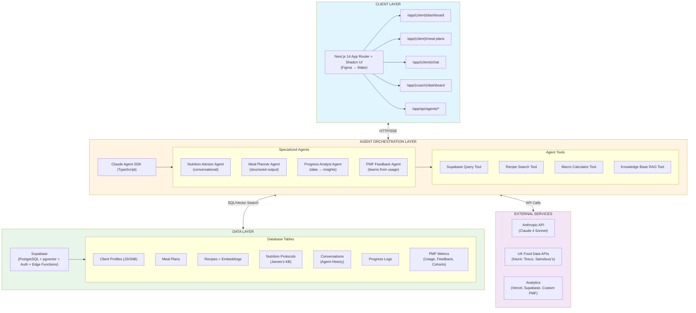
```mermaid
graph TB
    subgraph CLIENT["CLIENT LAYER"]
        NextJS["Next.js 14 App Router + Shadcn UI<br/>(Figma → Make)"]
        ClientDash["/app/(client)/dashboard"]
        MealPlans["/app/(client)/meal-plans"]
        Chat["/app/(client)/chat"]
        CoachDash["/app/(coach)/dashboard"]
        API["/app/api/agents/*"]
        
        NextJS --> ClientDash
        NextJS --> MealPlans
        NextJS --> Chat
        NextJS --> CoachDash
        NextJS --> API
    end
    
    subgraph AGENTS["AGENT ORCHESTRATION LAYER"]
        SDK["Claude Agent SDK (TypeScript)"]
        
        subgraph AgentTypes["Specialized Agents"]
            NutritionAdvisor["Nutrition Advisor Agent<br/>(conversational)"]
            MealPlanner["Meal Planner Agent<br/>(structured output)"]
            ProgressAnalyst["Progress Analyst Agent<br/>(data → insights)"]
            PMFAgent["PMF Feedback Agent<br/>(learns from usage)"]
        end
        
        subgraph Tools["Agent Tools"]
            SupabaseTool["Supabase Query Tool"]
            RecipeTool["Recipe Search Tool"]
            MacroTool["Macro Calculator Tool"]
            RAGTool["Knowledge Base RAG Tool"]
        end
        
        SDK --> AgentTypes
        AgentTypes --> Tools
    end
    
    subgraph DATA["DATA LAYER"]
        Supabase["Supabase<br/>(PostgreSQL + pgvector + Auth + Edge Functions)"]
        
        subgraph Tables["Database Tables"]
            Clients["Client Profiles (JSONB)"]
            Plans["Meal Plans"]
            Recipes["Recipes + Embeddings"]
            Protocols["Nutrition Protocols<br/>(James's KB)"]
            Conversations["Conversations<br/>(Agent History)"]
            Progress["Progress Logs"]
            PMFMetrics["PMF Metrics<br/>(Usage, Feedback, Cohorts)"]
        end
        
        Supabase --> Tables
    end
    
    subgraph EXTERNAL["EXTERNAL SERVICES"]
        Anthropic["Anthropic API<br/>(Claude 4 Sonnet)"]
        FoodAPIs["UK Food Data APIs<br/>(future: Tesco, Sainsbury's)"]
        Analytics["Analytics<br/>(Vercel, Supabase, Custom PMF)"]
    end
    
    CLIENT <-->|HTTP/SSE| AGENTS
    AGENTS <-->|SQL/Vector Search| DATA
    AGENTS <-->|API Calls| EXTERNAL
    
    style CLIENT fill:#e1f5ff
    style AGENTS fill:#fff4e1
    style DATA fill:#e8f5e9
    style EXTERNAL fill:#f3e5f5
```

### 1.2 Core Principles

**Minimum Effort, Maximum Gain:**
- Start with 1 agent (Nutrition Advisor), expand incrementally
- Use Supabase Edge Functions for heavy lifting (keep Next.js thin)
- Leverage Claude Agent SDK's built-in capabilities (streaming, tools, memory)
- Figma → Make for rapid UI iteration without custom CSS

**Product-Market Fit Driven:**
- Instrument everything (usage, satisfaction, outcomes)
- Weekly PMF reviews with quantitative + qualitative data
- Pivot features based on client feedback (not assumptions)
- Build feedback loops into agent conversations

**Incremental Architecture:**
- Each week delivers a working, testable feature
- No "big bang" launches - continuous deployment
- James validates each increment with real clients
- Technical debt addressed in Week 8 (hardening sprint)

---

## 2. Claude Agent SDK Implementation Strategy

### 2.1 Why Agent SDK for This Project

**Perfect Fit Because:**
1. **Conversational by Default:** Nutrition coaching is inherently conversational
2. **Tool Use Built-In:** Database queries, calculations, recipe search = tools
3. **Streaming Responses:** Real-time chat experience without custom WebSocket logic
4. **Context Management:** SDK handles message history, we focus on domain context
5. **TypeScript Native:** Seamless integration with Next.js
6. **Multi-Agent Coordination:** Natural pattern for Advisor → Planner → Analyst workflow

**What Agent SDK Provides:**
- `Anthropic` client with streaming support
- Tool definition and execution framework
- Message history management
- Error handling and retries
- Token counting and budget management
- Prompt caching for static contexts (James's protocols)

### 2.2 Agent SDK Architecture Pattern

**Three-Layer Agent Design:**

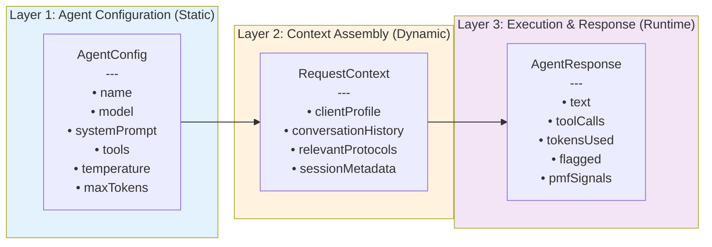
```mermaid
graph LR
    subgraph Layer1["Layer 1: Agent Configuration (Static)"]
        Config["AgentConfig<br/>---<br/>• name<br/>• model<br/>• systemPrompt<br/>• tools<br/>• temperature<br/>• maxTokens"]
    end
    
    subgraph Layer2["Layer 2: Context Assembly (Dynamic)"]
        Context["RequestContext<br/>---<br/>• clientProfile<br/>• conversationHistory<br/>• relevantProtocols<br/>• sessionMetadata"]
    end
    
    subgraph Layer3["Layer 3: Execution & Response (Runtime)"]
        Response["AgentResponse<br/>---<br/>• text<br/>• toolCalls<br/>• tokensUsed<br/>• flagged<br/>• pmfSignals"]
    end
    
    Config --> Context
    Context --> Response
    
    style Layer1 fill:#e3f2fd
    style Layer2 fill:#fff3e0
    style Layer3 fill:#f3e5f5
```

**TypeScript Interfaces:**

```typescript
// Layer 1: Agent Configuration (static)
interface AgentConfig {
  name: string;
  model: 'claude-sonnet-4-20250514';
  systemPrompt: string;
  tools: Tool[];
  temperature: number;
  maxTokens: number;
}

// Layer 2: Context Assembly (dynamic per request)
interface RequestContext {
  clientProfile: ClientProfile;
  conversationHistory: Message[];
  relevantProtocols: Protocol[];
  sessionMetadata: SessionMetadata;
}

// Layer 3: Execution & Response (runtime)
interface AgentResponse {
  text: string;
  toolCalls: ToolCall[];
  tokensUsed: number;
  flagged: boolean;
  pmfSignals: PMFSignal[];
}
```

### 2.3 Agent Implementation Hierarchy

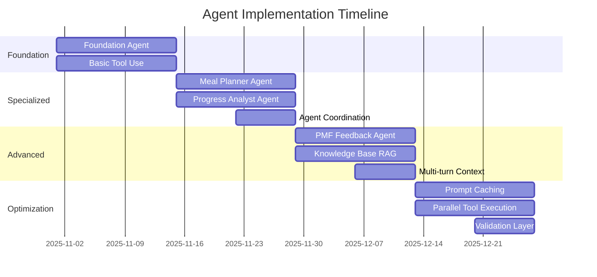
```mermaid
gantt
    title Agent Implementation Timeline
    dateFormat YYYY-MM-DD
    section Foundation
    Foundation Agent           :2025-11-01, 14d
    Basic Tool Use            :2025-11-01, 14d
    section Specialized
    Meal Planner Agent        :2025-11-15, 14d
    Progress Analyst Agent    :2025-11-15, 14d
    Agent Coordination        :2025-11-22, 7d
    section Advanced
    PMF Feedback Agent        :2025-11-29, 14d
    Knowledge Base RAG        :2025-11-29, 14d
    Multi-turn Context        :2025-12-06, 7d
    section Optimization
    Prompt Caching           :2025-12-13, 14d
    Parallel Tool Execution  :2025-12-13, 14d
    Validation Layer         :2025-12-20, 7d
```

**Week 1-2: Foundation Agent**
- Single Nutrition Advisor Agent
- Basic tool use (recipe search only)
- Simple system prompt (James's philosophy)

**Week 3-4: Specialized Agents**
- Meal Planner Agent (structured JSON output)
- Progress Analyst Agent (data analysis)
- Agent coordination (Advisor delegates to Planner)

**Week 5-6: Advanced Features**
- PMF Feedback Agent (learns from usage patterns)
- Knowledge Base RAG integration
- Multi-turn conversation with context pruning

**Week 7-8: Optimization**
- Prompt caching for James's protocols
- Parallel tool execution
- Agent response validation layer

---

## 3. Project Structure

### 3.1 Repository Organization

```
viridian-nutrition-app/
├── apps/
│   └── web/                          # Next.js application
│       ├── app/
│       │   ├── (auth)/
│       │   │   ├── login/
│       │   │   └── signup/
│       │   ├── (client)/
│       │   │   ├── dashboard/
│       │   │   ├── meal-plans/
│       │   │   ├── chat/
│       │   │   └── progress/
│       │   ├── (coach)/
│       │   │   ├── dashboard/
│       │   │   └── clients/[id]/
│       │   └── api/
│       │       ├── agents/
│       │       │   ├── nutrition-advisor/route.ts
│       │       │   ├── meal-planner/route.ts
│       │       │   └── progress-analyst/route.ts
│       │       ├── webhooks/
│       │       │   └── supabase/route.ts
│       │       └── pmf/
│       │           └── feedback/route.ts
│       ├── components/
│       │   ├── ui/                   # Shadcn components
│       │   ├── chat/
│       │   │   ├── chat-interface.tsx
│       │   │   ├── message-bubble.tsx
│       │   │   └── streaming-response.tsx
│       │   ├── meal-plans/
│       │   │   ├── meal-plan-card.tsx
│       │   │   └── recipe-card.tsx
│       │   └── shared/
│       │       ├── navbar.tsx
│       │       └── loading-states.tsx
│       ├── lib/
│       │   ├── supabase/
│       │   │   ├── client.ts
│       │   │   ├── server.ts
│       │   │   └── schema.ts
│       │   ├── agents/              # Claude Agent SDK
│       │   │   ├── base-agent.ts
│       │   │   ├── nutrition-advisor.ts
│       │   │   ├── meal-planner.ts
│       │   │   └── progress-analyst.ts
│       │   ├── tools/               # Agent tools
│       │   │   ├── recipe-search.ts
│       │   │   ├── macro-calculator.ts
│       │   │   ├── protocol-rag.ts
│       │   │   └── supabase-query.ts
│       │   ├── context/
│       │   │   ├── client-context.ts
│       │   │   └── protocol-context.ts
│       │   ├── pmf/
│       │   │   ├── tracker.ts
│       │   │   └── analyzer.ts
│       │   └── utils/
│       │       └── validation.ts
│       ├── prompts/                 # System prompts as files
│       │   ├── nutrition-advisor.txt
│       │   ├── meal-planner.txt
│       │   └── safety-guidelines.txt
│       └── types/
│           ├── agent.ts
│           ├── client.ts
│           └── pmf.ts
├── packages/
│   ├── supabase-schema/             # Shared DB types
│   │   ├── migrations/
│   │   └── types/
│   └── nutrition-schemas/           # Schema.org types
│       └── types/
├── supabase/
│   ├── migrations/
│   │   ├── 001_initial_schema.sql
│   │   ├── 002_recipes.sql
│   │   ├── 003_protocols.sql
│   │   └── 004_pmf_tracking.sql
│   ├── functions/                   # Edge Functions
│   │   ├── generate-meal-plan/
│   │   ├── analyze-progress/
│   │   └── sync-pmf-metrics/
│   └── seed/
│       ├── recipes.sql
│       └── protocols.sql
├── docs/
│   ├── PRD.md
│   ├── IMPLEMENTATION.md            # This file
│   ├── AGENT_SDK_GUIDE.md
│   └── weekly-reviews/
│       ├── week-1.md
│       └── ...
└── scripts/
    ├── setup-dev.sh
    ├── seed-data.ts
    └── generate-embeddings.ts
```

### 3.2 Tech Stack Versions

```json
{
  "dependencies": {
    "@anthropic-ai/sdk": "^0.30.0",
    "next": "14.2.0",
    "@supabase/supabase-js": "^2.45.0",
    "@supabase/ssr": "^0.5.0",
    "react": "^18.3.0",
    "react-dom": "^18.3.0",
    "@radix-ui/react-*": "latest",    // Shadcn dependencies
    "class-variance-authority": "^0.7.0",
    "clsx": "^2.1.0",
    "tailwind-merge": "^2.3.0",
    "zod": "^3.23.0",                 // Schema validation
    "ai": "^3.3.0",                   // Vercel AI SDK (optional, for streaming UI)
    "usehooks-ts": "^3.1.0"
  },
  "devDependencies": {
    "typescript": "^5.4.0",
    "supabase": "^1.200.0",           // Supabase CLI
    "@types/node": "^20.12.0",
    "eslint": "^8.57.0",
    "prettier": "^3.2.0"
  }
}
```

---

## 4. Incremental Build Plan (8 Weeks)

**Overall Timeline:**

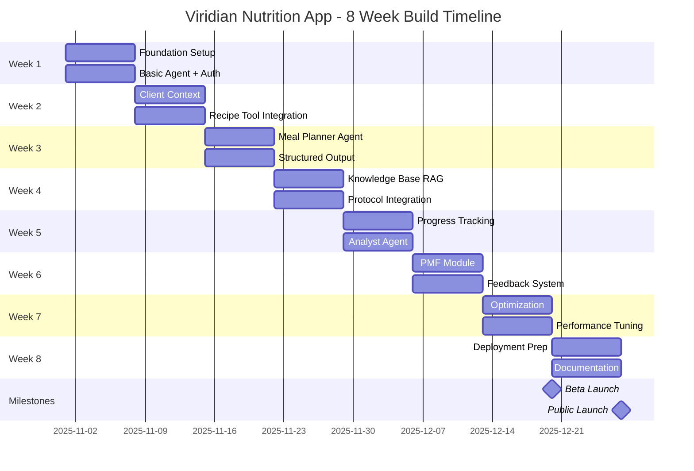
```mermaid
gantt
    title Viridian Nutrition App - 8 Week Build Timeline
    dateFormat YYYY-MM-DD
    section Week 1
    Foundation Setup           :w1a, 2025-11-01, 7d
    Basic Agent + Auth        :w1b, 2025-11-01, 7d
    section Week 2
    Client Context            :w2a, 2025-11-08, 7d
    Recipe Tool Integration   :w2b, 2025-11-08, 7d
    section Week 3
    Meal Planner Agent        :w3a, 2025-11-15, 7d
    Structured Output         :w3b, 2025-11-15, 7d
    section Week 4
    Knowledge Base RAG        :w4a, 2025-11-22, 7d
    Protocol Integration      :w4b, 2025-11-22, 7d
    section Week 5
    Progress Tracking         :w5a, 2025-11-29, 7d
    Analyst Agent             :w5b, 2025-11-29, 7d
    section Week 6
    PMF Module                :w6a, 2025-12-06, 7d
    Feedback System           :w6b, 2025-12-06, 7d
    section Week 7
    Optimization              :w7a, 2025-12-13, 7d
    Performance Tuning        :w7b, 2025-12-13, 7d
    section Week 8
    Deployment Prep           :w8a, 2025-12-20, 7d
    Documentation             :w8b, 2025-12-20, 7d
    section Milestones
    Beta Launch               :milestone, m1, 2025-12-20, 0d
    Public Launch             :milestone, m2, 2025-12-27, 0d
```

### Week 1: Foundation & First Agent

**Goal:** Working authentication + single agent conversation

**Deliverables:**
1. Project setup (Next.js + Supabase + Agent SDK)
2. Database schema (clients, conversations tables only)
3. Basic UI shell (Figma → Shadcn components)
4. Nutrition Advisor Agent with single tool (echo/test)
5. Simple chat interface with streaming responses
6. James can log in and test conversation

**Agent SDK Implementation Flow:**

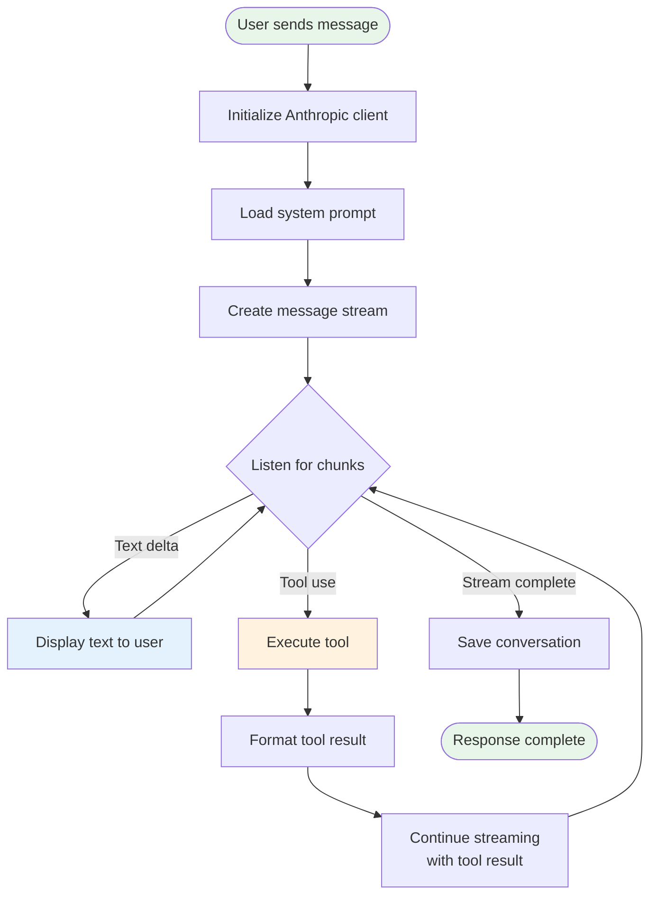
```mermaid
flowchart TD
    Start([User sends message]) --> Init[Initialize Anthropic client]
    Init --> System[Load system prompt]
    System --> Stream[Create message stream]
    Stream --> Listen{Listen for chunks}
    
    Listen -->|Text delta| Display[Display text to user]
    Display --> Listen
    
    Listen -->|Tool use| Execute[Execute tool]
    Execute --> ToolResult[Format tool result]
    ToolResult --> Continue[Continue streaming<br/>with tool result]
    Continue --> Listen
    
    Listen -->|Stream complete| Save[Save conversation]
    Save --> End([Response complete])
    
    style Start fill:#e8f5e9
    style End fill:#e8f5e9
    style Execute fill:#fff3e0
    style Display fill:#e3f2fd
```

**Agent SDK Implementation Code:**

```typescript
// lib/agents/nutrition-advisor.ts (Week 1 version)
import Anthropic from '@anthropic-ai/sdk';

const client = new Anthropic({
  apiKey: process.env.ANTHROPIC_API_KEY,
});

export async function* streamNutritionAdvice(
  userMessage: string,
  clientId: string
) {
  const systemPrompt = `You are a friendly nutrition advisor assistant for James Kerby's Viridian Health & Fitness. 
  Keep responses brief and helpful. If you don't know something, say so.`;

  const stream = await client.messages.stream({
    model: 'claude-sonnet-4-20250514',
    max_tokens: 1024,
    system: systemPrompt,
    messages: [
      { role: 'user', content: userMessage }
    ],
  });

  for await (const chunk of stream) {
    if (chunk.type === 'content_block_delta' && 
        chunk.delta.type === 'text_delta') {
      yield chunk.delta.text;
    }
  }
}
```

**Success Criteria:**
- ✅ James can create account and log in
- ✅ Chat interface streams responses in real-time
- ✅ Agent responds in James's tone
- ✅ Conversation persists in Supabase
- ✅ PMF Tracker: Record first conversation metrics

**Time Estimate:** 40 hours (1 developer week)

---

### Week 2: Client Context & Recipe Tool

**Goal:** Agent uses client profile + recipe database

**Deliverables:**
1. Client onboarding form (basic: name, goals, restrictions)
2. Recipe database seeded (50 UK recipes)
3. Recipe search tool for agent
4. Agent retrieves client context before responding
5. UI: Display recommended recipes in chat

**Tool Execution Flow:**

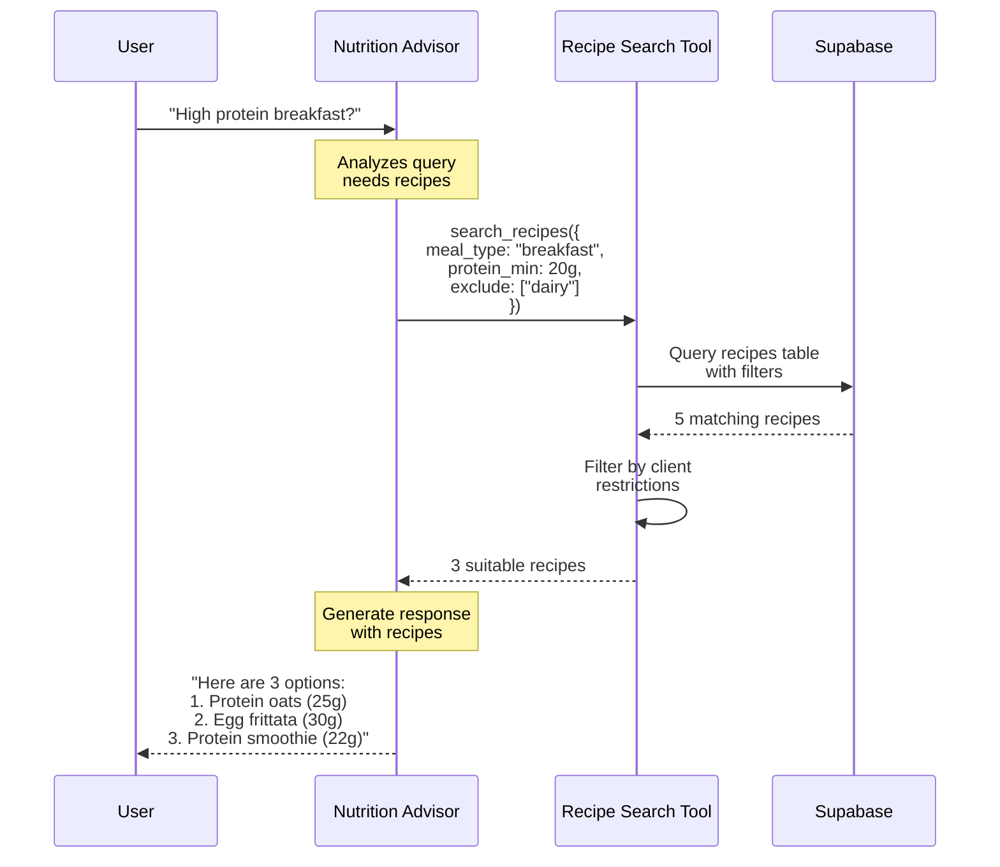
```mermaid
sequenceDiagram
    participant User
    participant Agent as Nutrition Advisor
    participant Tool as Recipe Search Tool
    participant DB as Supabase
    
    User->>Agent: "High protein breakfast?"
    Note over Agent: Analyzes query<br/>needs recipes
    
    Agent->>Tool: search_recipes({<br/>  meal_type: "breakfast",<br/>  protein_min: 20g,<br/>  exclude: ["dairy"]<br/>})
    
    Tool->>DB: Query recipes table<br/>with filters
    DB-->>Tool: 5 matching recipes
    
    Tool->>Tool: Filter by client<br/>restrictions
    Tool-->>Agent: 3 suitable recipes
    
    Note over Agent: Generate response<br/>with recipes
    
    Agent-->>User: "Here are 3 options:<br/>1. Protein oats (25g)<br/>2. Egg frittata (30g)<br/>3. Protein smoothie (22g)"
```

**Agent SDK Implementation:**

```typescript
// lib/tools/recipe-search.ts
import { Tool } from '@anthropic-ai/sdk/resources/messages.mjs';

export const recipeSearchTool: Tool = {
  name: 'search_recipes',
  description: 'Search recipe database by nutritional criteria, meal type, dietary restrictions',
  input_schema: {
    type: 'object',
    properties: {
      meal_type: { 
        type: 'string', 
        enum: ['breakfast', 'lunch', 'dinner', 'snack'],
        description: 'Type of meal to search for'
      },
      protein_min: { 
        type: 'number',
        description: 'Minimum grams of protein required'
      },
      exclude_ingredients: {
        type: 'array',
        items: { type: 'string' },
        description: 'Ingredients to exclude (allergies, dislikes)'
      }
    },
    required: ['meal_type']
  }
};

export async function executeRecipeSearch(params: any) {
  const { meal_type, protein_min, exclude_ingredients } = params;
  
  const { data, error } = await supabase
    .from('recipes')
    .select('*')
    .eq('meal_type', meal_type)
    .gte('protein', protein_min || 0)
    .limit(5);

  if (error) throw error;

  // Filter out excluded ingredients
  const filtered = data?.filter(recipe => {
    const ingredients = recipe.ingredients.map(i => i.toLowerCase());
    return !exclude_ingredients?.some(excl => 
      ingredients.some(ing => ing.includes(excl.toLowerCase()))
    );
  });

  return filtered;
}
```

```typescript
// lib/agents/nutrition-advisor.ts (Week 2 version)
import Anthropic from '@anthropic-ai/sdk';
import { recipeSearchTool, executeRecipeSearch } from '@/lib/tools/recipe-search';
import { getClientContext } from '@/lib/context/client-context';

export async function* streamNutritionAdvice(
  userMessage: string,
  clientId: string
) {
  // Fetch client context
  const clientContext = await getClientContext(clientId);
  
  const systemPrompt = `You are the Viridian Nutrition Advisor for James Kerby's coaching practice.

Client Context:
- Name: ${clientContext.name}
- Goals: ${clientContext.goals.join(', ')}
- Dietary Restrictions: ${clientContext.restrictions.join(', ')}

When suggesting recipes, use the search_recipes tool and respect the client's restrictions.`;

  const messages: Anthropic.MessageParam[] = [
    { role: 'user', content: userMessage }
  ];

  const stream = await client.messages.stream({
    model: 'claude-sonnet-4-20250514',
    max_tokens: 2048,
    system: systemPrompt,
    messages,
    tools: [recipeSearchTool],
  });

  for await (const chunk of stream) {
    if (chunk.type === 'content_block_delta') {
      if (chunk.delta.type === 'text_delta') {
        yield { type: 'text', content: chunk.delta.text };
      }
    }
    
    if (chunk.type === 'content_block_stop') {
      const toolUse = stream.currentMessage?.content.find(
        block => block.type === 'tool_use'
      );
      
      if (toolUse && toolUse.type === 'tool_use') {
        // Execute tool
        const toolResult = await executeRecipeSearch(toolUse.input);
        
        // Send tool result back to agent
        messages.push({
          role: 'assistant',
          content: stream.currentMessage!.content
        });
        messages.push({
          role: 'user',
          content: [{
            type: 'tool_result',
            tool_use_id: toolUse.id,
            content: JSON.stringify(toolResult)
          }]
        });
        
        // Continue streaming with tool result
        const continueStream = await client.messages.stream({
          model: 'claude-sonnet-4-20250514',
          max_tokens: 2048,
          system: systemPrompt,
          messages,
          tools: [recipeSearchTool],
        });
        
        for await (const continueChunk of continueStream) {
          if (continueChunk.type === 'content_block_delta' && 
              continueChunk.delta.type === 'text_delta') {
            yield { type: 'text', content: continueChunk.delta.text };
          }
        }
      }
    }
  }
}
```

**Success Criteria:**
- ✅ Agent knows client's name and goals
- ✅ Agent suggests recipes matching dietary restrictions
- ✅ Recipe cards display with images and macros
- ✅ PMF Tracker: Tool use frequency, recipe suggestion acceptance rate

**Time Estimate:** 40 hours

---

### Week 3: Meal Planning Agent & Structured Output

**Goal:** Generate complete 7-day meal plans

**Deliverables:**
1. Meal Planner Agent (separate from Advisor)
2. Meal plan schema (Schema.org based)
3. UI: Meal plan view with day-by-day breakdown
4. Agent coordination: Advisor delegates to Planner
5. Shopping list generation

**Meal Plan Generation Workflow:**

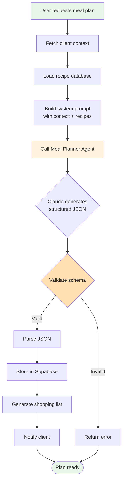
```mermaid
flowchart TD
    Start[User requests meal plan] --> Fetch[Fetch client context]
    Fetch --> Recipes[Load recipe database]
    Recipes --> Prompt[Build system prompt<br/>with context + recipes]
    
    Prompt --> Agent[Call Meal Planner Agent]
    Agent --> Generate{Claude generates<br/>structured JSON}
    
    Generate --> Validate{Validate schema}
    Validate -->|Invalid| Error[Return error]
    Validate -->|Valid| Parse[Parse JSON]
    
    Parse --> Store[Store in Supabase]
    Store --> Shopping[Generate shopping list]
    Shopping --> Notify[Notify client]
    Notify --> End([Plan ready])
    
    Error --> End
    
    style Start fill:#e8f5e9
    style Agent fill:#fff3e0
    style Validate fill:#ffe0b2
    style End fill:#e8f5e9
```

**Agent SDK Implementation:**

```typescript
// lib/agents/meal-planner.ts
import Anthropic from '@anthropic-ai/sdk';
import { z } from 'zod';

// Define meal plan schema
const MealPlanSchema = z.object({
  start_date: z.string(),
  end_date: z.string(),
  nutrition_targets: z.object({
    calories: z.number(),
    protein: z.number(),
    carbs: z.number(),
    fat: z.number(),
  }),
  meals: z.array(z.object({
    day: z.string(),
    breakfast: z.object({ recipe_id: z.string(), name: z.string() }),
    lunch: z.object({ recipe_id: z.string(), name: z.string() }),
    dinner: z.object({ recipe_id: z.string(), name: z.string() }),
    snack: z.object({ recipe_id: z.string(), name: z.string() }).optional(),
  })),
  shopping_list: z.array(z.object({
    category: z.string(),
    items: z.array(z.string()),
  })),
  coach_notes: z.string(),
});

export async function generateMealPlan(clientId: string) {
  const clientContext = await getClientContext(clientId);
  const availableRecipes = await getAllRecipes();
  
  const systemPrompt = `You are a meal planning specialist for James Kerby's nutrition coaching.
  
Client Context:
${JSON.stringify(clientContext, null, 2)}

Available Recipes:
${JSON.stringify(availableRecipes.map(r => ({
  id: r.id,
  name: r.name,
  meal_type: r.meal_type,
  macros: r.nutrition
})), null, 2)}

Create a 7-day meal plan that:
1. Meets the client's macro targets (calculated based on their goals)
2. Respects dietary restrictions
3. Uses variety (no meal repeated more than twice)
4. Is UK-realistic (ingredients available at Tesco/Sainsbury's)

Output ONLY valid JSON matching this schema. No additional text.`;

  const response = await client.messages.create({
    model: 'claude-sonnet-4-20250514',
    max_tokens: 4096,
    temperature: 0.3, // Lower temp for structured output
    system: systemPrompt,
    messages: [
      { 
        role: 'user', 
        content: 'Generate a 7-day meal plan for this client starting next Monday.' 
      }
    ],
  });

  const textContent = response.content.find(block => block.type === 'text');
  if (!textContent || textContent.type !== 'text') {
    throw new Error('No text response from agent');
  }

  // Parse and validate JSON
  const jsonMatch = textContent.text.match(/\{[\s\S]*\}/);
  if (!jsonMatch) {
    throw new Error('No JSON found in response');
  }

  const parsed = JSON.parse(jsonMatch[0]);
  const validated = MealPlanSchema.parse(parsed);

  // Store in Supabase
  const { data, error } = await supabase
    .from('meal_plans')
    .insert({
      client_id: clientId,
      plan_data: validated,
      status: 'active',
      generated_by: 'agent',
    })
    .select()
    .single();

  if (error) throw error;

  return data;
}
```

**Agent Coordination Pattern:**

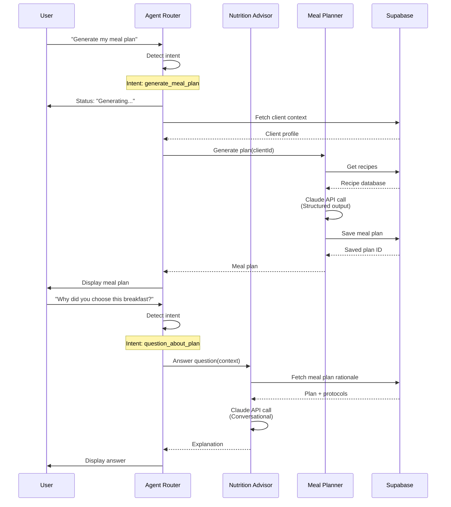
```mermaid
sequenceDiagram
    participant User
    participant Router as Agent Router
    participant Advisor as Nutrition Advisor
    participant Planner as Meal Planner
    participant DB as Supabase
    
    User->>Router: "Generate my meal plan"
    Router->>Router: Detect intent
    Note over Router: Intent: generate_meal_plan
    
    Router->>User: Status: "Generating..."
    Router->>DB: Fetch client context
    DB-->>Router: Client profile
    
    Router->>Planner: Generate plan(clientId)
    Planner->>DB: Get recipes
    DB-->>Planner: Recipe database
    
    Planner->>Planner: Claude API call<br/>(Structured output)
    Planner->>DB: Save meal plan
    DB-->>Planner: Saved plan ID
    
    Planner-->>Router: Meal plan
    Router->>User: Display meal plan
    
    User->>Router: "Why did you choose this breakfast?"
    Router->>Router: Detect intent
    Note over Router: Intent: question_about_plan
    
    Router->>Advisor: Answer question(context)
    Advisor->>DB: Fetch meal plan rationale
    DB-->>Advisor: Plan + protocols
    
    Advisor->>Advisor: Claude API call<br/>(Conversational)
    Advisor-->>Router: Explanation
    Router->>User: Display answer
```

```typescript
// lib/agents/agent-router.ts
export async function* routeAgentRequest(
  userMessage: string,
  clientId: string
) {
  // Determine intent
  const intent = await detectIntent(userMessage);
  
  if (intent === 'generate_meal_plan') {
    // Delegate to Meal Planner Agent
    yield { type: 'status', content: 'Generating your meal plan...' };
    const plan = await generateMealPlan(clientId);
    yield { type: 'meal_plan', content: plan };
  } else {
    // Use Nutrition Advisor Agent
    for await (const chunk of streamNutritionAdvice(userMessage, clientId)) {
      yield chunk;
    }
  }
}
```

**Success Criteria:**
- ✅ Agent generates valid 7-day meal plans
- ✅ Plans respect client macros and restrictions
- ✅ UI displays plan in calendar view
- ✅ Shopping list auto-generated and downloadable
- ✅ PMF Tracker: Plan generation success rate, client modifications

**Time Estimate:** 40 hours

---

### Week 4: James's Knowledge Base + RAG

**Goal:** Agent retrieves James's protocols via semantic search

**Deliverables:**
1. Protocol database with embeddings
2. RAG tool for agent (search James's knowledge)
3. Seed 10 core protocols from James
4. Agent cites protocols in responses
5. Coach UI: Add/edit protocols with embedding generation

**RAG System Architecture:**

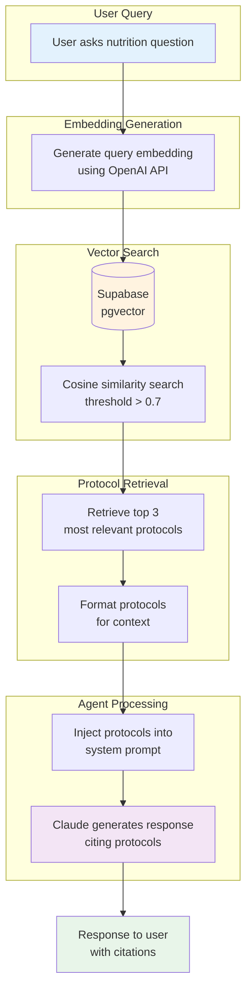
```mermaid
flowchart TD
    subgraph Input["User Query"]
        Query[User asks nutrition question]
    end
    
    subgraph Embed["Embedding Generation"]
        QueryEmbed[Generate query embedding<br/>using OpenAI API]
    end
    
    subgraph Search["Vector Search"]
        VectorDB[(Supabase<br/>pgvector)]
        Similarity[Cosine similarity search<br/>threshold > 0.7]
    end
    
    subgraph Retrieve["Protocol Retrieval"]
        Top3[Retrieve top 3<br/>most relevant protocols]
        Format[Format protocols<br/>for context]
    end
    
    subgraph Agent["Agent Processing"]
        SystemPrompt[Inject protocols into<br/>system prompt]
        Claude[Claude generates response<br/>citing protocols]
    end
    
    Query --> QueryEmbed
    QueryEmbed --> VectorDB
    VectorDB --> Similarity
    Similarity --> Top3
    Top3 --> Format
    Format --> SystemPrompt
    SystemPrompt --> Claude
    Claude --> Response[Response to user<br/>with citations]
    
    style Query fill:#e3f2fd
    style VectorDB fill:#fff3e0
    style Claude fill:#f3e5f5
    style Response fill:#e8f5e9
```

**Agent SDK Implementation:**

```typescript
// lib/tools/protocol-rag.ts
import Anthropic from '@anthropic-ai/sdk';
import { createClient } from '@supabase/supabase-js';

const client = new Anthropic({
  apiKey: process.env.ANTHROPIC_API_KEY,
});

const supabase = createClient(
  process.env.NEXT_PUBLIC_SUPABASE_URL!,
  process.env.SUPABASE_SERVICE_ROLE_KEY!
);

async function generateEmbedding(text: string): Promise<number[]> {
  // Use Anthropic's embedding endpoint (or OpenAI as fallback)
  // For now, using a placeholder - in production, integrate with embedding service
  const response = await fetch('https://api.openai.com/v1/embeddings', {
    method: 'POST',
    headers: {
      'Authorization': `Bearer ${process.env.OPENAI_API_KEY}`,
      'Content-Type': 'application/json',
    },
    body: JSON.stringify({
      model: 'text-embedding-3-small',
      input: text,
    }),
  });
  const data = await response.json();
  return data.data[0].embedding;
}

export const protocolRAGTool: Tool = {
  name: 'search_protocols',
  description: "Search James Kerby's clinical nutrition protocols for evidence-based guidance on specific topics",
  input_schema: {
    type: 'object',
    properties: {
      query: {
        type: 'string',
        description: 'The topic or question to search for in the knowledge base'
      },
      max_results: {
        type: 'number',
        description: 'Maximum number of protocols to retrieve (default 3)',
        default: 3
      }
    },
    required: ['query']
  }
};

export async function searchProtocols(query: string, maxResults: number = 3) {
  // Generate query embedding
  const queryEmbedding = await generateEmbedding(query);
  
  // Semantic search using pgvector
  const { data, error } = await supabase.rpc('match_protocols', {
    query_embedding: queryEmbedding,
    match_count: maxResults,
    match_threshold: 0.7
  });

  if (error) throw error;

  return data.map(protocol => ({
    id: protocol.id,
    title: protocol.title,
    content: protocol.content,
    relevance_score: protocol.similarity,
    tags: protocol.tags,
  }));
}
```

**Supabase Migration for Vector Search:**

```sql
-- supabase/migrations/003_protocols_vector_search.sql

-- Enable pgvector extension
CREATE EXTENSION IF NOT EXISTS vector;

-- Add embedding column to protocols table
ALTER TABLE nutrition_protocols 
ADD COLUMN embedding vector(1536);

-- Create index for fast similarity search
CREATE INDEX ON nutrition_protocols 
USING ivfflat (embedding vector_cosine_ops)
WITH (lists = 100);

-- Function for semantic search
CREATE OR REPLACE FUNCTION match_protocols(
  query_embedding vector(1536),
  match_count int DEFAULT 3,
  match_threshold float DEFAULT 0.7
)
RETURNS TABLE (
  id uuid,
  title text,
  content text,
  tags text[],
  similarity float
)
LANGUAGE plpgsql
AS $$
BEGIN
  RETURN QUERY
  SELECT
    nutrition_protocols.id,
    nutrition_protocols.title,
    nutrition_protocols.content,
    nutrition_protocols.tags,
    1 - (nutrition_protocols.embedding <=> query_embedding) AS similarity
  FROM nutrition_protocols
  WHERE 1 - (nutrition_protocols.embedding <=> query_embedding) > match_threshold
  ORDER BY nutrition_protocols.embedding <=> query_embedding
  LIMIT match_count;
END;
$$;
```

**Updated Nutrition Advisor with RAG:**

```typescript
// lib/agents/nutrition-advisor.ts (Week 4 version)
export async function* streamNutritionAdvice(
  userMessage: string,
  clientId: string
) {
  const clientContext = await getClientContext(clientId);
  
  // Pre-search protocols to include in system prompt
  const relevantProtocols = await searchProtocols(userMessage, 3);
  
  const systemPrompt = `You are the Viridian Nutrition Advisor for James Kerby.

Client Context:
${JSON.stringify(clientContext, null, 2)}

Relevant Protocols from James's Knowledge Base:
${relevantProtocols.map(p => `
## ${p.title}
${p.content}
`).join('\n\n')}

Guidelines:
- Base recommendations on James's protocols above
- If protocols don't cover the topic, use general evidence-based nutrition knowledge
- Always cite which protocol you're referencing
- If unsure, use search_protocols tool to find more information`;

  const messages: Anthropic.MessageParam[] = [
    { role: 'user', content: userMessage }
  ];

  const stream = await client.messages.stream({
    model: 'claude-sonnet-4-20250514',
    max_tokens: 3000,
    system: systemPrompt,
    messages,
    tools: [recipeSearchTool, protocolRAGTool],
  });

  // Handle streaming with tool use (similar to Week 2 pattern)
  // ... streaming logic with tool execution ...
}
```

**Success Criteria:**
- ✅ Agent cites James's protocols in responses
- ✅ Semantic search returns relevant protocols (>0.7 similarity)
- ✅ James can add new protocols via coach dashboard
- ✅ Embeddings auto-generate on protocol save
- ✅ PMF Tracker: Protocol retrieval accuracy (James validates)

**Time Estimate:** 40 hours

---

### Week 5: Progress Tracking + Analyst Agent

**Goal:** Track client metrics and generate insights

**Deliverables:**
1. Progress logging UI (weight, energy, adherence)
2. Progress Analyst Agent (data → insights)
3. Weekly progress reports (auto-generated)
4. Coach dashboard: Client progress visualizations
5. Agent proactively identifies plateaus/struggles

**Progress Analysis Workflow:**

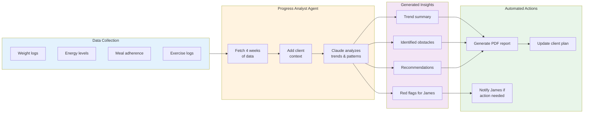
```mermaid
flowchart LR
    subgraph Data["Data Collection"]
        Weight[Weight logs]
        Energy[Energy levels]
        Adherence[Meal adherence]
        Exercise[Exercise logs]
    end
    
    subgraph Analysis["Progress Analyst Agent"]
        Fetch[Fetch 4 weeks<br/>of data]
        Context[Add client<br/>context]
        Analyze[Claude analyzes<br/>trends & patterns]
    end
    
    subgraph Insights["Generated Insights"]
        Trends[Trend summary]
        Obstacles[Identified obstacles]
        Recommendations[Recommendations]
        Alerts[Red flags for James]
    end
    
    subgraph Actions["Automated Actions"]
        Report[Generate PDF report]
        Notify[Notify James if<br/>action needed]
        Update[Update client plan]
    end
    
    Data --> Fetch
    Fetch --> Context
    Context --> Analyze
    Analyze --> Trends
    Analyze --> Obstacles
    Analyze --> Recommendations
    Analyze --> Alerts
    
    Trends --> Report
    Obstacles --> Report
    Recommendations --> Report
    Alerts --> Notify
    Report --> Update
    
    style Data fill:#e3f2fd
    style Analysis fill:#fff3e0
    style Insights fill:#f3e5f5
    style Actions fill:#e8f5e9
```

**Agent SDK Implementation:**

```typescript
// lib/agents/progress-analyst.ts
import Anthropic from '@anthropic-ai/sdk';

export async function analyzeClientProgress(clientId: string) {
  // Fetch 4 weeks of data
  const { data: progressLogs } = await supabase
    .from('progress_logs')
    .select('*')
    .eq('client_id', clientId)
    .gte('log_date', subWeeks(new Date(), 4).toISOString())
    .order('log_date', { ascending: true });

  const { data: mealPlans } = await supabase
    .from('meal_plans')
    .select('*')
    .eq('client_id', clientId)
    .eq('status', 'active');

  const clientContext = await getClientContext(clientId);

  const systemPrompt = `You are a progress analysis agent for James Kerby's nutrition coaching.

Analyze the client's progress over the last 4 weeks and provide:
1. Summary of trends (weight, energy, adherence)
2. Identification of obstacles or patterns
3. Recommendations for plan adjustments
4. Motivation talking points for James to use

Be data-driven but empathetic. Output as structured JSON.`;

  const response = await client.messages.create({
    model: 'claude-sonnet-4-20250514',
    max_tokens: 2048,
    temperature: 0.3,
    system: systemPrompt,
    messages: [
      {
        role: 'user',
        content: `Client Context:
${JSON.stringify(clientContext, null, 2)}

Progress Data (4 weeks):
${JSON.stringify(progressLogs, null, 2)}

Current Meal Plan:
${JSON.stringify(mealPlans, null, 2)}

Analyze this client's progress and provide insights.`
      }
    ]
  });

  const textContent = response.content.find(block => block.type === 'text');
  if (!textContent || textContent.type !== 'text') {
    throw new Error('No analysis returned');
  }

  // Parse JSON response
  const analysis = JSON.parse(textContent.text);

  // Store analysis
  await supabase.from('progress_analyses').insert({
    client_id: clientId,
    analysis_data: analysis,
    generated_at: new Date().toISOString(),
  });

  return analysis;
}

// Schedule weekly analysis (Supabase Edge Function)
export async function scheduleWeeklyAnalyses() {
  const { data: activeClients } = await supabase
    .from('clients')
    .select('id')
    .eq('status', 'active');

  for (const client of activeClients || []) {
    const analysis = await analyzeClientProgress(client.id);
    
    // Notify James if action needed
    if (analysis.requires_coach_review) {
      await sendCoachNotification(client.id, analysis);
    }
  }
}
```

**Success Criteria:**
- ✅ Clients log progress 3+ times/week
- ✅ Progress charts display trends clearly
- ✅ Agent identifies plateau within 1 week of occurrence
- ✅ Weekly reports auto-sent to James
- ✅ PMF Tracker: Progress logging adherence, insight accuracy

**Time Estimate:** 40 hours

---

### Week 6: PMF Module Integration (Platform Interface)

**Goal:** Integrate with Platform PMF Module for systematic feedback and analysis

**Platform Integration Note:**
This application will interface with the centralized **Platform PMF Module** that provides cross-application analytics, cohort analysis, and standardized metrics tracking. The implementation below defines the app-specific PMF instrumentation that feeds into the Platform PMF Module.

**Deliverables:**
1. In-app feedback prompts (NPS, feature satisfaction) → **Platform PMF API**
2. App-specific event tracking aligned with **Platform PMF Schema**
3. Dashboard view consuming **Platform PMF Analytics API**
4. A/B testing hooks (coordinated via Platform)
5. Cohort definitions (app-level, aggregated at Platform level)

**PMF Tracking System (Platform Integration Architecture):**

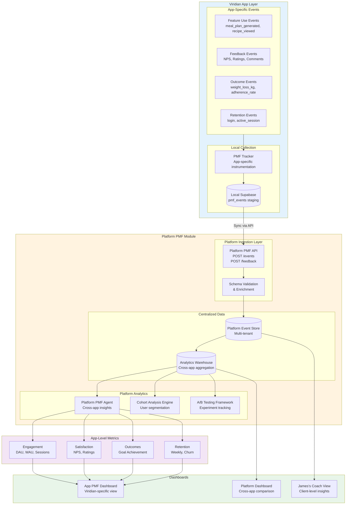
```mermaid
flowchart TD
    subgraph App["Viridian App Layer"]
        subgraph Events["App-Specific Events"]
            FeatureUse[Feature Use Events<br/>meal_plan_generated, recipe_viewed]
            Feedback[Feedback Events<br/>NPS, Ratings, Comments]
            Outcomes[Outcome Events<br/>weight_loss_kg, adherence_rate]
            Retention[Retention Events<br/>login, active_session]
        end
        
        subgraph Collection["Local Collection"]
            Tracker[PMF Tracker<br/>App-specific instrumentation]
            LocalDB[(Local Supabase<br/>pmf_events staging)]
        end
    end
    
    subgraph Platform["Platform PMF Module"]
        subgraph Ingestion["Platform Ingestion Layer"]
            API[Platform PMF API<br/>POST /events<br/>POST /feedback]
            Validation[Schema Validation<br/>& Enrichment]
        end
        
        subgraph PlatformDB["Centralized Data"]
            EventStore[(Platform Event Store<br/>Multi-tenant)]
            Warehouse[(Analytics Warehouse<br/>Cross-app aggregation)]
        end
        
        subgraph Analysis["Platform Analytics"]
            PlatformAgent[Platform PMF Agent<br/>Cross-app insights]
            Cohorts[Cohort Analysis Engine<br/>User segmentation]
            ABTest[A/B Testing Framework<br/>Experiment tracking]
        end
    end
    
    subgraph AppMetrics["App-Level Metrics"]
        Engagement[Engagement<br/>DAU, WAU, Sessions]
        Satisfaction[Satisfaction<br/>NPS, Ratings]
        OutcomeMetrics[Outcomes<br/>Goal Achievement]
        RetentionMetrics[Retention<br/>Weekly, Churn]
    end
    
    subgraph Dashboards["Dashboards"]
        AppDash[App PMF Dashboard<br/>Viridian-specific view]
        PlatformDash[Platform Dashboard<br/>Cross-app comparison]
        JamesDash[James's Coach View<br/>Client-level insights]
    end
    
    Events --> Tracker
    Tracker --> LocalDB
    LocalDB -->|Sync via API| API
    
    API --> Validation
    Validation --> EventStore
    EventStore --> Warehouse
    
    Warehouse --> PlatformAgent
    Warehouse --> Cohorts
    Warehouse --> ABTest
    
    PlatformAgent --> Engagement
    PlatformAgent --> Satisfaction
    PlatformAgent --> OutcomeMetrics
    PlatformAgent --> RetentionMetrics
    
    Engagement --> AppDash
    Satisfaction --> AppDash
    OutcomeMetrics --> AppDash
    RetentionMetrics --> AppDash
    
    Warehouse --> PlatformDash
    EventStore --> JamesDash
    
    style App fill:#e3f2fd
    style Platform fill:#fff3e0
    style AppMetrics fill:#f3e5f5
    style Dashboards fill:#e8f5e9
```

**PMF Module Implementation (Platform Integration):**

**Architecture Overview:**
- **Local Tracking:** App instruments events and stores temporarily in local Supabase
- **Platform Sync:** Events sync to Platform PMF Module via REST API
- **Schema Alignment:** All events conform to Platform PMF Event Schema
- **Dashboard Consumption:** App dashboard fetches aggregated metrics from Platform API

```typescript
// lib/pmf/platform-client.ts
/**
 * Client for Platform PMF Module Integration
 * Handles event publishing to centralized PMF system
 */

interface PlatformPMFConfig {
  apiBaseUrl: string;
  appId: string;
  apiKey: string;
  syncIntervalMs?: number;
}

interface PlatformPMFEvent {
  appId: string;
  appVersion: string;
  eventType: 'feature_use' | 'feedback' | 'outcome' | 'retention';
  timestamp: string;
  userId: string;
  sessionId: string;
  data: Record<string, any>;
  metadata?: {
    userAgent?: string;
    deviceType?: string;
    location?: string;
  };
}

export class PlatformPMFClient {
  private config: PlatformPMFConfig;
  private eventQueue: PlatformPMFEvent[] = [];
  private syncInterval: NodeJS.Timeout | null = null;

  constructor(config: PlatformPMFConfig) {
    this.config = {
      syncIntervalMs: 60000, // 1 minute default
      ...config
    };
    this.startAutoSync();
  }

  /**
   * Track app-specific event and queue for Platform sync
   */
  async trackEvent(event: Omit<PlatformPMFEvent, 'appId' | 'appVersion'>): Promise<void> {
    const platformEvent: PlatformPMFEvent = {
      appId: this.config.appId,
      appVersion: process.env.NEXT_PUBLIC_APP_VERSION || '1.0.0',
      ...event
    };

    // Store locally first (for resilience)
    await this.storeLocalEvent(platformEvent);

    // Queue for platform sync
    this.eventQueue.push(platformEvent);

    // Immediate sync for high-priority events
    if (this.isHighPriority(event.eventType)) {
      await this.syncToPlatform();
    }
  }

  /**
   * Sync queued events to Platform PMF Module
   */
  private async syncToPlatform(): Promise<void> {
    if (this.eventQueue.length === 0) return;

    const batch = this.eventQueue.splice(0, 100); // Batch limit

    try {
      const response = await fetch(`${this.config.apiBaseUrl}/events/batch`, {
        method: 'POST',
        headers: {
          'Content-Type': 'application/json',
          'X-API-Key': this.config.apiKey,
          'X-App-Id': this.config.appId,
        },
        body: JSON.stringify({ events: batch }),
      });

      if (!response.ok) {
        // Re-queue failed events
        this.eventQueue.unshift(...batch);
        console.error('Platform sync failed:', response.statusText);
      } else {
        console.log(`Synced ${batch.length} events to Platform PMF`);
      }
    } catch (error) {
      // Re-queue on network error
      this.eventQueue.unshift(...batch);
      console.error('Platform sync error:', error);
    }
  }

  /**
   * Store event in local Supabase (staging table)
   */
  private async storeLocalEvent(event: PlatformPMFEvent): Promise<void> {
    const { error } = await supabase
      .from('pmf_events_staging')
      .insert({
        platform_event_id: null, // Set after sync
        event_data: event,
        synced: false,
        created_at: new Date().toISOString(),
      });

    if (error) {
      console.error('Local event storage failed:', error);
    }
  }

  /**
   * Start automatic background sync
   */
  private startAutoSync(): void {
    this.syncInterval = setInterval(() => {
      this.syncToPlatform();
    }, this.config.syncIntervalMs);
  }

  /**
   * Stop automatic sync (cleanup)
   */
  stopAutoSync(): void {
    if (this.syncInterval) {
      clearInterval(this.syncInterval);
      this.syncInterval = null;
    }
  }

  private isHighPriority(eventType: string): boolean {
    return ['outcome', 'feedback'].includes(eventType);
  }
}

// lib/pmf/tracker.ts (Updated for Platform integration)
import { PlatformPMFClient } from './platform-client';

export class PMFTracker {
  private platformClient: PlatformPMFClient;

  constructor() {
    this.platformClient = new PlatformPMFClient({
      apiBaseUrl: process.env.PLATFORM_PMF_API_URL!,
      appId: 'viridian-nutrition',
      apiKey: process.env.PLATFORM_PMF_API_KEY!,
    });
  }

  async trackFeatureUse(
    clientId: string, 
    feature: string, 
    metadata?: any
  ): Promise<void> {
    await this.platformClient.trackEvent({
      eventType: 'feature_use',
      timestamp: new Date().toISOString(),
      userId: clientId,
      sessionId: this.getSessionId(),
      data: {
        featureName: feature,
        ...metadata
      },
      metadata: this.getDeviceMetadata()
    });

    // Also store app-specific details locally
    await supabase.from('pmf_events').insert({
      type: 'feature_use',
      client_id: clientId,
      feature_name: feature,
      metadata,
      created_at: new Date().toISOString(),
    });
  }

  async trackFeedback(
    clientId: string, 
    feedbackType: string, 
    score: number, 
    comment?: string
  ): Promise<void> {
    await this.platformClient.trackEvent({
      eventType: 'feedback',
      timestamp: new Date().toISOString(),
      userId: clientId,
      sessionId: this.getSessionId(),
      data: {
        feedbackType,
        score,
        comment,
        context: 'viridian_nutrition_app'
      }
    });

    await supabase.from('pmf_events').insert({
      type: 'feedback',
      client_id: clientId,
      feedback_type: feedbackType,
      score,
      comment,
      created_at: new Date().toISOString(),
    });
  }

  async trackOutcome(
    clientId: string, 
    outcomeType: string, 
    value: number
  ): Promise<void> {
    await this.platformClient.trackEvent({
      eventType: 'outcome',
      timestamp: new Date().toISOString(),
      userId: clientId,
      sessionId: this.getSessionId(),
      data: {
        outcomeType,
        value,
        unit: this.getOutcomeUnit(outcomeType)
      }
    });

    await supabase.from('pmf_events').insert({
      type: 'outcome',
      client_id: clientId,
      outcome_type: outcomeType,
      value,
      created_at: new Date().toISOString(),
    });
  }

  async trackRetention(
    clientId: string, 
    weeksSinceStart: number, 
    stillActive: boolean
  ): Promise<void> {
    await this.platformClient.trackEvent({
      eventType: 'retention',
      timestamp: new Date().toISOString(),
      userId: clientId,
      sessionId: this.getSessionId(),
      data: {
        weeksSinceStart,
        stillActive,
        cohort: this.determineUserCohort(weeksSinceStart)
      }
    });

    await supabase.from('pmf_events').insert({
      type: 'retention',
      client_id: clientId,
      weeks_since_start: weeksSinceStart,
      still_active: stillActive,
      created_at: new Date().toISOString(),
    });
  }

  private getSessionId(): string {
    // Implementation to get/generate session ID
    return sessionStorage.getItem('pmf_session_id') || crypto.randomUUID();
  }

  private getDeviceMetadata() {
    return {
      userAgent: navigator.userAgent,
      deviceType: this.detectDeviceType(),
      location: 'UK' // Can be enhanced with actual location detection
    };
  }

  private detectDeviceType(): string {
    const ua = navigator.userAgent;
    if (/(tablet|ipad|playbook|silk)|(android(?!.*mobi))/i.test(ua)) {
      return 'tablet';
    }
    if (/Mobile|Android|iP(hone|od)|IEMobile|BlackBerry|Kindle|Silk-Accelerated|(hpw|web)OS|Opera M(obi|ini)/.test(ua)) {
      return 'mobile';
    }
    return 'desktop';
  }

  private getOutcomeUnit(outcomeType: string): string {
    const units: Record<string, string> = {
      'weight_loss_kg': 'kg',
      'adherence_rate': 'percentage',
      'goal_achieved': 'boolean',
      'energy_level': 'scale_1_10'
    };
    return units[outcomeType] || 'unknown';
  }

  private determineUserCohort(weeksSinceStart: number): string {
    if (weeksSinceStart <= 2) return 'new_user';
    if (weeksSinceStart <= 8) return 'early_adopter';
    if (weeksSinceStart <= 26) return 'active_user';
    return 'long_term_user';
  }
}

// lib/pmf/platform-analytics.ts
/**
 * Fetch aggregated metrics from Platform PMF Analytics API
 */

interface PlatformPMFMetrics {
  engagement: {
    dau: number;
    wau: number;
    mau: number;
    avgSessionLength: number;
    avgEngagementScore: number;
  };
  satisfaction: {
    nps: number;
    avgRating: number;
    feedbackCount: number;
  };
  outcomes: {
    avgOutcomeScore: number;
    goalsAchievedRate: number;
  };
  retention: {
    weeklyRetention: number[];
    churnRate: number;
    cohortAnalysis: Record<string, any>;
  };
  benchmarks?: {
    crossAppComparison: Record<string, number>;
    industryBenchmarks: Record<string, number>;
  };
}

export async function fetchPlatformMetrics(
  appId: string,
  startDate: Date,
  endDate: Date
): Promise<PlatformPMFMetrics> {
  const response = await fetch(
    `${process.env.PLATFORM_PMF_API_URL}/analytics/metrics?` + 
    new URLSearchParams({
      appId,
      startDate: startDate.toISOString(),
      endDate: endDate.toISOString(),
      includeBenchmarks: 'true'
    }),
    {
      headers: {
        'X-API-Key': process.env.PLATFORM_PMF_API_KEY!,
        'X-App-Id': appId,
      }
    }
  );

  if (!response.ok) {
    throw new Error(`Platform metrics fetch failed: ${response.statusText}`);
  }

  return response.json();
}

// lib/pmf/analyzer.ts (Updated to use Platform insights)
/**
 * Generate PMF report combining Platform analytics with app-specific insights
 */
export async function generatePMFReport(weekNumber: number) {
  const startDate = subWeeks(new Date(), 1);
  const endDate = new Date();

  // Fetch from Platform
  const platformMetrics = await fetchPlatformMetrics(
    'viridian-nutrition',
    startDate,
    endDate
  );

  // Fetch app-specific local data
  const { data: localEvents } = await supabase
    .from('pmf_events')
    .select('*')
    .gte('created_at', startDate.toISOString())
    .lte('created_at', endDate.toISOString());

  // Combine Platform metrics with app-specific context
  const client = new Anthropic({ apiKey: process.env.ANTHROPIC_API_KEY });

  const systemPrompt = `You are analyzing PMF data for Viridian Nutrition App (Week ${weekNumber}).

You have access to:
1. Platform-wide metrics (engagement, satisfaction, outcomes, retention)
2. Cross-app benchmarks (how Viridian compares to other apps on the platform)
3. App-specific events (meal plans generated, recipes viewed, etc.)

Generate insights that:
- Highlight what's working well
- Identify areas for improvement
- Compare against platform benchmarks
- Provide actionable recommendations for next sprint`;

  const response = await client.messages.create({
    model: 'claude-sonnet-4-20250514',
    max_tokens: 3000,
    temperature: 0.3,
    system: systemPrompt,
    messages: [
      {
        role: 'user',
        content: `Platform PMF Metrics:
${JSON.stringify(platformMetrics, null, 2)}

App-Specific Events (Week ${weekNumber}):
${JSON.stringify(localEvents, null, 2)}

Analyze and provide weekly PMF report.`
      }
    ]
  });

  const textContent = response.content.find(block => block.type === 'text');
  if (!textContent || textContent.type !== 'text') {
    throw new Error('No PMF report generated');
  }

  return JSON.parse(textContent.text);
}
```

**In-App Feedback Prompts:**

```typescript
// components/pmf/feedback-prompt.tsx
'use client';

import { useState } from 'react';
import { PMFTracker } from '@/lib/pmf/tracker';

export function FeedbackPrompt({ clientId, trigger }: { clientId: string; trigger: string }) {
  const [rating, setRating] = useState<number | null>(null);
  const [comment, setComment] = useState('');
  const tracker = new PMFTracker();

  const handleSubmit = async () => {
    if (rating === null) return;
    
    await tracker.trackFeedback(clientId, trigger, rating, comment);
    // Hide prompt after submission
  };

  return (
    <div className="fixed bottom-4 right-4 bg-white p-4 rounded-lg shadow-lg">
      <p className="text-sm mb-2">How satisfied are you with {trigger}?</p>
      <div className="flex gap-2 mb-2">
        {[1, 2, 3, 4, 5].map(n => (
          <button
            key={n}
            onClick={() => setRating(n)}
            className={`w-8 h-8 rounded-full ${rating === n ? 'bg-blue-500' : 'bg-gray-200'}`}
          >
            {n}
          </button>
        ))}
      </div>
      <textarea
        value={comment}
        onChange={e => setComment(e.target.value)}
        placeholder="Any additional feedback?"
        className="w-full text-sm border p-2 rounded"
      />
      <button onClick={handleSubmit} className="mt-2 px-4 py-2 bg-blue-500 text-white rounded">
        Submit
      </button>
    </div>
  );
}
```

**PMF Dashboard for James (Platform API Consumer):**

```typescript
// app/(coach)/pmf-dashboard/page.tsx
import { fetchPlatformMetrics } from '@/lib/pmf/platform-analytics';
import { generatePMFReport } from '@/lib/pmf/analyzer';

export default async function PMFDashboardPage() {
  const currentWeek = getWeekNumber(new Date());
  const startDate = subWeeks(new Date(), 1);
  const endDate = new Date();

  // Fetch metrics from Platform PMF Module
  const platformMetrics = await fetchPlatformMetrics(
    'viridian-nutrition',
    startDate,
    endDate
  );

  // Generate app-specific insights combining Platform + local data
  const report = await generatePMFReport(currentWeek);

  return (
    <div className="p-8">
      <h1 className="text-2xl font-bold mb-4">
        PMF Dashboard - Week {currentWeek}
      </h1>
      
      {/* Platform Metrics Cards */}
      <div className="grid grid-cols-4 gap-4 mb-8">
        <MetricCard 
          title="Engagement" 
          value={platformMetrics.engagement.avgEngagementScore}
          subtitle={`${platformMetrics.engagement.wau} Weekly Active Users`}
          trend={calculateTrend(platformMetrics.engagement.wau)}
        />
        <MetricCard 
          title="Satisfaction" 
          value={platformMetrics.satisfaction.nps}
          subtitle={`NPS Score`}
          trend={calculateTrend(platformMetrics.satisfaction.nps)}
        />
        <MetricCard 
          title="Outcomes" 
          value={platformMetrics.outcomes.goalsAchievedRate}
          subtitle="Goal Achievement Rate"
          trend={calculateTrend(platformMetrics.outcomes.goalsAchievedRate)}
        />
        <MetricCard 
          title="Retention" 
          value={platformMetrics.retention.weeklyRetention[1]}
          subtitle="Week 2 Retention"
          trend={calculateTrend(platformMetrics.retention.weeklyRetention[1])}
        />
      </div>

      {/* Platform Benchmarks */}
      {platformMetrics.benchmarks && (
        <div className="mb-8 p-6 bg-blue-50 rounded-lg">
          <h2 className="text-xl font-semibold mb-4">
            📊 Platform Benchmarks
          </h2>
          <div className="grid grid-cols-2 gap-4">
            <BenchmarkComparison
              metric="NPS"
              value={platformMetrics.satisfaction.nps}
              platformAvg={platformMetrics.benchmarks.crossAppComparison.nps}
              industryAvg={platformMetrics.benchmarks.industryBenchmarks.nps}
            />
            <BenchmarkComparison
              metric="Retention (Week 2)"
              value={platformMetrics.retention.weeklyRetention[1]}
              platformAvg={platformMetrics.benchmarks.crossAppComparison.week2Retention}
              industryAvg={platformMetrics.benchmarks.industryBenchmarks.week2Retention}
            />
          </div>
        </div>
      )}

      {/* AI-Generated Insights */}
      <div className="mb-8">
        <h2 className="text-xl font-semibold mb-2">🔍 Key Insights</h2>
        <ul className="list-disc list-inside space-y-2">
          {report.insights.map((insight, i) => (
            <li key={i} className="mb-1">{insight}</li>
          ))}
        </ul>
      </div>

      {/* Actionable Recommendations */}
      <div className="mb-8">
        <h2 className="text-xl font-semibold mb-2">✅ Recommended Actions</h2>
        <ul className="list-disc list-inside space-y-2">
          {report.recommendations.map((rec, i) => (
            <li key={i} className="mb-1 font-medium">{rec}</li>
          ))}
        </ul>
      </div>

      {/* Red Flags */}
      {report.red_flags.length > 0 && (
        <div className="bg-red-50 p-4 rounded">
          <h2 className="text-xl font-semibold mb-2 text-red-700">
            🚨 Red Flags (Requires Attention)
          </h2>
          <ul className="list-disc list-inside space-y-2">
            {report.red_flags.map((flag, i) => (
              <li key={i} className="mb-1 text-red-700">{flag}</li>
            ))}
          </ul>
        </div>
      )}

      {/* Cohort Analysis */}
      <div className="mt-8">
        <h2 className="text-xl font-semibold mb-4">👥 Cohort Analysis</h2>
        <CohortRetentionChart 
          data={platformMetrics.retention.cohortAnalysis}
        />
      </div>
    </div>
  );
}

// components/pmf/benchmark-comparison.tsx
interface BenchmarkComparisonProps {
  metric: string;
  value: number;
  platformAvg: number;
  industryAvg: number;
}

function BenchmarkComparison({ 
  metric, 
  value, 
  platformAvg, 
  industryAvg 
}: BenchmarkComparisonProps) {
  const performanceVsPlatform = ((value - platformAvg) / platformAvg * 100).toFixed(1);
  const performanceVsIndustry = ((value - industryAvg) / industryAvg * 100).toFixed(1);

  return (
    <div className="p-4 bg-white rounded border">
      <h3 className="font-semibold mb-2">{metric}</h3>
      <div className="space-y-1 text-sm">
        <div>Your App: <span className="font-bold">{value}</span></div>
        <div>
          Platform Avg: {platformAvg}{' '}
          <span className={performanceVsPlatform >= 0 ? 'text-green-600' : 'text-red-600'}>
            ({performanceVsPlatform >= 0 ? '+' : ''}{performanceVsPlatform}%)
          </span>
        </div>
        <div>
          Industry Avg: {industryAvg}{' '}
          <span className={performanceVsIndustry >= 0 ? 'text-green-600' : 'text-red-600'}>
            ({performanceVsIndustry >= 0 ? '+' : ''}{performanceVsIndustry}%)
          </span>
        </div>
      </div>
    </div>
  );
}
```

**Success Criteria:**
- ✅ 50%+ of clients provide feedback weekly
- ✅ PMF events successfully sync to Platform (>95% success rate)
- ✅ Platform PMF dashboard accessible with real-time metrics
- ✅ Cross-app benchmarks visible in James's dashboard
- ✅ Clear recommendations for next sprint from combined analytics
- ✅ Early identification of at-risk clients via Platform cohort analysis
- ✅ Quantified engagement, satisfaction, outcomes, retention (Platform + local metrics)

**Time Estimate:** 40 hours

---

### Week 7: Polish & Optimization

**Goal:** Performance tuning, UX improvements, agent quality

**Deliverables:**
1. Prompt caching for James's protocols (reduce cost & latency)
2. Parallel tool execution (faster responses)
3. Agent response validation layer (safety checks)
4. UI polish based on user feedback
5. Mobile responsiveness
6. Error handling and edge cases

**Prompt Caching Optimization:**

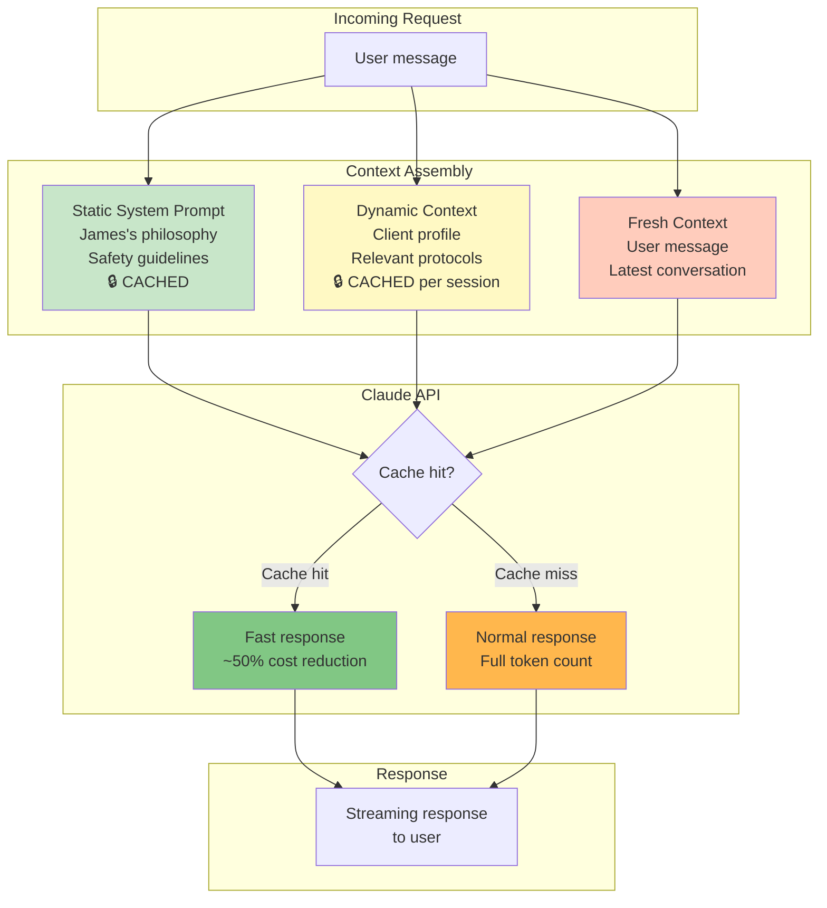
```mermaid
flowchart TD
    subgraph Request["Incoming Request"]
        User[User message]
    end
    
    subgraph Context["Context Assembly"]
        Static[Static System Prompt<br/>James's philosophy<br/>Safety guidelines<br/>🔒 CACHED]
        Dynamic[Dynamic Context<br/>Client profile<br/>Relevant protocols<br/>🔒 CACHED per session]
        Fresh[Fresh Context<br/>User message<br/>Latest conversation]
    end
    
    subgraph API["Claude API"]
        Check{Cache hit?}
        Fast[Fast response<br/>~50% cost reduction]
        Normal[Normal response<br/>Full token count]
    end
    
    subgraph Response["Response"]
        Stream[Streaming response<br/>to user]
    end
    
    User --> Static
    User --> Dynamic
    User --> Fresh
    
    Static --> Check
    Dynamic --> Check
    Fresh --> Check
    
    Check -->|Cache hit| Fast
    Check -->|Cache miss| Normal
    
    Fast --> Stream
    Normal --> Stream
    
    style Static fill:#c8e6c9
    style Dynamic fill:#fff9c4
    style Fresh fill:#ffccbc
    style Fast fill:#81c784
    style Normal fill:#ffb74d
```

**Prompt Caching Implementation:**

```typescript
// lib/agents/nutrition-advisor.ts (Week 7 optimized version)
import Anthropic from '@anthropic-ai/sdk';

export async function* streamNutritionAdvice(
  userMessage: string,
  clientId: string
) {
  const clientContext = await getClientContext(clientId);
  const relevantProtocols = await searchProtocols(userMessage, 3);
  
  // Static system prompt (cached across requests)
  const staticSystemPrompt = `You are the Viridian Nutrition Advisor for James Kerby's coaching practice.

James's Coaching Philosophy:
- No gimmicks, potions, drinks, or pills
- Evidence-based nutrition science
- Sustainable, long-term behavior change
- Patient, caring, and encouraging
- Realistic goal-setting
- Education-first approach
- UK dietary context and food availability

Safety Guidelines:
- Never recommend supplements without James's approval
- Never diagnose medical conditions
- Escalate concerning patterns to James
- Respect all dietary restrictions
- Cite evidence or protocols for recommendations`;

  // Dynamic context (changes per request, but can be cached for multi-turn)
  const dynamicContext = `
Client Context:
${JSON.stringify(clientContext, null, 2)}

Relevant Protocols:
${relevantProtocols.map(p => `## ${p.title}\n${p.content}`).join('\n\n')}`;

  const stream = await client.messages.stream({
    model: 'claude-sonnet-4-20250514',
    max_tokens: 3000,
    system: [
      {
        type: 'text',
        text: staticSystemPrompt,
        cache_control: { type: 'ephemeral' } // Cache this block
      },
      {
        type: 'text',
        text: dynamicContext,
        cache_control: { type: 'ephemeral' } // Cache this block per session
      }
    ],
    messages: [
      { role: 'user', content: userMessage }
    ],
    tools: [recipeSearchTool, protocolRAGTool],
  });

  // ... rest of streaming logic
}
```

**Parallel Tool Execution:**

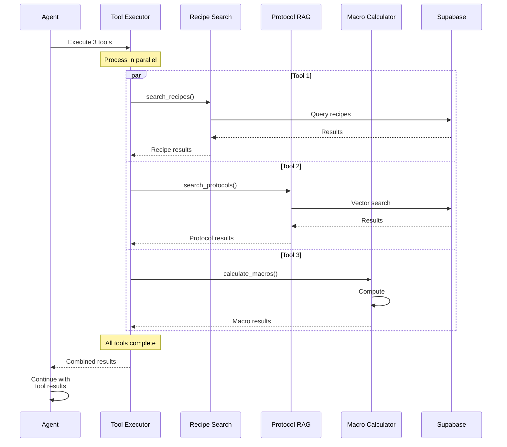
```mermaid
sequenceDiagram
    participant Agent
    participant Executor as Tool Executor
    participant Tool1 as Recipe Search
    participant Tool2 as Protocol RAG
    participant Tool3 as Macro Calculator
    participant DB as Supabase
    
    Agent->>Executor: Execute 3 tools
    Note over Executor: Process in parallel
    
    par Tool 1
        Executor->>Tool1: search_recipes()
        Tool1->>DB: Query recipes
        DB-->>Tool1: Results
        Tool1-->>Executor: Recipe results
    and Tool 2
        Executor->>Tool2: search_protocols()
        Tool2->>DB: Vector search
        DB-->>Tool2: Results
        Tool2-->>Executor: Protocol results
    and Tool 3
        Executor->>Tool3: calculate_macros()
        Tool3->>Tool3: Compute
        Tool3-->>Executor: Macro results
    end
    
    Note over Executor: All tools complete
    Executor-->>Agent: Combined results
    Agent->>Agent: Continue with<br/>tool results
```

```typescript
// lib/agents/tool-executor.ts
export async function executeToolsInParallel(toolCalls: ToolUse[]) {
  const results = await Promise.all(
    toolCalls.map(async (toolCall) => {
      try {
        let result;
        switch (toolCall.name) {
          case 'search_recipes':
            result = await executeRecipeSearch(toolCall.input);
            break;
          case 'search_protocols':
            result = await searchProtocols(toolCall.input.query, toolCall.input.max_results);
            break;
          case 'calculate_macros':
            result = await calculateMacros(toolCall.input);
            break;
          default:
            result = { error: 'Unknown tool' };
        }
        
        return {
          tool_use_id: toolCall.id,
          content: JSON.stringify(result),
        };
      } catch (error) {
        return {
          tool_use_id: toolCall.id,
          content: JSON.stringify({ error: error.message }),
          is_error: true,
        };
      }
    })
  );

  return results;
}
```

**Agent Response Validation:**

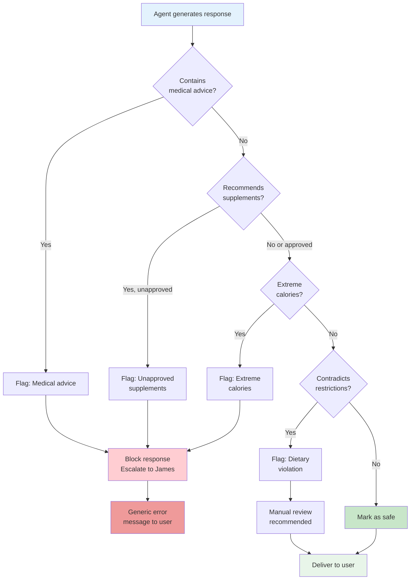
```mermaid
flowchart TD
    Start[Agent generates response] --> Medical{Contains<br/>medical advice?}
    
    Medical -->|Yes| Flag1[Flag: Medical advice]
    Medical -->|No| Supplements{Recommends<br/>supplements?}
    
    Supplements -->|Yes, unapproved| Flag2[Flag: Unapproved<br/>supplements]
    Supplements -->|No or approved| Calories{Extreme<br/>calories?}
    
    Calories -->|Yes| Flag3[Flag: Extreme<br/>calories]
    Calories -->|No| Restrictions{Contradicts<br/>restrictions?}
    
    Restrictions -->|Yes| Flag4[Flag: Dietary<br/>violation]
    Restrictions -->|No| Safe[Mark as safe]
    
    Flag1 --> Block[Block response<br/>Escalate to James]
    Flag2 --> Block
    Flag3 --> Block
    Flag4 --> Review[Manual review<br/>recommended]
    
    Safe --> Deliver[Deliver to user]
    Review --> Deliver
    
    Block --> Error[Generic error<br/>message to user]
    
    style Start fill:#e3f2fd
    style Safe fill:#c8e6c9
    style Deliver fill:#e8f5e9
    style Block fill:#ffcdd2
    style Error fill:#ef9a9a
```

```typescript
// lib/agents/safety-validator.ts
export async function validateAgentResponse(
  response: string,
  clientContext: ClientProfile
): Promise<{ safe: boolean; reason?: string }> {
  // Check for medical advice
  const medicalKeywords = ['diagnose', 'prescribe', 'medication', 'disease', 'illness'];
  if (medicalKeywords.some(kw => response.toLowerCase().includes(kw))) {
    return { safe: false, reason: 'Contains medical advice' };
  }

  // Check for supplement recommendations
  const supplementKeywords = ['supplement', 'pill', 'capsule', 'vitamin', 'protein powder'];
  if (supplementKeywords.some(kw => response.toLowerCase().includes(kw))) {
    // Allowed if from approved list
    const approvedSupplements = ['whey protein', 'creatine']; // James's approved list
    const isApproved = approvedSupplements.some(s => response.toLowerCase().includes(s));
    if (!isApproved) {
      return { safe: false, reason: 'Recommends non-approved supplements' };
    }
  }

  // Check for extreme calorie recommendations
  const calorieMatch = response.match(/(\d+)\s*(calories|kcal)/i);
  if (calorieMatch) {
    const calories = parseInt(calorieMatch[1]);
    if (calories < 1200 || calories > 4000) {
      return { safe: false, reason: 'Extreme calorie recommendation' };
    }
  }

  // Check for contradictions with client restrictions
  const restrictions = clientContext.dietary_restrictions || [];
  for (const restriction of restrictions) {
    if (response.toLowerCase().includes(restriction.toLowerCase())) {
      // This might be okay if discussing alternatives, but flag for review
      return { safe: true, reason: 'Mentions restricted ingredient - manual review recommended' };
    }
  }

  return { safe: true };
}
```

**Success Criteria:**
- ✅ Agent response time <2 seconds (with caching)
- ✅ 50% cost reduction from prompt caching
- ✅ Zero safety violations in production
- ✅ Mobile UI fully functional
- ✅ <1% error rate on agent requests

**Time Estimate:** 40 hours

---

### Week 8: Launch Preparation & Documentation

**Goal:** Production-ready system with documentation

**Deliverables:**
1. Production deployment (Vercel + Supabase)
2. Monitoring and logging setup
3. James's admin guide (how to use coach dashboard)
4. Client onboarding guide
5. Technical documentation for future developers
6. Backup and disaster recovery plan
7. Security audit

**Deployment Pipeline:**


```mermaid
flowchart LR
    subgraph Dev["Development"]
        Code[Code changes]
        Commit[Git commit]
        PR[Pull request]
    end
    
    subgraph CI["CI/CD Pipeline"]
        Test[Run tests]
        Build[Build app]
        Preview[Deploy preview<br/>Vercel]
    end
    
    subgraph Review["Code Review"]
        ReviewStep[Team review]
        Approve{Approved?}
    end
    
    subgraph Deploy["Production Deploy"]
        Merge[Merge to main]
        ProdBuild[Production build]
        Vercel[Deploy to Vercel]
        Supabase[Run migrations<br/>Supabase]
    end
    
    subgraph Monitor["Monitoring"]
        Health[Health checks]
        Logs[Error logging]
        Analytics[Usage analytics]
    end
    
    Code --> Commit
    Commit --> PR
    PR --> Test
    Test --> Build
    Build --> Preview
    Preview --> ReviewStep
    ReviewStep --> Approve
    
    Approve -->|Yes| Merge
    Approve -->|No| Code
    
    Merge --> ProdBuild
    ProdBuild --> Vercel
    Vercel --> Supabase
    Supabase --> Health
    Health --> Logs
    Logs --> Analytics
    
    style Dev fill:#e3f2fd
    style CI fill:#fff3e0
    style Review fill:#f3e5f5
    style Deploy fill:#c8e6c9
    style Monitor fill:#ffecb3
```

**Deployment Checklist:**

```markdown
## Pre-Launch Checklist

### Infrastructure
- [ ] Vercel project configured with production domain
- [ ] Supabase production instance created
- [ ] Environment variables set in Vercel
- [ ] Database migrations run on production
- [ ] Recipe database seeded (100+ recipes)
- [ ] James's protocols embedded and indexed

### Security
- [ ] RLS policies tested and enforced
- [ ] API routes protected with authentication
- [ ] CORS configured correctly
- [ ] Secrets rotated (API keys, DB passwords)
- [ ] HTTPS enforced
- [ ] Rate limiting enabled (Vercel, Supabase)

### Monitoring
- [ ] Vercel Analytics enabled
- [ ] Supabase Monitoring dashboard configured
- [ ] Sentry error tracking integrated
- [ ] Custom logs for agent interactions
- [ ] Alerts set up for critical errors

### Documentation
- [ ] James's Admin Guide (PDF)
- [ ] Client Onboarding Guide (in-app + PDF)
- [ ] Developer README with setup instructions
- [ ] API documentation (internal endpoints)
- [ ] Agent prompt documentation

### Testing
- [ ] E2E tests for critical flows (Playwright)
- [ ] Agent response quality validated by James
- [ ] Load testing (50 concurrent users)
- [ ] Mobile testing (iOS Safari, Android Chrome)
- [ ] Accessibility audit (WCAG 2.1 AA)

### Legal/Compliance
- [ ] Privacy Policy published
- [ ] Terms of Service published
- [ ] GDPR compliance verified
- [ ] Data processing agreement with Anthropic
- [ ] Backup strategy documented
```

**Monitoring Setup:**

```typescript
// lib/monitoring/logger.ts
import { createClient } from '@supabase/supabase-js';

export class AppLogger {
  async logAgentInteraction(
    clientId: string,
    agentType: string,
    input: string,
    output: string,
    tokensUsed: number,
    duration: number,
    toolsUsed: string[]
  ) {
    await supabase.from('agent_logs').insert({
      client_id: clientId,
      agent_type: agentType,
      input_preview: input.substring(0, 200),
      output_preview: output.substring(0, 200),
      tokens_used: tokensUsed,
      duration_ms: duration,
      tools_used: toolsUsed,
      created_at: new Date().toISOString(),
    });
  }

  async logError(
    context: string,
    error: Error,
    metadata?: Record<string, any>
  ) {
    console.error(`[${context}]`, error);
    
    await supabase.from('error_logs').insert({
      context,
      error_message: error.message,
      error_stack: error.stack,
      metadata,
      created_at: new Date().toISOString(),
    });

    // Also send to Sentry if critical
    if (this.isCritical(context)) {
      // Sentry.captureException(error);
    }
  }

  private isCritical(context: string): boolean {
    const criticalContexts = ['agent_generation', 'meal_plan_creation', 'payment'];
    return criticalContexts.some(c => context.includes(c));
  }
}
```

**Success Criteria:**
- ✅ Production deployment stable (99% uptime)
- ✅ All documentation complete
- ✅ James trained on coach dashboard
- ✅ 5 beta clients onboarded successfully
- ✅ Monitoring dashboards showing real-time data
- ✅ Security audit passed with no high-severity issues

**Time Estimate:** 40 hours

---

## 5. Agent SDK Integration Patterns

### 5.1 Base Agent Class (Reusable Pattern)

```typescript
// lib/agents/base-agent.ts
import Anthropic from '@anthropic-ai/sdk';
import type { MessageParam, Tool } from '@anthropic-ai/sdk/resources/messages.mjs';

export abstract class BaseAgent {
  protected client: Anthropic;
  protected model = 'claude-sonnet-4-20250514';

  constructor() {
    this.client = new Anthropic({
      apiKey: process.env.ANTHROPIC_API_KEY!,
    });
  }

  abstract getSystemPrompt(context: any): string | Array<{ type: string; text: string; cache_control?: any }>;
  abstract getTools(): Tool[];
  abstract executeToolCall(toolName: string, input: any): Promise<any>;

  async *stream(
    userMessage: string,
    context: any,
    conversationHistory: MessageParam[] = []
  ): AsyncGenerator<{ type: string; content: any }> {
    const systemPrompt = this.getSystemPrompt(context);
    const tools = this.getTools();

    const messages: MessageParam[] = [
      ...conversationHistory,
      { role: 'user', content: userMessage }
    ];

    const stream = await this.client.messages.stream({
      model: this.model,
      max_tokens: 4096,
      system: systemPrompt,
      messages,
      tools: tools.length > 0 ? tools : undefined,
    });

    let toolCalls: any[] = [];

    for await (const chunk of stream) {
      if (chunk.type === 'content_block_start' && chunk.content_block.type === 'tool_use') {
        toolCalls.push({
          id: chunk.content_block.id,
          name: chunk.content_block.name,
          input: {},
        });
      }

      if (chunk.type === 'content_block_delta') {
        if (chunk.delta.type === 'text_delta') {
          yield { type: 'text', content: chunk.delta.text };
        }
        
        if (chunk.delta.type === 'input_json_delta' && toolCalls.length > 0) {
          // Accumulate tool input
          const currentTool = toolCalls[toolCalls.length - 1];
          currentTool.input = {
            ...currentTool.input,
            ...JSON.parse(chunk.delta.partial_json || '{}')
          };
        }
      }

      if (chunk.type === 'content_block_stop' && toolCalls.length > 0) {
        // Execute tools
        const results = await Promise.all(
          toolCalls.map(async (call) => ({
            type: 'tool_result' as const,
            tool_use_id: call.id,
            content: JSON.stringify(await this.executeToolCall(call.name, call.input)),
          }))
        );

        // Continue conversation with tool results
        messages.push({
          role: 'assistant',
          content: stream.currentMessage!.content
        });
        messages.push({
          role: 'user',
          content: results
        });

        // Resume streaming
        const continueStream = await this.client.messages.stream({
          model: this.model,
          max_tokens: 4096,
          system: systemPrompt,
          messages,
          tools,
        });

        for await (const continueChunk of continueStream) {
          if (continueChunk.type === 'content_block_delta' && 
              continueChunk.delta.type === 'text_delta') {
            yield { type: 'text', content: continueChunk.delta.text };
          }
        }

        toolCalls = [];
      }
    }
  }

  async generate(userMessage: string, context: any): Promise<string> {
    const systemPrompt = this.getSystemPrompt(context);

    const response = await this.client.messages.create({
      model: this.model,
      max_tokens: 4096,
      system: systemPrompt,
      messages: [{ role: 'user', content: userMessage }],
    });

    const textContent = response.content.find(block => block.type === 'text');
    return textContent && textContent.type === 'text' ? textContent.text : '';
  }
}
```

### 5.2 Concrete Agent Implementation Example

```typescript
// lib/agents/nutrition-advisor.ts
import { BaseAgent } from './base-agent';
import { recipeSearchTool, executeRecipeSearch } from '@/lib/tools/recipe-search';
import { protocolRAGTool, searchProtocols } from '@/lib/tools/protocol-rag';
import { getClientContext } from '@/lib/context/client-context';

export class NutritionAdvisorAgent extends BaseAgent {
  getSystemPrompt(context: any) {
    const { clientContext, protocols } = context;

    return [
      {
        type: 'text',
        text: `You are the Viridian Nutrition Advisor for James Kerby's coaching practice.

James's Philosophy:
- No gimmicks, potions, drinks, or pills
- Evidence-based nutrition science
- Sustainable, long-term behavior change
- Patient, caring, and encouraging
- UK dietary context and food availability`,
        cache_control: { type: 'ephemeral' } // Static part, cacheable
      },
      {
        type: 'text',
        text: `Client Context:
Name: ${clientContext.name}
Goals: ${clientContext.goals.join(', ')}
Restrictions: ${clientContext.dietary_restrictions.join(', ')}

Relevant Protocols:
${protocols.map(p => `## ${p.title}\n${p.content}`).join('\n\n')}`,
        cache_control: { type: 'ephemeral' } // Dynamic but cacheable per session
      }
    ];
  }

  getTools() {
    return [recipeSearchTool, protocolRAGTool];
  }

  async executeToolCall(toolName: string, input: any) {
    switch (toolName) {
      case 'search_recipes':
        return executeRecipeSearch(input);
      case 'search_protocols':
        return searchProtocols(input.query, input.max_results);
      default:
        throw new Error(`Unknown tool: ${toolName}`);
    }
  }

  // Convenience method for common use case
  async *chatWithClient(clientId: string, userMessage: string, history: any[] = []) {
    const clientContext = await getClientContext(clientId);
    const relevantProtocols = await searchProtocols(userMessage, 2);

    const context = { clientContext, protocols: relevantProtocols };

    for await (const chunk of this.stream(userMessage, context, history)) {
      yield chunk;
    }
  }
}
```

### 5.3 API Route Integration

```typescript
// app/api/agents/nutrition-advisor/route.ts
import { NextRequest } from 'next/server';
import { createClient } from '@/lib/supabase/server';
import { NutritionAdvisorAgent } from '@/lib/agents/nutrition-advisor';

export const runtime = 'edge'; // Deploy as Edge Function for low latency

export async function POST(request: NextRequest) {
  const supabase = createClient();
  
  // Authenticate
  const { data: { user }, error: authError } = await supabase.auth.getUser();
  if (authError || !user) {
    return new Response('Unauthorized', { status: 401 });
  }

  // Get client ID from user
  const { data: client } = await supabase
    .from('clients')
    .select('id')
    .eq('user_id', user.id)
    .single();

  if (!client) {
    return new Response('Client not found', { status: 404 });
  }

  const { message, conversationHistory } = await request.json();

  const agent = new NutritionAdvisorAgent();

  // Stream response
  const encoder = new TextEncoder();
  const stream = new ReadableStream({
    async start(controller) {
      try {
        for await (const chunk of agent.chatWithClient(client.id, message, conversationHistory)) {
          controller.enqueue(encoder.encode(`data: ${JSON.stringify(chunk)}\n\n`));
        }
        controller.close();
      } catch (error) {
        controller.error(error);
      }
    },
  });

  return new Response(stream, {
    headers: {
      'Content-Type': 'text/event-stream',
      'Cache-Control': 'no-cache',
      'Connection': 'keep-alive',
    },
  });
}
```

### 5.4 Frontend Integration (Streaming UI)

```typescript
// components/chat/chat-interface.tsx
'use client';

import { useState } from 'react';
import { Button } from '@/components/ui/button';
import { Input } from '@/components/ui/input';
import { ScrollArea } from '@/components/ui/scroll-area';

interface Message {
  role: 'user' | 'assistant';
  content: string;
}

export function ChatInterface() {
  const [messages, setMessages] = useState<Message[]>([]);
  const [input, setInput] = useState('');
  const [isStreaming, setIsStreaming] = useState(false);

  const sendMessage = async () => {
    if (!input.trim()) return;

    const userMessage: Message = { role: 'user', content: input };
    setMessages(prev => [...prev, userMessage]);
    setInput('');
    setIsStreaming(true);

    // Prepare streaming response
    let assistantMessage = '';
    setMessages(prev => [...prev, { role: 'assistant', content: '' }]);

    try {
      const response = await fetch('/api/agents/nutrition-advisor', {
        method: 'POST',
        headers: { 'Content-Type': 'application/json' },
        body: JSON.stringify({
          message: input,
          conversationHistory: messages.slice(-10), // Last 10 messages for context
        }),
      });

      const reader = response.body?.getReader();
      const decoder = new TextDecoder();

      if (!reader) throw new Error('No reader available');

      while (true) {
        const { done, value } = await reader.read();
        if (done) break;

        const chunk = decoder.decode(value);
        const lines = chunk.split('\n\n');

        for (const line of lines) {
          if (line.startsWith('data: ')) {
            const data = JSON.parse(line.slice(6));
            if (data.type === 'text') {
              assistantMessage += data.content;
              setMessages(prev => {
                const newMessages = [...prev];
                newMessages[newMessages.length - 1].content = assistantMessage;
                return newMessages;
              });
            }
          }
        }
      }
    } catch (error) {
      console.error('Streaming error:', error);
      setMessages(prev => [
        ...prev.slice(0, -1),
        { role: 'assistant', content: 'Sorry, something went wrong. Please try again.' }
      ]);
    } finally {
      setIsStreaming(false);
    }
  };

  return (
    <div className="flex flex-col h-screen">
      <ScrollArea className="flex-1 p-4">
        {messages.map((msg, i) => (
          <div key={i} className={`mb-4 ${msg.role === 'user' ? 'text-right' : 'text-left'}`}>
            <div className={`inline-block p-3 rounded-lg ${
              msg.role === 'user' ? 'bg-blue-500 text-white' : 'bg-gray-200'
            }`}>
              {msg.content}
            </div>
          </div>
        ))}
      </ScrollArea>
      
      <div className="p-4 border-t flex gap-2">
        <Input
          value={input}
          onChange={e => setInput(e.target.value)}
          onKeyPress={e => e.key === 'Enter' && !isStreaming && sendMessage()}
          placeholder="Ask about nutrition, recipes, or your meal plan..."
          disabled={isStreaming}
        />
        <Button onClick={sendMessage} disabled={isStreaming}>
          {isStreaming ? 'Sending...' : 'Send'}
        </Button>
      </div>
    </div>
  );
}
```

---

## 6. PMF Validation Module

### 6.1 PMF Metrics Framework

**Core PMF Questions:**
1. **Are users engaging?** (Daily/weekly active users, session length, feature usage)
2. **Are users satisfied?** (NPS, feature ratings, agent quality scores)
3. **Are users achieving outcomes?** (Goal progress, adherence rates, health improvements)
4. **Are users staying?** (Weekly retention, churn rate, referrals)

**PMF Metrics Calculation Flow:**

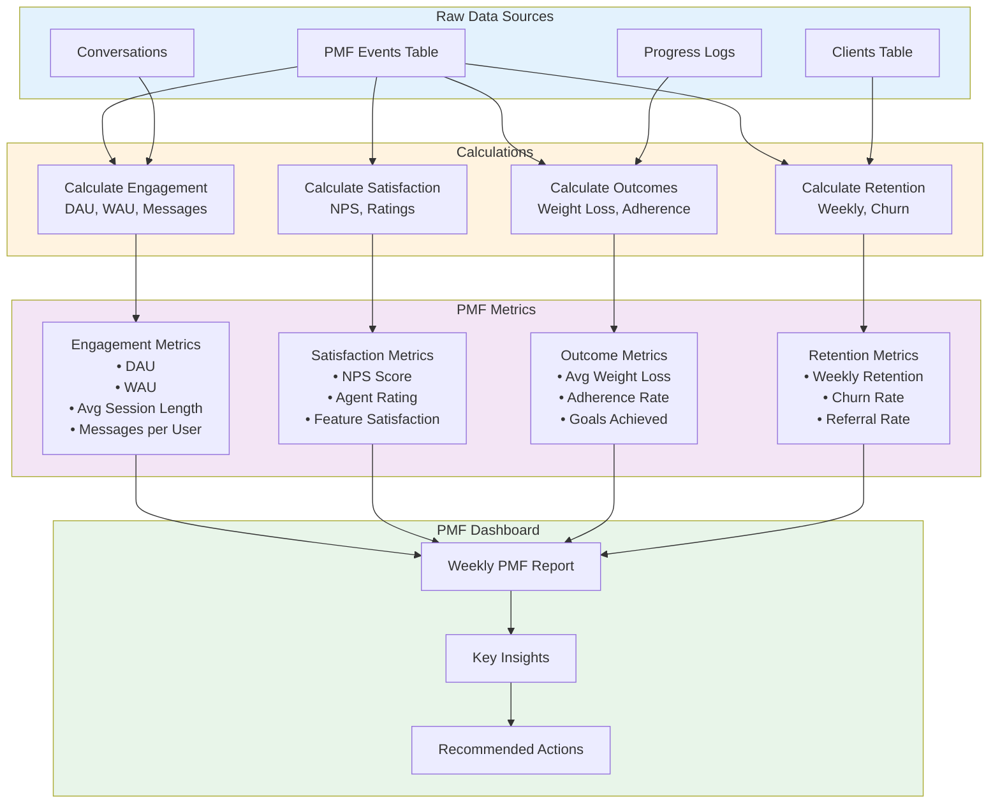
```mermaid
flowchart TD
    subgraph Raw["Raw Data Sources"]
        Events[PMF Events Table]
        Clients[Clients Table]
        Logs[Progress Logs]
        Conv[Conversations]
    end
    
    subgraph Calc["Calculations"]
        Engage[Calculate Engagement<br/>DAU, WAU, Messages]
        Satis[Calculate Satisfaction<br/>NPS, Ratings]
        Out[Calculate Outcomes<br/>Weight Loss, Adherence]
        Ret[Calculate Retention<br/>Weekly, Churn]
    end
    
    subgraph Metrics["PMF Metrics"]
        EngageMetrics["Engagement Metrics<br/>• DAU<br/>• WAU<br/>• Avg Session Length<br/>• Messages per User"]
        SatisMetrics["Satisfaction Metrics<br/>• NPS Score<br/>• Agent Rating<br/>• Feature Satisfaction"]
        OutMetrics["Outcome Metrics<br/>• Avg Weight Loss<br/>• Adherence Rate<br/>• Goals Achieved"]
        RetMetrics["Retention Metrics<br/>• Weekly Retention<br/>• Churn Rate<br/>• Referral Rate"]
    end
    
    subgraph Dashboard["PMF Dashboard"]
        Report[Weekly PMF Report]
        Insights[Key Insights]
        Actions[Recommended Actions]
    end
    
    Events --> Engage
    Events --> Satis
    Events --> Out
    Events --> Ret
    
    Clients --> Ret
    Logs --> Out
    Conv --> Engage
    
    Engage --> EngageMetrics
    Satis --> SatisMetrics
    Out --> OutMetrics
    Ret --> RetMetrics
    
    EngageMetrics --> Report
    SatisMetrics --> Report
    OutMetrics --> Report
    RetMetrics --> Report
    
    Report --> Insights
    Insights --> Actions
    
    style Raw fill:#e3f2fd
    style Calc fill:#fff3e0
    style Metrics fill:#f3e5f5
    style Dashboard fill:#e8f5e9
```

**Metrics Dashboard:**

```typescript
// lib/pmf/metrics.ts
export interface PMFMetrics {
  engagement: {
    dau: number;              // Daily active users
    wau: number;              // Weekly active users
    avgSessionLength: number; // Minutes
    messagesPerUser: number;
    mealPlansGenerated: number;
  };
  satisfaction: {
    nps: number;              // Net Promoter Score
    avgAgentRating: number;   // 1-5 stars
    featureSatisfaction: Record<string, number>;
  };
  outcomes: {
    avgWeightLossKg: number;
    adherenceRate: number;    // % of meal plans followed
    goalsAchieved: number;    // % of clients hitting goals
  };
  retention: {
    weeklyRetention: number[]; // [week1, week2, ..., week8]
    churnRate: number;
    referralRate: number;
  };
}

export async function calculatePMFMetrics(
  startDate: Date,
  endDate: Date
): Promise<PMFMetrics> {
  // Fetch raw data
  const { data: events } = await supabase
    .from('pmf_events')
    .select('*')
    .gte('created_at', startDate.toISOString())
    .lte('created_at', endDate.toISOString());

  const { data: clients } = await supabase
    .from('clients')
    .select('*');

  // Calculate engagement
  const uniqueActiveUsers = new Set(
    events?.filter(e => e.type === 'feature_use').map(e => e.client_id)
  ).size;

  const engagement = {
    dau: uniqueActiveUsers / 7, // Approximate DAU
    wau: uniqueActiveUsers,
    avgSessionLength: calculateAvgSessionLength(events),
    messagesPerUser: calculateMessagesPerUser(events),
    mealPlansGenerated: events?.filter(e => e.feature_name === 'meal_plan_generated').length || 0,
  };

  // Calculate satisfaction
  const feedbackEvents = events?.filter(e => e.type === 'feedback') || [];
  const npsScores = feedbackEvents
    .filter(e => e.feedback_type === 'nps')
    .map(e => e.score);
  
  const satisfaction = {
    nps: calculateNPS(npsScores),
    avgAgentRating: calculateAvgRating(feedbackEvents.filter(e => e.feedback_type === 'agent_quality')),
    featureSatisfaction: calculateFeatureSatisfaction(feedbackEvents),
  };

  // Calculate outcomes
  const outcomeEvents = events?.filter(e => e.type === 'outcome') || [];
  const outcomes = {
    avgWeightLossKg: calculateAvgOutcome(outcomeEvents, 'weight_loss_kg'),
    adherenceRate: calculateAvgOutcome(outcomeEvents, 'adherence_rate'),
    goalsAchieved: (outcomeEvents.filter(e => e.outcome_type === 'goal_achieved').length / clients!.length) * 100,
  };

  // Calculate retention
  const retentionEvents = events?.filter(e => e.type === 'retention') || [];
  const retention = {
    weeklyRetention: calculateWeeklyRetention(retentionEvents),
    churnRate: calculateChurnRate(retentionEvents),
    referralRate: calculateReferralRate(clients),
  };

  return { engagement, satisfaction, outcomes, retention };
}
```

### 6.2 PMF Feedback Loops

**In-App Prompts (Strategic Timing):**

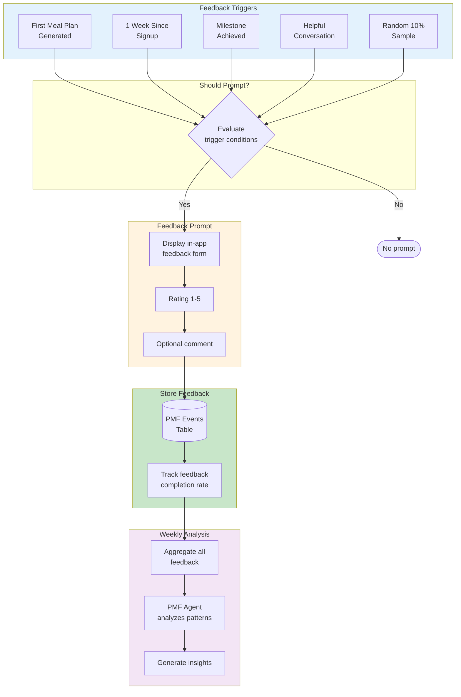
```mermaid
flowchart TD
    subgraph Triggers["Feedback Triggers"]
        First[First Meal Plan<br/>Generated]
        Week[1 Week Since<br/>Signup]
        Milestone[Milestone<br/>Achieved]
        Helpful[Helpful<br/>Conversation]
        Random[Random 10%<br/>Sample]
    end
    
    subgraph Check["Should Prompt?"]
        Eval{Evaluate<br/>trigger conditions}
    end
    
    subgraph Prompt["Feedback Prompt"]
        Display[Display in-app<br/>feedback form]
        Rating[Rating 1-5]
        Comment[Optional comment]
    end
    
    subgraph Store["Store Feedback"]
        DB[(PMF Events<br/>Table)]
        Track[Track feedback<br/>completion rate]
    end
    
    subgraph Analysis["Weekly Analysis"]
        Aggregate[Aggregate all<br/>feedback]
        PMFAgent[PMF Agent<br/>analyzes patterns]
        Report[Generate insights]
    end
    
    First --> Eval
    Week --> Eval
    Milestone --> Eval
    Helpful --> Eval
    Random --> Eval
    
    Eval -->|Yes| Display
    Eval -->|No| End([No prompt])
    
    Display --> Rating
    Rating --> Comment
    Comment --> DB
    DB --> Track
    Track --> Aggregate
    Aggregate --> PMFAgent
    PMFAgent --> Report
    
    style Triggers fill:#e3f2fd
    style Prompt fill:#fff3e0
    style Store fill:#c8e6c9
    style Analysis fill:#f3e5f5
```

```typescript
// lib/pmf/feedback-triggers.ts
export function shouldPromptFeedback(
  clientId: string,
  trigger: string
): boolean {
  // Trigger feedback after key moments:
  // 1. After first meal plan generated
  // 2. After 1 week of using the app
  // 3. After achieving a milestone (e.g., 5kg lost)
  // 4. After a particularly helpful agent conversation
  // 5. Random 10% sampling for continuous feedback

  const triggers = {
    first_meal_plan: hasGeneratedFirstMealPlan(clientId),
    week_one: isWeekOneSinceSignup(clientId),
    milestone_achieved: hasMilestone(clientId),
    helpful_conversation: recentConversationRatedHigh(clientId),
    random_sample: Math.random() < 0.1,
  };

  return triggers[trigger] || false;
}
```

### 6.3 Weekly PMF Review Template

```markdown
# Week X PMF Review - Viridian Nutrition App

**Date:** [Date]
**Attendees:** James Kerby, Development Team

## 1. Metrics Summary

| Metric | This Week | Last Week | Change | Target |
|--------|-----------|-----------|--------|--------|
| WAU | 15 | 12 | +25% | 20 |
| Avg Messages/User | 8 | 6 | +33% | 10 |
| NPS | 45 | 40 | +5 | 50+ |
| Adherence Rate | 68% | 65% | +3% | 75% |
| Weekly Retention (Week 2) | 80% | 75% | +5% | 85% |

## 2. Key Insights

**What's Working:**
- [Insight 1 from PMF Agent analysis]
- [Insight 2]

**What's Not:**
- [Problem 1]
- [Problem 2]

## 3. Client Feedback Highlights

**Positive:**
- "The agent really understands my preferences"
- "Meal plans are actually doable with my schedule"

**Needs Improvement:**
- "Recipe database needs more variety"
- "Shopping list could be better organized"

## 4. Decisions & Actions

**For Next Sprint:**
1. [Action item 1 with owner and deadline]
2. [Action item 2]

**Experiments to Run:**
- A/B test: Different meal plan presentation formats
- Feature test: Proactive check-ins vs on-demand only

## 5. Red Flags & Risks

- [Any concerning trends]
- [At-risk clients identified]

## 6. Next Week's Focus

[1-2 sentence priority for the coming week]
```

### 6.4 Platform PMF Integration Summary

**Architecture Benefits:**
1. **Centralized Analytics:** All apps on the platform share a unified PMF tracking system
2. **Cross-App Benchmarking:** Compare Viridian metrics against other apps automatically
3. **Reduced Development Effort:** Platform handles complex analytics, cohort analysis, A/B testing
4. **Consistent Methodology:** Standardized metrics definitions across all applications
5. **Scalability:** Platform PMF Module scales independently of individual apps

**Data Flow:**
```
Viridian App Events → Local Staging → Platform PMF API → Platform Event Store
                                                              ↓
                            Platform Analytics Engine (Claude-powered)
                                                              ↓
                          Platform Analytics API → Viridian Dashboard
```

**What Viridian Owns:**
- Event instrumentation (when/what to track)
- Local event storage (app-specific details)
- Platform sync client implementation
- Dashboard UI consuming Platform metrics

**What Platform Provides:**
- Event ingestion API (POST /events)
- Analytics computation (engagement, satisfaction, outcomes, retention)
- Benchmarking data (cross-app, industry)
- PMF insights generation (Claude agent at Platform level)
- Cohort analysis engine
- A/B testing coordination

**Migration Path:**
- **Week 1-5:** Use simple local PMF tracking (documented in current implementation)
- **Week 6:** Implement Platform integration layer
- **Post-Launch:** Fully migrate to Platform PMF Module, deprecate local analytics

**Schema Alignment:**
All events must include these standard fields for Platform compatibility:
- `appId` - Application identifier
- `appVersion` - Semantic version
- `eventType` - Standardized type (feature_use, feedback, outcome, retention)
- `timestamp` - ISO 8601 format
- `userId` - Anonymized user identifier
- `sessionId` - Session tracking
- `data` - Event-specific payload
- `metadata` - Device, location, context

---

## 7. Technical Implementation Details

### 7.1 Environment Setup

```bash
# .env.local (Development)
NEXT_PUBLIC_SUPABASE_URL=https://your-project.supabase.co
NEXT_PUBLIC_SUPABASE_ANON_KEY=your-anon-key
SUPABASE_SERVICE_ROLE_KEY=your-service-role-key

# Anthropic (Agent SDK)
ANTHROPIC_API_KEY=sk-ant-your-api-key

# OpenAI (Embeddings for RAG)
OPENAI_API_KEY=sk-your-openai-key

# Platform PMF Module Integration
PLATFORM_PMF_API_URL=https://platform.yourdomain.com/pmf/api
PLATFORM_PMF_API_KEY=your-platform-pmf-api-key
NEXT_PUBLIC_APP_VERSION=1.0.0

NODE_ENV=development

# .env.production (Vercel)
# Same vars, production values
# Platform PMF API URL should point to production Platform endpoint
```

### 7.2 Database Schema (Complete)

**Entity Relationship Diagram:**

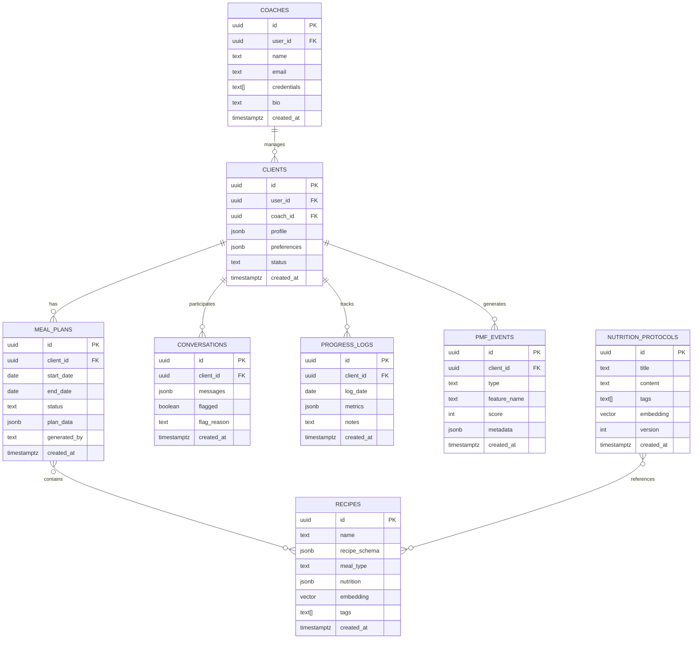
```mermaid
erDiagram
    COACHES ||--o{ CLIENTS : manages
    CLIENTS ||--o{ MEAL_PLANS : has
    CLIENTS ||--o{ CONVERSATIONS : participates
    CLIENTS ||--o{ PROGRESS_LOGS : tracks
    CLIENTS ||--o{ PMF_EVENTS : generates
    MEAL_PLANS }o--o{ RECIPES : contains
    NUTRITION_PROTOCOLS }o--o{ RECIPES : references
    
    COACHES {
        uuid id PK
        uuid user_id FK
        text name
        text email
        text[] credentials
        text bio
        timestamptz created_at
    }
    
    CLIENTS {
        uuid id PK
        uuid user_id FK
        uuid coach_id FK
        jsonb profile
        jsonb preferences
        text status
        timestamptz created_at
    }
    
    RECIPES {
        uuid id PK
        text name
        jsonb recipe_schema
        text meal_type
        jsonb nutrition
        vector embedding
        text[] tags
        timestamptz created_at
    }
    
    NUTRITION_PROTOCOLS {
        uuid id PK
        text title
        text content
        text[] tags
        vector embedding
        int version
        timestamptz created_at
    }
    
    MEAL_PLANS {
        uuid id PK
        uuid client_id FK
        date start_date
        date end_date
        text status
        jsonb plan_data
        text generated_by
        timestamptz created_at
    }
    
    CONVERSATIONS {
        uuid id PK
        uuid client_id FK
        jsonb messages
        boolean flagged
        text flag_reason
        timestamptz created_at
    }
    
    PROGRESS_LOGS {
        uuid id PK
        uuid client_id FK
        date log_date
        jsonb metrics
        text notes
        timestamptz created_at
    }
    
    PMF_EVENTS {
        uuid id PK
        uuid client_id FK
        text type
        text feature_name
        int score
        jsonb metadata
        timestamptz created_at
    }
```

**SQL Schema:**

```sql
-- supabase/migrations/001_complete_schema.sql

-- Enable necessary extensions
CREATE EXTENSION IF NOT EXISTS "uuid-ossp";
CREATE EXTENSION IF NOT EXISTS "pgcrypto";
CREATE EXTENSION IF NOT EXISTS "vector";

-- Coaches table
CREATE TABLE coaches (
  id UUID PRIMARY KEY DEFAULT uuid_generate_v4(),
  user_id UUID REFERENCES auth.users(id) ON DELETE CASCADE,
  name TEXT NOT NULL,
  email TEXT UNIQUE NOT NULL,
  credentials TEXT[],
  bio TEXT,
  created_at TIMESTAMPTZ DEFAULT NOW(),
  updated_at TIMESTAMPTZ DEFAULT NOW()
);

-- Clients table
CREATE TABLE clients (
  id UUID PRIMARY KEY DEFAULT uuid_generate_v4(),
  user_id UUID REFERENCES auth.users(id) ON DELETE CASCADE,
  coach_id UUID REFERENCES coaches(id),
  profile JSONB NOT NULL, -- Schema.org Patient structure
  preferences JSONB,
  status TEXT DEFAULT 'active', -- active, inactive, paused
  created_at TIMESTAMPTZ DEFAULT NOW(),
  updated_at TIMESTAMPTZ DEFAULT NOW()
);

-- Recipes table
CREATE TABLE recipes (
  id UUID PRIMARY KEY DEFAULT uuid_generate_v4(),
  name TEXT NOT NULL,
  recipe_schema JSONB NOT NULL, -- Schema.org Recipe
  meal_type TEXT NOT NULL, -- breakfast, lunch, dinner, snack
  cuisine TEXT,
  prep_time_minutes INT,
  cook_time_minutes INT,
  servings INT,
  nutrition JSONB NOT NULL, -- calories, protein, carbs, fat, fiber
  ingredients JSONB NOT NULL,
  instructions JSONB NOT NULL,
  tags TEXT[],
  uk_availability JSONB,
  embedding VECTOR(1536),
  created_at TIMESTAMPTZ DEFAULT NOW()
);

-- Nutrition protocols table
CREATE TABLE nutrition_protocols (
  id UUID PRIMARY KEY DEFAULT uuid_generate_v4(),
  title TEXT NOT NULL,
  content TEXT NOT NULL,
  tags TEXT[],
  version INT DEFAULT 1,
  embedding VECTOR(1536),
  created_at TIMESTAMPTZ DEFAULT NOW(),
  updated_at TIMESTAMPTZ DEFAULT NOW()
);

-- Meal plans table
CREATE TABLE meal_plans (
  id UUID PRIMARY KEY DEFAULT uuid_generate_v4(),
  client_id UUID REFERENCES clients(id) ON DELETE CASCADE,
  start_date DATE NOT NULL,
  end_date DATE NOT NULL,
  status TEXT DEFAULT 'active', -- active, completed, archived
  plan_data JSONB NOT NULL,
  generated_by TEXT DEFAULT 'agent',
  version INT DEFAULT 1,
  created_at TIMESTAMPTZ DEFAULT NOW()
);

-- Conversations table
CREATE TABLE conversations (
  id UUID PRIMARY KEY DEFAULT uuid_generate_v4(),
  client_id UUID REFERENCES clients(id) ON DELETE CASCADE,
  messages JSONB NOT NULL,
  flagged BOOLEAN DEFAULT FALSE,
  flag_reason TEXT,
  created_at TIMESTAMPTZ DEFAULT NOW(),
  updated_at TIMESTAMPTZ DEFAULT NOW()
);

-- Progress logs table
CREATE TABLE progress_logs (
  id UUID PRIMARY KEY DEFAULT uuid_generate_v4(),
  client_id UUID REFERENCES clients(id) ON DELETE CASCADE,
  log_date DATE NOT NULL,
  metrics JSONB NOT NULL,
  notes TEXT,
  created_at TIMESTAMPTZ DEFAULT NOW()
);

-- PMF events table (local app-specific tracking)
CREATE TABLE pmf_events (
  id UUID PRIMARY KEY DEFAULT uuid_generate_v4(),
  type TEXT NOT NULL, -- feature_use, feedback, outcome, retention
  client_id UUID REFERENCES clients(id) ON DELETE CASCADE,
  feature_name TEXT,
  feedback_type TEXT,
  score INT,
  comment TEXT,
  outcome_type TEXT,
  value NUMERIC,
  metadata JSONB,
  created_at TIMESTAMPTZ DEFAULT NOW()
);

-- PMF events staging table (for Platform sync)
CREATE TABLE pmf_events_staging (
  id UUID PRIMARY KEY DEFAULT uuid_generate_v4(),
  platform_event_id UUID, -- Set after successful sync to Platform
  event_data JSONB NOT NULL, -- Full PlatformPMFEvent structure
  synced BOOLEAN DEFAULT FALSE,
  sync_attempted_at TIMESTAMPTZ,
  sync_error TEXT,
  created_at TIMESTAMPTZ DEFAULT NOW(),
  updated_at TIMESTAMPTZ DEFAULT NOW()
);

-- Index for efficient sync queries
CREATE INDEX idx_pmf_staging_unsynced ON pmf_events_staging(synced, created_at)
WHERE synced = FALSE;

-- Agent logs table (for monitoring)
CREATE TABLE agent_logs (
  id UUID PRIMARY KEY DEFAULT uuid_generate_v4(),
  client_id UUID REFERENCES clients(id) ON DELETE SET NULL,
  agent_type TEXT NOT NULL,
  input_preview TEXT,
  output_preview TEXT,
  tokens_used INT,
  duration_ms INT,
  tools_used TEXT[],
  created_at TIMESTAMPTZ DEFAULT NOW()
);

-- RLS Policies
ALTER TABLE clients ENABLE ROW LEVEL SECURITY;
CREATE POLICY "Clients can view own data" ON clients
  FOR SELECT USING (auth.uid() = user_id);

CREATE POLICY "Coaches can view their clients" ON clients
  FOR SELECT USING (
    coach_id IN (SELECT id FROM coaches WHERE user_id = auth.uid())
  );

-- Similar policies for other tables...

-- Indexes for performance
CREATE INDEX idx_recipes_meal_type ON recipes(meal_type);
CREATE INDEX idx_recipes_embedding ON recipes USING ivfflat (embedding vector_cosine_ops);
CREATE INDEX idx_protocols_embedding ON nutrition_protocols USING ivfflat (embedding vector_cosine_ops);
CREATE INDEX idx_conversations_client ON conversations(client_id);
CREATE INDEX idx_progress_logs_client_date ON progress_logs(client_id, log_date);
CREATE INDEX idx_pmf_events_client_type ON pmf_events(client_id, type, created_at);

-- Functions
CREATE OR REPLACE FUNCTION match_recipes(
  query_embedding vector(1536),
  match_count int DEFAULT 5,
  match_threshold float DEFAULT 0.7
)
RETURNS TABLE (
  id uuid,
  name text,
  recipe_schema jsonb,
  similarity float
)
LANGUAGE plpgsql
AS $$
BEGIN
  RETURN QUERY
  SELECT
    recipes.id,
    recipes.name,
    recipes.recipe_schema,
    1 - (recipes.embedding <=> query_embedding) AS similarity
  FROM recipes
  WHERE 1 - (recipes.embedding <=> query_embedding) > match_threshold
  ORDER BY recipes.embedding <=> query_embedding
  LIMIT match_count;
END;
$$;

-- Similar function for protocols (already defined in Week 4)
```

### 7.3 Supabase Edge Function Example

```typescript
// supabase/functions/generate-meal-plan/index.ts
import { serve } from 'https://deno.land/std@0.168.0/http/server.ts';
import { createClient } from 'https://esm.sh/@supabase/supabase-js@2';
import Anthropic from 'npm:@anthropic-ai/sdk';

serve(async (req) => {
  try {
    const { clientId } = await req.json();

    // Initialize clients
    const supabase = createClient(
      Deno.env.get('SUPABASE_URL')!,
      Deno.env.get('SUPABASE_SERVICE_ROLE_KEY')!
    );

    const anthropic = new Anthropic({
      apiKey: Deno.env.get('ANTHROPIC_API_KEY')!,
    });

    // Fetch client context
    const { data: client } = await supabase
      .from('clients')
      .select('*')
      .eq('id', clientId)
      .single();

    // Fetch recipes
    const { data: recipes } = await supabase
      .from('recipes')
      .select('*')
      .limit(100);

    // Generate meal plan with Claude
    const systemPrompt = `You are a meal planning specialist...`;
    
    const response = await anthropic.messages.create({
      model: 'claude-sonnet-4-20250514',
      max_tokens: 4096,
      system: systemPrompt,
      messages: [{
        role: 'user',
        content: `Generate a 7-day meal plan for client: ${JSON.stringify(client.profile)}`
      }]
    });

    const mealPlan = JSON.parse(response.content[0].text);

    // Store meal plan
    const { data: savedPlan } = await supabase
      .from('meal_plans')
      .insert({
        client_id: clientId,
        plan_data: mealPlan,
        start_date: new Date().toISOString(),
        end_date: new Date(Date.now() + 7 * 24 * 60 * 60 * 1000).toISOString(),
      })
      .select()
      .single();

    return new Response(JSON.stringify(savedPlan), {
      headers: { 'Content-Type': 'application/json' },
    });
  } catch (error) {
    return new Response(JSON.stringify({ error: error.message }), {
      status: 500,
      headers: { 'Content-Type': 'application/json' },
    });
  }
});
```

---

## 8. Weekly Review Framework

### 8.1 Weekly Standup Agenda

**Duration:** 60 minutes  
**Attendees:** James, Development Team, Product Owner

**Agenda:**
1. **Demo** (15 min): Show completed features from previous week
2. **Metrics Review** (15 min): PMF dashboard walkthrough
3. **Feedback Discussion** (15 min): Client quotes, pain points, wins
4. **Planning** (10 min): Prioritize next week's work
5. **Blockers & Risks** (5 min): Surface any issues

### 8.2 Decision Framework

**For Each Feature Request or Change:**

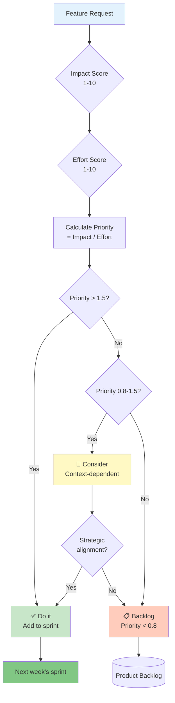
```mermaid
flowchart TD
    Start[Feature Request] --> Impact{Impact Score<br/>1-10}
    Impact --> Effort{Effort Score<br/>1-10}
    Effort --> Calc[Calculate Priority<br/>= Impact / Effort]
    
    Calc --> High{Priority > 1.5?}
    High -->|Yes| DoIt[✅ Do it<br/>Add to sprint]
    
    High -->|No| Medium{Priority 0.8-1.5?}
    Medium -->|Yes| Consider[🤔 Consider<br/>Context-dependent]
    
    Medium -->|No| Low[📋 Backlog<br/>Priority < 0.8]
    
    Consider --> Context{Strategic<br/>alignment?}
    Context -->|Yes| DoIt
    Context -->|No| Low
    
    DoIt --> Sprint[Next week's sprint]
    Low --> Backlog[(Product Backlog)]
    
    style Start fill:#e3f2fd
    style DoIt fill:#c8e6c9
    style Consider fill:#fff9c4
    style Low fill:#ffccbc
    style Sprint fill:#81c784
```

**Priority Examples:**

| Feature Request | Impact | Effort | Priority | Decision |
|----------------|--------|--------|----------|----------|
| Meal plan PDF export | 8 | 3 | 2.67 | ✅ Do it |
| Recipe photos | 6 | 7 | 0.86 | 🤔 Consider |
| Video tutorials | 5 | 9 | 0.56 | 📋 Backlog |
| Shopping list API | 7 | 4 | 1.75 | ✅ Do it |

1. **Impact Score** (1-10): How much will this improve PMF metrics?
2. **Effort Score** (1-10): How much development time required?
3. **Priority = Impact / Effort**
4. **Decision:** 
   - Priority >1.5: Do it
   - Priority 0.8-1.5: Consider (context-dependent)
   - Priority <0.8: Backlog

### 8.3 Success Criteria Gate (Go/No-Go)

**End of Week 8:**
- ✅ 20+ clients onboarded
- ✅ 70%+ adherence rate
- ✅ NPS >40
- ✅ 80%+ weekly retention (Week 2)
- ✅ Zero critical bugs
- ✅ James satisfaction score >4/5

**If criteria met:** Proceed to public launch  
**If not:** Iterate for 2 more weeks, reassess

---

## 9. Deployment & CI/CD

### 9.1 Vercel Deployment

```bash
# Install Vercel CLI
npm i -g vercel

# Link project
vercel link

# Deploy to preview
vercel

# Deploy to production
vercel --prod
```

### 9.2 GitHub Actions CI/CD

```yaml
# .github/workflows/deploy.yml
name: Deploy to Production

on:
  push:
    branches: [main]

jobs:
  deploy:
    runs-on: ubuntu-latest
    steps:
      - uses: actions/checkout@v3
      
      - name: Setup Node.js
        uses: actions/setup-node@v3
        with:
          node-version: '20'
      
      - name: Install dependencies
        run: npm ci
      
      - name: Run tests
        run: npm test
      
      - name: Build
        run: npm run build
      
      - name: Deploy to Vercel
        uses: amondnet/vercel-action@v20
        with:
          vercel-token: ${{ secrets.VERCEL_TOKEN }}
          vercel-org-id: ${{ secrets.VERCEL_ORG_ID }}
          vercel-project-id: ${{ secrets.VERCEL_PROJECT_ID }}
          vercel-args: '--prod'
```

### 9.3 Supabase Migrations

```bash
# Run migrations locally
supabase db reset

# Push migrations to production
supabase db push

# Generate TypeScript types
supabase gen types typescript --project-id your-project-id > lib/supabase/types.ts
```

---

## 10. Cost Estimation

### 10.1 Monthly Costs (30 Active Clients)

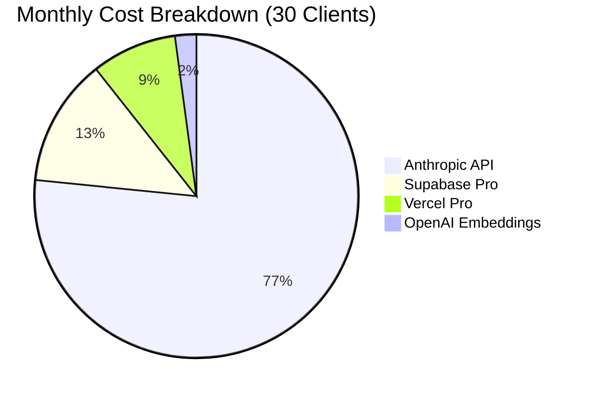
```mermaid
pie title Monthly Cost Breakdown (30 Clients)
    "Anthropic API" : 180
    "Supabase Pro" : 30
    "Vercel Pro" : 20
    "OpenAI Embeddings" : 5
```

**Detailed Breakdown:**

**Anthropic API (Claude):**
- Avg 50 messages/client/week = 6,000 messages/month
- Avg 3,000 tokens/conversation (input+output)
- 18M tokens/month
- Cost: ~$180/month (at $10/1M tokens for Claude Sonnet 4)

**Supabase:**
- Pro plan: $25/month
- Additional storage: ~$5/month

**Vercel:**
- Pro plan: $20/month

**OpenAI (Embeddings):**
- 1,000 embeddings/month
- Cost: ~$5/month

**Total:** ~$235/month for 30 clients = $7.83/client/month

**Revenue Target:** £29/client/month = ~£870/month = ~$1,100/month  
**Gross Margin:** ~79%

### 10.2 Scaling Considerations

```mermaid
graph LR
    subgraph Scale["Scaling Economics"]
        C30["30 Clients<br/>$235/month<br/>$7.83/client"]
        C50["50 Clients<br/>$350/month<br/>$7.00/client"]
        C100["100 Clients<br/>$725/month<br/>$7.25/client"]
        C200["200 Clients<br/>$1,400/month<br/>$7.00/client"]
    end
    
    C30 -->|Scale up| C50
    C50 -->|Scale up| C100
    C100 -->|Scale up| C200
    
    style C30 fill:#ffccbc
    style C50 fill:#fff9c4
    style C100 fill:#c8e6c9
    style C200 fill:#81c784
```

**At 100 Clients:**
- Anthropic: ~$600/month
- Supabase: ~$75/month
- Vercel: ~$50/month
- Total: ~$725/month = $7.25/client/month
- Gross Margin: ~75%

---

## 11. Next Steps

### Immediate Actions (This Week)

1. **James:** Review PRD and Implementation Guide
2. **Dev Team:** Set up development environment
3. **Product:** Create Figma designs for Week 1 UI
4. **All:** Schedule Week 1 kickoff meeting

### Kickoff Meeting Agenda

1. Walk through Week 1 scope
2. Assign tasks
3. Set up communication channels (Slack, GitHub)
4. Review success criteria
5. Schedule Week 1 demo (Friday)

### Communication Cadence

- **Daily:** Quick standups (15 min, async okay)
- **Friday:** Weekly demo + PMF review (60 min)
- **Ad-hoc:** Slack for blockers, questions

---

## Document Control

**Version:** 1.0  
**Last Updated:** 2025-10-31  
**Next Review:** After Week 2 Demo

**Approval:**
- [ ] James Kerby (Product Owner)
- [ ] Lead Developer
- [ ] Project Manager

---

**END OF IMPLEMENTATION GUIDE**

This guide provides a comprehensive, incremental approach to building the Viridian Nutrition App using Claude Agent SDK, optimized for maximum value delivery with minimum effort. Each week builds on the previous, with clear success criteria and PMF validation throughout.
