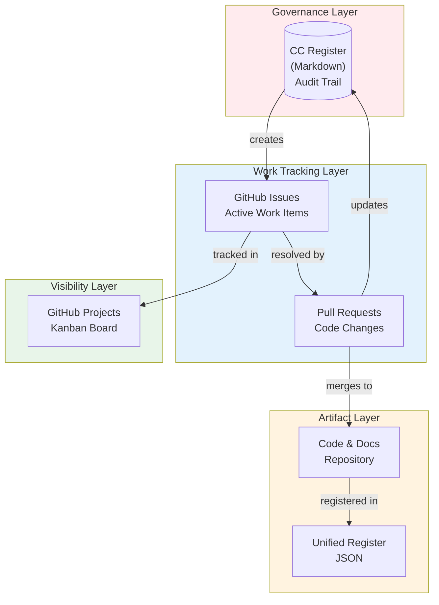
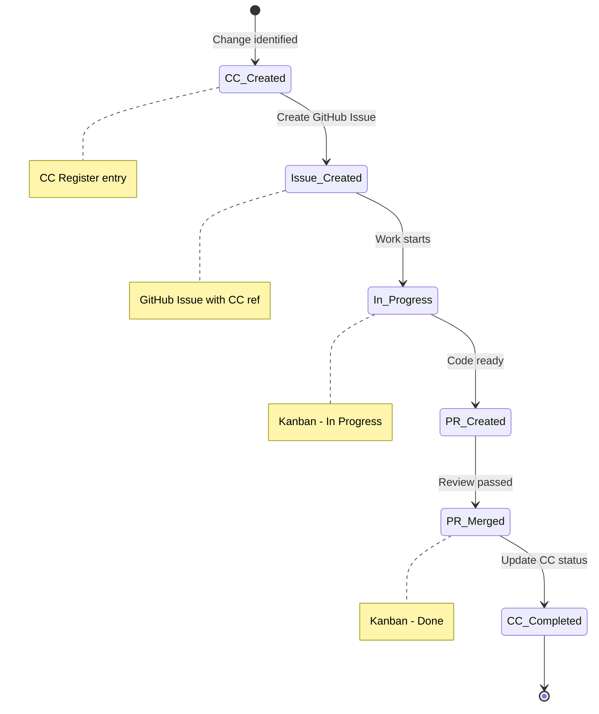

# VHF Change Control & GitHub Workflow
## CC Register ↔ GitHub Issues ↔ Kanban Integration

---

| Document Control | |
|-----------------|---|
| **Document Number** | VHF-STD-002 |
| **Version** | 1.4 |
| **Status** | Active |
| **Date** | 26 January 2026 |

---

## 1. PURPOSE

This document defines how Change Control (CC) items integrate with GitHub Issues and Projects to provide:
- **Governance** - CC Register as audit trail
- **Visibility** - GitHub Projects Kanban for team
- **Traceability** - Links between CC, Issues, and PRs
- **No duplication** - Single source of truth per concern
- **Value-first** - Changes must demonstrate benefit before work begins

### 1.1 Master Change Control Reference

> **IMPORTANT:** This workflow document complements the **Master Change Control Register**:
>
> | Document | Path | Purpose |
> |----------|------|---------|
> | **VHF-NI-App-Mk3-Master-Change-Control-v1.0.md** | `PBS/STD-DOCS/` | Detailed CC register, version tracking, approval status |
> | This document | `PBS/STD-DOCS/VHF_CC_GITHUB_WORKFLOW.md` | GitHub integration workflow |
>
> The Master Change Control Register contains:
> - Complete document version register (Section 3)
> - Major changes summary with migration notes (Section 4)
> - Design token verification matrix (Section 5)
> - Brand asset mapping (Section 6)
> - Approval workflows and sign-off records (Section 8)

### 1.2 Quick Start - Ready to Use

- **Create issues** with `[CC-###]` prefix (e.g., `[CC-001] Add dashboard component`)
- **Apply labels:** `cc-item`, `epic:*`, `wbs:*`, `priority:*`
- **Track on Kanban:** Project #7 "@ajrmooreuk's VHF App"
- **Follow value-first gate:** VALUE → DONE → WORKS (Section 2)

---

## 2. DEFINITION OF READY

Before creating a CC item or GitHub Issue, the proposer must answer three questions:

```
┌─────────────────────────────────────────────────────────┐
│  CHANGE REQUEST GATE                                    │
├─────────────────────────────────────────────────────────┤
│  1. VALUE: What benefit does this deliver?              │
│  2. DONE:  How do we know it's complete?                │
│  3. WORKS: How do we verify it works?                   │
├─────────────────────────────────────────────────────────┤
│  Can't answer all three? → Don't create the request     │
└─────────────────────────────────────────────────────────┘
```

### Value Categories (link to VE)

| Category | Maps To |
|----------|---------|
| Error Reduction | Fewer mistakes, rework, corrections |
| Labour Efficiency | Less manual effort, faster processing |
| Capacity Enablement | Handle more volume without more staff |
| Faster Onboarding | New staff productive sooner |
| Customer Retention | Better service, fewer complaints |
| Margin Protection | Prevent revenue leakage |
| Compliance | Meet regulatory/policy requirements |
| Technical Debt | Reduce future maintenance burden |

### CC Entry Template

```markdown
| CC-### | Doc | Section | Type | Current | Proposed | Priority | Status |
```

**Required thinking (not in table, but documented in Section 3):**
- **Value:** [Category] - [One sentence on benefit]
- **Done:** [Acceptance criteria - what must be true]
- **Works:** [How to verify - test/review/demo]

### GitHub Issue Template

```markdown
## Value Hypothesis
**Category:** [Error Reduction | Labour Efficiency | ...]
**Benefit:** [What problem this solves]

## Acceptance Criteria
- [ ] [Verifiable criterion 1]
- [ ] [Verifiable criterion 2]

## Verification
- [ ] [How to test/verify this works]

---
CC Reference: CC-###
```

### Quick Decision Test

> "If I can't explain the value, define done, or describe how to test it - I shouldn't be requesting it."

---

## 3. WORKFLOW OVERVIEW



---

## 4. SEPARATION OF CONCERNS

| Layer | Tool | Purpose | Owner |
|-------|------|---------|-------|
| **Governance** | CC Register (MD) | Audit trail, approvals, history | PMA |
| **Work Tracking** | GitHub Issues | Active tasks, assignments, progress | Dev Team |
| **Visibility** | GitHub Projects | Kanban view, sprint planning | All |
| **Artifacts** | Repository + Register | Code, docs, JSON registry | OAA |

---

## 5. ITEM LIFECYCLE



---

## 6. NAMING CONVENTIONS

### GitHub Issues
```
[CC-###] Brief description
```
Example: `[CC-001] Add responsive navigation component`

### Pull Requests
```
CC-###: Description of change
```
Example: `CC-001: Add responsive navigation component`

### Branch Names
```
feature/cc-###-brief-description
```
Example: `feature/cc-001-responsive-nav`

---

## 7. LINKING RULES

### CC Register → GitHub Issue
In CC Register, add Issue link:
```markdown
| CC-001 | PRD | ... | PARTIAL | [#15](link) |
```

### GitHub Issue → CC Register
In Issue description:
```markdown
**CC Reference:** CC-001
**CC Register:** [VHF_CHANGE_CONTROL.md](link)
```

### PR → CC + Issue
In PR description:
```markdown
Closes #15
CC Reference: CC-001
```

---

## 8. WORKFLOW BY PHASE

### Phase 1: Documentation (Current)
- CC Register is primary tracking
- GitHub Issues for active items only
- PRs link to CC numbers

### Phase 2: Build
- GitHub Issues created from WBS
- GitHub Projects Kanban active
- CC Register updated on completion

### Phase 3: Maintenance
- New issues reference CC or create new CC
- Kanban for sprint planning
- CC Register for audit/compliance

---

## 9. GITHUB PROJECTS SETUP

### Recommended Columns

| Column | WIP Limit | Contains |
|--------|-----------|----------|
| **Backlog** | - | Future work, unprioritised |
| **Ready** | 10 | Refined, ready to start |
| **In Progress** | 5 | Active development |
| **Review** | 5 | PR open, awaiting review |
| **Done** | - | Merged, CC updated |

### Labels

| Label | Colour | Usage |
|-------|--------|-------|
| `cc-item` | Purple | Linked to CC Register |
| `epic:dashboard` | Green | Dashboard feature items |
| `epic:data-entry` | Blue | Data entry feature items |
| `epic:reporting` | Pink | Reporting feature items |
| `epic:ai-agents` | Orange | AI agent feature items |
| `wbs:phase-1` | Grey | WBS Phase 1 |
| `wbs:phase-2` | Grey | WBS Phase 2 |
| `priority:high` | Red | High priority |
| `priority:medium` | Yellow | Medium priority |
| `priority:low` | White | Low priority |

---

## 10. BATCH CHANGE PLANNING

### Overview

Plan changes before execution. CC numbers link spec → branch → PR → commit.

```
┌─────────────────────────────────────────────────────────┐
│  PLAN → BATCH → EXECUTE → COMMIT                        │
├─────────────────────────────────────────────────────────┤
│  1. SPEC: List changes with CC-### numbers              │
│  2. BATCH: Group related changes into feature branch    │
│  3. EXECUTE: Make changes per spec                      │
│  4. COMMIT: Reference CC-### in commit message          │
└─────────────────────────────────────────────────────────┘
```

### Step 1: Spec Planned Changes

Before starting work, document what will change:

```markdown
## Change Batch: [Feature Name]
Branch: feature/cc-001-feature-name
Date: DD-MMM-YYYY

| CC-### | File | Change | Status |
|--------|------|--------|--------|
| CC-001 | src/component.tsx | Add new prop | Pending |
| CC-002 | docs/README.md | Update API docs | Pending |
| CC-003 | tests/component.test.ts | Add unit tests | Pending |
```

### Step 2: Create Feature Branch

```bash
git checkout main && git pull origin main
git checkout -b feature/cc-001-feature-name
```

Branch name uses **first CC number** from batch.

### Step 3: Execute Changes

Work through spec, updating status as you go:

| CC-### | File | Change | Status |
|--------|------|--------|--------|
| CC-001 | src/component.tsx | Add new prop | **Done** |
| CC-002 | docs/README.md | Update API docs | **Done** |
| CC-003 | tests/component.test.ts | Add unit tests | In Progress |

### Step 4: Commit with CC References

```bash
git add .
git commit -m "CC-001,CC-002,CC-003: Add feature with docs and tests

- CC-001: Add new prop to component
- CC-002: Update API documentation
- CC-003: Add unit tests for new functionality

Co-Authored-By: Claude Opus 4.5 <noreply@anthropic.com>"
```

### Step 5: Create PR

PR title includes primary CC number:

```bash
gh pr create \
  --title "CC-001: Add feature with docs and tests" \
  --body "## Changes
- CC-001: Add new prop to component
- CC-002: Update API documentation
- CC-003: Add unit tests

## CC References
Closes CC-001, CC-002, CC-003"
```

### Traceability Chain

```
CC Register     →  Feature Branch      →  Commits           →  PR
CC-001,002,003     feature/cc-001-...     CC-001,002,003:...    #PR links to CC
```

---

## 11. COMMIT POLICY

### When to Use Feature Branch + PR
- **Code changes** - Any source code modifications
- **New features** - Adding functionality
- **Multi-file changes** - Changes spanning multiple documents
- **Structural changes** - Reorganising folders, renaming files
- **CC-tracked items** - All items with CC reference numbers

### When Direct to Main is Acceptable
- **Minor doc updates** - Typo fixes, formatting corrections
- **Version bumps** - Updating version numbers after PR merge
- **Quick Start additions** - Adding operational notes post-setup
- **Single-file cosmetic changes** - Non-functional updates

**Rule:** When in doubt, use a PR. Traceability > convenience.

---

## 12. AUTOMATION (FUTURE)

### Git Hooks
```bash
# On commit: validate CC reference in message
# On PR merge: update CC register status
# On issue close: flag for CC update
```

### GitHub Actions
```yaml
# Auto-label issues with CC references
# Sync CC status to Project board
# Generate CC summary report
```

---

## 13. QUICK REFERENCE

### Create Issue from CC Item
```bash
gh issue create \
  --title "[CC-001] Add responsive navigation" \
  --body "CC Reference: CC-001

## Task
Implement responsive navigation component.

## Acceptance Criteria
- [ ] Works on mobile
- [ ] Works on desktop
- [ ] CC-001 marked COMPLETED" \
  --label "cc-item,priority:medium"
```

### Update CC After PR Merge
1. PR merged → Issue auto-closes
2. Update CC Register: status → **COMPLETED**
3. Add PR/Issue link to CC entry

---

## 14. SUMMARY

```
┌─────────────────────────────────────────────────────────┐
│  CC Register        GitHub Issues      GitHub Projects  │
│  ════════════       ═════════════      ═══════════════  │
│  Audit/Governance   Work Tracking      Visibility       │
│  Historical         Active             Real-time        │
│  Markdown           Issue #            Kanban Board     │
│  CC-###             [CC-###] Title     Card             │
└─────────────────────────────────────────────────────────┘
```

**Rule:** One source of truth per concern. No duplication.

---

**--- END OF WORKFLOW DOCUMENT ---**

*Version 1.4 | Active*
*26 January 2026*
