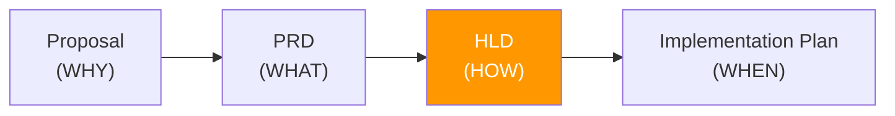
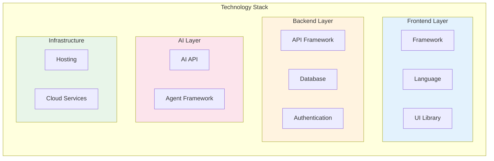
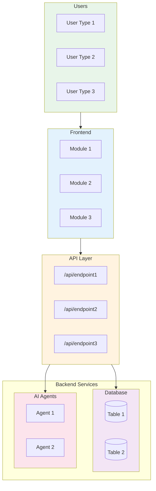
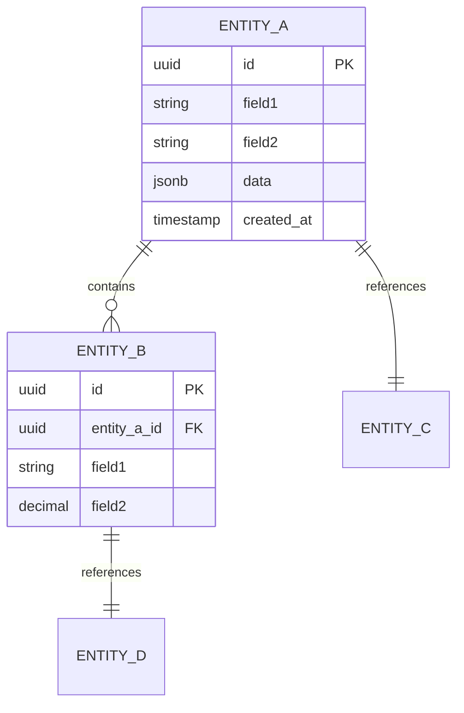
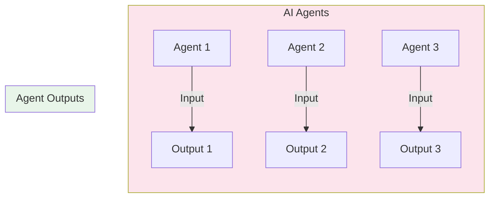
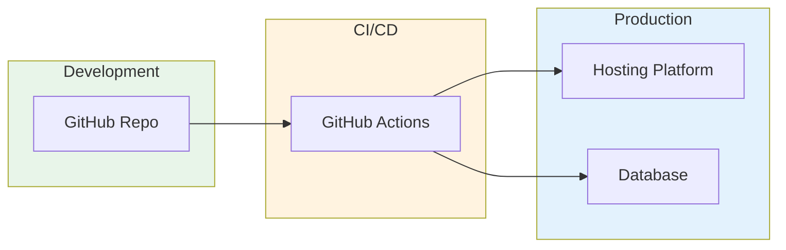

# [PROJECT NAME] HIGH-LEVEL DESIGN (HLD)
## Technical Architecture & Design Decisions

---

| Document Control | |
|-----------------|---|
| **Document Number** | [PROJECT]-HLD-001 |
| **Version** | 0.1 |
| **Status** | Draft |
| **Date** | [DD Month YYYY] |
| **Related PRD** | [PROJECT]_PRD_v[X.X].md |
| **Related Proposal** | [PROJECT]_PROPOSAL_v[X.X].md |
| **Related Impl Plan** | [PROJECT]_IMPLEMENTATION_PLAN.md |

---

## Document Purpose

This High-Level Design (HLD) document describes **HOW** the [PROJECT NAME] system will be built. It sits between the PRD (WHAT we're building) and the Implementation Plan (WHEN we build it) in the document hierarchy.



---

## Table of Contents

1. [System Overview](#1-system-overview)
2. [Architecture Principles](#2-architecture-principles)
3. [Technology Stack](#3-technology-stack)
4. [System Architecture](#4-system-architecture)
5. [Data Architecture](#5-data-architecture)
6. [AI Agent Architecture](#6-ai-agent-architecture)
7. [Security Architecture](#7-security-architecture)
8. [Integration Architecture](#8-integration-architecture)
9. [Infrastructure & Deployment](#9-infrastructure--deployment)
10. [Design Decisions Log](#10-design-decisions-log)

---

## 1. System Overview

### 1.1 System Context

[PROJECT NAME] is a [brief description of system purpose]. The system provides:

- **[Capability 1]**: [Description]
- **[Capability 2]**: [Description]
- **[Capability 3]**: [Description]
- **[Capability 4]**: [Description]

### 1.2 Key Characteristics

| Characteristic | Design Approach |
|----------------|-----------------|
| **Users** | [Expected user count and types] |
| **Data Volume** | [Expected data volumes] |
| **Availability** | [Availability requirements] |
| **Performance** | [Performance targets] |
| **Security** | [Security approach] |

---

## 2. Architecture Principles

| Principle | Description | Rationale |
|-----------|-------------|-----------|
| **[Principle 1]** | [Description] | [Why this matters] |
| **[Principle 2]** | [Description] | [Why this matters] |
| **[Principle 3]** | [Description] | [Why this matters] |
| **[Principle 4]** | [Description] | [Why this matters] |
| **[Principle 5]** | [Description] | [Why this matters] |

---

## 3. Technology Stack

### 3.1 Core Stack (MVP)



### 3.2 Technology Decisions

| Layer | Technology | Version | Decision Rationale |
|-------|------------|---------|-------------------|
| **Frontend Framework** | [Technology] | [Version] | [Rationale] |
| **UI Components** | [Technology] | [Version] | [Rationale] |
| **Styling** | [Technology] | [Version] | [Rationale] |
| **Database** | [Technology] | [Version] | [Rationale] |
| **Authentication** | [Technology] | [Version] | [Rationale] |
| **AI/Agents** | [Technology] | [Version] | [Rationale] |
| **Hosting** | [Technology] | [Version] | [Rationale] |
| **Design** | [Technology] | [Version] | [Rationale] |

---

## 4. System Architecture

### 4.1 Architecture Overview



### 4.2 Component Responsibilities

| Component | Responsibility | Key Interfaces |
|-----------|---------------|----------------|
| **[Component 1]** | [Description] | [APIs/Interfaces] |
| **[Component 2]** | [Description] | [APIs/Interfaces] |
| **[Component 3]** | [Description] | [APIs/Interfaces] |

---

## 5. Data Architecture

### 5.1 Data Model Overview

*Reference: PRD Section [X] - Data Model*



### 5.2 Core Entities

| Entity | Purpose | Key Fields |
|--------|---------|------------|
| **[Entity 1]** | [Purpose] | [Key fields] |
| **[Entity 2]** | [Purpose] | [Key fields] |
| **[Entity 3]** | [Purpose] | [Key fields] |

### 5.3 Data Access Patterns

| Pattern | Implementation | Security |
|---------|---------------|----------|
| **[Pattern 1]** | [Implementation] | [Security approach] |
| **[Pattern 2]** | [Implementation] | [Security approach] |

---

## 6. AI Agent Architecture

### 6.1 Agent Overview



### 6.2 Agent Specifications

| Agent | Input | Output | Trigger |
|-------|-------|--------|---------|
| **[Agent 1]** | [Input data] | [Output data] | [When triggered] |
| **[Agent 2]** | [Input data] | [Output data] | [When triggered] |
| **[Agent 3]** | [Input data] | [Output data] | [When triggered] |

### 6.3 Agent Integration

```
Frontend --> API Route --> AI SDK --> Agent Response --> Frontend Display
```

- **Synchronous**: [Which operations]
- **Human-in-loop**: [How human oversight works]

---

## 7. Security Architecture

### 7.1 Security Layers

| Layer | Implementation | Standard |
|-------|---------------|----------|
| **Authentication** | [Implementation] | [Standard] |
| **Authorization** | [Implementation] | [Standard] |
| **Data Protection** | [Implementation] | [Standard] |
| **Audit** | [Implementation] | [Standard] |
| **AI Security** | [Implementation] | [Standard] |

### 7.2 Role-Based Access

| Role | [Resource 1] | [Resource 2] | [Resource 3] | Admin |
|------|--------------|--------------|--------------|-------|
| **[Role 1]** | [Access] | [Access] | [Access] | - |
| **[Role 2]** | [Access] | [Access] | [Access] | - |
| **[Role 3]** | [Access] | [Access] | [Access] | Full |

---

## 8. Integration Architecture

### 8.1 Current Integrations (MVP)

| System | Type | Purpose |
|--------|------|---------|
| **[System 1]** | [Type] | [Purpose] |
| **[System 2]** | [Type] | [Purpose] |
| **[System 3]** | [Type] | [Purpose] |

### 8.2 Future Integrations

| System | Type | Timeline |
|--------|------|----------|
| **[System 1]** | [Type] | [Timeline] |
| **[System 2]** | [Type] | [Timeline] |

---

## 9. Infrastructure & Deployment

### 9.1 Deployment Architecture



### 9.2 Environment Configuration

| Environment | Purpose | URL Pattern |
|-------------|---------|-------------|
| **Development** | Local dev | localhost:3000 |
| **Staging** | UAT, testing | staging.[domain] |
| **Production** | Live system | [domain] |

### 9.3 Estimated Costs (MVP)

| Service | Tier | Est. Monthly |
|---------|------|--------------|
| [Service 1] | [Tier] | $[Amount] |
| [Service 2] | [Tier] | $[Amount] |
| [Service 3] | [Tier] | $[Amount] |
| **Total** | | **$[Total]** |

---

## 10. Design Decisions Log

| ID | Decision | Rationale | Date | Status |
|----|----------|-----------|------|--------|
| DD-001 | [Decision] | [Rationale] | [Date] | [Status] |
| DD-002 | [Decision] | [Rationale] | [Date] | [Status] |
| DD-003 | [Decision] | [Rationale] | [Date] | [Status] |

---

## Appendix A: Glossary

| Term | Definition |
|------|------------|
| **[Term 1]** | [Definition] |
| **[Term 2]** | [Definition] |
| **[Term 3]** | [Definition] |

---

## Appendix B: References

| Document | Purpose |
|----------|---------|
| [Document 1] | [Purpose] |
| [Document 2] | [Purpose] |
| [Document 3] | [Purpose] |

---

## Approval

| Role | Name | Date | Signature |
|------|------|------|-----------|
| Product Owner | | | |
| Technical Lead | | | |

---

**--- END OF HIGH-LEVEL DESIGN TEMPLATE ---**

*Template Version 1.0*
*Adapted from EOMS HLD v1.1*
