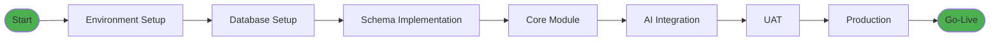
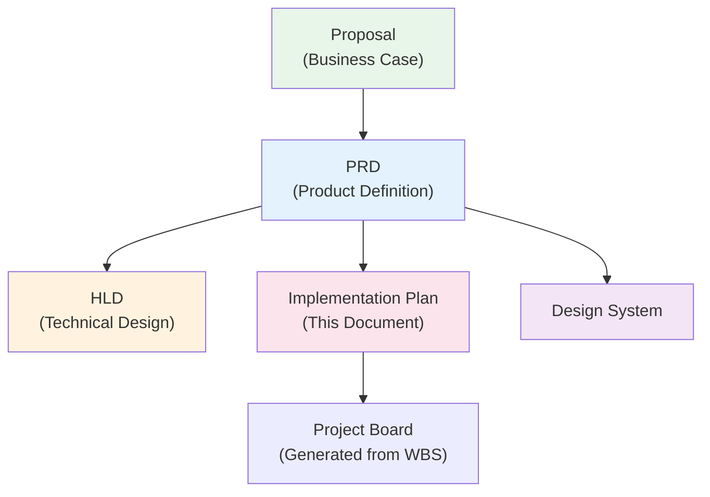

# [PROJECT NAME] IMPLEMENTATION PLAN
## Work Breakdown Structure, Schedule & References

---

| Document Control | |
|-----------------|---|
| **Document Number** | [PROJECT]-IMP-001 |
| **Version** | 0.1 |
| **Status** | Draft |
| **Date** | [DD Month YYYY] |
| **Related PRD** | [PROJECT]_PRD_v[X.X].md |
| **Related HLD** | [PROJECT]_HLD.md |
| **Related Proposal** | [PROJECT]_PROPOSAL_v[X.X].md |

---

## 1. WORK BREAKDOWN STRUCTURE (WBS)

### WBS Overview Diagram

```mermaid
flowchart TB
    WBS["WBS 0.0<br/>[PROJECT] Implementation"]

    WBS --> W1["WBS 1.0<br/>Design & Setup"]
    WBS --> W2["WBS 2.0<br/>Data & Infrastructure"]
    WBS --> W3["WBS 3.0<br/>Core Development"]
    WBS --> W4["WBS 4.0<br/>AI Integration"]
    WBS --> W5["WBS 5.0<br/>Testing & UAT"]
    WBS --> W6["WBS 6.0<br/>Deployment"]

    W1 --> W11[Design System]
    W1 --> W12[Component Library]
    W1 --> W13[Environment Config]

    W2 --> W21[Database Schema]
    W2 --> W22[Data Migration]
    W2 --> W23[API Setup]

    W3 --> W31[Module 1]
    W3 --> W32[Module 2]
    W3 --> W33[Module 3]

    W4 --> W41[Agent 1]
    W4 --> W42[Agent 2]

    W5 --> W51[Unit Tests]
    W5 --> W52[Integration Tests]
    W5 --> W53[UAT]

    W6 --> W61[Staging Deploy]
    W6 --> W62[Production Deploy]
    W6 --> W63[Handover]

    style WBS fill:#1a237e,color:#fff
    style W1 fill:#4caf50,color:#fff
    style W2 fill:#2196f3,color:#fff
    style W3 fill:#ff9800,color:#fff
    style W4 fill:#9c27b0,color:#fff
    style W5 fill:#00bcd4,color:#fff
    style W6 fill:#e91e63,color:#fff
```



### WBS Detailed Breakdown

| WBS ID | Task | PBS Reference | Epic Reference | Dependencies |
|--------|------|---------------|----------------|--------------|
| **1.0** | **Design & Setup** | PBS 6.0 | - | - |
| 1.1 | Design System Setup | PBS 6.1 | - | - |
| 1.2 | Component Library Design | PBS 6.2 | - | 1.1 |
| 1.3 | Screen Mockups | PBS 6.3 | - | 1.1, 1.2 |
| 1.4 | Design Token Setup | PBS 3.2 | - | 1.1 |
| 1.5 | Environment Configuration | PBS 1.1 | - | - |
| **2.0** | **Data & Infrastructure** | PBS 1.0, 2.0 | - | 1.5 |
| 2.1 | Database Project Setup | PBS 1.2 | - | 1.5 |
| 2.2 | Database Schema Implementation | PBS 2.1-2.X | - | 2.1 |
| 2.3 | Authentication Setup | PBS 1.3 | - | 2.1 |
| 2.4 | Data Import | PBS 5.1 | [Epic] | 2.2 |
| **3.0** | **Core Development** | PBS 3.0 | [Epics] | 2.0 |
| 3.1 | [Module 1] | PBS 3.X | Epic [X] | 2.3 |
| 3.2 | [Module 2] | PBS 3.X | Epic [X] | 2.3, 3.1 |
| 3.3 | [Module 3] | PBS 3.X | Epic [X] | 2.4 |
| **4.0** | **AI Integration** | PBS 4.0 | Epic [X] | 3.0 |
| 4.1 | AI API Integration | PBS 1.4 | - | 3.X |
| 4.2 | [Agent 1] | PBS 4.1 | Epic [X] | 4.1 |
| 4.3 | [Agent 2] | PBS 4.2 | Epic [X] | 4.1 |
| **5.0** | **Testing & UAT** | PBS 8.0 | - | 4.0 |
| 5.1 | Unit Tests | PBS 8.1 | - | Ongoing |
| 5.2 | Integration Tests | PBS 8.2 | - | 4.0 |
| 5.3 | User Acceptance Testing | PBS 8.3 | - | 5.2 |
| 5.4 | PMF Validation | - | - | 5.3 |
| **6.0** | **Deployment** | - | - | 5.0 |
| 6.1 | Staging Deployment | - | - | 5.2 |
| 6.2 | Production Deployment | - | - | 5.3 |
| 6.3 | Documentation & Handover | PBS 7.0 | - | 6.2 |

---

## 2. SCHEDULE & MILESTONES

### Phase Overview

| Phase | Description | Duration |
|-------|-------------|----------|
| **Phase 1** | Design & Setup | [Duration] |
| **Phase 2** | Core Development | [Duration] |
| **Phase 3** | AI Integration | [Duration] |
| **Phase 4** | Testing & UAT | [Duration] |
| **Phase 5** | Deployment & Stabilisation | [Duration] |

### Milestone Gates

| Gate | Milestone | Deliverables | Approver |
|------|-----------|--------------|----------|
| **G0** | Project Kickoff | PRD approved, team assigned | [Role] |
| **G1** | Design Complete | Designs approved, tokens ready | [Role] |
| **G2** | MVP Feature Complete | Core modules functional | [Role] |
| **G3** | AI Integration Complete | Agents operational | [Role] |
| **G4** | UAT Complete | > 90% task success rate | [Role] |
| **G5** | Go-Live | Production deployment | [Role] |

### Project Board Structure

| Column | Description | WIP Limit |
|--------|-------------|-----------|
| **Backlog** | Prioritised work items | Unlimited |
| **Ready** | Refined, ready to start | 10 |
| **In Progress** | Active development | 5 |
| **Review** | Code review, QA | 5 |
| **Done** | Completed, verified | Unlimited |

---

## 3. RESOURCE ASSIGNMENTS

### Team Roles

| Role | Responsibilities | Allocation |
|------|------------------|------------|
| **[Role 1]** | [Responsibilities] | [Allocation] |
| **[Role 2]** | [Responsibilities] | [Allocation] |
| **[Role 3]** | [Responsibilities] | [Allocation] |

### Skills & Tools

| Area | Tools/Skills |
|------|-------------|
| **Design** | [Tools] |
| **Frontend** | [Technologies] |
| **Backend** | [Technologies] |
| **AI** | [Technologies] |
| **DevOps** | [Technologies] |

---

## 4. DEPENDENCIES & CRITICAL PATH

### Critical Path



### External Dependencies

| Dependency | Owner | Status |
|------------|-------|--------|
| [Dependency 1] | [Owner] | [Status] |
| [Dependency 2] | [Owner] | [Status] |
| [Dependency 3] | [Owner] | [Status] |
| [Dependency 4] | [Owner] | [Status] |

---

## 5. RISK REGISTER (Implementation-Specific)

| Risk | Likelihood | Impact | Mitigation |
|------|------------|--------|------------|
| [Risk 1] | [L/M/H] | [L/M/H] | [Mitigation] |
| [Risk 2] | [L/M/H] | [L/M/H] | [Mitigation] |
| [Risk 3] | [L/M/H] | [L/M/H] | [Mitigation] |
| [Risk 4] | [L/M/H] | [L/M/H] | [Mitigation] |

---

## 6. REFERENCES & EXTERNAL DOCUMENTS

### Document Hierarchy



### External References

| Document | Location | Purpose |
|----------|----------|---------|
| [Document 1] | [Location] | [Purpose] |
| [Document 2] | [Location] | [Purpose] |
| [Document 3] | [Location] | [Purpose] |

### Standards & Compliance

| Standard | Application |
|----------|-------------|
| **[Standard 1]** | [Application] |
| **[Standard 2]** | [Application] |
| **[Standard 3]** | [Application] |

---

## 7. APPROVAL

| Role | Name | Date | Signature |
|------|------|------|-----------|
| Product Owner | | | |
| Technical Lead | | | |
| Project Sponsor | | | |

---

## APPENDIX A: DEVELOPMENT SETUP GUIDE

### A.1 Prerequisites

```bash
# Ensure you have installed:
- [Prerequisite 1]
- [Prerequisite 2]
- [Prerequisite 3]
- [Prerequisite 4]
```

### A.2 Create Project

```bash
# Create new project
[Command to create project]

# Navigate to project
cd [project-name]
```

### A.3 Install Dependencies

```bash
# Install core dependencies
[Package install commands]

# Install UI components
[UI component commands]
```

### A.4 Configure Styling/Branding

```typescript
// Configuration example
// [Project config file]

const config = {
  // Brand colours
  colors: {
    primary: {
      DEFAULT: "[Primary colour]",
      light: "[Light variant]",
      dark: "[Dark variant]",
    },
    secondary: {
      DEFAULT: "[Secondary colour]",
    },
    // ... additional colours
  },
  // Typography
  fontFamily: {
    heading: ["[Heading font]", "serif"],
    sans: ["[Body font]", "sans-serif"],
    mono: ["[Mono font]", "monospace"],
  },
}
```

### A.5 Set Up Database

```sql
-- Create database tables

-- Table 1
CREATE TABLE [table_1] (
  id UUID PRIMARY KEY DEFAULT gen_random_uuid(),
  [field_1] VARCHAR(50) NOT NULL,
  [field_2] TEXT,
  data JSONB DEFAULT '{}',
  created_at TIMESTAMPTZ DEFAULT NOW(),
  updated_at TIMESTAMPTZ DEFAULT NOW()
);

-- Table 2
CREATE TABLE [table_2] (
  id UUID PRIMARY KEY DEFAULT gen_random_uuid(),
  [table_1]_id UUID REFERENCES [table_1](id),
  [field_1] VARCHAR(255) NOT NULL,
  [field_2] DECIMAL(10, 2),
  created_at TIMESTAMPTZ DEFAULT NOW()
);

-- Enable Row Level Security
ALTER TABLE [table_1] ENABLE ROW LEVEL SECURITY;
ALTER TABLE [table_2] ENABLE ROW LEVEL SECURITY;
```

### A.6 Project Structure

```
/[project-name]
+-- app/
|   +-- layout.tsx          # Root layout
|   +-- page.tsx            # Home/Dashboard
|   +-- [module_1]/
|   |   +-- page.tsx        # Module 1 list
|   |   +-- new/
|   |   |   +-- page.tsx    # Create new
|   |   +-- [id]/
|   |       +-- page.tsx    # Detail view
|   +-- api/
|       +-- [endpoint_1]/
|       |   +-- route.ts    # API route
|       +-- ai/
|           +-- [agent]/
|               +-- route.ts # AI agent API
+-- components/
|   +-- ui/                 # UI components
|   +-- layout/             # Layout components
|   +-- [module]/           # Module components
+-- lib/
|   +-- [database]/
|   |   +-- client.ts       # Database client
|   +-- [ai]/
|   |   +-- client.ts       # AI client
|   +-- utils/
|       +-- index.ts        # Utilities
+-- types/
|   +-- index.ts            # TypeScript types
```

### A.7 Deploy

```bash
# Install CLI
[CLI install command]

# Login
[Login command]

# Deploy
[Deploy command]

# Set environment variables
[Env var commands]

# Deploy to production
[Production deploy command]
```

---

## APPENDIX B: WBS DETAILED BREAKDOWN

```
WBS 0.0 [PROJECT] PROJECT
|
+-- WBS 1.0 PROJECT INITIATION
|   +-- WBS 1.1 Stakeholder Alignment
|   |   +-- WBS 1.1.1 [Stakeholder 1] Briefing
|   |   +-- WBS 1.1.2 [Stakeholder 2] Requirements
|   |   +-- WBS 1.1.3 [Stakeholder 3] Requirements
|   +-- WBS 1.2 Environment Setup
|   |   +-- WBS 1.2.1 Database Setup
|   |   +-- WBS 1.2.2 Repository Setup
|   |   +-- WBS 1.2.3 Hosting Setup
|   |   +-- WBS 1.2.4 API Access
|   +-- WBS 1.3 Data Preparation
|       +-- WBS 1.3.1 Data Extract
|       +-- WBS 1.3.2 Data Validation
|       +-- WBS 1.3.3 Data Import
|
+-- WBS 2.0 DESIGN PHASE
|   +-- WBS 2.1 Design System Setup
|   |   +-- WBS 2.1.1 Design Tool Setup
|   |   +-- WBS 2.1.2 Colour & Typography
|   |   +-- WBS 2.1.3 Component Library
|   +-- WBS 2.2 Wireframes
|   |   +-- WBS 2.2.1 [Screen 1] Wireframes
|   |   +-- WBS 2.2.2 [Screen 2] Wireframes
|   |   +-- WBS 2.2.3 [Screen 3] Wireframes
|   +-- WBS 2.3 High-Fidelity Mockups
|   |   +-- WBS 2.3.1 Desktop Mockups
|   |   +-- WBS 2.3.2 Mobile Mockups
|   +-- WBS 2.4 Interactive Prototype
|       +-- WBS 2.4.1 Prototype Linking
|       +-- WBS 2.4.2 Design Review
|
+-- WBS 3.0 DEVELOPMENT PHASE
|   +-- WBS 3.1 Platform Setup
|   |   +-- WBS 3.1.1 Project Initialisation
|   |   +-- WBS 3.1.2 UI Framework Setup
|   |   +-- WBS 3.1.3 Database Integration
|   |   +-- WBS 3.1.4 AI SDK Integration
|   +-- WBS 3.2 Database Implementation
|   |   +-- WBS 3.2.1 Schema Creation
|   |   +-- WBS 3.2.2 Sample Data Import
|   +-- WBS 3.3 Frontend Development
|   |   +-- WBS 3.3.1 Layout & Navigation
|   |   +-- WBS 3.3.2 [Module 1] Implementation
|   |   +-- WBS 3.3.3 [Module 2] Implementation
|   |   +-- WBS 3.3.4 Mobile Responsiveness
|   +-- WBS 3.4 API Development
|   |   +-- WBS 3.4.1 CRUD APIs
|   |   +-- WBS 3.4.2 Search APIs
|   +-- WBS 3.5 AI Integration
|       +-- WBS 3.5.1 [Agent 1]
|       +-- WBS 3.5.2 [Agent 2]
|       +-- WBS 3.5.3 AI Response UI
|
+-- WBS 4.0 TESTING PHASE
|   +-- WBS 4.1 Internal Testing
|   |   +-- WBS 4.1.1 Functional Testing
|   |   +-- WBS 4.1.2 Cross-browser Testing
|   |   +-- WBS 4.1.3 Mobile Testing
|   |   +-- WBS 4.1.4 Bug Fixing
|   +-- WBS 4.2 UAT Preparation
|   |   +-- WBS 4.2.1 UAT Environment
|   |   +-- WBS 4.2.2 Test Scenarios
|   +-- WBS 4.3 User Acceptance Testing
|       +-- WBS 4.3.1 [User Group 1] UAT
|       +-- WBS 4.3.2 [User Group 2] UAT
|       +-- WBS 4.3.3 Management Demo
|
+-- WBS 5.0 PMF & FEEDBACK
|   +-- WBS 5.1 Feedback Collection
|   |   +-- WBS 5.1.1 User Feedback Sessions
|   |   +-- WBS 5.1.2 Feedback Analysis
|   +-- WBS 5.2 Iteration Delivery
|       +-- WBS 5.2.1 Priority Bug Fixes
|       +-- WBS 5.2.2 UX Improvements
|
+-- WBS 6.0 APPROVAL & ROLLOUT
    +-- WBS 6.1 Stakeholder Review
    |   +-- WBS 6.1.1 Demo & Review
    |   +-- WBS 6.1.2 Operational Review
    +-- WBS 6.2 Go/No-Go Decision
    |   +-- WBS 6.2.1 Success Criteria Review
    |   +-- WBS 6.2.2 Decision
    +-- WBS 6.3 Rollout Planning
        +-- WBS 6.3.1 Training Plan
        +-- WBS 6.3.2 Go-Live Readiness
```

---

## APPENDIX C: DESIGN IMPLEMENTATION GUIDE

### C.1 Design Tool Setup

```
ACTION: Open [Design Tool] -> Create New Design File

1. Log in to [Design Tool]
2. Click [+ New design file]
3. Rename file: "[PROJECT NAME] - [Description]"
4. Set up team/project folder

Create page structure:
+-- Design Tokens
+-- Brand Assets
+-- Components
+-- Wireframes
+-- Desktop Mockups
+-- Mobile Mockups
+-- Prototype
```

### C.2 Create Colour Variables

```
Click [+] to add each variable:

GROUP: primary
+-- primary/default    -> [Hex]
+-- primary/light      -> [Hex]
+-- primary/dark       -> [Hex]

GROUP: secondary
+-- secondary/default  -> [Hex]

GROUP: accent
+-- accent/default     -> [Hex]

GROUP: neutral
+-- neutral/base       -> [Hex]
+-- neutral/50-900     -> [Scale]

GROUP: semantic
+-- semantic/success   -> [Hex]
+-- semantic/warning   -> [Hex]
+-- semantic/error     -> [Hex]
+-- semantic/info      -> [Hex]
```

### C.3 Typography Styles

```
Display Styles ([Heading Font]):
+-- display/xl    -> [Font], [Size], [Weight], [Line height]
+-- display/lg    -> [Font], [Size], [Weight], [Line height]
+-- display/md    -> [Font], [Size], [Weight], [Line height]

Heading Styles ([Heading Font]):
+-- heading/lg    -> [Font], [Size], [Weight], [Line height]
+-- heading/md    -> [Font], [Size], [Weight], [Line height]
+-- heading/sm    -> [Font], [Size], [Weight], [Line height]

Body Styles ([Body Font]):
+-- body/lg       -> [Font], [Size], [Weight], [Line height]
+-- body/md       -> [Font], [Size], [Weight], [Line height]
+-- body/sm       -> [Font], [Size], [Weight], [Line height]
+-- body/xs       -> [Font], [Size], [Weight], [Line height]
```

### C.4 Component Library

Refer to [Design System] for detailed component specifications:
- Button variants
- Status badges
- Form inputs
- Cards and panels
- Navigation components

### C.5 Prototype Flow

```
FLOW 1: [Primary User Flow]

[Screen 1]
  | Click "[Action]"
  v
[Screen 2]
  | Click "[Action]"
  v
[Screen 3]
  | Click "[Action]"
  v
[Screen 4]
  | Click "[Action]"
  v
[Completion Screen]
```

---

**--- END OF IMPLEMENTATION PLAN TEMPLATE ---**

*Template Version 1.0*
*Adapted from EOMS Implementation Plan v1.1*
