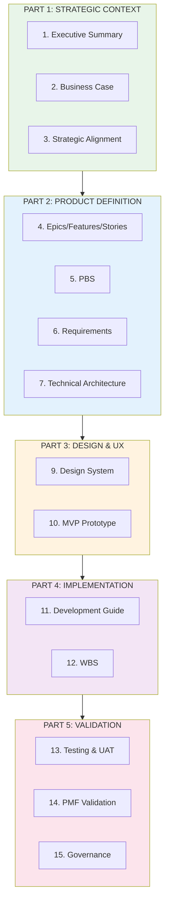
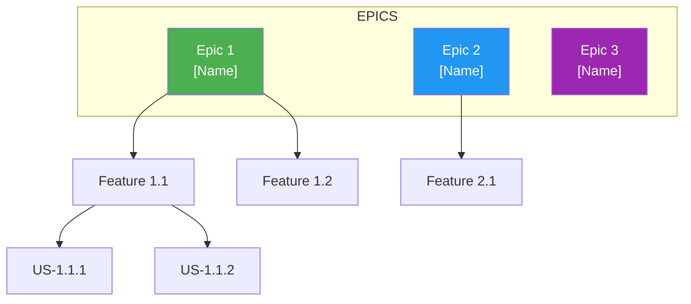
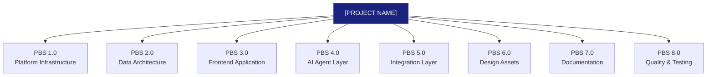
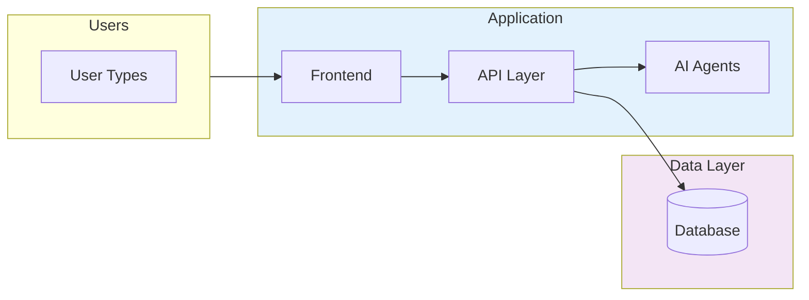
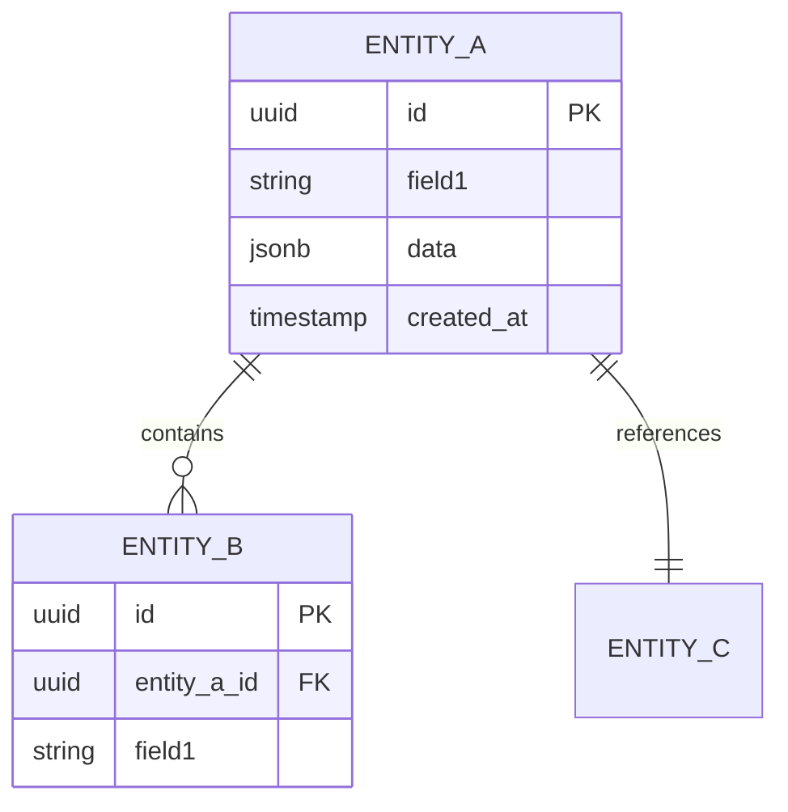
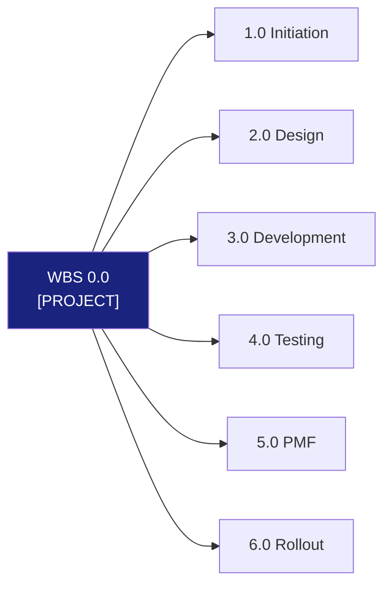

# [PROJECT NAME]
## Unified Product Requirements Document v1.0
## [Phase Description]

---

| Document Control | |
|-----------------|---|
| **Document Number** | [PROJECT]-PRD-001 |
| **Version** | 1.0 |
| **Status** | Draft |
| **Created** | [DD Month YYYY] |
| **Last Modified** | [DD Month YYYY] |
| **Authors** | [Names] |
| **Classification** | [CONFIDENTIAL/INTERNAL/PUBLIC] |

---

## Version History

| Version | Date | Author | Changes |
|---------|------|--------|---------|
| 0.1 | [Date] | [Author] | Initial draft |
| 1.0 | [Date] | [Author] | [Changes] |

---

## Table of Contents

**PART 1: STRATEGIC CONTEXT**
1. [Executive Summary](#1-executive-summary)
2. [Business Case Summary](#2-business-case-summary)
3. [Strategic Alignment](#3-strategic-alignment)

**PART 2: PRODUCT DEFINITION**
4. [Epics, Features & User Stories](#4-epics-features--user-stories)
5. [Product Breakdown Structure (PBS)](#5-product-breakdown-structure-pbs)
6. [Requirements](#6-requirements)
7. [Technical Architecture](#7-technical-architecture)
8. [Data Model & Ontologies](#8-data-model--ontologies)

**PART 3: DESIGN & UX**
9. [UI/UX Design System](#9-uiux-design-system)
10. [MVP Prototype Specification](#10-mvp-prototype-specification)

**PART 4: IMPLEMENTATION**
11. [Development Guide](#11-development-guide)
12. [Work Breakdown Structure (WBS)](#12-work-breakdown-structure-wbs)

**PART 5: VALIDATION & GOVERNANCE**
13. [Testing & UAT](#13-testing--uat)
14. [PMF & Feedback Process](#14-pmf--feedback-process)
15. [Governance & Sign-off](#15-governance--sign-off)

---

## Document Structure Overview



---

# PART 1: STRATEGIC CONTEXT

---

## 1. Executive Summary

### 1.1 Business Problem

**Strategic Context:** [Brief description of business context and growth trajectory]

Current challenges:
- **[Challenge 1]**: [Description and impact]
- **[Challenge 2]**: [Description and impact]
- **[Challenge 3]**: [Description and impact]

**Risk Scale:** [Description of what's at stake]

### 1.2 The Solution: [PROJECT NAME]

A [description of solution] delivering:
- [Capability 1]
- [Capability 2]
- [Capability 3]
- [Capability 4]

### 1.3 Phase 1 MVP

**This is Phase 1** - [Description of phase goals]. The MVP demonstrates:
- [Key demonstration 1]
- [Key demonstration 2]
- [Key demonstration 3]

**Investment Summary:** [Investment amount and timeline]

**ROI:** [ROI metrics]

### 1.4 Delivery Approach

**[Approach Name]:**
- [Step 1]
- [Step 2]
- [Step 3]
- [Step 4]

### 1.5 Success Criteria

| Metric | Current | Target |
|--------|---------|--------|
| [Metric 1] | [Current] | [Target] |
| [Metric 2] | [Current] | [Target] |
| [Metric 3] | [Current] | [Target] |
| [Metric 4] | [Current] | [Target] |

---

## 2. Business Case Summary

### 2.1 Investment vs Return Overview

| Metric | Phase 1 MVP | [X]-Year Total |
|--------|------------:|---------------:|
| **Total Investment** | $[Amount] | $[Amount] |
| **Total Benefit** | $[Amount] | $[Amount] |
| **ROI** | **[X]x** | **[X]x** |
| **Payback Period** | **[X] days** | - |

### 2.2 Development Approach

**[Approach Name]** selected for Phase 1 MVP:
- [Key aspect 1]
- [Key aspect 2]
- [Key aspect 3]

---

## 3. Strategic Alignment

### 3.1 Business Objectives Mapping

| Objective | [PROJECT] Contribution |
|-----------|------------------------|
| [Objective 1] | [How project contributes] |
| [Objective 2] | [How project contributes] |
| [Objective 3] | [How project contributes] |

### 3.2 VSOM: Vision, Strategy, Objectives & Metrics

#### Vision
**[Vision statement]**

#### Strategy
| Strategic Pillar | [PROJECT] Contribution |
|------------------|------------------------|
| **[Pillar 1]** | [Contribution] |
| **[Pillar 2]** | [Contribution] |
| **[Pillar 3]** | [Contribution] |

#### Objectives (SMART)
| Objective | Metric | Target | Timeline |
|-----------|--------|--------|----------|
| O1: [Objective] | [Metric] | [Target] | [Timeline] |
| O2: [Objective] | [Metric] | [Target] | [Timeline] |
| O3: [Objective] | [Metric] | [Target] | [Timeline] |

### 3.3 Value Proposition

**For [target users]** who need to [problem/need],

**[PROJECT NAME] is a** [description]

**That provides:**
- [Benefit 1]
- [Benefit 2]
- [Benefit 3]

**Unlike** [current solution],

**[PROJECT NAME] enables:**
- [Differentiator 1]
- [Differentiator 2]
- [Differentiator 3]

---

# PART 2: PRODUCT DEFINITION

---

## 4. Epics, Features & User Stories



### 4.1 Epic 1: [Name]
*PBS Reference: PBS [X.X]*

**Feature 1.1: [Name]**
- US-1.1.1: As a [role], I can [action] [benefit]
- US-1.1.2: As a [role], I can [action] [benefit]
- US-1.1.3: As a [role], I can [action] [benefit]

**Feature 1.2: [Name]**
- US-1.2.1: As a [role], I can [action] [benefit]
- US-1.2.2: As a [role], I can [action] [benefit]

### 4.2 Epic 2: [Name]
*PBS Reference: PBS [X.X]*

**Feature 2.1: [Name]**
- US-2.1.1: As a [role], I can [action] [benefit]
- US-2.1.2: As a [role], I can [action] [benefit]

---

## 5. Product Breakdown Structure (PBS)

### PBS Visual Overview



### PBS Detailed Breakdown

```
PBS 0.0 [PROJECT NAME]
|
+-- PBS 1.0 PLATFORM INFRASTRUCTURE
|   +-- PBS 1.1 Hosting Environment
|   +-- PBS 1.2 Database Layer
|   +-- PBS 1.3 Authentication & Security
|   +-- PBS 1.4 AI Integration
|
+-- PBS 2.0 DATA ARCHITECTURE
|   +-- PBS 2.1 [Domain 1] Schema
|   +-- PBS 2.2 [Domain 2] Schema
|   +-- PBS 2.3 [Domain 3] Schema
|
+-- PBS 3.0 FRONTEND APPLICATION
|   +-- PBS 3.1 Core Framework
|   +-- PBS 3.2 Design System
|   +-- PBS 3.3 [Module 1]
|   +-- PBS 3.4 [Module 2]
|   +-- PBS 3.5 [Module 3]
|
+-- PBS 4.0 AI AGENT LAYER
|   +-- PBS 4.1 [Agent 1]
|   +-- PBS 4.2 [Agent 2]
|   +-- PBS 4.3 [Agent 3]
|
+-- PBS 5.0 INTEGRATION LAYER
|   +-- PBS 5.1 Data Import
|   +-- PBS 5.2 API Endpoints
|   +-- PBS 5.3 External Systems
|
+-- PBS 6.0 DESIGN ASSETS
|   +-- PBS 6.1 Design System
|   +-- PBS 6.2 Component Library
|   +-- PBS 6.3 Screen Mockups
|   +-- PBS 6.4 Prototypes
|
+-- PBS 7.0 DOCUMENTATION
|   +-- PBS 7.1 Technical Documentation
|   +-- PBS 7.2 User Documentation
|   +-- PBS 7.3 Process Documentation
|
+-- PBS 8.0 QUALITY & TESTING
    +-- PBS 8.1 Test Artefacts
    +-- PBS 8.2 UAT Package
    +-- PBS 8.3 Validation
```

### PBS Priority Summary (MVP)

| PBS Code | Component | MVP Priority | Owner |
|----------|-----------|--------------|-------|
| PBS 1.0 | Platform Infrastructure | MUST | [Owner] |
| PBS 2.0 | Data Architecture | MUST | [Owner] |
| PBS 3.0 | Frontend Application | MUST | [Owner] |
| PBS 4.0 | AI Agent Layer | SHOULD | [Owner] |
| PBS 5.0 | Integration Layer | MUST | [Owner] |
| PBS 6.0 | Design Assets | MUST | [Owner] |
| PBS 7.0 | Documentation | SHOULD | [Owner] |
| PBS 8.0 | Quality & Testing | MUST | [Owner] |

---

## 6. Requirements

### 6.1 Functional Requirements Summary

#### FR-[DOMAIN]-001: [Requirement Name]
**Priority:** MUST HAVE (MVP)

| Field | Source | Type | Validation |
|-------|--------|------|------------|
| [Field 1] | [Source] | [Type] | [Validation] |
| [Field 2] | [Source] | [Type] | [Validation] |
| [Field 3] | [Source] | [Type] | [Validation] |

#### FR-[DOMAIN]-002: [Requirement Name]
**Priority:** SHOULD HAVE (MVP)

[Requirement details...]

### 6.2 Non-Functional Requirements

#### NFR-PERF: Performance Requirements

| Requirement | Target | Priority |
|-------------|--------|----------|
| **NFR-PERF-001:** Page load time | < 2 seconds | MUST |
| **NFR-PERF-002:** [Requirement] | [Target] | [Priority] |
| **NFR-PERF-003:** [Requirement] | [Target] | [Priority] |

#### NFR-SEC: Security Requirements

| Requirement | Target | Priority |
|-------------|--------|----------|
| **NFR-SEC-001:** Authentication | [Target] | MUST |
| **NFR-SEC-002:** Authorisation | [Target] | MUST |
| **NFR-SEC-003:** Data encryption | [Target] | MUST |

#### NFR-AVL: Availability Requirements

| Requirement | Target | Priority |
|-------------|--------|----------|
| **NFR-AVL-001:** System uptime | [Target] | MUST |
| **NFR-AVL-002:** RTO | [Target] | SHOULD |
| **NFR-AVL-003:** RPO | [Target] | SHOULD |

---

## 7. Technical Architecture

*For detailed technical architecture, see **[PROJECT]_HLD.md***

### 7.1 Technology Stack Summary

| Layer | Technology | Rationale |
|-------|------------|-----------|
| **Frontend** | [Technology] | [Rationale] |
| **Database** | [Technology] | [Rationale] |
| **AI/Agents** | [Technology] | [Rationale] |
| **Hosting** | [Technology] | [Rationale] |
| **Auth** | [Technology] | [Rationale] |

### 7.2 Architecture Overview



---

## 8. Data Model & Ontologies

### 8.1 Data Model Overview



### 8.2 Core Ontologies

| Ontology | Purpose | Key Entities |
|----------|---------|--------------|
| **[Domain 1]** | [Purpose] | [Entities] |
| **[Domain 2]** | [Purpose] | [Entities] |
| **[Domain 3]** | [Purpose] | [Entities] |

---

# PART 3: DESIGN & UX

---

## 9. UI/UX Design System

### 9.1 Design Principles

| Principle | Implementation |
|-----------|----------------|
| **[Principle 1]** | [Implementation] |
| **[Principle 2]** | [Implementation] |
| **[Principle 3]** | [Implementation] |

### 9.2 Design System Summary

**Brand Theme: [Theme Name]**
- **Primary Colour:** [Hex]
- **Secondary/CTA:** [Hex]
- **Fonts:** [Fonts]
- **Component Library:** [Library]

---

## 10. MVP Prototype Specification

### 10.1 Prototype Scope

**In Scope (MVP):**
- [Feature 1]
- [Feature 2]
- [Feature 3]

**Out of Scope (MVP - Future Phases):**
- [Feature 1]
- [Feature 2]

### 10.2 Key Screens

| Screen | Purpose | Key Features |
|--------|---------|--------------|
| **[Screen 1]** | [Purpose] | [Features] |
| **[Screen 2]** | [Purpose] | [Features] |
| **[Screen 3]** | [Purpose] | [Features] |

---

# PART 4: IMPLEMENTATION

*See [PROJECT]_IMPLEMENTATION_PLAN.md for details*

---

## 11. Development Guide

**Summary:**
- Prerequisites: [Requirements]
- Stack: [Technologies]
- Database: [Database]
- Deployment: [Platform]

---

## 12. Work Breakdown Structure (WBS)

### WBS Overview



| Phase | Key Deliverables |
|-------|-----------------|
| **1.0 Initiation** | [Deliverables] |
| **2.0 Design** | [Deliverables] |
| **3.0 Development** | [Deliverables] |
| **4.0 Testing** | [Deliverables] |
| **5.0 PMF** | [Deliverables] |
| **6.0 Rollout** | [Deliverables] |

---

# PART 5: VALIDATION & GOVERNANCE

---

## 13. Testing & UAT

### 13.1 Functional Testing Checklist

```
[ ] [Module 1]
  [ ] [Test case 1]
  [ ] [Test case 2]

[ ] [Module 2]
  [ ] [Test case 1]
  [ ] [Test case 2]

[ ] Mobile Responsive
  [ ] [Test case 1]
  [ ] [Test case 2]
```

### 13.2 Performance Targets

```
TARGET METRICS:

[ ] First Contentful Paint (FCP): < 1.5s
[ ] Largest Contentful Paint (LCP): < 2.5s
[ ] Time to Interactive (TTI): < 3.0s
```

---

## 14. PMF & Feedback Process

### 14.1 PMF Criteria

1. **Problem-Solution Fit:** Does [PROJECT] solve the identified pain points?
2. **Usability:** Can users complete core tasks without assistance?
3. **Adoption Intent:** Would users choose [PROJECT] over current solution?
4. **Value Perception:** Do users see measurable benefit?

### 14.2 Success Metrics for Go/No-Go

| Metric | Target | Measurement |
|--------|--------|-------------|
| **Task Success Rate** | > 90% | UAT completion rate |
| **User Satisfaction** | > 4.0/5.0 | Feedback form average |
| **Adoption Intent** | > 80% "Yes" | Survey response |

---

## 15. Governance & Sign-off

### 15.1 Decision Gates

| Gate | Decision | Approver |
|------|----------|----------|
| **G1: POC Approval** | Continue to MVP | [Role] |
| **G2: MVP Approval** | Continue to UAT | [Role] |
| **G3: UAT Sign-off** | Continue to Approval | [Role] |
| **G4: Go/No-Go** | Proceed to Rollout | [Role] |

### 15.2 Roles & Responsibilities

| Role | Responsibilities | Reports To |
|------|-----------------|------------|
| **[Role 1]** | [Responsibilities] | [Reports to] |
| **[Role 2]** | [Responsibilities] | [Reports to] |
| **[Role 3]** | [Responsibilities] | [Reports to] |

### 15.3 RACI Matrix

| Activity | [Role 1] | [Role 2] | [Role 3] | [Role 4] |
|----------|:--------:|:--------:|:--------:|:--------:|
| [Activity 1] | R | A | C | I |
| [Activity 2] | C | R | A | I |
| [Activity 3] | I | C | R | A |

### 15.4 Risk Register

| Risk | Likelihood | Impact | Mitigation |
|------|:----------:|:------:|------------|
| [Risk 1] | [L/M/H] | [L/M/H] | [Mitigation] |
| [Risk 2] | [L/M/H] | [L/M/H] | [Mitigation] |
| [Risk 3] | [L/M/H] | [L/M/H] | [Mitigation] |

---

## Appendix A: Glossary

| Term | Definition |
|------|------------|
| **[Term 1]** | [Definition] |
| **[Term 2]** | [Definition] |
| **[Term 3]** | [Definition] |

---

## Appendix B: Document References

| Document | Location | Purpose |
|----------|----------|---------|
| [Document 1] | [Location] | [Purpose] |
| [Document 2] | [Location] | [Purpose] |
| [Document 3] | [Location] | [Purpose] |

---

**--- END OF PRD TEMPLATE ---**

*Template Version 1.0*
*Adapted from EOMS PRD v1.7*
