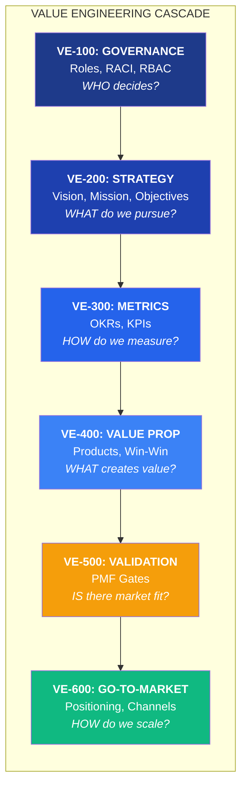
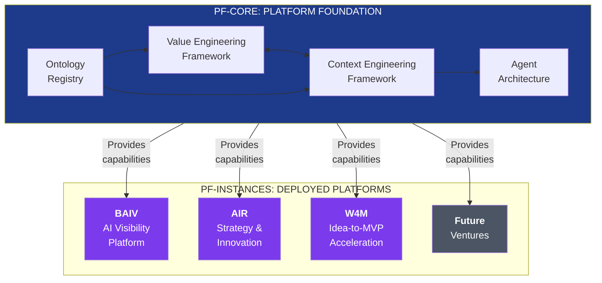
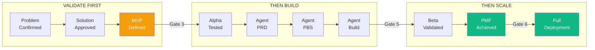

# Value Engineering & Context Engineering
## Executive Overview

**Version:** 1.0.0  
**Date:** 2024-12-02  
**Audience:** Executive Leadership, Strategic Partners, Investors  
**Classification:** Strategic Architecture Summary

---

## The Strategic Imperative

Modern AI-powered platforms face a critical challenge: **how do agents know what matters?**

Without strategic alignment, AI agents operate in isolation—technically capable but strategically blind. They can execute tasks but cannot prioritize, cannot understand business context, and cannot adapt to organizational goals.

**PF-Core solves this through two integrated systems:**

| System | Question Answered | Owner |
|--------|-------------------|-------|
| **Value Engineering (VE)** | *What is valuable and why?* | Human leadership |
| **Context Engineering (CE)** | *How do agents receive that knowledge?* | Platform automation |

---

## The Core Relationship

```mermaid
flowchart LR
    subgraph HUMAN["👥 HUMAN LEADERSHIP"]
        VE["VALUE<br/>ENGINEERING<br/><br/>Defines what matters<br/>Sets strategy<br/>Measures success"]
    end

    subgraph PLATFORM["⚙️ PLATFORM AUTOMATION"]
        CE["CONTEXT<br/>ENGINEERING<br/><br/>Retrieves context<br/>Assembles packages<br/>Delivers to agents"]
    end

    subgraph EXECUTION["🤖 AI EXECUTION"]
        AGENTS["STRATEGICALLY<br/>ALIGNED<br/>AGENTS<br/><br/>Act with purpose<br/>Respect authority<br/>Drive outcomes"]
    end

    VE -->|"Produces<br/>strategic context"| CE
    CE -->|"Delivers<br/>right context"| AGENTS
    AGENTS -->|"Generates<br/>measurable results"| VE

    style VE fill:#1e40af,color:#fff
    style CE fill:#7c3aed,color:#fff
    style AGENTS fill:#059669,color:#fff
```

**Value Engineering** is the human-led discipline that cascades organizational purpose from vision through strategy to measurable outcomes. It answers: *Who decides? What do we pursue? How do we measure success? What products create value?*

**Context Engineering** is the platform capability that makes VE outputs actionable for AI agents. It retrieves, assembles, optimizes, and delivers the right context at the right time—ensuring agents operate within strategic boundaries with appropriate authority.

---

## Value Engineering: The Strategic Cascade

Value Engineering transforms organizational vision into actionable, measurable guidance through six integrated modules:

### Module Summary

| Module | Purpose | Business Impact |
|--------|---------|-----------------|
| **VE-100 Governance** | Defines who has authority and accountability | Clear decision rights, reduced conflict |
| **VE-200 Strategy** | Articulates vision through operational objectives | Strategic alignment across organization |
| **VE-300 Metrics** | Translates strategy into measurable outcomes | Data-driven decision making |
| **VE-400 Value Proposition** | Identifies win-win opportunities | Customer-centric product development |
| **VE-500 PMF Validation** | Gates investment based on market evidence | Reduced waste, validated bets |
| **VE-600 Go-To-Market** | Orchestrates market entry and scale | Efficient growth, optimized CAC |

---

## Context Engineering: The Delivery System

Context Engineering ensures AI agents receive precisely the strategic context they need—no more, no less—optimized for performance and governed by authority boundaries.

```mermaid
flowchart LR
    subgraph SOURCES["VE OUTPUTS"]
        S1["Strategy"]
        S2["Authority"]
        S3["Outcomes"]
        S4["Products"]
        S5["Validation"]
        S6["Market"]
    end

    subgraph CE["CONTEXT ENGINEERING"]
        direction TB
        CE1["<b>DISCOVER</b><br/>Retrieve from VE<br/>Enrich from external"]
        CE2["<b>ASSEMBLE</b><br/>Build context package<br/>Optimize tokens"]
        CE3["<b>DELIVER</b><br/>Cache intelligently<br/>Refresh as needed"]
        
        CE1 --> CE2 --> CE3
    end

    subgraph AGENTS["AGENT CONTEXT"]
        PKG["Context Package<br/><br/>• Strategic direction<br/>• Authority boundaries<br/>• Success metrics<br/>• Product specs<br/>• Validation status<br/>• Market positioning"]
    end

    S1 & S2 & S3 & S4 & S5 & S6 --> CE1
    CE3 --> PKG

    style CE fill:#7c3aed,color:#fff
    style PKG fill:#059669,color:#fff
```

### CE Capabilities

| Capability | Function | Agent Benefit |
|------------|----------|---------------|
| **Discovery** | Retrieves context from VE modules | Access to strategic knowledge |
| **Assembly** | Builds optimized context packages | Efficient token usage |
| **Lifecycle** | Caches and refreshes context | Consistent, current information |
| **Authority** | Enforces RBAC boundaries | Appropriate access control |

---

## PF-Core: The Reusable Foundation

**PF-Core** is the platform foundation—the reusable architectural layer that provides VE and CE capabilities to all platform instances.

### Core vs Instance

| Aspect | PF-Core | PF-Instance |
|--------|---------|-------------|
| **Scope** | Universal platform capabilities | Specific product/market application |
| **VE Content** | Framework and ontologies | Populated strategic context |
| **CE Content** | Retrieval architecture | Instance-specific extensions |
| **Ownership** | Platform team | Instance leadership |
| **Customization** | Parameterized, not forked | Fully customizable within framework |

---

## Business Impact

### Strategic Leverage

**Build Once, Deploy Many:** VE and CE frameworks in PF-Core are developed once and leveraged across all platform instances. Each new venture (BAIV, AIR, W4M) inherits battle-tested strategic infrastructure.

**Validated Investment:** PMF gates (VE-500) ensure resources flow only to validated opportunities. Agent development scales with market confidence—no premature scaling.

**Autonomous Alignment:** CE delivers strategic context to agents automatically. Agents operate within defined boundaries without constant human supervision.

### Quantified Benefits

| Metric | Without VE-CE | With VE-CE | Impact |
|--------|---------------|------------|--------|
| Agent strategic alignment | Manual briefing | Automated delivery | 90% reduction in context prep |
| Investment validation | Gut feel | Evidence-gated | 60% reduction in failed bets |
| New venture deployment | 6-12 months | 2-4 weeks | 80% faster time-to-market |
| Agent authority conflicts | Frequent | Governed | Near-zero unauthorized actions |

---

## The PMF-Gated Agent Build Model

A critical innovation: **agent development is gated by market validation**.

**Core Principle:** *Validate before you build. No agent development proceeds without explicit PMF gate authorization.*

| Gate | Requirement | What's Authorized |
|------|-------------|-------------------|
| Gate 3 | MVP defined, PRD approved | PBS creation begins |
| Gate 4 | 10+ alpha users, 70% journey completion | Agent SDK development |
| Gate 5 | 50+ beta, Sean Ellis ≥30% | Agent beta deployment |
| Gate 6 | 100 paying customers, PMF certified | Full scale + GTM execution |

---

## Summary: Two Systems, One Purpose

```mermaid
flowchart TB
    PURPOSE["<b>ORGANIZATIONAL PURPOSE</b><br/>Vision • Mission • Values"]
    
    subgraph TWIN["THE VE-CE TWIN SYSTEMS"]
        direction LR
        VE["<b>VALUE ENGINEERING</b><br/><br/>Human-led<br/>Strategic cascade<br/>Defines value<br/>Gates investment"]
        CE["<b>CONTEXT ENGINEERING</b><br/><br/>Platform-automated<br/>Context delivery<br/>Enables agents<br/>Enforces boundaries"]
    end
    
    AGENTS["<b>STRATEGICALLY ALIGNED AGENTS</b><br/>Execute with purpose • Respect authority • Drive measurable outcomes"]
    
    RESULTS["<b>BUSINESS RESULTS</b><br/>Validated products • Efficient growth • Competitive advantage"]
    
    PURPOSE --> VE
    VE <-->|"VE produces<br/>CE delivers"| CE
    CE --> AGENTS
    AGENTS --> RESULTS
    RESULTS -->|"Informs<br/>strategy"| PURPOSE

    style PURPOSE fill:#1e3a8a,color:#fff
    style VE fill:#2563eb,color:#fff
    style CE fill:#7c3aed,color:#fff
    style AGENTS fill:#059669,color:#fff
    style RESULTS fill:#10b981,color:#fff
```

### The Bottom Line

| Value Engineering | Context Engineering |
|-------------------|---------------------|
| **What** is valuable | **How** agents know it |
| **Human** leadership defines | **Platform** automation delivers |
| **Strategic** decisions | **Operational** enablement |
| **Investment** governance | **Execution** efficiency |

Together, VE and CE create a **self-reinforcing system** where organizational strategy flows seamlessly into AI agent execution, and agent-generated results inform strategic refinement.

**This is how AI platforms scale with purpose.**

---

## Appendix: Quick Reference

### VE Module Codes
- **VE-100:** Governance (RRR)
- **VE-200:** Strategy (VSOM)
- **VE-300:** Metrics (OKR)
- **VE-400:** Value Proposition
- **VE-500:** PMF Validation
- **VE-600:** Go-To-Market

### CE Module Codes
- **CE-100:** Discovery (CE-111 to CE-117 retrievers)
- **CE-200:** Assembly
- **CE-300:** Lifecycle
- **CE-400:** Instance Extensions
- **CE-500:** Orchestration

### Key Documents
- PF-Core VE-CE Integrated Framework v1.1
- VE-PMF-GTM Agent Build Lifecycle Framework v1.1
- VE-CE Integration Implementation Summary v1.1

---

*Document Version: 1.0.0 | Platform Foundation Core Architecture*
