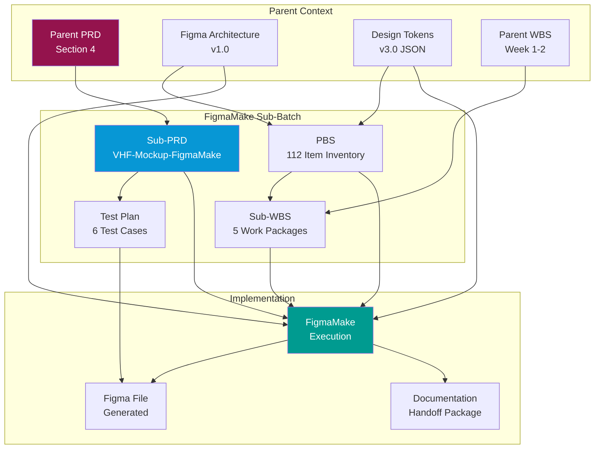
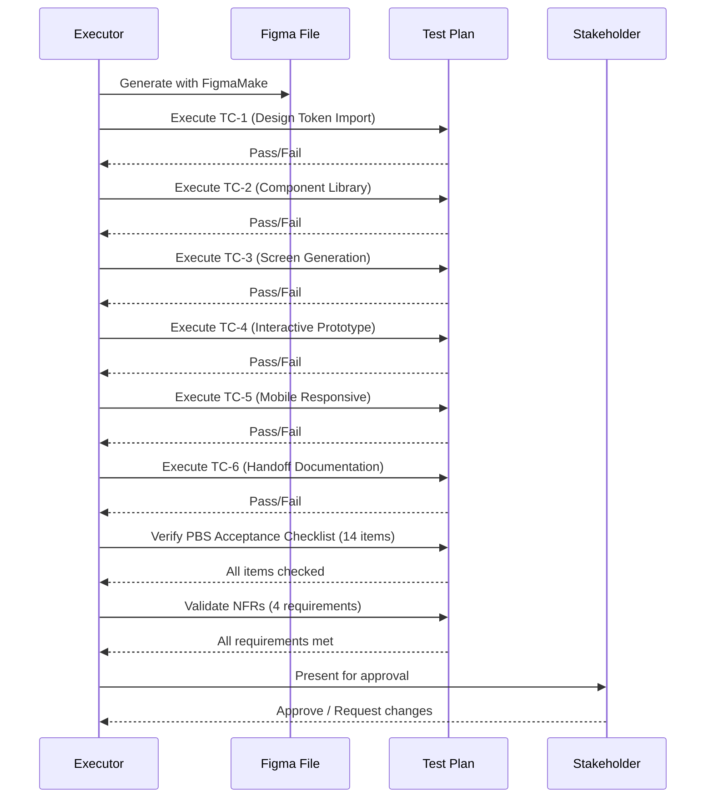

# VHF-Mockup-FigmaMake: Documentation Requirements
## Complete Document Package for Implementation

**Version:** 1.0.0  
**Date:** 2024-12-10  
**Status:** Ready for Execution  
**GitHub:** https://github.com/ajrmooreuk/VHF-App-Mk3

---

## Document Inventory

### 1. Parent Documents (Context)

| Document | Location | Purpose | Status |
|----------|----------|---------|--------|
| **PRD (Parent)** | [GitHub](https://github.com/ajrmooreuk/VHF-App-Mk3/blob/main/VHF-NI-App-Mk3-PRD-Mockup-First-v3.0.md) | Parent PRD with Week 1-2 mockup requirements (Section 4) | ✅ Exists |
| **Figma Architecture** | `VHF-NI-App-Mk3-Figma-Architecture-v1.0.md` | Complete atomic design structure, component specs | ✅ Exists |
| **Design Tokens v3.0** | `VHF-NI-App-Mk3-Design-Tokens-v3.0.json` | 73 design system tokens (colors, typography, spacing) | ✅ Exists |
| **WBS (Parent)** | `viridian-work-breakdown-structure.md` | Original 8-week WBS with design tasks | ✅ Exists |

---

### 2. FigmaMake Sub-Documents (This Batch)

| Document | Location | Purpose | Status |
|----------|----------|---------|--------|
| **Sub-PRD** | `VHF-Mockup-FigmaMake-PRD-v1.0.md` | Isolated PRD for FigmaMake mockup generation | ✅ Created |
| **PBS** | `VHF-Mockup-FigmaMake-PBS-v1.0.md` | Product breakdown - 112 item inventory | ✅ Created |
| **WBS** | `VHF-Mockup-FigmaMake-WBS-v1.0.md` | Work breakdown - tasks & schedule | 📝 Next |
| **Test Plan** | `VHF-Mockup-FigmaMake-Test-Plan-v1.0.md` | Test cases for completion validation | 📝 Next |

---

## Required Documents for FigmaMake Implementation

### Phase 1: Pre-Implementation (Read-Only)

These documents must be available before starting FigmaMake generation:

#### 1.1 Design System Foundation
- **VHF-NI-App-Mk3-Design-Tokens-v3.0.json**
  - 56 color tokens (primitive → semantic → component)
  - 11 typography tokens (PT Sans, sizes, weights)
  - 6 spacing tokens (8px grid)
  - 6 shadow tokens (teal tints)
  - **Format:** Valid JSON
  - **Usage:** Import into FigmaMake for variable generation

#### 1.2 Component Specifications
- **VHF-NI-App-Mk3-Figma-Architecture-v1.0.md**
  - Atomic design hierarchy (atoms → molecules → organisms)
  - Component variant definitions (Button: 48v, Input: 12v, etc.)
  - Schema.org semantic mappings
  - Component structure specifications
  - **Format:** Markdown
  - **Usage:** Reference for component generation logic

#### 1.3 Screen Requirements
- **VHF-NI-App-Mk3-PRD-Mockup-First-v3.0.md (Section 4.2)**
  - 12 core screens defined
  - Interactive prototype requirements
  - User testing preparation criteria
  - Success metrics
  - **Format:** Markdown
  - **Usage:** Screen generation specifications

---

### Phase 2: Implementation Guides (This Batch)

#### 2.1 Sub-PRD (Product Requirements)
**File:** `VHF-Mockup-FigmaMake-PRD-v1.0.md`

**Contains:**
- Scope definition (in/out of scope)
- 6 functional requirements (FR-1 to FR-6)
- 4 non-functional requirements (NFR-1 to NFR-4)
- Acceptance criteria per requirement
- 6 test cases (TC-1 to TC-6)
- Dependencies (upstream/downstream)
- Risk mitigation
- Timeline (Week 1-2 breakdown)

**Usage:**
- Defines WHAT to build
- Provides acceptance criteria for each deliverable
- Guides test case execution

---

#### 2.2 PBS (Product Breakdown Structure)
**File:** `VHF-Mockup-FigmaMake-PBS-v1.0.md`

**Contains:**
- Complete component inventory (112 items)
- 8 major subsystems:
  1. Design Tokens (73 styles)
  2. Atomic Components (4 subsystems)
  3. Molecular Components (5 components, 74 variants)
  4. Organism Components (5 components, 33 variants)
  5. Page Templates (4 layouts)
  6. Application Screens (12 pages)
  7. Interactive Prototype (5 flows)
  8. Documentation Package (4 deliverables)
- Detailed specifications per component
- Variant matrices
- Responsive breakpoints

**Usage:**
- Inventory checklist (WHAT exists when complete)
- Component specification reference
- Completeness verification

---

#### 2.3 WBS (Work Breakdown Structure)
**File:** `VHF-Mockup-FigmaMake-WBS-v1.0.md` (to be created)

**Should Contain:**
- Task decomposition (HOW to build)
- 5 work packages:
  1. FigmaMake Setup & Token Import (2h)
  2. Component Library Generation (3h)
  3. Screen Generation (4h)
  4. Interactive Prototype (2h)
  5. Export & Documentation (1h)
- Task dependencies
- Resource assignments
- Schedule (Gantt chart)
- Cost estimates (time-based)

**Usage:**
- Execution roadmap
- Task tracking
- Progress monitoring

---

#### 2.4 Test Plan (Completion Validation)
**File:** `VHF-Mockup-FigmaMake-Test-Plan-v1.0.md` (to be created)

**Should Contain:**
- Test strategy
- 6 test cases from PRD (TC-1 to TC-6)
- Acceptance checklist (14 items from PBS)
- Test execution procedures
- Pass/fail criteria
- Bug tracking template
- Sign-off process

**Usage:**
- Validate completeness
- Quality assurance
- Stakeholder approval

---

## Additional Required Assets

### Input Assets (Must Exist)
1. **Figma API Token**
   - Generate from: https://www.figma.com/settings
   - Scope: File content, variables, styles
   - Usage: FigmaMake authentication

2. **PT Sans Font**
   - Format: Web font or system font
   - Weights: 400 (normal), 700 (bold)
   - Usage: Typography rendering

3. **Icon Library Source**
   - 50+ icons (food, health, UI)
   - Format: SVG preferred
   - Usage: Icon component generation

4. **Sample Images**
   - Food photography (meal cards, recipes)
   - User avatars (placeholder)
   - Empty state illustrations
   - Usage: Content placeholders

---

### Output Deliverables (Will Be Created)

#### From FigmaMake Generation:
1. **Figma File:** "VHF Nutrition Intelligence - Design System v3.0"
   - 73 design system styles
   - 100+ components (atoms → organisms)
   - 12 screens × 3 breakpoints = 36 frames
   - Interactive prototype
   - Estimated size: ~50 MB

2. **Component Library**
   - Auto-layout enabled
   - All variants functional
   - Design token linked

3. **Interactive Prototype**
   - 5 user flows connected
   - Hover/focus states working
   - Mobile responsive

#### From Manual Creation:
4. **Handoff Documentation**
   - Component Usage Guide (PDF, 15-20 pages)
   - Screen Flow Diagram (Mermaid + PDF)
   - Design Token Reference (Markdown + PDF)
   - Handoff Package (Zip with assets)

---

## Document Cross-Reference Map

---

## Completion Testing Approach

### Test Isolation Strategy

This FigmaMake batch can be tested independently using:

1. **PBS Acceptance Checklist (14 items)**
   - From: `VHF-Mockup-FigmaMake-PBS-v1.0.md` (lines 1036-1050)
   - Validates: All 112 inventory items exist
   - Method: Manual verification in Figma

2. **PRD Test Cases (6 cases)**
   - From: `VHF-Mockup-FigmaMake-PRD-v1.0.md` (lines 259-309)
   - Validates: Functional requirements met
   - Method: Structured test execution

3. **NFR Validation (4 requirements)**
   - Design consistency (token usage audit)
   - Accessibility (WCAG 2.1 AA via Stark plugin)
   - Performance (load time < 5s)
   - Maintainability (component instances, not detached)

### Test Execution Order

---

## Success Criteria for Batch Completion

### Phase Gate: Ready for User Testing

All of the following must be TRUE:

- [ ] All 6 PRD test cases PASS
- [ ] All 14 PBS acceptance checklist items checked
- [ ] All 4 NFRs validated
- [ ] Figma share link generated and accessible
- [ ] Interactive prototype link working end-to-end
- [ ] Handoff documentation package complete (4 deliverables)
- [ ] Stakeholder approval obtained

### Isolated Batch Definition

This work batch is considered COMPLETE and ISOLATED when:

1. **Input:** Only requires existing parent documents (no code dependencies)
2. **Output:** Deliverables usable by downstream teams (Week 3-4 implementation)
3. **Testing:** Can be validated independently (no integration tests needed)
4. **Approval:** Stakeholder can approve based on Figma file alone

---

## Next Steps

### Immediate Actions Required

1. **Create Sub-WBS**
   - File: `VHF-Mockup-FigmaMake-WBS-v1.0.md`
   - Content: 5 work packages, task dependencies, Gantt chart, 12-hour timeline
   - Purpose: Execution roadmap

2. **Create Test Plan**
   - File: `VHF-Mockup-FigmaMake-Test-Plan-v1.0.md`
   - Content: Expand 6 test cases, add execution procedures, sign-off template
   - Purpose: Completion validation

3. **Gather Input Assets**
   - Generate Figma API token
   - Verify PT Sans font availability
   - Source icon library (50+ SVG icons)
   - Collect sample images for placeholders

4. **Setup FigmaMake Environment**
   - Install FigmaMake CLI
   - Authenticate with Figma API
   - Test token import with Design Tokens v3.0 JSON
   - Validate component generation capability

---

## Document Summary

| Category | Count | Status |
|----------|-------|--------|
| **Parent Context Docs** | 4 | ✅ All exist |
| **FigmaMake Sub-Docs** | 4 | 2 created, 2 needed |
| **Input Assets** | 4 | TBD (gather) |
| **Output Deliverables** | 4 | Generated by FigmaMake |
| **TOTAL** | 16 | 75% ready |

---

## GitHub Links

- **Parent PRD:** https://github.com/ajrmooreuk/VHF-App-Mk3/blob/main/VHF-NI-App-Mk3-PRD-Mockup-First-v3.0.md
- **Local Sub-PRD:** `./VHF-Mockup-FigmaMake-PRD-v1.0.md`
- **Local PBS:** `./VHF-Mockup-FigmaMake-PBS-v1.0.md`
- **Local WBS (Parent):** `./viridian-work-breakdown-structure.md`

---

**Document Status:** ✅ Complete Requirements Package  
**Ready for:** Sub-WBS creation → Test Plan creation → FigmaMake execution  
**Estimated Time to Complete Batch:** 12 hours
