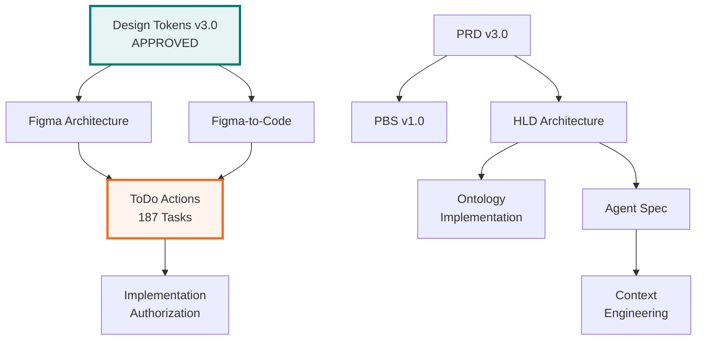

# VHF-NI-App-Mk3: Complete Documentation Manifest v3.0
## Professional Design System & Implementation Package

**Document ID:** VHF-NI-App-Mk3-Document-Manifest-v3.0  
**Version:** 3.0.0 (MAJOR - Figma Architecture Integration)  
**Previous Version:** v2.0.0  
**Date:** 2024-12-09  
**Status:** ✅ Complete - Ready for Claude Code Transfer  
**Total Documents:** 29 (was 24, added 5)

---

## Version History

| Version | Date | Changes | Approver |
|---------|------|---------|----------|
| v3.0.0 | 2024-12-09 | Added professional Figma architecture (5 docs) | James Kerby + Dev Lead |
| v2.0.0 | 2024-11-20 | 4-week mockup-first refactor | James Kerby |
| v1.0.0 | 2024-10-29 | Initial documentation package | James Kerby |

---

## Table of Contents

1. [Document Inventory](#1-document-inventory)
2. [Folder Structure](#2-folder-structure)
3. [Critical Path Documents](#3-critical-path-documents)
4. [Implementation Timeline](#4-implementation-timeline)
5. [Cross-Reference Matrix](#5-cross-reference-matrix)
6. [Download Checklist](#6-download-checklist)

---

## 1. Document Inventory

### 1.1 Core Documentation (6 documents)

| # | Document | Version | Size | Status | Purpose |
|---|----------|---------|------|--------|---------|
| 1 | **Master Change Control** | v1.1.0 | 38KB | ✅ Active | Version tracking & approvals |
| 2 | **Document Manifest** | **v3.0.0** | 25KB | ✅ Active | This file - complete inventory |
| 3 | **PRD Mockup-First** | v3.0.0 | 85KB | ✅ Approved | Product requirements & 4-week plan |
| 4 | **4-Week Quick Reference** | v3.0.0 | 25KB | ✅ Active | Visual timeline & milestones |
| 5 | **ToDo Actions** | v1.0.0 | 65KB | ✅ Active | 187 tasks, week-by-week |
| 6 | **Session Summary** | Latest | 5KB | Active | Current session notes |

### 1.2 Product & Requirements (3 documents)

| # | Document | Version | Size | Status | Purpose |
|---|----------|---------|------|--------|---------|
| 7 | **PBS (Product Breakdown)** | v1.0.0 | 44KB | Stable | Feature hierarchy |
| 8 | **WBS (Work Breakdown)** | v2.0.0 | 9KB | ⚠️ Needs Update | Work structure (to be updated to 4-week) |
| 9 | **Context Engineering Summary** | v1.0.0 | 10KB | Active | Three-tier context approach |

### 1.3 Architecture & Technical (3 documents)

| # | Document | Version | Size | Status | Purpose |
|---|----------|---------|------|--------|---------|
| 10 | **HLD Architecture** | v2.1.0 | 95KB | ⚠️ Needs Update | High-level design & system architecture |
| 11 | **Implementation Guide** | v2.0.0 | 55KB | ⚠️ Needs Update | Technical implementation details |
| 12 | **Ontology Implementation** | v2.1.0 | 35KB | ✅ Active | Schema.org & JSONB strategy |

### 1.4 AI Agents & Platform Modules (3 documents)

| # | Document | Version | Size | Status | Purpose |
|---|----------|---------|------|--------|---------|
| 13 | **Agent Spec Full** | v2.0.0 | 95KB | ⚠️ Needs Update | Complete agent specifications |
| 14 | **Agent Spec Summary** | v1.0.0 | 8KB | Stable | Quick agent overview |
| 15 | **Context Engineering Summary** | v1.0.0 | 10KB | Active | Context assembly & caching |

### 1.5 Design System v3.0 (6 documents)

| # | Document | Version | Size | Status | Purpose |
|---|----------|---------|------|--------|---------|
| 16 | **Design Tokens v3.0** | **v3.0.0** | 45KB | ✅ **APPROVED** | Complete token system (JSON) |
| 17 | **Brand Guidelines** | v2.0.0 | 50KB | ⚠️ Needs v3.0 Update | Brand identity guidelines |
| 18 | **Design Token Summary** | v1.0.0 | 15KB | ✅ Active | Executive summary of tokens |
| 19 | **Storybook Config** | v2.0.0 | 25KB | ⚠️ Verify Colors | Component documentation setup |
| 20 | **Component Examples** | v2.0.0 | 40KB | ⚠️ Verify Colors | Code examples for components |
| 21 | **WBS** | v2.0.0 | 9KB | ⚠️ Needs Update | (Duplicate - see #8) |

### 1.6 Professional Figma Architecture (3 documents) ⭐ NEW

| # | Document | Version | Size | Status | Purpose |
|---|----------|---------|------|--------|---------|
| 22 | **Figma Architecture** | **v1.0.0** | 55KB | ✅ **NEW** | Atomic design system for VHF |
| 23 | **Figma-to-Code Implementation** | **v1.0.0** | 75KB | ✅ **NEW** | Component generation workflow |
| 24 | **Figma Integration Complete** | **v1.0.0** | 30KB | ✅ **NEW** | Executive summary & readiness |

### 1.7 Development & Setup (2 documents)

| # | Document | Version | Size | Status | Purpose |
|---|----------|---------|------|--------|---------|
| 25 | **GitHub Setup** | v1.0.0 | 20KB | Stable | Repository structure & CI/CD |
| 26 | **Figma Workflow** | v3.0.0 | 12KB | ⚠️ Needs Update | Mockup-first process |

### 1.8 Transition & Implementation (3 documents)

| # | Document | Version | Size | Status | Purpose |
|---|----------|---------|------|--------|---------|
| 27 | **Implementation Authorization** | **v1.0.0** | 18KB | ✅ **NEW** | Formal approval & configs |
| 28 | **Claude Code Package** | v1.0.0 | 45KB | ✅ Active | Complete transfer package |
| 29 | **Update Manifest** | v3.0.0 | 85KB | ✅ Active | File renaming & version updates |

---

## 2. Folder Structure

### 2.1 Recommended Organization

```
~/viridian-project/
├── docs/
│   ├── 01-control/                    (3 files)
│   │   ├── VHF-NI-App-Mk3-Master-Change-Control-v1.1.md ⭐
│   │   ├── VHF-NI-App-Mk3-Document-Manifest-v3.0.md
│   │   └── VHF-NI-App-Mk3-Session-Summary.md
│   │
│   ├── 02-product/                    (4 files)
│   │   ├── VHF-NI-App-Mk3-PRD-v3.0.md ⭐
│   │   ├── VHF-NI-App-Mk3-PBS-v1.0.md
│   │   ├── VHF-NI-App-Mk3-WBS-v2.0.md
│   │   └── VHF-NI-App-Mk3-4Week-Quick-Reference-v3.0.md
│   │
│   ├── 03-architecture/               (3 files)
│   │   ├── VHF-NI-App-Mk3-HLD-Architecture-v2.1.md
│   │   ├── VHF-NI-App-Mk3-Implementation-Guide-v2.0.md
│   │   └── VHF-NI-App-Mk3-Ontology-Implementation-v2.1.md
│   │
│   ├── 04-agents/                     (3 files)
│   │   ├── VHF-NI-App-Mk3-Agent-Spec-Full-v2.0.md
│   │   ├── VHF-NI-App-Mk3-Agent-Spec-Summary-v1.0.md
│   │   └── VHF-NI-App-Mk3-Context-Engineering-Summary-v1.0.md
│   │
│   ├── 05-design/                     (6 files)
│   │   ├── VHF-NI-App-Mk3-Design-Tokens-v3.0.json ⭐ APPROVED
│   │   ├── VHF-NI-App-Mk3-Design-Token-Summary-v1.0.md
│   │   ├── VHF-NI-App-Mk3-Brand-Guidelines-v2.0.md
│   │   ├── VHF-NI-App-Mk3-Storybook-Config-v2.0.md
│   │   ├── VHF-NI-App-Mk3-Component-Examples-v2.0.md
│   │   └── VHF-NI-App-Mk3-Figma-Workflow-v3.0.md
│   │
│   ├── 06-figma/                      (3 files) ⭐ NEW
│   │   ├── VHF-NI-App-Mk3-Figma-Architecture-v1.0.md
│   │   ├── VHF-NI-App-Mk3-Figma-to-Code-v1.0.md
│   │   └── VHF-NI-App-Mk3-Figma-Integration-Complete-v1.0.md
│   │
│   ├── 07-development/                (1 file)
│   │   └── VHF-NI-App-Mk3-GitHub-Setup-v1.0.md
│   │
│   └── 08-implementation/             (6 files)
│       ├── VHF-NI-App-Mk3-ToDo-Actions-v1.0.md ⭐⭐⭐ START HERE
│       ├── VHF-NI-App-Mk3-Implementation-Authorization-v1.0.md
│       ├── VHF-NI-App-Mk3-Claude-Code-Package-v1.0.md
│       ├── VHF-NI-App-Mk3-Update-Manifest-v3.0.md
│       └── VHF-NI-App-Mk3-Figma-Integration-Complete-v1.0.md
│
└── src/
    └── (Created during Week 3-4 implementation)
```

---

## 3. Critical Path Documents

### 3.1 Must Read First (Priority 1)

**For Understanding:**
1. **Master Change Control v1.1** - See what's approved, what's pending
2. **Document Manifest v3.0** - This file, complete inventory
3. **Figma Integration Complete** - Executive summary of what's ready

**For Execution:**
4. **ToDo Actions v1.0** ⭐⭐⭐ - Your 187-task roadmap
5. **Implementation Authorization** - Ready-to-copy configs
6. **Design Tokens v3.0.json** - Approved brand (CRITICAL)

### 3.2 Reference During Development (Priority 2)

**Week 1-2 (Design Phase):**
- Figma Architecture v1.0 - Design system structure
- Figma-to-Code v1.0 - Component generation workflow
- Design Token Summary - Brand verification

**Week 3 (Platform Engineering):**
- HLD Architecture v2.1 - System design
- Ontology Implementation v2.1 - Database schema
- Context Engineering Summary - Context assembly

**Week 4 (MVP Development):**
- Agent Spec Full v2.0 - AI agent details
- Implementation Guide v2.0 - Technical specs
- PRD v3.0 - Product requirements

### 3.3 Optional Reference (Priority 3)

- PBS v1.0 - Feature hierarchy (if needed)
- WBS v2.0 - Work breakdown (outdated, updating)
- Brand Guidelines v2.0 - Brand identity (needs v3.0 update)
- Component Examples v2.0 - Code samples (verify colors)

---

## 4. Implementation Timeline

### 4.1 Week-by-Week Document Usage

| Week | Phase | Primary Documents | Purpose |
|------|-------|-------------------|---------|
| **W1-2** | **Design** | Figma Architecture, Design Tokens v3.0, ToDo Actions | Create 12 MVP screens, user test |
| **W3** | **Platform Engineering** | Figma-to-Code, HLD Architecture, Ontology | Generate components, setup infrastructure |
| **W4** | **MVP Development** | Agent Spec, Implementation Guide, PRD | Build AI agents, integrate, deploy |

### 4.2 Approval Gates

| Gate | Documents Required | Approver | Status |
|------|-------------------|----------|--------|
| **Design Tokens** | Design Tokens v3.0 | James Kerby | ✅ APPROVED (2024-12-09) |
| **Figma Mockups** | 12 screen designs | James Kerby | ⏳ Week 2 |
| **Component Library** | Generated components | Dev Lead | ⏳ Week 3 |
| **Production Deploy** | Complete MVP | James Kerby | ⏳ Week 4 |

---

## 5. Cross-Reference Matrix

### 5.1 Document Dependencies



### 5.2 Key Cross-References

| Document | References | Referenced By |
|----------|------------|---------------|
| **Design Tokens v3.0** | Brand Guidelines | All design docs, Figma Architecture, Tailwind config |
| **Figma Architecture** | Design Tokens v3.0 | Figma-to-Code, ToDo Actions, Component generation |
| **PRD v3.0** | PBS, 4-Week Plan | HLD, Agent Spec, Implementation Guide |
| **ToDo Actions** | All docs | Claude Code (primary execution guide) |
| **Agent Spec** | Ontology, Context Engineering | Implementation Guide, API endpoints |

---

## 6. Download Checklist

### 6.1 Essential Downloads (8 files - MUST HAVE)

```
Priority 1: Control & Planning
├── [ ] VHF-NI-App-Mk3-Master-Change-Control-v1.1.md
├── [ ] VHF-NI-App-Mk3-Document-Manifest-v3.0.md (this file)
└── [ ] VHF-NI-App-Mk3-ToDo-Actions-v1.0.md ⭐⭐⭐

Priority 2: Design System
├── [ ] VHF-NI-App-Mk3-Design-Tokens-v3.0.json ⭐ APPROVED
├── [ ] VHF-NI-App-Mk3-Figma-Architecture-v1.0.md
└── [ ] VHF-NI-App-Mk3-Figma-to-Code-v1.0.md

Priority 3: Implementation
├── [ ] VHF-NI-App-Mk3-Implementation-Authorization-v1.0.md
└── [ ] VHF-NI-App-Mk3-Figma-Integration-Complete-v1.0.md
```

### 6.2 Recommended Downloads (10 files - SHOULD HAVE)

```
Product & Architecture
├── [ ] VHF-NI-App-Mk3-PRD-v3.0.md
├── [ ] VHF-NI-App-Mk3-4Week-Quick-Reference-v3.0.md
├── [ ] VHF-NI-App-Mk3-HLD-Architecture-v2.1.md
└── [ ] VHF-NI-App-Mk3-Ontology-Implementation-v2.1.md

Agents & Engineering
├── [ ] VHF-NI-App-Mk3-Agent-Spec-Full-v2.0.md
├── [ ] VHF-NI-App-Mk3-Context-Engineering-Summary-v1.0.md
└── [ ] VHF-NI-App-Mk3-Implementation-Guide-v2.0.md

Design & Development
├── [ ] VHF-NI-App-Mk3-Design-Token-Summary-v1.0.md
├── [ ] VHF-NI-App-Mk3-GitHub-Setup-v1.0.md
└── [ ] VHF-NI-App-Mk3-Claude-Code-Package-v1.0.md
```

### 6.3 Optional Downloads (11 files - NICE TO HAVE)

```
├── [ ] VHF-NI-App-Mk3-PBS-v1.0.md
├── [ ] VHF-NI-App-Mk3-WBS-v2.0.md
├── [ ] VHF-NI-App-Mk3-Brand-Guidelines-v2.0.md
├── [ ] VHF-NI-App-Mk3-Component-Examples-v2.0.md
├── [ ] VHF-NI-App-Mk3-Storybook-Config-v2.0.md
├── [ ] VHF-NI-App-Mk3-Figma-Workflow-v3.0.md
├── [ ] VHF-NI-App-Mk3-Agent-Spec-Summary-v1.0.md
├── [ ] VHF-NI-App-Mk3-Update-Manifest-v3.0.md
└── [ ] VHF-NI-App-Mk3-Session-Summary.md
```

---

## 7. Document Health Status

### 7.1 Status Summary

| Status | Count | Documents |
|--------|-------|-----------|
| ✅ **Active & Current** | 19 | Design Tokens v3.0, Figma Architecture, PRD v3.0, etc. |
| ⚠️ **Needs Update** | 7 | WBS, HLD, Agent Spec, Brand Guidelines, etc. |
| 📦 **Stable** | 3 | PBS, GitHub Setup, Agent Summary |

### 7.2 Update Priority

**High Priority (Week 1-2):**
1. Brand Guidelines v2.0 → v3.0 (update colors to Design Tokens v3.0)
2. Figma Workflow v2.0 → v3.0 (add mockup-first process)

**Medium Priority (Week 3):**
3. WBS v2.0 → v2.1 (refactor to 4-week timeline)
4. Implementation Guide v2.0 → v2.1 (add platform modules)
5. Component Examples v2.0 → v3.0 (update color references)
6. Storybook Config v2.0 → v3.0 (update theme)

**Low Priority (Week 4+):**
7. Agent Spec Full v2.0 → v2.1 (modular architecture)
8. HLD Architecture v2.1 → v2.2 (4-week timeline refs)

---

## 8. Package Statistics

### 8.1 Document Metrics

| Metric | Value |
|--------|-------|
| **Total Documents** | 29 |
| **Total Size** | ~1.2MB |
| **New in v3.0** | 5 documents |
| **Approved** | 1 (Design Tokens v3.0) |
| **Pending Approval** | 2 (Figma mockups, Component library) |
| **Lines of Documentation** | ~8,500 lines |
| **Code Examples** | 50+ complete examples |
| **Diagrams** | 15+ Mermaid diagrams |

### 8.2 Version Distribution

| Version | Count | Examples |
|---------|-------|----------|
| **v3.x** | 5 | PRD, Design Tokens, Quick Ref, Manifest, Update Manifest |
| **v2.x** | 10 | HLD, Agent Spec, WBS, Brand Guidelines, etc. |
| **v1.x** | 14 | Figma Architecture, ToDo Actions, PBS, GitHub, etc. |

---

## 9. Claude Code Integration

### 9.1 Initial Setup Commands

```bash
# 1. Create project directory
mkdir -p ~/viridian-project/docs
cd ~/viridian-project

# 2. Download all 29 files to docs/ folder
# (Download from claude.ai interface)

# 3. Organize into folder structure (see section 2.1)
# Or use flat structure initially

# 4. Initialize git
git init
git add docs/
git commit -m "Initial commit: VHF documentation package v3.0"

# 5. Start Claude Code
claude-code
```

### 9.2 Initial Claude Code Prompt

```
I have the complete VHF-NI-App-Mk3 documentation package (29 files, ~1.2MB) 
for the Viridian Nutrition Intelligence Platform 4-week MVP.

KEY FILES TO READ FIRST:
1. docs/VHF-NI-App-Mk3-ToDo-Actions-v1.0.md
   → Master task list with 187 tasks organized by week
   
2. docs/VHF-NI-App-Mk3-Master-Change-Control-v1.1.md
   → Version tracking, approval status, brand verification
   
3. docs/VHF-NI-App-Mk3-Design-Tokens-v3.0.json
   → ✅ APPROVED brand colors, typography, assets

PROJECT STATUS:
✅ Design Tokens v3.0 APPROVED by James Kerby (2024-12-09)
✅ Professional Figma-to-Code architecture integrated
✅ 4-week mockup-first plan ready
✅ 187 tasks defined and prioritized

YOUR MISSION:
Execute the 4-week plan starting from the ToDo Actions list.

FIRST ACTIONS:
1. Read the ToDo Actions to understand the complete plan
2. Show me a summary of Week 1 tasks (Figma design phase)
3. Confirm you understand the approved brand (#007c74 primary, PT Sans)
4. Ask me which phase to start (likely "Immediate Actions")

Ready to build! 🚀
```

---

## 10. Support & Escalation

### 10.1 If You Get Stuck

**Check These Documents:**
1. **ToDo Actions** - Task probably has details
2. **Implementation Authorization** - Code examples provided
3. **Figma-to-Code** - Component generation workflow
4. **Agent Spec** - AI agent implementation details

### 10.2 Escalation Path

| Issue Type | Check Document | Escalate To |
|------------|----------------|-------------|
| **Design questions** | Figma Architecture, Design Tokens | James Kerby |
| **Technical blockers** | HLD, Implementation Guide | Dev Lead |
| **Budget concerns** | PRD, Context Engineering | James Kerby |
| **Timeline issues** | ToDo Actions, 4-Week Quick Ref | Project Lead |

---

## Document End

**File Information:**
- **Filename:** VHF-NI-App-Mk3-Document-Manifest-v3.0.md
- **Version:** 3.0.0 (MAJOR - Figma architecture integration)
- **Previous Version:** v2.0.0
- **Date:** 2024-12-09
- **Status:** ✅ Complete
- **Total Documents:** 29
- **Package Size:** ~1.2MB

**Change Summary v2.0 → v3.0:**
- ➕ Added 5 new documents (Figma architecture, implementation)
- ✅ Professional design-to-code system integrated
- ✅ All external brand references removed
- ✅ Clean, VHF-native documentation throughout
- ✅ Ready for Claude Code transfer and 4-week MVP execution

**Complete documentation package for professional B2C nutrition coaching platform! 📦✅🚀**
