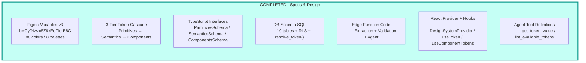
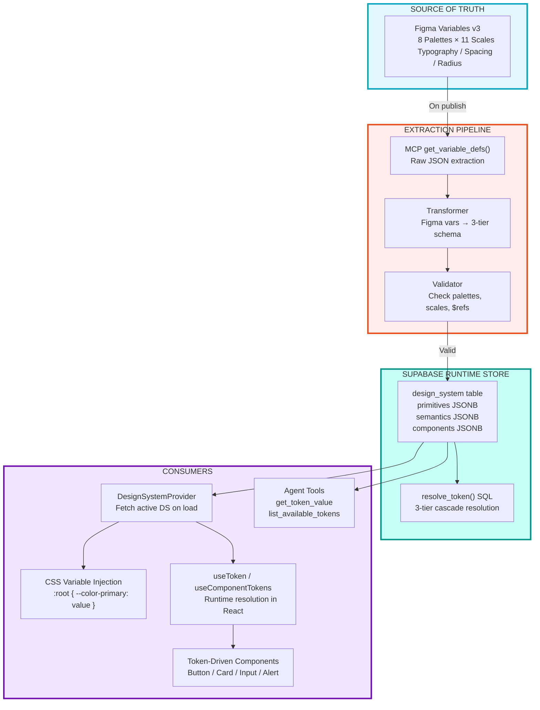
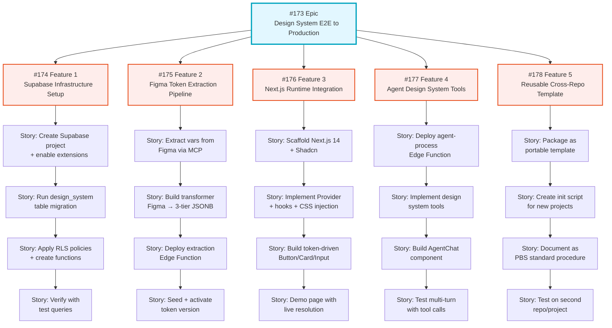
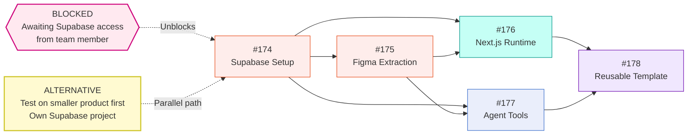
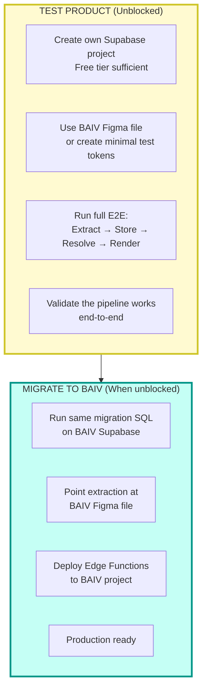

# Design System E2E Implementation Plan

## Epic #173: Design System E2E to Production

---

## 1. Current State: What's Built

---

## 2. E2E Workflow: Figma → Production

---

## 3. Epic → Feature → Story Hierarchy

---

## 4. Dependency Chain

---

## 5. Recommended Path: Test Product First

Since Supabase access is blocked on the main BAIV project, run the E2E prototype on a smaller test product:

### Test Product Setup

| Item | Value |
|------|-------|
| Supabase | New free-tier project (your own account) |
| Figma | Use existing BAIV file `bXCyfNwzc8Z9kEeFIeIB8C` or subset |
| Repo | New repo e.g. `TeamBAIV/ds-e2e-prototype` or branch in PF-Core-BAIV |
| Scope | Features #174 + #175 + #176 (infra + extraction + runtime) |
| Goal | Prove token cascade resolves from Figma → DB → React component |

### What This Proves

| Question | Validated By |
|----------|-------------|
| Does MCP extraction produce valid JSONB? | Feature #175 |
| Does resolve_token() cascade correctly? | Feature #174 |
| Do components render from DB tokens? | Feature #176 |
| Can we change Figma → see UI update? | Full loop |
| Is the process portable? | Migrating to BAIV proves #178 |

---

## 6. Issue Summary

| # | Type | Title | Status | Blocked By |
|---|------|-------|--------|------------|
| [#173](https://github.com/TeamBAIV/PF-Core-BAIV/issues/173) | Epic | Design System E2E to Production | Open | - |
| [#174](https://github.com/TeamBAIV/PF-Core-BAIV/issues/174) | Feature | Supabase Infrastructure Setup | Open | Supabase access |
| [#175](https://github.com/TeamBAIV/PF-Core-BAIV/issues/175) | Feature | Figma Token Extraction Pipeline | Open | #174 |
| [#176](https://github.com/TeamBAIV/PF-Core-BAIV/issues/176) | Feature | Next.js Runtime Integration | Open | #174, #175 |
| [#177](https://github.com/TeamBAIV/PF-Core-BAIV/issues/177) | Feature | Agent Design System Tools | Open | #174, #175 |
| [#178](https://github.com/TeamBAIV/PF-Core-BAIV/issues/178) | Feature | Reusable Cross-Repo Template | Open | #174-#177 |

---

*Plan Version: 1.0.0*
*Created: 2026-01-27*
*Epic: #173*
*Project: ajrmooreuk/projects/22*
