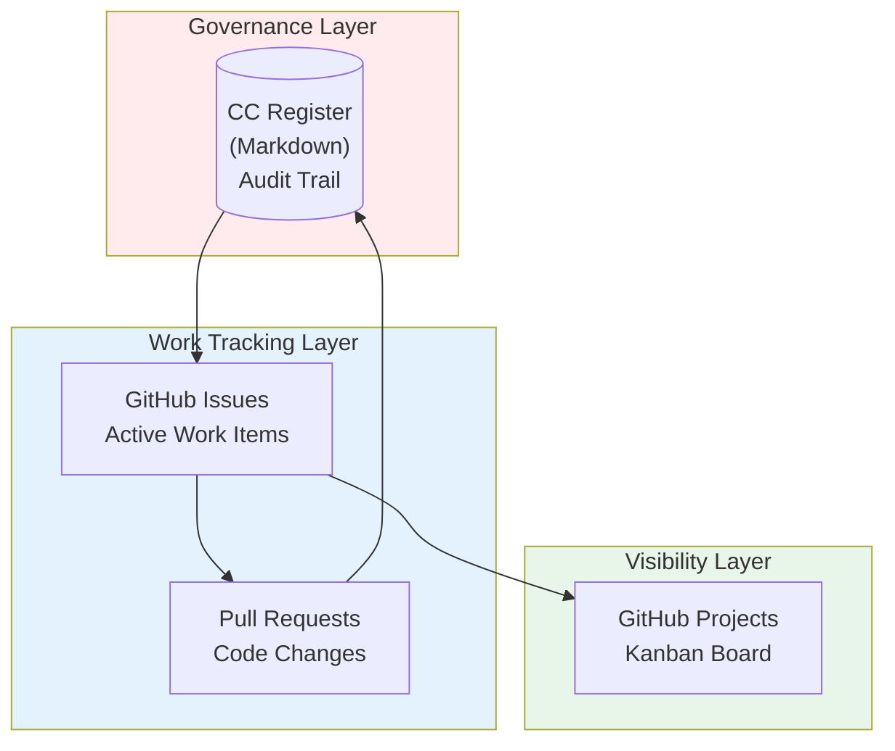
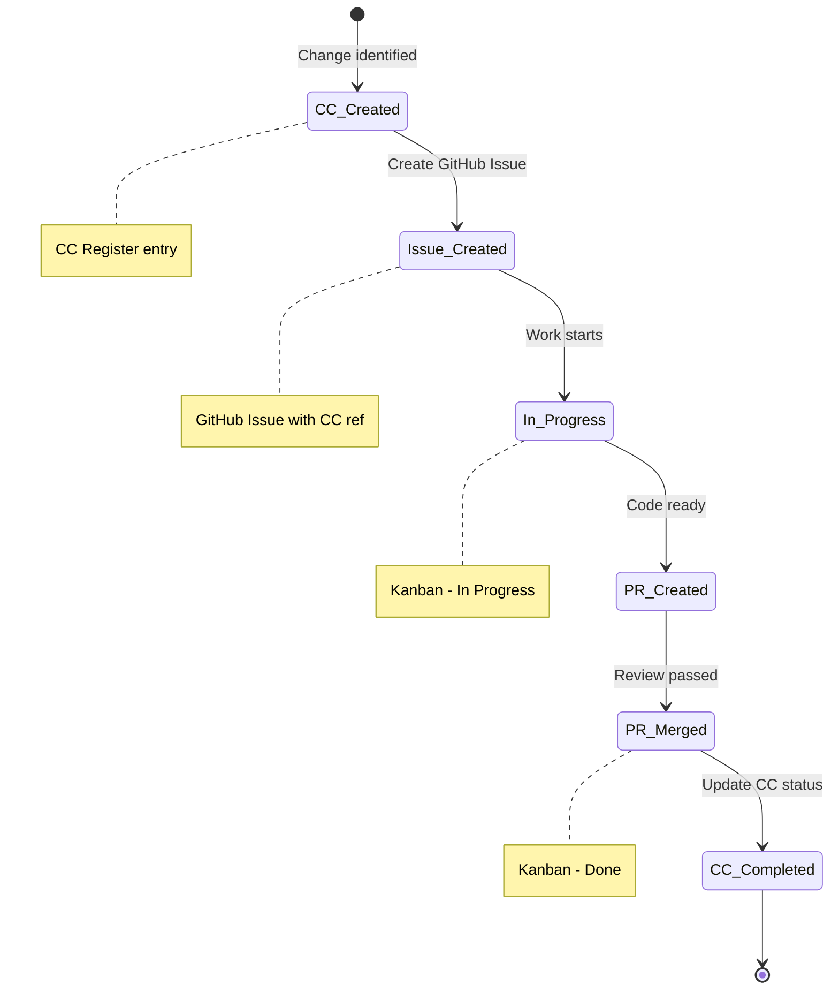

# VHF Change Control & GitHub Workflow
## CC Register <-> GitHub Issues <-> Kanban Integration

---

| Document Control | |
|-----------------|---|
| **Document Number** | VHF-STD-002 |
| **Version** | 1.0 |
| **Status** | Active |
| **Date** | 26 January 2026 |

---

## 1. PURPOSE

This document defines how Change Control (CC) items integrate with GitHub Issues and Projects:
- **Governance** - CC Register as audit trail
- **Visibility** - GitHub Projects Kanban for team
- **Traceability** - Links between CC, Issues, and PRs
- **Value-first** - Changes must demonstrate benefit

### 1.1 Master Change Control Reference

> **IMPORTANT:** This workflow document complements the **Master Change Control Register**:
>
> | Document | Location | Purpose |
> |----------|----------|---------|
> | [VHF-NI-App-Mk3-Master-Change-Control-v1.0.md](../VHF-NI-App-Mk3-Master-Change-Control-v1.0.md) | Root | Detailed CC register, version tracking, approval status |
> | This document (VHF_CC_GITHUB_WORKFLOW.md) | std-docs/ | GitHub integration workflow |
>
> The Master Change Control Register contains:
> - Complete document version register (Section 3)
> - Major changes summary with migration notes (Section 4)
> - Design token verification matrix (Section 5)
> - Brand asset mapping (Section 6)
> - Approval workflows and sign-off records (Section 8)

---

## 2. DEFINITION OF READY

Before creating a CC item or GitHub Issue:

```
+-------------------------------------------------------------+
|  CHANGE REQUEST GATE                                         |
+-------------------------------------------------------------+
|  1. VALUE: What benefit does this deliver?                   |
|  2. DONE:  How do we know it's complete?                     |
|  3. WORKS: How do we verify it works?                        |
+-------------------------------------------------------------+
|  Can't answer all three? -> Don't create the request         |
+-------------------------------------------------------------+
```

---

## 3. WORKFLOW OVERVIEW



---

## 4. NAMING CONVENTIONS

### GitHub Issues
```
[CC-###] Brief description
```
Example: `[CC-001] Add responsive navigation component`

### Pull Requests
```
[CC-###] Brief description
```
Example: `[CC-001] Add responsive navigation component`

### Branch Names
```
feature/cc-###-brief-description
```
Example: `feature/cc-001-responsive-nav`

---

## 5. ITEM LIFECYCLE



---

## 6. GITHUB PROJECTS SETUP

### Recommended Columns

| Column | WIP Limit | Contains |
|--------|-----------|----------|
| **Backlog** | - | Future work |
| **Ready** | 10 | Refined, ready to start |
| **In Progress** | 5 | Active development |
| **Review** | 3 | PR review |
| **Done** | - | Completed |

---

## 7. QUICK REFERENCE

### Create Issue from CC Item
```bash
gh issue create \
  --title "[CC-001] Add responsive navigation" \
  --body "CC Reference: CC-001

## Task
Implement responsive navigation component

## Acceptance Criteria
- [ ] Works on mobile
- [ ] Works on desktop
"
```

### Update CC After PR Merge
1. PR merged -> Issue auto-closes
2. Update CC Register: status -> **COMPLETED**
3. Add PR/Issue link to CC entry

---

## 8. SUMMARY

```
+-------------------------------------------------------------+
|  CC Register        GitHub Issues      GitHub Projects       |
|  ============       =============      ===============       |
|  Audit/Governance   Work Tracking      Visibility            |
|  Historical         Active             Real-time             |
|  Markdown           Issue #            Kanban Board          |
+-------------------------------------------------------------+
```

**Rule:** One source of truth per concern. No duplication.

---

**--- END OF WORKFLOW DOCUMENT ---**

*Version 1.0 | Active*
*26 January 2026*
