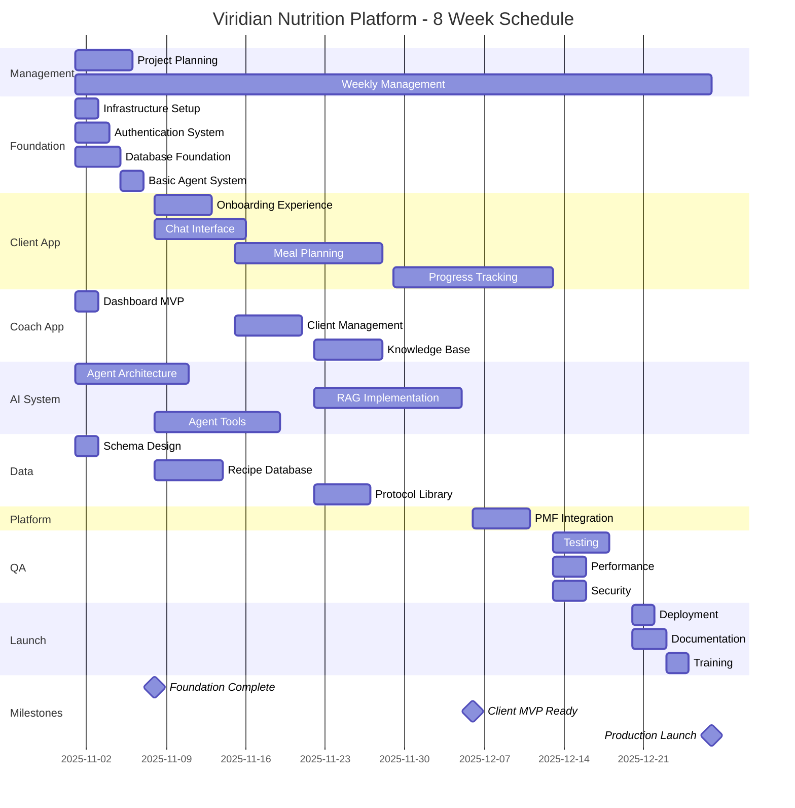
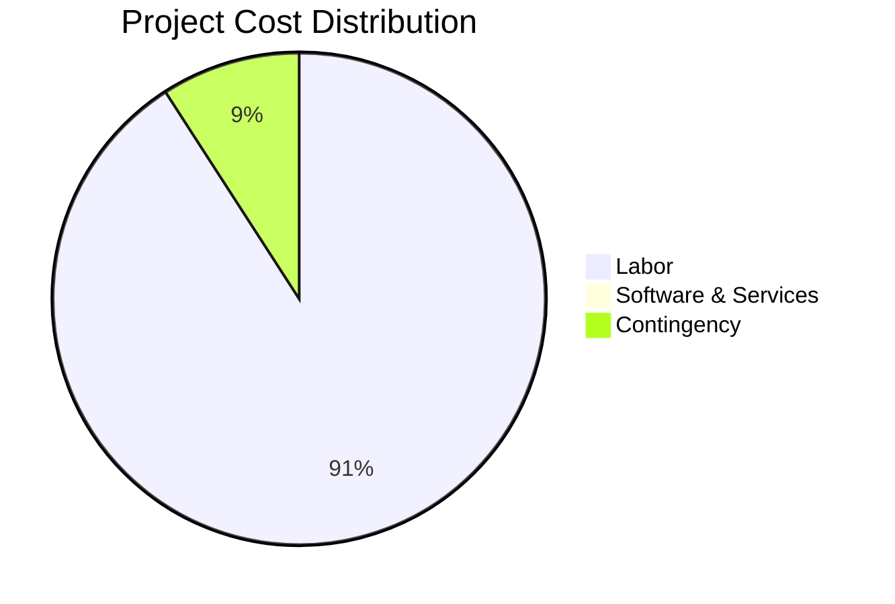

# Work Breakdown Structure: Viridian Nutrition Intelligence Platform

**Version:** 1.0  
**Project:** Viridian Nutrition Intelligence Platform MVP 1.2  
**Project Manager:** TBD  
**Product Owner:** James Kerby  
**Duration:** 8 Weeks (56 Days)  
**Methodology:** Agile/Incremental Delivery

---

## WBS Overview

This Work Breakdown Structure (WBS) decomposes the Viridian Nutrition Intelligence Platform project into a hierarchical structure of deliverables and work packages. The WBS is deliverable-oriented (what needs to be produced) whereas the PBS focuses on product components (what the product contains).

**WBS Principles:**
- 100% Rule: All work is captured (parent = sum of children)
- Mutually Exclusive: No overlap between sibling elements
- Deliverable-Oriented: Focus on outputs, not activities
- Level of Detail: Decomposed to manageable work packages (40-80 hours)

**WBS Coding:** X.Y.Z format
- X = Level 1 (Major Deliverable Phase)
- Y = Level 2 (Deliverable Category)
- Z = Level 3 (Work Package)

---

## Table of Contents

1. [WBS Dictionary](#wbs-dictionary)
2. [WBS Hierarchy Diagram](#wbs-hierarchy-diagram)
3. [Level 1: Project Phases](#level-1-project-phases)
4. [Level 2-3: Detailed Decomposition](#level-2-3-detailed-decomposition)
5. [Resource Requirements](#resource-requirements)
6. [Schedule Integration](#schedule-integration)
7. [Cost Estimates](#cost-estimates)

---

## WBS Dictionary

### 1.0 PROJECT MANAGEMENT
**Description:** All project management activities including planning, coordination, status reporting, risk management, and stakeholder communication  
**Deliverables:** Project plan, status reports, risk register, change requests  
**Owner:** Project Manager  
**Duration:** 8 weeks (continuous)

### 2.0 TECHNICAL FOUNDATION
**Description:** Core infrastructure setup including development environment, authentication, database, and basic agent implementation  
**Deliverables:** Working dev environment, authenticated application, database schema, basic agent  
**Owner:** Technical Lead  
**Duration:** Week 1 (5 days)

### 3.0 CLIENT APPLICATION
**Description:** All client-facing features including onboarding, chat interface, meal planning, and progress tracking  
**Deliverables:** Client portal with full functionality  
**Owner:** Frontend Lead  
**Duration:** Weeks 2-5 (20 days)

### 4.0 COACH APPLICATION
**Description:** Coach-facing tools including dashboard, client management, and knowledge base editor  
**Deliverables:** Coach portal with management capabilities  
**Owner:** Frontend Lead  
**Duration:** Weeks 1-4, 8 (15 days)

### 5.0 AI INTELLIGENCE SYSTEM
**Description:** All AI/ML components including agent architecture, RAG system, and tool implementations  
**Deliverables:** Multi-agent system with RAG capabilities  
**Owner:** AI/ML Lead  
**Duration:** Weeks 1-5 (25 days)

### 6.0 DATA & CONTENT
**Description:** All data structures, content creation, and database seeding  
**Deliverables:** Complete database with recipes and protocols  
**Owner:** Data Lead / James Kerby  
**Duration:** Weeks 1-4 (20 days)

### 7.0 PLATFORM INTEGRATION
**Description:** Integration with Platform PMF Module and external services  
**Deliverables:** Working PMF integration with analytics  
**Owner:** Backend Lead  
**Duration:** Week 6 (5 days)

### 8.0 QUALITY ASSURANCE
**Description:** Testing, optimization, security hardening, and performance tuning  
**Deliverables:** Test suite, performance report, security audit  
**Owner:** QA Lead  
**Duration:** Week 7 (5 days)

### 9.0 DEPLOYMENT & LAUNCH
**Description:** Production deployment, documentation, training, and go-live  
**Deliverables:** Live application, documentation, trained users  
**Owner:** DevOps Lead  
**Duration:** Week 8 (5 days)

---

## WBS Hierarchy Diagram

```mermaid
graph TD
    Root[0.0 Viridian Nutrition<br/>Intelligence Platform]
    
    Root --> PM[1.0 Project Management]
    Root --> Foundation[2.0 Technical Foundation]
    Root --> Client[3.0 Client Application]
    Root --> Coach[4.0 Coach Application]
    Root --> AI[5.0 AI Intelligence System]
    Root --> Data[6.0 Data & Content]
    Root --> Platform[7.0 Platform Integration]
    Root --> QA[8.0 Quality Assurance]
    Root --> Deploy[9.0 Deployment & Launch]
    
    PM --> PM1[1.1 Planning]
    PM --> PM2[1.2 Execution Management]
    PM --> PM3[1.3 Reporting & Control]
    
    Foundation --> F1[2.1 Infrastructure Setup]
    Foundation --> F2[2.2 Authentication System]
    Foundation --> F3[2.3 Database Foundation]
    Foundation --> F4[2.4 Basic Agent System]
    
    Client --> C1[3.1 Onboarding Experience]
    Client --> C2[3.2 Nutrition Chat Interface]
    Client --> C3[3.3 Meal Planning Features]
    Client --> C4[3.4 Progress Tracking]
    
    Coach --> CO1[4.1 Dashboard & Reporting]
    Coach --> CO2[4.2 Client Management]
    Coach --> CO3[4.3 Knowledge Base Tools]
    
    AI --> A1[5.1 Agent Architecture]
    AI --> A2[5.2 RAG Implementation]
    AI --> A3[5.3 Agent Tools & Utilities]
    
    Data --> D1[6.1 Schema Design]
    Data --> D2[6.2 Recipe Database]
    Data --> D3[6.3 Protocol Library]
    
    Platform --> P1[7.1 PMF Module Integration]
    Platform --> P2[7.2 Analytics Implementation]
    
    QA --> Q1[8.1 Testing]
    QA --> Q2[8.2 Performance Optimization]
    QA --> Q3[8.3 Security Hardening]
    
    Deploy --> DE1[9.1 Production Deployment]
    Deploy --> DE2[9.2 Documentation]
    Deploy --> DE3[9.3 Training & Handover]
    
    style Root fill:#e1f5ff
    style PM fill:#fff4e1
    style Foundation fill:#e8f5e9
    style Client fill:#f3e5f5
    style Coach fill:#fce4ec
    style AI fill:#fff9c4
    style Data fill:#e0f2f1
    style Platform fill:#f3e5f5
    style QA fill:#ffebee
    style Deploy fill:#e8eaf6
```

---

## Level 1: Project Phases

### 1.0 PROJECT MANAGEMENT (Duration: 8 weeks)
**Total Effort:** 80 hours  
**% of Total Project:** 5%

#### 1.1 Project Planning & Initiation
- 1.1.1 Project Charter Development
- 1.1.2 Stakeholder Analysis
- 1.1.3 Communication Plan
- 1.1.4 Risk Management Plan
- 1.1.5 Resource Allocation Plan

#### 1.2 Execution Management
- 1.2.1 Weekly Sprint Planning
- 1.2.2 Daily Standups (40 sessions)
- 1.2.3 Sprint Reviews (8 sessions)
- 1.2.4 Sprint Retrospectives (8 sessions)

#### 1.3 Monitoring & Control
- 1.3.1 Weekly Status Reports
- 1.3.2 Risk Tracking & Mitigation
- 1.3.3 Change Management
- 1.3.4 Budget Tracking

---

### 2.0 TECHNICAL FOUNDATION (Duration: Week 1)
**Total Effort:** 120 hours  
**% of Total Project:** 8%

#### 2.1 Infrastructure Setup (24h)
- 2.1.1 Development Environment Configuration (8h)
- 2.1.2 Version Control Setup (4h)
- 2.1.3 CI/CD Pipeline Implementation (8h)
- 2.1.4 Environment Variables & Secrets Management (4h)

#### 2.2 Authentication System (32h)
- 2.2.1 Supabase Auth Integration (16h)
- 2.2.2 Authentication UI Components (8h)
- 2.2.3 Session Management (4h)
- 2.2.4 Route Protection Middleware (4h)

#### 2.3 Database Foundation (40h)
- 2.3.1 Schema Design & Documentation (8h)
- 2.3.2 Core Tables Implementation (16h)
- 2.3.3 RLS Policies Configuration (8h)
- 2.3.4 Database Access Layer (8h)

#### 2.4 Basic Agent System (24h)
- 2.4.1 Agent SDK Integration (8h)
- 2.4.2 Nutrition Advisor Agent Core (16h)

---

### 3.0 CLIENT APPLICATION (Duration: Weeks 2-5)
**Total Effort:** 320 hours  
**% of Total Project:** 20%

#### 3.1 Onboarding Experience (40h)
- 3.1.1 Multi-Step Form Design (8h)
- 3.1.2 Step 1: Demographics Implementation (8h)
- 3.1.3 Step 2: Health Profile Implementation (8h)
- 3.1.4 Step 3: Goals Implementation (8h)
- 3.1.5 Step 4: Preferences Implementation (8h)

#### 3.2 Nutrition Chat Interface (64h)
- 3.2.1 Chat UI Layout & Components (16h)
- 3.2.2 Message Streaming Implementation (16h)
- 3.2.3 Conversation History Management (8h)
- 3.2.4 Recipe Display Integration (16h)
- 3.2.5 Error Handling & Loading States (8h)

#### 3.3 Meal Planning Features (104h)
- 3.3.1 Meal Plan Generation Backend (40h)
- 3.3.2 Meal Plan Calendar UI (24h)
- 3.3.3 Recipe Detail Views (16h)
- 3.3.4 Shopping List Generator (16h)
- 3.3.5 PDF Export Functionality (8h)

#### 3.4 Progress Tracking (112h)
- 3.4.1 Progress Logging Forms (24h)
- 3.4.2 Data Visualization Components (40h)
- 3.4.3 Progress Charts Implementation (32h)
- 3.4.4 Trend Analysis UI (16h)

---

### 4.0 COACH APPLICATION (Duration: Weeks 1-4, 8)
**Total Effort:** 144 hours  
**% of Total Project:** 9%

#### 4.1 Dashboard & Reporting (48h)
- 4.1.1 Coach Dashboard Layout (16h)
- 4.1.2 Client List Table (16h)
- 4.1.3 Summary Statistics Cards (8h)
- 4.1.4 Quick Action Buttons (8h)

#### 4.2 Client Management (48h)
- 4.2.1 Client Detail Page (24h)
- 4.2.2 Client Profile Editor (16h)
- 4.2.3 Coach Notes System (8h)

#### 4.3 Knowledge Base Tools (48h)
- 4.3.1 Protocol List Interface (8h)
- 4.3.2 Protocol Editor with Markdown (24h)
- 4.3.3 Version Control System (8h)
- 4.3.4 Protocol Search & Filtering (8h)

---

### 5.0 AI INTELLIGENCE SYSTEM (Duration: Weeks 1-5)
**Total Effort:** 272 hours  
**% of Total Project:** 17%

#### 5.1 Agent Architecture (80h)
- 5.1.1 Base Agent Class Implementation (32h)
- 5.1.2 Agent Coordination System (24h)
- 5.1.3 Safety Validation Layer (24h)

#### 5.2 RAG Implementation (104h)
- 5.2.1 Vector Database Setup (24h)
- 5.2.2 Embedding Generation Pipeline (32h)
- 5.2.3 Semantic Search Implementation (32h)
- 5.2.4 Context Injection System (16h)

#### 5.3 Agent Tools & Utilities (88h)
- 5.3.1 Recipe Search Tool (32h)
- 5.3.2 Macro Calculator Tool (24h)
- 5.3.3 Protocol RAG Tool (24h)
- 5.3.4 Database Query Tool (8h)

---

### 6.0 DATA & CONTENT (Duration: Weeks 1-4)
**Total Effort:** 104 hours  
**% of Total Project:** 7%

#### 6.1 Schema Design (16h)
- 6.1.1 Schema.org Mapping (8h)
- 6.1.2 JSONB Structure Definition (4h)
- 6.1.3 Schema Documentation (4h)

#### 6.2 Recipe Database (48h)
- 6.2.1 Recipe Schema Design (8h)
- 6.2.2 Recipe Content Creation (24h)
- 6.2.3 Nutrition Calculation (8h)
- 6.2.4 Recipe Data Import (8h)

#### 6.3 Protocol Library (40h)
- 6.3.1 Protocol Template Design (8h)
- 6.3.2 Content Creation (James: 24h)
- 6.3.3 Protocol Review & Editing (8h)

---

### 7.0 PLATFORM INTEGRATION (Duration: Week 6)
**Total Effort:** 104 hours  
**% of Total Project:** 7%

#### 7.1 PMF Module Integration (64h)
- 7.1.1 Platform API Client Development (32h)
- 7.1.2 Event Tracking Implementation (24h)
- 7.1.3 Sync Queue System (8h)

#### 7.2 Analytics Implementation (40h)
- 7.2.1 PMF Dashboard UI (24h)
- 7.2.2 Metrics Visualization (16h)

---

### 8.0 QUALITY ASSURANCE (Duration: Week 7)
**Total Effort:** 168 hours  
**% of Total Project:** 11%

#### 8.1 Testing (80h)
- 8.1.1 Unit Test Suite Development (40h)
- 8.1.2 Integration Test Implementation (24h)
- 8.1.3 E2E Test Suite (16h)

#### 8.2 Performance Optimization (48h)
- 8.2.1 Prompt Caching Implementation (24h)
- 8.2.2 Parallel Tool Execution (16h)
- 8.2.3 Database Query Optimization (8h)

#### 8.3 Security Hardening (40h)
- 8.3.1 Security Audit (24h)
- 8.3.2 GDPR Compliance Review (16h)

---

### 9.0 DEPLOYMENT & LAUNCH (Duration: Week 8)
**Total Effort:** 104 hours  
**% of Total Project:** 7%

#### 9.1 Production Deployment (40h)
- 9.1.1 Production Environment Setup (16h)
- 9.1.2 Data Migration (8h)
- 9.1.3 Deployment Execution (8h)
- 9.1.4 Smoke Testing (8h)

#### 9.2 Documentation (40h)
- 9.2.1 User Documentation (24h)
- 9.2.2 Technical Documentation (16h)

#### 9.3 Training & Handover (24h)
- 9.3.1 James Training Session (8h)
- 9.3.2 Beta Client Onboarding (16h)

---

## Level 2-3: Detailed Decomposition

### 2.1 INFRASTRUCTURE SETUP

#### 2.1.1 Development Environment Configuration
**WBS Code:** 2.1.1  
**Duration:** 8 hours  
**Resource:** Lead Developer  
**Deliverable:** Configured Next.js project with all dependencies

**Tasks:**
1. Initialize Next.js 14 project with App Router (1h)
2. Install and configure Shadcn UI (1h)
3. Install Anthropic SDK and Supabase client (1h)
4. Configure TypeScript, ESLint, Prettier (2h)
5. Set up environment variable structure (1h)
6. Write setup documentation (1h)
7. Test development server (1h)

**Acceptance Criteria:**
- Project runs with `npm run dev`
- All dependencies locked in package-lock.json
- TypeScript compiles without errors
- README includes setup instructions

**Cost:** $800 (@ $100/hr)

---

#### 2.1.2 Version Control Setup
**WBS Code:** 2.1.2  
**Duration:** 4 hours  
**Resource:** Lead Developer  
**Deliverable:** Git repository with branching strategy

**Tasks:**
1. Initialize Git repository (0.5h)
2. Configure .gitignore for Next.js (0.5h)
3. Set up GitHub repository (0.5h)
4. Create branch protection rules (1h)
5. Document Git workflow (1h)
6. Create initial commit (0.5h)

**Acceptance Criteria:**
- Repository on GitHub
- Main branch protected
- Git workflow documented

**Cost:** $400

---

#### 2.1.3 CI/CD Pipeline Implementation
**WBS Code:** 2.1.3  
**Duration:** 8 hours  
**Resource:** DevOps Engineer  
**Deliverable:** Automated testing and deployment pipeline

**Tasks:**
1. Create GitHub Actions workflow file (2h)
2. Configure test runner (2h)
3. Set up Vercel integration (2h)
4. Configure preview deployments (1h)
5. Test full pipeline (1h)

**Acceptance Criteria:**
- Tests run on every PR
- Preview deployments created automatically
- Main branch deploys to staging
- Failed tests block merge

**Cost:** $800

---

#### 2.1.4 Environment Variables & Secrets Management
**WBS Code:** 2.1.4  
**Duration:** 4 hours  
**Resource:** DevOps Engineer  
**Deliverable:** Secure secrets management

**Tasks:**
1. Create .env.example template (1h)
2. Configure Vercel environment variables (1h)
3. Set up Supabase secrets (1h)
4. Document secrets management process (1h)

**Acceptance Criteria:**
- All secrets documented in .env.example
- Production secrets configured in Vercel
- No secrets in Git history

**Cost:** $400

---

### 2.2 AUTHENTICATION SYSTEM

#### 2.2.1 Supabase Auth Integration
**WBS Code:** 2.2.1  
**Duration:** 16 hours  
**Resource:** Backend Developer  
**Deliverable:** Working authentication system

**Tasks:**
1. Configure Supabase Auth settings (2h)
2. Implement email/password signup (4h)
3. Implement magic link login (4h)
4. Create auth middleware (3h)
5. Implement session management (2h)
6. Write unit tests (1h)

**Acceptance Criteria:**
- Users can sign up with email/password
- Magic link login works
- Sessions persist across refreshes
- Tests pass

**Cost:** $1,600

---

#### 2.2.2 Authentication UI Components
**WBS Code:** 2.2.2  
**Duration:** 8 hours  
**Resource:** Frontend Developer  
**Deliverable:** Login and signup pages

**Tasks:**
1. Create login page component (2h)
2. Create signup page component (2h)
3. Build form validation (2h)
4. Add loading/error states (1h)
5. Make responsive (1h)

**Acceptance Criteria:**
- Forms validate input
- Error messages display clearly
- Mobile responsive
- Accessible (WCAG 2.1 AA)

**Cost:** $800

---

#### 2.2.3 Session Management
**WBS Code:** 2.2.3  
**Duration:** 4 hours  
**Resource:** Backend Developer  
**Deliverable:** Session handling system

**Tasks:**
1. Implement token refresh logic (2h)
2. Add logout functionality (1h)
3. Handle expired sessions (1h)

**Acceptance Criteria:**
- Sessions refresh automatically
- Logout clears all data
- Expired sessions redirect to login

**Cost:** $400

---

#### 2.2.4 Route Protection Middleware
**WBS Code:** 2.2.4  
**Duration:** 4 hours  
**Resource:** Backend Developer  
**Deliverable:** Protected route middleware

**Tasks:**
1. Create auth middleware (2h)
2. Apply to protected routes (1h)
3. Test protection (1h)

**Acceptance Criteria:**
- Unauthenticated users redirected
- Authenticated users access routes
- Middleware applied consistently

**Cost:** $400

---

### 2.3 DATABASE FOUNDATION

#### 2.3.1 Schema Design & Documentation
**WBS Code:** 2.3.1  
**Duration:** 8 hours  
**Resource:** Database Architect  
**Deliverable:** Complete schema documentation

**Tasks:**
1. Design Schema.org mappings (3h)
2. Define JSONB structures (2h)
3. Create ER diagram (2h)
4. Write schema documentation (1h)

**Acceptance Criteria:**
- All tables documented
- ER diagram shows relationships
- Schema.org mappings clear

**Cost:** $800

---

#### 2.3.2 Core Tables Implementation
**WBS Code:** 2.3.2  
**Duration:** 16 hours  
**Resource:** Backend Developer  
**Deliverable:** Database tables and migrations

**Tasks:**
1. Create coaches table migration (2h)
2. Create clients table migration (3h)
3. Create conversations table migration (2h)
4. Create indexes (2h)
5. Generate TypeScript types (2h)
6. Write seed data script (3h)
7. Test migrations (2h)

**Acceptance Criteria:**
- All tables created successfully
- Types match schema
- Seed data loads correctly
- Migrations reversible

**Cost:** $1,600

---

#### 2.3.3 RLS Policies Configuration
**WBS Code:** 2.3.3  
**Duration:** 8 hours  
**Resource:** Backend Developer  
**Deliverable:** Row-level security policies

**Tasks:**
1. Design RLS policy structure (2h)
2. Implement coaches RLS (2h)
3. Implement clients RLS (2h)
4. Test policy enforcement (2h)

**Acceptance Criteria:**
- Clients see only own data
- Coaches see only their clients
- Tests verify isolation

**Cost:** $800

---

#### 2.3.4 Database Access Layer
**WBS Code:** 2.3.4  
**Duration:** 8 hours  
**Resource:** Backend Developer  
**Deliverable:** Type-safe database client

**Tasks:**
1. Set up Supabase clients (SSR + CSR) (3h)
2. Create query helper functions (3h)
3. Implement error handling (1h)
4. Write integration tests (1h)

**Acceptance Criteria:**
- Type-safe queries work
- Error handling consistent
- Tests verify CRUD operations

**Cost:** $800

---

### 2.4 BASIC AGENT SYSTEM

#### 2.4.1 Agent SDK Integration
**WBS Code:** 2.4.1  
**Duration:** 8 hours  
**Resource:** AI Developer  
**Deliverable:** Claude SDK integration

**Tasks:**
1. Install Anthropic SDK (1h)
2. Configure API credentials (1h)
3. Create basic streaming test (2h)
4. Implement error handling (2h)
5. Test streaming responses (2h)

**Acceptance Criteria:**
- SDK installed and configured
- Streaming works reliably
- Errors handled gracefully

**Cost:** $800

---

#### 2.4.2 Nutrition Advisor Agent Core
**WBS Code:** 2.4.2  
**Duration:** 16 hours  
**Resource:** AI Developer  
**Deliverable:** Working nutrition advisor agent

**Tasks:**
1. Design agent architecture (3h)
2. Write system prompt (3h)
3. Implement streaming handler (4h)
4. Add conversation storage (3h)
5. Create API route (2h)
6. Write integration tests (1h)

**Acceptance Criteria:**
- Agent responds appropriately
- Streaming smooth
- Conversations persist
- Safety checks in place

**Cost:** $1,600

---

### 3.0 CLIENT APPLICATION - Detailed Breakdown

#### 3.1.1 Multi-Step Form Design
**WBS Code:** 3.1.1  
**Duration:** 8 hours  
**Resource:** Frontend Developer + UX Designer  
**Deliverable:** Onboarding flow wireframes and design

**Tasks:**
1. Design 4-step flow structure (2h)
2. Create wireframes for each step (3h)
3. Design progress indicator (1h)
4. Review with James (2h)

**Acceptance Criteria:**
- Flow approved by James
- Wireframes complete
- Progress indicator designed

**Cost:** $800

---

#### 3.1.2 Step 1: Demographics Implementation
**WBS Code:** 3.1.2  
**Duration:** 8 hours  
**Resource:** Frontend Developer  
**Deliverable:** Demographics form

**Tasks:**
1. Build form layout (2h)
2. Add input validation (2h)
3. Implement field components (3h)
4. Add navigation (1h)

**Acceptance Criteria:**
- Form captures all demographics
- Validation prevents bad data
- Navigation works smoothly

**Cost:** $800

---

#### 3.1.3 Step 2: Health Profile Implementation
**WBS Code:** 3.1.3  
**Duration:** 8 hours  
**Resource:** Frontend Developer  
**Deliverable:** Health profile form

**Tasks:**
1. Build medical conditions selector (3h)
2. Add medication inputs (2h)
3. Implement activity level selector (2h)
4. Add validation (1h)

**Acceptance Criteria:**
- Health data captured completely
- UI intuitive for medical info

**Cost:** $800

---

#### 3.1.4 Step 3: Goals Implementation
**WBS Code:** 3.1.4  
**Duration:** 8 hours  
**Resource:** Frontend Developer  
**Deliverable:** Goals form

**Tasks:**
1. Build goal selection UI (3h)
2. Add target weight/outcome inputs (2h)
3. Implement timeline selector (2h)
4. Add motivation field (1h)

**Acceptance Criteria:**
- Goals clearly defined
- Timeline realistic options

**Cost:** $800

---

#### 3.1.5 Step 4: Preferences Implementation
**WBS Code:** 3.1.5  
**Duration:** 8 hours  
**Resource:** Frontend Developer  
**Deliverable:** Preferences form

**Tasks:**
1. Build allergy multi-select (2h)
2. Add dietary restrictions checkboxes (2h)
3. Implement cooking skill selector (2h)
4. Add summary & submit (2h)

**Acceptance Criteria:**
- All preferences captured
- Summary shows complete profile
- Submission stores to database

**Cost:** $800

---

### 3.2 NUTRITION CHAT INTERFACE

#### 3.2.1 Chat UI Layout & Components
**WBS Code:** 3.2.1  
**Duration:** 16 hours  
**Resource:** Frontend Developer  
**Deliverable:** Chat interface components

**Tasks:**
1. Create chat container layout (4h)
2. Build message bubble component (4h)
3. Create chat input component (4h)
4. Style with Shadcn (4h)

**Acceptance Criteria:**
- Chat interface displays messages
- Message bubbles styled correctly
- Input accepts user text

**Cost:** $1,600

---

#### 3.2.2 Message Streaming Implementation
**WBS Code:** 3.2.2  
**Duration:** 16 hours  
**Resource:** Frontend Developer  
**Deliverable:** Real-time streaming responses

**Tasks:**
1. Implement Server-Sent Events client (6h)
2. Add streaming response handler (6h)
3. Display letter-by-letter (2h)
4. Handle stream errors (2h)

**Acceptance Criteria:**
- Responses stream in real-time
- No lag or stuttering
- Errors handled gracefully

**Cost:** $1,600

---

#### 3.2.3 Conversation History Management
**WBS Code:** 3.2.3  
**Duration:** 8 hours  
**Resource:** Frontend Developer  
**Deliverable:** Conversation loading and display

**Tasks:**
1. Fetch conversation history API (3h)
2. Display historical messages (3h)
3. Implement auto-scroll (2h)

**Acceptance Criteria:**
- History loads on mount
- Scrolls to latest message
- Pagination for long conversations

**Cost:** $800

---

#### 3.2.4 Recipe Display Integration
**WBS Code:** 3.2.4  
**Duration:** 16 hours  
**Resource:** Frontend Developer  
**Deliverable:** Recipe cards in chat

**Tasks:**
1. Design recipe card component (4h)
2. Implement nutrition display (4h)
3. Add recipe detail modal (6h)
4. Connect to agent responses (2h)

**Acceptance Criteria:**
- Recipe cards display in chat
- Nutrition info clearly shown
- Modal shows full recipe

**Cost:** $1,600

---

#### 3.2.5 Error Handling & Loading States
**WBS Code:** 3.2.5  
**Duration:** 8 hours  
**Resource:** Frontend Developer  
**Deliverable:** Error and loading UI

**Tasks:**
1. Create loading spinner component (2h)
2. Implement error message display (3h)
3. Add retry mechanism (2h)
4. Test error scenarios (1h)

**Acceptance Criteria:**
- Loading states show during requests
- Errors display with helpful messages
- Retry button works

**Cost:** $800

---

### 3.3 MEAL PLANNING FEATURES

#### 3.3.1 Meal Plan Generation Backend
**WBS Code:** 3.3.1  
**Duration:** 40 hours  
**Resource:** AI Developer + Backend Developer  
**Deliverable:** Meal plan generation system

**Tasks:**
1. Create Meal Planner Agent (16h)
2. Implement macro calculation (8h)
3. Build recipe selection algorithm (8h)
4. Add plan validation (4h)
5. Create API endpoint (2h)
6. Write tests (2h)

**Acceptance Criteria:**
- Generates valid 7-day plans
- Meets macro targets ±5%
- No recipe repeated >2x
- Plans stored in database

**Cost:** $4,000

---

#### 3.3.2 Meal Plan Calendar UI
**WBS Code:** 3.3.2  
**Duration:** 24 hours  
**Resource:** Frontend Developer  
**Deliverable:** Weekly meal plan display

**Tasks:**
1. Design calendar layout (6h)
2. Build day components (8h)
3. Implement meal cards (6h)
4. Add expand/collapse (4h)

**Acceptance Criteria:**
- Weekly view shows 7 days
- Each meal displays name and macros
- Expandable for details

**Cost:** $2,400

---

#### 3.3.3 Recipe Detail Views
**WBS Code:** 3.3.3  
**Duration:** 16 hours  
**Resource:** Frontend Developer  
**Deliverable:** Recipe detail modal

**Tasks:**
1. Create modal component (4h)
2. Display ingredients list (4h)
3. Show cooking instructions (4h)
4. Add nutrition breakdown (4h)

**Acceptance Criteria:**
- Modal shows complete recipe
- Instructions clear and numbered
- Nutrition data formatted

**Cost:** $1,600

---

#### 3.3.4 Shopping List Generator
**WBS Code:** 3.3.4  
**Duration:** 16 hours  
**Resource:** Backend + Frontend Developer  
**Deliverable:** Shopping list feature

**Tasks:**
1. Aggregate ingredients from plan (6h)
2. Group by category (4h)
3. Calculate quantities (4h)
4. Display in UI (2h)

**Acceptance Criteria:**
- List includes all ingredients
- Grouped logically (produce, protein, etc.)
- Quantities correct for recipes

**Cost:** $1,600

---

#### 3.3.5 PDF Export Functionality
**WBS Code:** 3.3.5  
**Duration:** 8 hours  
**Resource:** Frontend Developer  
**Deliverable:** PDF export feature

**Tasks:**
1. Install PDF library (1h)
2. Design PDF template (3h)
3. Implement generation (3h)
4. Test downloads (1h)

**Acceptance Criteria:**
- PDF includes complete plan
- Formatted for printing
- Downloads successfully

**Cost:** $800

---

### 3.4 PROGRESS TRACKING

#### 3.4.1 Progress Logging Forms
**WBS Code:** 3.4.1  
**Duration:** 24 hours  
**Resource:** Full Stack Developer  
**Deliverable:** Progress logging system

**Tasks:**
1. Create progress_logs table (4h)
2. Build logging form UI (8h)
3. Implement metric inputs (8h)
4. Add validation and storage (4h)

**Acceptance Criteria:**
- Clients can log multiple metrics
- Form validates entries
- Data persists to database

**Cost:** $2,400

---

#### 3.4.2 Data Visualization Components
**WBS Code:** 3.4.2  
**Duration:** 40 hours  
**Resource:** Frontend Developer  
**Deliverable:** Chart components

**Tasks:**
1. Install charting library (2h)
2. Create chart container components (8h)
3. Implement data fetching (8h)
4. Style charts (12h)
5. Make responsive (10h)

**Acceptance Criteria:**
- Charts render data correctly
- Responsive on mobile
- Performance acceptable

**Cost:** $4,000

---

#### 3.4.3 Progress Charts Implementation
**WBS Code:** 3.4.3  
**Duration:** 32 hours  
**Resource:** Frontend Developer  
**Deliverable:** Weight, adherence, energy charts

**Tasks:**
1. Build weight trend chart (10h)
2. Create adherence heatmap (12h)
3. Implement energy chart (10h)

**Acceptance Criteria:**
- Weight chart shows 4-week trend
- Heatmap highlights patterns
- Energy levels visualized

**Cost:** $3,200

---

#### 3.4.4 Trend Analysis UI
**WBS Code:** 3.4.4  
**Duration:** 16 hours  
**Resource:** Frontend Developer  
**Deliverable:** Correlation and trend views

**Tasks:**
1. Build date range selector (4h)
2. Implement correlation views (8h)
3. Add trend indicators (4h)

**Acceptance Criteria:**
- Date range filters data
- Correlations displayed (sleep vs adherence)
- Trends indicated with arrows/colors

**Cost:** $1,600

---

### 4.0 COACH APPLICATION - Full Breakdown

#### 4.1.1 Coach Dashboard Layout
**WBS Code:** 4.1.1  
**Duration:** 16 hours  
**Resource:** Frontend Developer  
**Deliverable:** Dashboard page structure

**Tasks:**
1. Design dashboard layout (4h)
2. Create grid structure (4h)
3. Build navigation (4h)
4. Add responsive breakpoints (4h)

**Acceptance Criteria:**
- Dashboard displays on all devices
- Navigation intuitive
- Layout matches design

**Cost:** $1,600

---

#### 4.1.2 Client List Table
**WBS Code:** 4.1.2  
**Duration:** 16 hours  
**Resource:** Frontend Developer  
**Deliverable:** Sortable client table

**Tasks:**
1. Build table component (6h)
2. Add sorting functionality (4h)
3. Implement search (4h)
4. Add filters (2h)

**Acceptance Criteria:**
- Table displays all clients
- Sortable by any column
- Search filters results
- Status filters work

**Cost:** $1,600

---

#### 4.1.3 Summary Statistics Cards
**WBS Code:** 4.1.3  
**Duration:** 8 hours  
**Resource:** Frontend Developer  
**Deliverable:** Metric cards

**Tasks:**
1. Design stat cards (2h)
2. Fetch aggregate data (3h)
3. Display metrics (3h)

**Acceptance Criteria:**
- Cards show key metrics
- Data updates in real-time
- Styled consistently

**Cost:** $800

---

#### 4.1.4 Quick Action Buttons
**WBS Code:** 4.1.4  
**Duration:** 8 hours  
**Resource:** Frontend Developer  
**Deliverable:** Action button components

**Tasks:**
1. Create action buttons (4h)
2. Wire up navigation (2h)
3. Test workflows (2h)

**Acceptance Criteria:**
- Buttons launch correct features
- Tooltips explain actions

**Cost:** $800

---

#### 4.2.1 Client Detail Page
**WBS Code:** 4.2.1  
**Duration:** 24 hours  
**Resource:** Frontend Developer  
**Deliverable:** Comprehensive client view

**Tasks:**
1. Design page layout (6h)
2. Display client profile (6h)
3. Show current meal plan (6h)
4. Add progress charts (6h)

**Acceptance Criteria:**
- All client data visible
- Charts show recent progress
- Navigation to related data works

**Cost:** $2,400

---

#### 4.2.2 Client Profile Editor
**WBS Code:** 4.2.2  
**Duration:** 16 hours  
**Resource:** Full Stack Developer  
**Deliverable:** Profile editing capability

**Tasks:**
1. Build edit form (8h)
2. Implement save functionality (4h)
3. Add validation (2h)
4. Test updates (2h)

**Acceptance Criteria:**
- James can edit client profiles
- Changes save correctly
- Validation prevents bad data

**Cost:** $1,600

---

#### 4.2.3 Coach Notes System
**WBS Code:** 4.2.3  
**Duration:** 8 hours  
**Resource:** Full Stack Developer  
**Deliverable:** Private notes feature

**Tasks:**
1. Add notes field to database (2h)
2. Build notes editor (4h)
3. Implement save (2h)

**Acceptance Criteria:**
- James can add private notes
- Notes not visible to clients
- Notes persist

**Cost:** $800

---

#### 4.3.1 Protocol List Interface
**WBS Code:** 4.3.1  
**Duration:** 8 hours  
**Resource:** Frontend Developer  
**Deliverable:** Protocol list page

**Tasks:**
1. Create list layout (3h)
2. Implement search (2h)
3. Add tag filters (2h)
4. Wire up navigation (1h)

**Acceptance Criteria:**
- Lists all protocols
- Search finds protocols
- Tags filter results

**Cost:** $800

---

#### 4.3.2 Protocol Editor with Markdown
**WBS Code:** 4.3.2  
**Duration:** 24 hours  
**Resource:** Frontend Developer  
**Deliverable:** Markdown editor

**Tasks:**
1. Install markdown editor (2h)
2. Build editor component (10h)
3. Add live preview (6h)
4. Implement save (4h)
5. Test editing workflow (2h)

**Acceptance Criteria:**
- Markdown edits smoothly
- Preview updates in real-time
- Saves persist

**Cost:** $2,400

---

#### 4.3.3 Version Control System
**WBS Code:** 4.3.3  
**Duration:** 8 hours  
**Resource:** Backend Developer  
**Deliverable:** Protocol versioning

**Tasks:**
1. Add version column to table (2h)
2. Implement version saving (4h)
3. Build version history UI (2h)

**Acceptance Criteria:**
- Each save creates new version
- History shows all versions
- Can view previous versions

**Cost:** $800

---

#### 4.3.4 Protocol Search & Filtering
**WBS Code:** 4.3.4  
**Duration:** 8 hours  
**Resource:** Frontend Developer  
**Deliverable:** Search and filter UI

**Tasks:**
1. Implement search input (3h)
2. Add tag filtering (3h)
3. Show usage statistics (2h)

**Acceptance Criteria:**
- Search finds protocols by title/content
- Tags filter appropriately
- Usage stats display

**Cost:** $800

---

### 5.0 AI INTELLIGENCE SYSTEM - Complete Breakdown

#### 5.1.1 Base Agent Class Implementation
**WBS Code:** 5.1.1  
**Duration:** 32 hours  
**Resource:** AI Developer  
**Deliverable:** Reusable agent foundation

**Tasks:**
1. Design base agent interface (6h)
2. Implement streaming handler (10h)
3. Create tool execution framework (10h)
4. Add context assembly (4h)
5. Write tests (2h)

**Acceptance Criteria:**
- All agents extend base class
- Streaming consistent
- Tool execution reliable

**Cost:** $3,200

---

#### 5.1.2 Agent Coordination System
**WBS Code:** 5.1.2  
**Duration:** 24 hours  
**Resource:** AI Developer  
**Deliverable:** Agent router

**Tasks:**
1. Design routing logic (6h)
2. Implement intent detection (8h)
3. Add agent delegation (6h)
4. Test coordination (4h)

**Acceptance Criteria:**
- Router identifies intent correctly
- Delegates to appropriate agent
- Handoffs seamless

**Cost:** $2,400

---

#### 5.1.3 Safety Validation Layer
**WBS Code:** 5.1.3  
**Duration:** 24 hours  
**Resource:** AI Developer  
**Deliverable:** Response validation system

**Tasks:**
1. Define safety rules (4h)
2. Implement validation checks (10h)
3. Create flagging system (6h)
4. Test edge cases (4h)

**Acceptance Criteria:**
- Medical advice blocked 100%
- Supplements flagged
- Escalation works

**Cost:** $2,400

---

#### 5.2.1 Vector Database Setup
**WBS Code:** 5.2.1  
**Duration:** 24 hours  
**Resource:** Backend Developer  
**Deliverable:** pgvector enabled Supabase

**Tasks:**
1. Enable pgvector extension (2h)
2. Create protocols table with vector column (4h)
3. Create similarity search function (8h)
4. Build indexes (4h)
5. Test search performance (4h)
6. Seed test protocols (2h)

**Acceptance Criteria:**
- pgvector enabled
- Similarity search works
- Performance acceptable (<1s)

**Cost:** $2,400

---

#### 5.2.2 Embedding Generation Pipeline
**WBS Code:** 5.2.2  
**Duration:** 32 hours  
**Resource:** AI/Backend Developer  
**Deliverable:** Automated embedding system

**Tasks:**
1. Integrate embedding API (8h)
2. Build embedding generation function (10h)
3. Create auto-generation trigger (8h)
4. Implement batch embedding (4h)
5. Test and monitor (2h)

**Acceptance Criteria:**
- Embeddings auto-generate on save
- Batch tool works for existing data
- Cost tracked

**Cost:** $3,200

---

#### 5.2.3 Semantic Search Implementation
**WBS Code:** 5.2.3  
**Duration:** 32 hours  
**Resource:** AI Developer  
**Deliverable:** Protocol search system

**Tasks:**
1. Build query embedding function (8h)
2. Implement similarity search (12h)
3. Format results for context (8h)
4. Test search quality (4h)

**Acceptance Criteria:**
- Search returns relevant protocols
- Similarity threshold configurable
- Results ranked by relevance

**Cost:** $3,200

---

#### 5.2.4 Context Injection System
**WBS Code:** 5.2.4  
**Duration:** 16 hours  
**Resource:** AI Developer  
**Deliverable:** Protocol injection pipeline

**Tasks:**
1. Pre-search protocols (4h)
2. Format for system prompt (6h)
3. Implement prompt caching (4h)
4. Test injection (2h)

**Acceptance Criteria:**
- Protocols injected before query
- Agent cites protocols
- Prompt caching reduces costs

**Cost:** $1,600

---

#### 5.3.1 Recipe Search Tool
**WBS Code:** 5.3.1  
**Duration:** 32 hours  
**Resource:** Backend + AI Developer  
**Deliverable:** Recipe search agent tool

**Tasks:**
1. Design tool definition (4h)
2. Implement search logic (12h)
3. Add filtering (8h)
4. Integrate with agent (6h)
5. Test tool execution (2h)

**Acceptance Criteria:**
- Tool searches by criteria
- Respects dietary restrictions
- Returns formatted results

**Cost:** $3,200

---

#### 5.3.2 Macro Calculator Tool
**WBS Code:** 5.3.2  
**Duration:** 24 hours  
**Resource:** Backend Developer  
**Deliverable:** Macro calculation tool

**Tasks:**
1. Implement Mifflin-St Jeor (6h)
2. Add activity factors (4h)
3. Calculate macro splits (6h)
4. Create tool definition (4h)
5. Write tests (4h)

**Acceptance Criteria:**
- Calculates BMR accurately
- Macros align with protocols
- Handles edge cases

**Cost:** $2,400

---

#### 5.3.3 Protocol RAG Tool
**WBS Code:** 5.3.3  
**Duration:** 24 hours  
**Resource:** AI Developer  
**Deliverable:** Protocol search tool

**Tasks:**
1. Create tool definition (4h)
2. Implement search execution (10h)
3. Format results (6h)
4. Test with agent (4h)

**Acceptance Criteria:**
- Tool retrieves top 3 protocols
- Results formatted for agent
- Search completes quickly

**Cost:** $2,400

---

#### 5.3.4 Database Query Tool
**WBS Code:** 5.3.4  
**Duration:** 8 hours  
**Resource:** Backend Developer  
**Deliverable:** Safe DB query tool

**Tasks:**
1. Define safe query patterns (3h)
2. Implement query execution (3h)
3. Test with RLS (2h)

**Acceptance Criteria:**
- Agents can query DB safely
- RLS enforced
- Results formatted

**Cost:** $800

---

### 6.0 DATA & CONTENT - Complete Breakdown

#### 6.1.1 Schema.org Mapping
**WBS Code:** 6.1.1  
**Duration:** 8 hours  
**Resource:** Data Architect  
**Deliverable:** Schema.org documentation

**Tasks:**
1. Map tables to Schema.org types (4h)
2. Document JSONB structures (2h)
3. Create examples (2h)

**Acceptance Criteria:**
- All tables mapped
- Documentation complete
- Examples provided

**Cost:** $800

---

#### 6.1.2 JSONB Structure Definition
**WBS Code:** 6.1.2  
**Duration:** 4 hours  
**Resource:** Data Architect  
**Deliverable:** JSONB field specs

**Tasks:**
1. Define client profile structure (2h)
2. Define preferences structure (1h)
3. Document structures (1h)

**Acceptance Criteria:**
- Structures documented
- Examples provided
- Validation rules defined

**Cost:** $400

---

#### 6.1.3 Schema Documentation
**WBS Code:** 6.1.3  
**Duration:** 4 hours  
**Resource:** Technical Writer  
**Deliverable:** Schema documentation

**Tasks:**
1. Write schema overview (1h)
2. Document each table (2h)
3. Create ER diagram (1h)

**Acceptance Criteria:**
- All tables documented
- ER diagram included
- Relationships explained

**Cost:** $400

---

#### 6.2.1 Recipe Schema Design
**WBS Code:** 6.2.1  
**Duration:** 8 hours  
**Resource:** Data Architect  
**Deliverable:** Recipe table schema

**Tasks:**
1. Design Schema.org Recipe extension (4h)
2. Add UK-specific fields (2h)
3. Create migration (2h)

**Acceptance Criteria:**
- Schema follows Schema.org
- UK fields included
- Migration tested

**Cost:** $800

---

#### 6.2.2 Recipe Content Creation
**WBS Code:** 6.2.2  
**Duration:** 24 hours  
**Resource:** Content Creator + Nutritionist  
**Deliverable:** 50 UK recipes

**Tasks:**
1. Research UK recipes (4h)
2. Write 50 recipes (16h)
3. Review for accuracy (4h)

**Acceptance Criteria:**
- 50 recipes covering all meal types
- All recipes UK-ingredient based
- Nutrition data included

**Cost:** $2,400

---

#### 6.2.3 Nutrition Calculation
**WBS Code:** 6.2.3  
**Duration:** 8 hours  
**Resource:** Nutritionist  
**Deliverable:** Recipe nutrition data

**Tasks:**
1. Calculate macros for each recipe (6h)
2. Verify calculations (2h)

**Acceptance Criteria:**
- All recipes have nutrition data
- Calculations accurate
- Data formatted correctly

**Cost:** $800

---

#### 6.2.4 Recipe Data Import
**WBS Code:** 6.2.4  
**Duration:** 8 hours  
**Resource:** Backend Developer  
**Deliverable:** Recipes in database

**Tasks:**
1. Format recipes as JSON (3h)
2. Write import script (3h)
3. Execute import (1h)
4. Verify data (1h)

**Acceptance Criteria:**
- All 50 recipes imported
- Data integrity verified
- Searchable by filters

**Cost:** $800

---

#### 6.3.1 Protocol Template Design
**WBS Code:** 6.3.1  
**Duration:** 8 hours  
**Resource:** Technical Writer + James Kerby  
**Deliverable:** Protocol template

**Tasks:**
1. Design template structure (4h)
2. Create markdown template (2h)
3. Review with James (2h)

**Acceptance Criteria:**
- Template follows best practices
- James approves structure
- Easy to replicate

**Cost:** $800

---

#### 6.3.2 Content Creation (James)
**WBS Code:** 6.3.2  
**Duration:** 24 hours  
**Resource:** James Kerby  
**Deliverable:** 10 core protocols

**Tasks:**
1. Write weight loss protocol (3h)
2. Write muscle gain protocol (3h)
3. Write high-protein protocol (2h)
4. Write training nutrition protocol (3h)
5. Write menopause protocol (3h)
6. Write PCOS protocol (3h)
7. Write plateau breaking protocol (2h)
8. Write meal timing protocol (2h)
9. Write special occasions protocol (2h)
10. Write evidence summary (1h)

**Acceptance Criteria:**
- 10 protocols complete
- Each 500-1000 words
- Evidence cited
- James's voice clear

**Cost:** $2,400 (James's time)

---

#### 6.3.3 Protocol Review & Editing
**WBS Code:** 6.3.3  
**Duration:** 8 hours  
**Resource:** Technical Writer  
**Deliverable:** Edited protocols

**Tasks:**
1. Review all 10 protocols (4h)
2. Edit for clarity (3h)
3. Final review with James (1h)

**Acceptance Criteria:**
- Protocols professionally edited
- Consistent formatting
- James approves

**Cost:** $800

---

### 7.0 PLATFORM INTEGRATION - Complete Breakdown

#### 7.1.1 Platform API Client Development
**WBS Code:** 7.1.1  
**Duration:** 32 hours  
**Resource:** Backend Developer  
**Deliverable:** Platform PMF client

**Tasks:**
1. Design client architecture (4h)
2. Implement event queue (10h)
3. Build batch sync (8h)
4. Add retry logic (6h)
5. Test sync (4h)

**Acceptance Criteria:**
- Events sync to Platform
- Retry works for failures
- Success rate >95%

**Cost:** $3,200

---

#### 7.1.2 Event Tracking Implementation
**WBS Code:** 7.1.2  
**Duration:** 24 hours  
**Resource:** Full Stack Developer  
**Deliverable:** Event instrumentation

**Tasks:**
1. Instrument meal plan generation (4h)
2. Track agent conversations (6h)
3. Log progress entries (4h)
4. Track recipe views (4h)
5. Add feedback prompts (4h)
6. Test event firing (2h)

**Acceptance Criteria:**
- All key features tracked
- Events fire correctly
- Platform receives events

**Cost:** $2,400

---

#### 7.1.3 Sync Queue System
**WBS Code:** 7.1.3  
**Duration:** 8 hours  
**Resource:** Backend Developer  
**Deliverable:** Event staging system

**Tasks:**
1. Create staging table (2h)
2. Implement queue logic (4h)
3. Test sync flow (2h)

**Acceptance Criteria:**
- Events queue locally
- Sync happens automatically
- No data loss

**Cost:** $800

---

#### 7.2.1 PMF Dashboard UI
**WBS Code:** 7.2.1  
**Duration:** 24 hours  
**Resource:** Frontend Developer  
**Deliverable:** PMF dashboard

**Tasks:**
1. Fetch Platform metrics (8h)
2. Build dashboard layout (8h)
3. Display metric cards (4h)
4. Add benchmarks (4h)

**Acceptance Criteria:**
- Dashboard shows Platform metrics
- Benchmarks visible
- Updates weekly

**Cost:** $2,400

---

#### 7.2.2 Metrics Visualization
**WBS Code:** 7.2.2  
**Duration:** 16 hours  
**Resource:** Frontend Developer  
**Deliverable:** Metric charts

**Tasks:**
1. Create engagement charts (4h)
2. Build satisfaction visualizations (4h)
3. Show outcome metrics (4h)
4. Display retention data (4h)

**Acceptance Criteria:**
- Charts render metrics
- Data accurate
- Responsive design

**Cost:** $1,600

---

### 8.0 QUALITY ASSURANCE - Complete Breakdown

#### 8.1.1 Unit Test Suite Development
**WBS Code:** 8.1.1  
**Duration:** 40 hours  
**Resource:** All Developers  
**Deliverable:** Comprehensive unit tests

**Tasks:**
1. Write agent tests (10h)
2. Write database tests (10h)
3. Write utility tests (10h)
4. Write component tests (10h)

**Acceptance Criteria:**
- Code coverage >70%
- All critical paths tested
- Tests pass in CI/CD

**Cost:** $4,000

---

#### 8.1.2 Integration Test Implementation
**WBS Code:** 8.1.2  
**Duration:** 24 hours  
**Resource:** QA Engineer  
**Deliverable:** Integration test suite

**Tasks:**
1. Set up test environment (4h)
2. Write API integration tests (10h)
3. Write database integration tests (6h)
4. Write PMF integration tests (4h)

**Acceptance Criteria:**
- All integrations tested
- Tests run in staging
- Tests automated

**Cost:** $2,400

---

#### 8.1.3 E2E Test Suite
**WBS Code:** 8.1.3  
**Duration:** 16 hours  
**Resource:** QA Engineer  
**Deliverable:** End-to-end tests

**Tasks:**
1. Install Playwright (2h)
2. Write onboarding test (4h)
3. Write meal plan test (4h)
4. Write chat test (4h)
5. Run tests (2h)

**Acceptance Criteria:**
- All user journeys tested
- Tests catch regressions
- Tests automated

**Cost:** $1,600

---

#### 8.2.1 Prompt Caching Implementation
**WBS Code:** 8.2.1  
**Duration:** 24 hours  
**Resource:** AI Developer  
**Deliverable:** Caching system

**Tasks:**
1. Identify cacheable context (4h)
2. Add cache_control directives (10h)
3. Test cache hit rates (6h)
4. Measure cost reduction (4h)

**Acceptance Criteria:**
- Cache hit rate >60%
- Cost reduction >40%
- Response latency reduced

**Cost:** $2,400

---

#### 8.2.2 Parallel Tool Execution
**WBS Code:** 8.2.2  
**Duration:** 16 hours  
**Resource:** Backend Developer  
**Deliverable:** Concurrent tool execution

**Tasks:**
1. Identify parallelizable tools (2h)
2. Implement Promise.all (8h)
3. Add timeout handling (4h)
4. Test performance (2h)

**Acceptance Criteria:**
- Tools execute in parallel
- Response time reduced 30%+
- Errors handled per-tool

**Cost:** $1,600

---

#### 8.2.3 Database Query Optimization
**WBS Code:** 8.2.3  
**Duration:** 8 hours  
**Resource:** Backend Developer  
**Deliverable:** Optimized queries

**Tasks:**
1. Identify slow queries (2h)
2. Add indexes (2h)
3. Optimize JSONB queries (2h)
4. Test performance (2h)

**Acceptance Criteria:**
- All queries <100ms
- Dashboard loads <1s
- Caching reduces DB load

**Cost:** $800

---

#### 8.3.1 Security Audit
**WBS Code:** 8.3.1  
**Duration:** 24 hours  
**Resource:** Security Expert  
**Deliverable:** Security report

**Tasks:**
1. Review RLS policies (6h)
2. Test authentication (6h)
3. Check for vulnerabilities (8h)
4. Document findings (4h)

**Acceptance Criteria:**
- No high-severity issues
- RLS prevents unauthorized access
- Security report complete

**Cost:** $2,400

---

#### 8.3.2 GDPR Compliance Review
**WBS Code:** 8.3.2  
**Duration:** 16 hours  
**Resource:** Legal + Technical Lead  
**Deliverable:** GDPR compliance

**Tasks:**
1. Document data collected (4h)
2. Implement data export (6h)
3. Implement data deletion (4h)
4. Review privacy policy (2h)

**Acceptance Criteria:**
- Privacy policy published
- Data export works
- Data deletion works
- GDPR compliant

**Cost:** $1,600

---

### 9.0 DEPLOYMENT & LAUNCH - Complete Breakdown

#### 9.1.1 Production Environment Setup
**WBS Code:** 9.1.1  
**Duration:** 16 hours  
**Resource:** DevOps Engineer  
**Deliverable:** Production environment

**Tasks:**
1. Create Vercel project (2h)
2. Configure domain (2h)
3. Set environment variables (2h)
4. Create production Supabase (4h)
5. Set up monitoring (4h)
6. Configure alerts (2h)

**Acceptance Criteria:**
- Production URL accessible
- Environment variables set
- Monitoring live
- Alerts configured

**Cost:** $1,600

---

#### 9.1.2 Data Migration
**WBS Code:** 9.1.2  
**Duration:** 8 hours  
**Resource:** Backend Developer  
**Deliverable:** Production database

**Tasks:**
1. Run migrations (2h)
2. Seed recipes (2h)
3. Seed protocols (2h)
4. Verify data (2h)

**Acceptance Criteria:**
- All migrations run
- Seed data loaded
- Data integrity verified

**Cost:** $800

---

#### 9.1.3 Deployment Execution
**WBS Code:** 9.1.3  
**Duration:** 8 hours  
**Resource:** DevOps Engineer  
**Deliverable:** Live application

**Tasks:**
1. Deploy to production (2h)
2. Verify deployment (2h)
3. Test critical paths (2h)
4. Monitor for errors (2h)

**Acceptance Criteria:**
- Application deployed
- No deployment errors
- Critical paths work

**Cost:** $800

---

#### 9.1.4 Smoke Testing
**WBS Code:** 9.1.4  
**Duration:** 8 hours  
**Resource:** QA Engineer  
**Deliverable:** Smoke test report

**Tasks:**
1. Test authentication (2h)
2. Test agent chat (2h)
3. Test meal plan generation (2h)
4. Test progress logging (2h)

**Acceptance Criteria:**
- All smoke tests pass
- No critical bugs
- Performance acceptable

**Cost:** $800

---

#### 9.2.1 User Documentation
**WBS Code:** 9.2.1  
**Duration:** 24 hours  
**Resource:** Technical Writer  
**Deliverable:** User guides

**Tasks:**
1. Write client guide (12h)
2. Write coach guide (10h)
3. Create FAQ (2h)

**Acceptance Criteria:**
- Guides cover all features
- Screenshots included
- FAQ answers common questions

**Cost:** $2,400

---

#### 9.2.2 Technical Documentation
**WBS Code:** 9.2.2  
**Duration:** 16 hours  
**Resource:** Lead Developer  
**Deliverable:** Technical docs

**Tasks:**
1. Document architecture (6h)
2. Create API docs (6h)
3. Write deployment guide (4h)

**Acceptance Criteria:**
- Architecture documented
- APIs documented
- Deployment repeatable

**Cost:** $1,600

---

#### 9.3.1 James Training Session
**WBS Code:** 9.3.1  
**Duration:** 8 hours  
**Resource:** Product Owner + Lead Developer  
**Deliverable:** Trained coach

**Tasks:**
1. Schedule training (1h)
2. Conduct training session (4h)
3. Q&A session (2h)
4. Provide reference materials (1h)

**Acceptance Criteria:**
- James comfortable with all features
- James can manage knowledge base
- James understands PMF metrics

**Cost:** $800

---

#### 9.3.2 Beta Client Onboarding
**WBS Code:** 9.3.2  
**Duration:** 16 hours  
**Resource:** James Kerby + Product Owner  
**Deliverable:** 5 onboarded clients

**Tasks:**
1. Select beta clients (2h)
2. Send onboarding emails (2h)
3. Guide through signup (4h)
4. Generate first meal plans (4h)
5. Collect feedback (4h)

**Acceptance Criteria:**
- 5 clients onboarded
- All complete onboarding
- Feedback collected

**Cost:** $1,600

---

## Resource Requirements

### Human Resources

**Core Team (Full 8 Weeks):**
- 1x Project Manager (20% FTE) - 64 hours
- 1x Technical Lead (100% FTE) - 320 hours
- 1x Backend Developer (100% FTE) - 320 hours
- 1x Frontend Developer (100% FTE) - 320 hours
- 1x AI/ML Developer (100% FTE) - 320 hours
- 1x QA Engineer (50% FTE) - 160 hours
- 1x DevOps Engineer (25% FTE) - 80 hours

**Part-Time Resources:**
- 1x UX Designer (Weeks 1-3) - 40 hours
- 1x Technical Writer (Week 8) - 40 hours
- 1x Security Expert (Week 7) - 24 hours
- 1x Data Architect (Weeks 1-4) - 40 hours
- 1x Content Creator (Week 2) - 24 hours
- 1x Nutritionist (Week 2) - 16 hours

**Domain Expert:**
- James Kerby (Content Creation & Review) - 40 hours

**Total Project Hours:** 1,832 hours

### Technical Resources

**Development Tools:**
- GitHub (Version Control) - Free
- Vercel (Hosting) - $20/month
- Supabase (Database & Auth) - $25/month
- Anthropic API (Claude) - Variable ($200 estimated)
- OpenAI API (Embeddings) - Variable ($50 estimated)
- Figma (Design) - $15/month

**Development Environment:**
- Developer Laptops (5) - Existing
- Test Devices (iOS/Android) - Existing
- Staging Environment - $50/month

**Third-Party Services:**
- Sentry (Error Monitoring) - $26/month
- Analytics - Included in Vercel

---

## Schedule Integration

### Gantt Chart View

### Critical Path

**Critical Path Duration:** 56 days (8 weeks)

**Critical Path Sequence:**
1. Infrastructure Setup (2.1) → 2 days
2. Database Foundation (2.3) → 4 days
3. Basic Agent System (2.4) → 2 days
4. Onboarding Experience (3.1) → 5 days
5. Chat Interface (3.2) → 8 days
6. Meal Planning Backend (3.3.1) → 8 days
7. Meal Planning UI (3.3.2-3.3.5) → 10 days
8. Progress Tracking (3.4) → 14 days
9. PMF Integration (7.0) → 5 days
10. QA & Optimization (8.0) → 5 days
11. Deployment (9.0) → 5 days

**Total Critical Path:** 56 days

---

## Cost Estimates

### Labor Costs

**By Role:**
- Project Manager (64h @ $100/hr): $6,400
- Technical Lead (320h @ $120/hr): $38,400
- Backend Developer (320h @ $100/hr): $32,000
- Frontend Developer (320h @ $100/hr): $32,000
- AI/ML Developer (320h @ $120/hr): $38,400
- QA Engineer (160h @ $80/hr): $12,800
- DevOps Engineer (80h @ $100/hr): $8,000
- UX Designer (40h @ $90/hr): $3,600
- Technical Writer (40h @ $75/hr): $3,000
- Security Expert (24h @ $150/hr): $3,600
- Data Architect (40h @ $110/hr): $4,400
- Content Creator (24h @ $60/hr): $1,440
- Nutritionist (16h @ $80/hr): $1,280
- James Kerby (40h @ $60/hr): $2,400

**Total Labor Cost:** $187,720

### Software & Services (8 weeks)

- Vercel: $40
- Supabase: $50
- Anthropic API: $400 (estimated)
- OpenAI API: $100 (estimated)
- Figma: $30
- Sentry: $52
- Staging Environment: $100

**Total Software & Services:** $772

### Contingency (10%)**

**Contingency:** $18,849

### **TOTAL PROJECT COST: $207,341**

### Cost Breakdown by Phase

### Cost by WBS Category

| WBS Category | Labor Hours | Cost | % of Total |
|--------------|-------------|------|------------|
| 1.0 Project Management | 80 | $8,000 | 4% |
| 2.0 Technical Foundation | 120 | $12,400 | 6% |
| 3.0 Client Application | 320 | $32,000 | 17% |
| 4.0 Coach Application | 144 | $14,640 | 8% |
| 5.0 AI Intelligence | 272 | $32,640 | 17% |
| 6.0 Data & Content | 104 | $11,520 | 6% |
| 7.0 Platform Integration | 104 | $10,400 | 5% |
| 8.0 Quality Assurance | 168 | $16,800 | 9% |
| 9.0 Deployment & Launch | 104 | $10,400 | 5% |
| **Subtotal** | **1,416** | **$148,800** | **78%** |
| Specialist Resources | 416 | $38,920 | 21% |
| **Total Labor** | **1,832** | **$187,720** | **100%** |

---

## WBS Control Accounts

### Control Account Structure

**CA-1: Foundation (WBS 2.0)**
- Budget: $12,400
- Schedule: Week 1
- Manager: Technical Lead

**CA-2: Client Features (WBS 3.0)**
- Budget: $32,000
- Schedule: Weeks 2-5
- Manager: Frontend Lead

**CA-3: Coach Features (WBS 4.0)**
- Budget: $14,640
- Schedule: Weeks 1-4, 8
- Manager: Frontend Lead

**CA-4: AI System (WBS 5.0)**
- Budget: $32,640
- Schedule: Weeks 1-5
- Manager: AI/ML Lead

**CA-5: Data & Content (WBS 6.0)**
- Budget: $11,520
- Schedule: Weeks 1-4
- Manager: Data Lead

**CA-6: Platform Integration (WBS 7.0)**
- Budget: $10,400
- Schedule: Week 6
- Manager: Backend Lead

**CA-7: Quality Assurance (WBS 8.0)**
- Budget: $16,800
- Schedule: Week 7
- Manager: QA Lead

**CA-8: Launch (WBS 9.0)**
- Budget: $10,400
- Schedule: Week 8
- Manager: DevOps Lead

---

## Assumptions & Constraints

### Assumptions
1. Team members available full-time as scheduled
2. Anthropic API stable and accessible
3. James available for content creation and reviews
4. Supabase services remain available
5. No major scope changes during execution
6. External dependencies (Platform PMF) ready when needed

### Constraints
1. Fixed 8-week timeline
2. Budget ceiling of $210,000
3. Team size limited to specified resources
4. Must use specified technology stack
5. UK GDPR compliance required
6. Must integrate with Platform PMF Module

---

## Version History

| Version | Date | Author | Changes |
|---------|------|--------|---------|
| 1.0 | 2025-11-01 | AI Consultant | Initial WBS creation |

---

**Document End**

This Work Breakdown Structure provides a complete deliverable-oriented decomposition of the Viridian Nutrition Intelligence Platform project, with detailed task breakdowns, resource assignments, effort estimates, and cost projections for successful project execution.
